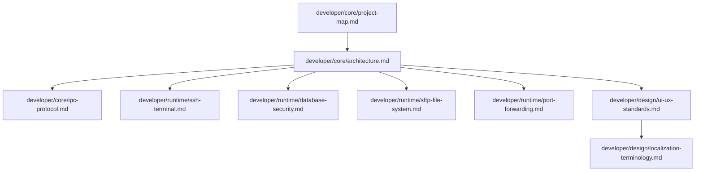

# Cosmosh Documentation Index

This folder is the architecture and implementation knowledge base for Cosmosh, powered by VitePress with bilingual structure.

## Structure

```text
docs/
  index.md
  developer/
    index.md
    core/
      project-map.md
      architecture.md
      ipc-protocol.md
    runtime/
      ssh-terminal.md
      database-security.md
      sftp-file-system.md
      port-forwarding.md
    design/
      ui-ux-standards.md
      localization-terminology.md
  user/
    roadmap.md
  zh-CN/
    index.md
    developer/
      index.md
      core/
      runtime/
      design/
    user/
      roadmap.md
```

## Read Order (English Source)



## Localization Policy

- English pages are the source of truth.
- Chinese pages under `zh-CN/` are synchronized translations.
- Any English developer-doc update must include same-cycle Chinese synchronization.
- Cross-locale matrices such as terminology tables may live only in the English source page, with localized pages linking to that single source to avoid duplicated tables drifting apart.

## Writing Conventions

- Keep documentation authoring rules centralized in this file and `AGENTS.md`.
- Avoid scattering process and policy writing guidance across feature documents.
- Chinese Markdown links must not include spaces before or after link syntax.
- Preferred pattern example: `请阅读[开发文档总览](/zh-CN/developer/)`.

## Maintenance Rule

When implementation changes affect behavior or structure, update corresponding English and Chinese documents in the same change set.
