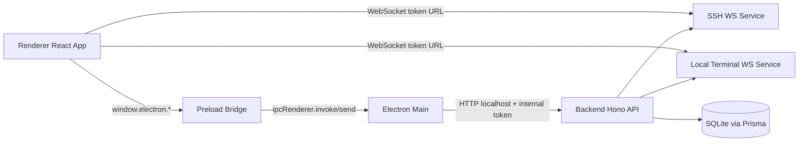
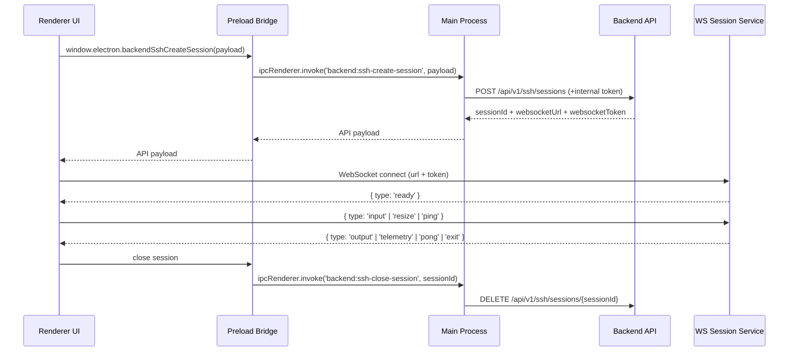
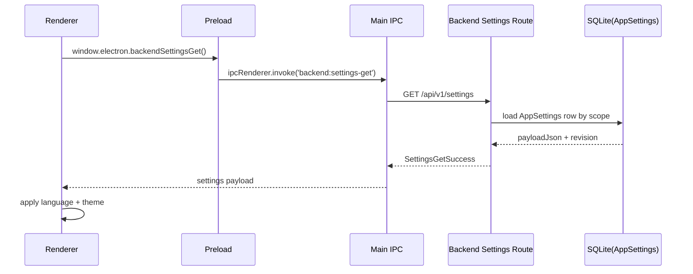
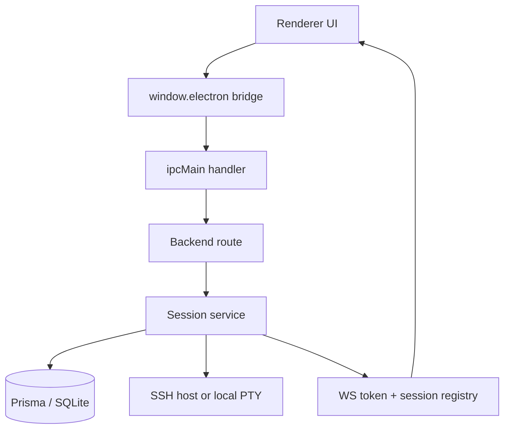
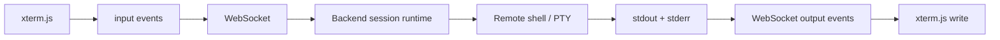
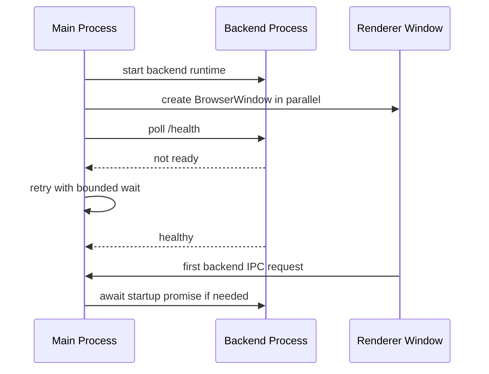
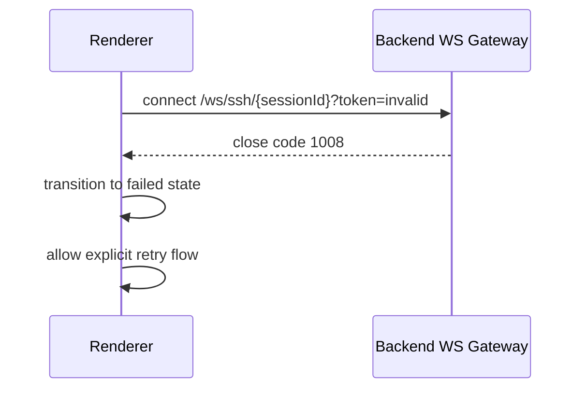
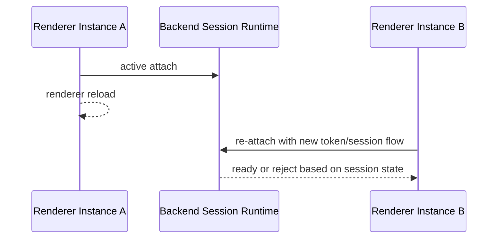
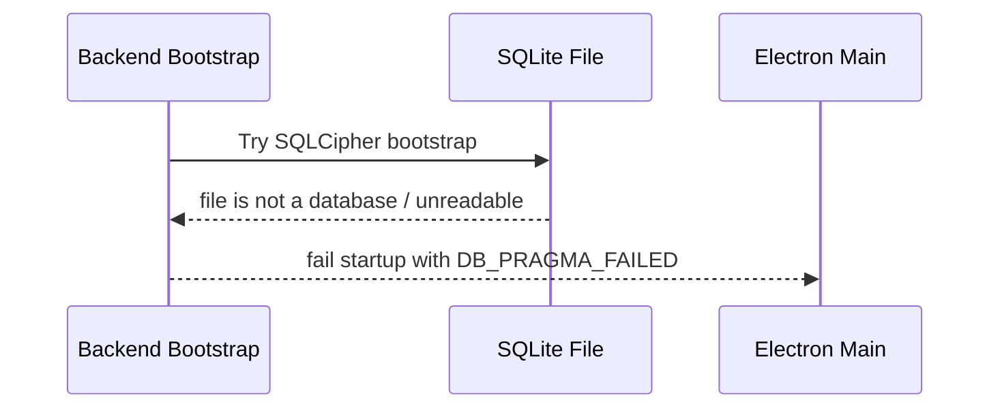
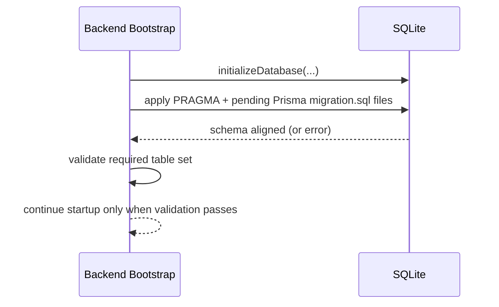

# Cosmosh Architecture

## 1. Runtime Topology

Cosmosh uses an Electron dual-process model with an embedded backend service:

- **Main Process** (`packages/main/src/index.ts`): app lifecycle, BrowserWindow creation, preload wiring, IPC registration, backend process orchestration.
- **Preload Bridge** (`packages/main/src/preload.ts`): strict API surface exposed via `contextBridge`.
- **Renderer Process** (`packages/renderer/src`): React UI, xterm UI, state orchestration.
- **Backend Process** (`packages/backend/src/index.ts`): Hono HTTP API + WebSocket session services for SSH/local terminal, plus SFTP browser, download, file-operation sessions, and SSH port-forwarding runtimes.

## 2. Main ↔ Renderer Responsibilities

### Main Process (`packages/main/src/index.ts`)

- Starts BrowserWindow and backend warmup in parallel during app bootstrap.
- Keeps a single in-flight backend startup promise to deduplicate concurrent startup triggers.
- Main-process backend proxy requests now ensure backend readiness before forwarding HTTP calls.
- In development startup, main uses an incremental preflight (`packages/main/scripts/dev-preflight.cjs`) and skips `@cosmosh/api-contract` / `@cosmosh/i18n` rebuilds when outputs are fresh.
- Development profiles are managed by `pnpm dev:profile` (`scripts/dev-profile.mjs`). When a profile is selected or passed through `COSMOSH_DEV_PROFILE`, main applies it before window/backend startup so Electron `userData`, the SQLite file, and backend-only secret storage all resolve under `.cosmosh/dev-profiles/<name>/`.
- Main launches backend with a runtime-only non-watch command (`dev:runtime`) to avoid duplicate `predev` rebuilds and reduce sustained CPU noise on laptops.
- Production packaging does not rely on the app asar to resolve backend packages. Main prebuild copies built backend/api-contract/i18n artifacts plus curated recursive third-party runtime dependencies into `packages/main/resources-runtime/node_modules`, then validates every non-workspace `@cosmosh/backend` production dependency resolves there. Any new backend production dependency must be covered by `packages/main/scripts/sync-backend-runtime.cjs`, otherwise installer builds fail before launch instead of shipping a missing module.
- CI packaging can also write `resources/remote-bootstrap/manifest-url.json` when `COSMOSH_REMOTE_BOOTSTRAP_MANIFEST_URL` is provided. Packaged main reads this resource only as a fallback after the environment variable, preserving local override behavior while allowing tagged release installers and `main` build artifacts to discover their intended bootstrap manifest automatically. Unpackaged development runs fall back once more to the rolling `remote-bootstrap-dev` manifest URL, so local Remote Enhancements testing does not require per-shell setup.
- Owns app-level capabilities: locale persistence (in-memory), window/devtools/file-manager actions.
- Proxies renderer requests to backend endpoints with:
  - `COSMOSH_INTERNAL_TOKEN` as internal auth header.
  - locale header for i18n-compatible backend responses.

### Backend Process (`packages/backend/src/index.ts`)

- Registers idempotent graceful-shutdown flow for runtime signals and fatal process events.
- Shutdown order is explicit: stop WS session services, close HTTP listener, then disconnect Prisma/SQLite handles.
- Windows-specific termination (`SIGBREAK`) is handled in the same path as POSIX signals to reduce stale DB lock cases.
- Local terminal profile discovery now uses short-lived in-memory caching and parallel probing, reducing repeated profile scan latency on Home/Settings first-load paths.
- SSH session attach can start the Remote Enhancements bootstrap side-channel through `RemoteBootstrapService` when global and server-level gates plus a manifest URL allow it. Backend owns manifest loading, remote probing, side-channel execution, status forwarding, and audit logging; `packages/remote-bootstrap` owns the downloaded user-scoped Go installer. The manifest URL comes from `COSMOSH_REMOTE_BOOTSTRAP_MANIFEST_URL` first, then the packaged CI resource when present, then the development-only `remote-bootstrap-dev` default for unpackaged runs. Tagged release packages point to a versioned release manifest; `main` packages point to the fixed `remote-bootstrap-dev` prerelease manifest; pushed branches whose name contains `remote-bootstrap` can point to branch-scoped temporary prerelease manifests for end-to-end CI testing. The side-channel uses bounded `ssh2 exec`, never writes installer output into the interactive terminal stream, and emits structured `bootstrap-status` WS events.
- Startup includes idempotent Prisma migration-file execution in `initializeDatabase(...)`, so first install launch and every subsequent launch both converge local DB structure to the current backend schema contract before serving HTTP routes.
- Simple Prisma `ALTER TABLE ... ADD COLUMN` migrations are reconciled against live SQLite table metadata before execution. If a column already exists but `_prisma_migrations` lacks the row, startup records the migration as applied instead of re-running duplicate DDL; non-simple migration drift still fails fast.
- Schema sync is fail-fast: backend startup stops when required tables still cannot be reconciled after runtime migration execution, preventing partial/undefined API behavior.
- Migration ledger metadata is stored in Prisma-compatible `_prisma_migrations` format to keep a future path open for native `prisma migrate deploy/resolve` workflows.

### Renderer Process (`packages/renderer/src`)

- Uses `window.electron` bridge only (no direct Node API usage).
- Creates SSH/local terminal sessions and SFTP browser/download/file-operation sessions through backend APIs.
- Connects terminal data channels through WebSocket and renders with `xterm.js`.
- Non-home renderer pages, including SSH and the CodeMirror-backed settings editor, are lazy-loaded to keep heavyweight assets out of the default startup path.
- Renderer bootstrap hydrates settings from local cache first, then refreshes canonical values from backend in background.
- Development StrictMode is opt-in via `VITE_ENABLE_STRICT_MODE=true` to reduce duplicate effect execution during local performance profiling.
- SSH page uses tab-scoped connection intent snapshots (no global mutable target singleton), so retry/split flows are isolated per tab.
- Hidden tabs are rendered but cannot start new SSH connect side effects; connect flow is active-tab gated.
- Renderer consumes backend `bootstrap-status` messages for Remote Enhancements observability, but SSH sidebar does not render a dedicated Remote Enhancements card in v1.

## 3. IPC Lifecycle (Current)

## 4. Security Model

### Electron Surface Hardening

- `nodeIntegration: false`
- `contextIsolation: true`
- Renderer gets only explicit bridge APIs via `contextBridge.exposeInMainWorld`.
- Renderer Content Security Policy keeps `script-src` restricted to `'self'` plus `'wasm-unsafe-eval'`. The WebAssembly allowance is required by renderer-bundled libraries such as `@xterm/addon-image` for inline image decoding, and does not enable general JavaScript `eval`.
- The sandboxed preload script must not import workspace packages at runtime. It may use shared API contract types at compile time, but runtime validators used inside preload must stay local or be bundled so Electron does not need to resolve project modules before the bridge loads.
- Internal privileged operations stay in Main/Backend process.
- Renderer-requested app windows are denied by default. The current allow-list only permits same-renderer SFTP Properties popups, and those child windows reuse the secure preload with `nodeIntegration` disabled and `contextIsolation` enabled.

### Backend Access Boundary

- Backend HTTP explicitly binds to the IPv4 loopback interface (`127.0.0.1`) in every runtime mode. The listener must never rely on the Node server default, which can expose standalone development APIs on non-loopback interfaces.
- Electron-main mode additionally guards `/api/v1/*` with an internal runtime token (`COSMOSH_INTERNAL_TOKEN`). Standalone mode remains loopback-only even though it does not require that token.
- Main process injects headers and never exposes internal token to renderer.
- Development request mirror: in unpackaged development runs, Main records sanitized mirrors of backend proxy requests into an in-memory ring buffer and exposes them to the custom DevTools panel through debug IPC. This does not change the real request path (`renderer -> preload IPC -> main -> backend`), does not issue mirror fetches, and does not add fake rows to the native Network tab. The mirror redacts internal auth headers, secret-like payload keys, and local absolute paths before renderer/DevTools visibility. Production packages do not collect traces or load the extension. If the `Cosmosh Requests` panel is missing in development, check the main-process terminal for the `[debug]` extension load/skip log first.
- Main also capability-gates local SFTP download destinations. App utility IPC authorizes an exact normalized path for the requesting renderer webContents, and the backend proxy rejects any download path without that owner-bound authorization. Temporary preview/open paths are reusable; Downloads and save-dialog paths are consumed after one request.
- Credential encryption key is derived from `COSMOSH_SECRET_KEY`/internal token hash in backend bootstrap.
- HTTP i18n is request-scoped: backend middleware resolves locale from `x-cosmosh-locale` (fallback `accept-language`), then injects a per-request translator used by all route response messages.
- WS runtime i18n is session-scoped: session creation carries resolved locale into SSH/local terminal runtime so WS `error`/`exit` messages and close reasons are localized consistently.
- i18n runtime is resource-injected: consumers register locale JSON payloads during `createI18n(...)` setup, so each process bundles only its required scope data.

### Session Channel Hardening

- WebSocket path includes sessionId and query token.
- Token mismatch or stale session causes immediate close (`1008`).
- Session attach timeout is enforced (30 seconds) to avoid orphaned resources.

### Release Supply-Chain Boundary

- Ordinary CI and rolling remote-bootstrap channels remain separate from versioned public releases. The rolling `remote-bootstrap-dev` and `remote-bootstrap-branch-*` assets are intentionally replaceable; tagged applications use only their exact versioned manifest URL.
- GitHub Actions are pinned to full commit SHAs and updated through reviewed Dependabot pull requests. Build jobs are repository read-only and stage short-lived workflow artifacts; only the final release job can create or update a draft.
- Formal release assembly validates the complete platform inventory, writes `SHA256SUMS`, creates GitHub provenance attestations, and refuses to modify a release after publication.
- Windows signing is currently policy-gated. `audit` permits a visibly marked unsigned draft for pipeline validation, while `enforce` requires valid Authenticode signatures, timestamps, and the configured publisher identity before draft creation.
- Draft mutability is intentional. Repository-side immutable releases, a protected `release` environment, and a `v*` tag ruleset complete the boundary before the first public release. See [Release Security](./release-security.md) for the operating contract and remaining setup.

## 5. Runtime Capabilities

- SSH and local terminal sessions use WebSocket data channels for terminal I/O.
- SSH sessions now run user-scoped Remote Enhancements bootstrap installation after first WS attach when Settings `remoteEnhancementsEnabled`, the server record `remoteEnhancementsEnabled`, and a manifest URL allow it. Disabled gates emit `REMOTE_ENHANCEMENTS_DISABLED`; missing manifest configuration remains an explicit failed bootstrap status before any remote probe. Tagged release installers, `main` build artifacts, and opted-in remote-bootstrap branch builds can provide the default manifest URL through the packaged `remote-bootstrap/manifest-url.json` resource, while `COSMOSH_REMOTE_BOOTSTRAP_MANIFEST_URL` remains the explicit override. Unpackaged development runs use `remote-bootstrap-dev` when neither override nor packaged resource is present. Ordinary PR and branch builds do not package a default manifest URL. The Go installer writes only remote user XDG/home files and shell profile hooks; see `packages/remote-bootstrap/README.md` for the module contract.
- SFTP uses request/response IPC + backend HTTP routes for directory browsing, local-file upload, download, create, rename, copy, delete, and batch file operations.
- Port Forwarding uses request/response IPC + backend HTTP routes for persisted rule CRUD and manual start/stop. Runtime state stays in backend memory, so app/backend restart resets all rules to stopped.
- SFTP local OS-open flows download regular files into a Cosmosh-controlled temp root through the existing backend download endpoint, then ask main-process app utility IPC to open only validated temp files. Windows uses the shell `openas` verb for Open With, resolves the PowerShell primary route and rundll32/shell32 fallback independently from the kernel-owned `GLOBALROOT\SystemRoot\System32` namespace instead of inherited environment/PATH/CWD values, and enriches the primary child environment through Windows known-folder APIs. A blocked or unavailable PowerShell route cannot prevent the validated rundll32 fallback from running with a kernel-anchored minimal environment. Packaged macOS runs accept only the compiled NSWorkspace helper under `process.resourcesPath`; repository binary/source fallbacks are development-only and unavailable when `app.isPackaged` is true. Linux omits Open With.
- SFTP directory upload/download, chmod, byte-level transfer progress/cancellation, richer transfer queues, and SSH terminal session reuse remain planned follow-up work.

## 5.1 SSH Port Forwarding Runtime (Implemented)

- Port forwarding rules are persisted in SQLite through `PortForwardRule`, with type-specific fields for local, remote, and dynamic SOCKS forwarding.
- `PortForwardSessionService` owns active SSH clients, `net.Server` listeners, sockets, channels, remote-forward listeners, and shutdown cleanup.
- Start opens SSH clients through the shared `packages/backend/src/ssh/connect.ts` helper, so keychain credential decryption and strict host-key behavior stay aligned with SSH/SFTP.
- Local forwarding listens on the backend host and opens `ssh2.Client.forwardOut(...)` per inbound local socket.
- Remote forwarding calls `client.forwardIn(...)` and connects accepted SSH channels from backend to the configured target host/port.
- Dynamic forwarding implements SOCKS5 no-auth TCP CONNECT for IPv4, IPv6, and domain targets; UDP ASSOCIATE, BIND, and SOCKS authentication are not supported.
- Default local bind host is `127.0.0.1`; non-localhost bind hosts are allowed only with renderer risk messaging.
- Each rule is capped at 64 concurrent connections with a 15-second connection setup timeout.

## 5.2 Settings Runtime (Implemented)

- Settings are now persisted by backend route `GET/PUT /api/v1/settings`.
- Storage model is a single-row JSON payload per scope (`scopeAccountId` + `scopeDeviceId`) in `AppSettings`.
- Scope defaults to local device (`deviceId=local-device`) while keeping account scope field for future sync.
- Renderer bootstrap (`packages/renderer/src/main.tsx`) applies persisted language/theme using cached settings at startup, then synchronizes with backend.
- Renderer date-time display uses persisted time-zone/date/time format settings through `packages/renderer/src/lib/date-time-format.ts`; `system` preserves the OS time zone, and the Settings UI lists runtime-supported IANA time zones with their current UTC offsets.
- Renderer terminal character width compatibility is stored as `terminalCharacterWidthCompatibilityModeEnabled`; SSH server records can opt out per server with `disableCharacterWidthCompatibilityMode`, while local terminal sessions only follow the global setting.
- Remote Enhancements use both a global Settings gate `remoteEnhancementsEnabled` and a per-server `SshServer.remoteEnhancementsEnabled` field. Defaults are true so the manifest URL remains the deployment-level on/off switch until users explicitly disable either gate.
- Non-visual settings (for example SSH runtime limits) are persisted and discoverable, but some are intentionally not bound to runtime behavior yet.
- All setting definitions (types, defaults, constraints, enum sets, JSON schemas, UI metadata, categories) live in a single registry: `packages/api-contract/src/settings-registry.ts`. Adding or removing a setting only requires editing this file (plus i18n locale files).
- Validation logic in `packages/api-contract/src/settings.ts` is now generic and registry-driven for common scalar rules (type check, enum, range, maxLength), with narrow custom validators for settings that need runtime checks or structured JSON normalization such as IANA time-zone support and the SFTP directory-list view.
- Settings UI surfaces structured JSON settings as explicit rows, but they do not render inline editors or per-item Settings Editor actions. They provide a single Settings Editor link so full-object editing remains schema-backed and centralized, while default reset remains available through the regular item menu.
- The OpenAPI `SettingsValues` schema is intentionally loose (`type: object`); strict TypeScript types and constraints live exclusively in the code registry.
- Settings API response types (`ApiSettingsGetResponse`, `ApiSettingsUpdateResponse`) are hand-crafted in `packages/api-contract/src/index.ts` using the strict `SettingsValues` from the registry rather than generated from OpenAPI.
- Stored settings payload parsing is forward-compatible: missing/new fields are backfilled per-field from defaults instead of resetting the entire settings object.
- Strict full-schema validation is still enforced for update requests (`PUT /api/v1/settings`) to keep persisted payload shape deterministic.

## 5.3 Local-First Audit Runtime (Implemented)

- Security-core operations are persisted to `AuditEvent` with stable correlation fields (`requestId`, `sessionId`, `entityId`, `relatedRecordId`) for forensic traceability.
- Existing `SshLoginAudit` remains active for backward-compatible SSH last-used sorting, while `AuditEvent` is used as the cross-domain audit stream.
- Audit writes are best-effort and non-blocking by contract: failures are logged in backend runtime and do not fail parent request/session flows.
- Metadata persistence is sanitized before storage (secret-like keys are redacted) and capped by serialized size limits to prevent payload inflation.
- Retention is local policy-driven (default 180 days) with periodic sweeps in audit service runtime.
- Future sync checkpoint state is pre-modeled by `AuditSyncCursor` without introducing current mandatory remote dependency.

Current event categories in runtime wiring include:

- `ssh-session`
- `ssh-host-trust`
- `ssh-server`
- `ssh-keychain`
- `port-forward`
- `settings`

## 6. Core Data-Flow Views

### 6.1 Session Bootstrap Data Flow

### 6.2 Runtime Stream Data Flow

### 6.3 Failure Boundary Model

- **Renderer boundary**: visual state and user interaction; failures should stay recoverable via UI retry.
- **Main boundary**: capability routing and internal auth injection; failures should never leak privileged tokens.
- **Backend boundary**: protocol validation, session lifecycle, and resource cleanup ownership.
- **Remote boundary**: SSH host / local shell instability is treated as external and mapped to stable UI error codes.

## 7. SSH Keychain Credential Model (2026-03)

- SSH credentials are now persisted in `SshKeychain` and linked from `SshServer.keychainId`.
- `SshServer` keeps connection identity, host/transport policy (`host`, `port`, `username`, `strictHostKey`, `enableSshCompression`), and renderer terminal compatibility flags (`disableCharacterWidthCompatibilityMode`) but no longer stores encrypted password/private-key fields directly.
- SSH transport compression is disabled by default. When enabled on a server record, the backend applies the same compression negotiation policy to SSH shell sessions, SFTP sessions, and port-forwarding clients.
- Keychain organization metadata reuses the same `SshFolder` and `SshTag` domains used by servers (no separate keychain-only folder/tag tables).
- Existing per-server edit UX is preserved by allowing inline credential input in the SSH editor; backend transparently materializes/updates hidden keychains.
- Server updates that keep inline credential mode may omit password/private-key fields; the backend retains the existing encrypted values and only rejects the update when the stored credential material cannot satisfy the selected auth type.
- Shared keychains can be reused by multiple servers; hidden keychains are intended for single-server private use.
- SSH session creation resolves credentials through server → keychain relation before opening `ssh2` connections.

## 7.1 Development Profile Runtime

Development profile mode is a developer-only isolation layer for fresh-install verification. It does not change packaged production storage or database key policy.

The first non-help `pnpm dev:profile` command automatically imports the legacy implicit default identity into `.cosmosh/dev-profiles/default/`. The import copies the legacy workspace database, SQLite WAL/SHM sidecars, Electron `userData`, and backend secret storage on a best-effort basis. Missing or unreadable legacy sources are recorded in the profile manifest instead of aborting the command.

The `default` profile is a managed recovery snapshot, not a throwaway test profile. It can be selected with `pnpm dev:profile use default` or rebuilt with `pnpm dev:profile import-default --force --use`, but regular `create default`, `reset default`, and `delete default` commands are rejected to avoid losing the recovery path.

Use `pnpm dev:profile` to create, switch, reset, inspect, or delete local test profiles:

- `pnpm dev:profile create fresh --use` creates `.cosmosh/dev-profiles/fresh/` and makes it the default development profile.
- `pnpm dev:profile reset fresh` clears only that profile's runtime data so the next development launch behaves like a new install for the same identity.
- `pnpm dev:profile delete fresh --force` removes the profile and clears the current pointer if it was active.
- `pnpm dev:profile run fresh --create --reset -- pnpm dev:main` runs one command with an isolated, freshly reset profile. The root script `pnpm dev:main:fresh` is the shorthand for this flow.

A profile owns these paths:

- `.cosmosh/dev-profiles/<name>/user-data`: injected into Electron via `app.setPath('userData', ...)` before app storage is touched.
- `.cosmosh/dev-profiles/<name>/database/cosmosh.db`: injected as `COSMOSH_DB_PATH` and used by both main and backend database path resolvers.
- `.cosmosh/dev-profiles/<name>/backend-storage`: injected as `COSMOSH_BACKEND_STORAGE_PATH` for backend-only secret material such as `secret.key`.
- `.cosmosh/dev-profiles/default/profile.json`: import manifest for the managed default profile, including source paths and per-source copy status.

If no development profile is active, direct development launches keep the legacy workspace database path `.dev_data/cosmosh.db` and default Electron development storage. This preserves existing local data unless a developer explicitly opts into profile isolation.

## 8. Architecture Decision Rationale

- Keep the backend as a separate runtime process to isolate protocol and credential handling from renderer attack surface.
- Use preload as a minimal bridge to reduce API exposure and preserve strict process contracts.
- Prefer WS data plane for terminal streams to avoid IPC bottlenecks on high-frequency I/O.
- Keep main as orchestrator/proxy instead of business-logic host for easier future server-client decoupling.

## 9. Boundary Case Playbook

### 9.1 Backend Not Ready at Startup

Handling principle:

- UI should become visible as early as possible while backend continues warming in parallel.
- First backend-bound IPC request must still observe backend ready-state before forwarding.
- Startup failure paths should be explicit and observable.

### 9.2 WS Attach Token Mismatch

Handling principle:

- Token/session mismatch is security-sensitive and must fail closed.
- Recovery should create a fresh session/token path.

### 9.3 Renderer Reload During Active Session

Handling principle:

- Session runtime must guard against stale attach state.
- Renderer should treat reload as a new lifecycle and re-establish state explicitly.

### 8.4 Unreadable SQLite File During Startup

Handling principle:

- Production uses strict mode: SQLCipher/Prisma incompatibility fails fast and must be fixed operationally.

### 8.5 Startup Schema Upgrade Path

Handling principle:

- Runtime migration sync is idempotent and executes on every startup.
- Existing user data must remain intact while structural drift is repaired incrementally.

## 10. Server Proxy Runtime

- Global settings define `serverProxyMode = off | system | custom` and `serverProxyUrl`; the default is `system`.
- Each `SshServer` defines `proxyMode = default | off | custom` and an optional `proxyUrl`. `default` inherits the global policy.
- Renderer resolves system/PAC proxy rules through the privileged `app:resolve-system-proxy` Main IPC only when the effective mode is `system`.
- Backend remains the policy authority. `packages/backend/src/ssh/proxy.ts` reloads persisted global settings, applies the server override, parses ordered Chromium proxy rules, and creates HTTP, HTTPS CONNECT, SOCKS5, or explicit `DIRECT` sockets.
- The prepared socket is injected through `ssh2` `ConnectConfig.sock`, so SSH shell, SFTP, and port-forwarding connections share one proxy implementation.
- Proxy candidates share the configured SSH connection timeout. Proxy failure never silently falls back to direct transport; direct transport is allowed only for `off` mode or an explicit system `DIRECT` candidate.
- Audit metadata records only proxy mode and protocol. Proxy URLs and embedded credentials are never written to audit metadata.
