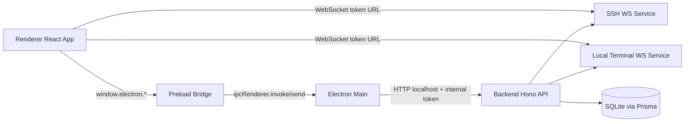
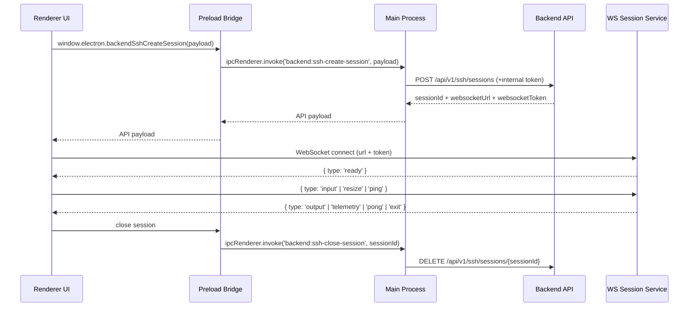
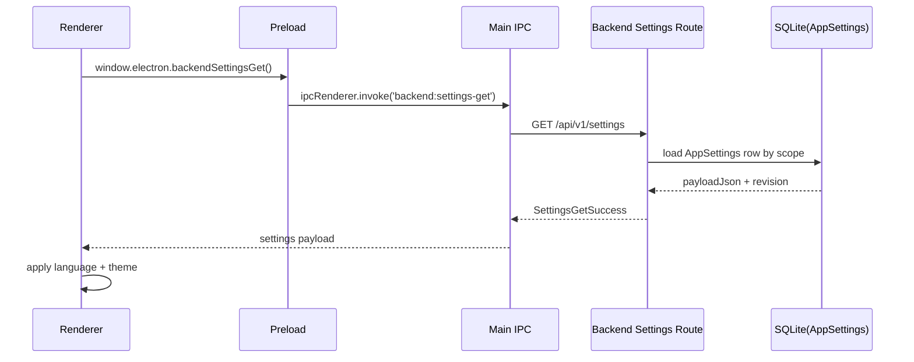
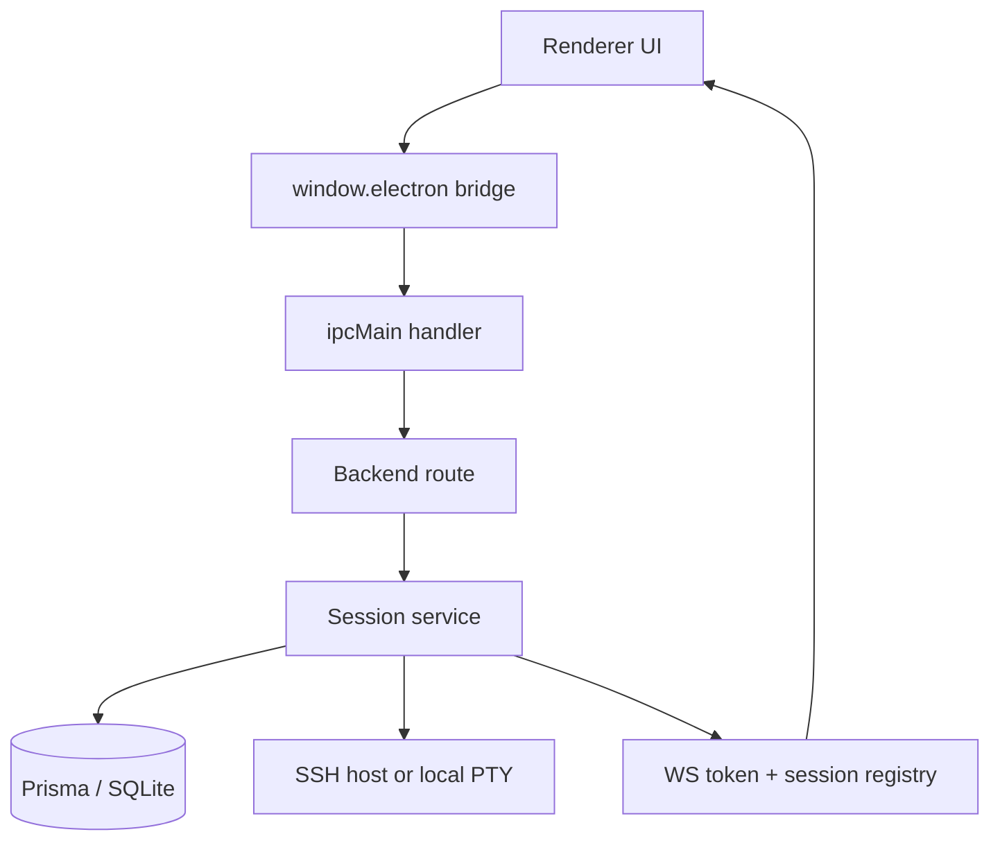
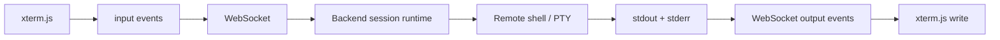
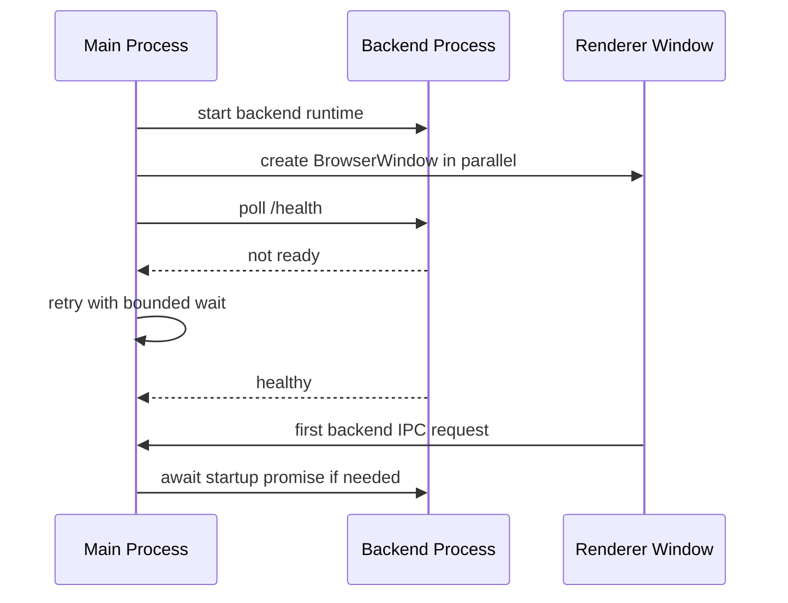
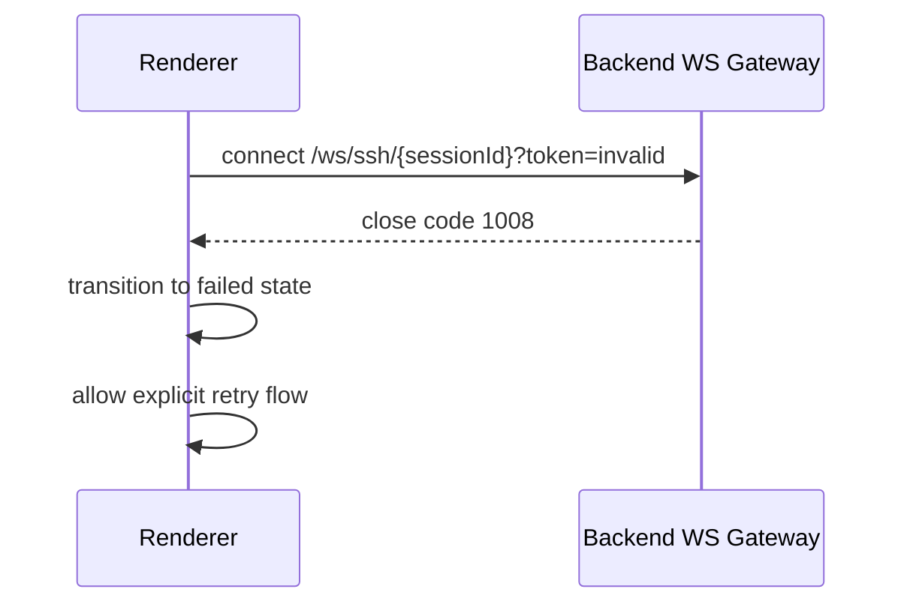
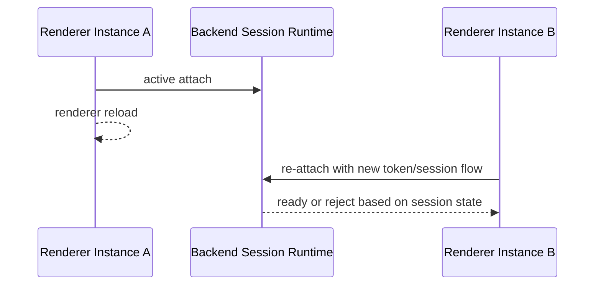
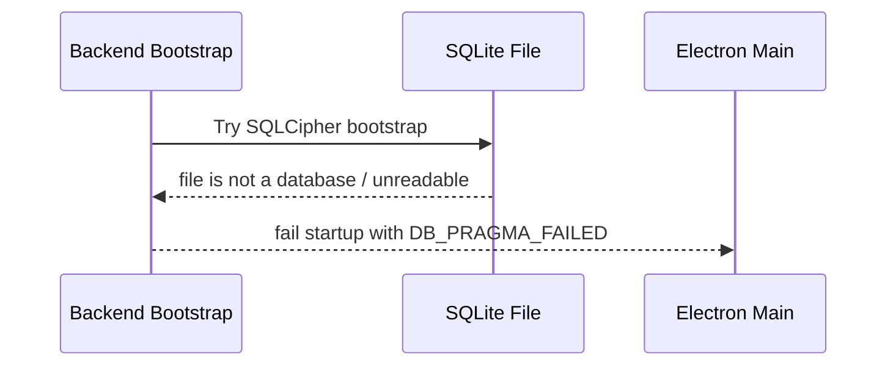
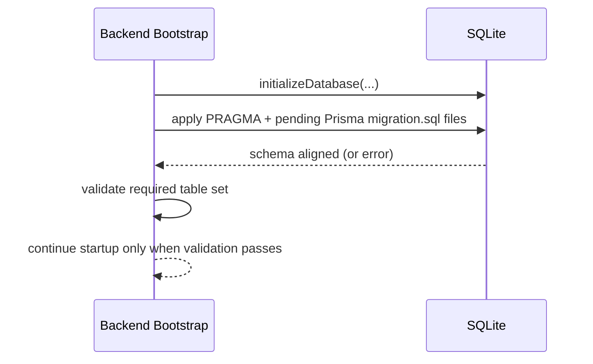

# Cosmosh Architecture

## 1. Runtime Topology

Cosmosh uses an Electron dual-process model with an embedded backend service:

- **Main Process** (`packages/main/src/index.ts`): app lifecycle, BrowserWindow creation, preload wiring, IPC registration, backend process orchestration.
- **Preload Bridge** (`packages/main/src/preload.ts`): strict API surface exposed via `contextBridge`.
- **Renderer Process** (`packages/renderer/src`): React UI, xterm UI, state orchestration.
- **Backend Process** (`packages/backend/src/index.ts`): Hono HTTP API + WebSocket session services for SSH/local terminal, plus SFTP browser, download, file-operation sessions, and SSH port-forwarding runtimes.

## 2. Main ↔ Renderer Responsibilities

### Main Process (`packages/main/src/index.ts`)

- Starts BrowserWindow and backend warmup in parallel during app bootstrap.
- Keeps a single in-flight backend startup promise to deduplicate concurrent startup triggers.
- Main-process backend proxy requests now ensure backend readiness before forwarding HTTP calls.
- In development startup, main uses an incremental preflight (`packages/main/scripts/dev-preflight.cjs`) and skips `@cosmosh/api-contract` / `@cosmosh/i18n` rebuilds when outputs are fresh.
- Main launches backend with a runtime-only non-watch command (`dev:runtime`) to avoid duplicate `predev` rebuilds and reduce sustained CPU noise on laptops.
- Owns app-level capabilities: locale persistence (in-memory), window/devtools/file-manager actions.
- Proxies renderer requests to backend endpoints with:
  - `COSMOSH_INTERNAL_TOKEN` as internal auth header.
  - locale header for i18n-compatible backend responses.

### Backend Process (`packages/backend/src/index.ts`)

- Registers idempotent graceful-shutdown flow for runtime signals and fatal process events.
- Shutdown order is explicit: stop WS session services, close HTTP listener, then disconnect Prisma/SQLite handles.
- Windows-specific termination (`SIGBREAK`) is handled in the same path as POSIX signals to reduce stale DB lock cases.
- Local terminal profile discovery now uses short-lived in-memory caching and parallel probing, reducing repeated profile scan latency on Home/Settings first-load paths.
- Startup includes idempotent Prisma migration-file execution in `initializeDatabase(...)`, so first install launch and every subsequent launch both converge local DB structure to the current backend schema contract before serving HTTP routes.
- Schema sync is fail-fast: backend startup stops when required tables still cannot be reconciled after runtime migration execution, preventing partial/undefined API behavior.
- Migration ledger metadata is stored in Prisma-compatible `_prisma_migrations` format to keep a future path open for native `prisma migrate deploy/resolve` workflows.

### Renderer Process (`packages/renderer/src`)

- Uses `window.electron` bridge only (no direct Node API usage).
- Creates SSH/local terminal sessions and SFTP browser/download/file-operation sessions through backend APIs.
- Connects terminal data channels through WebSocket and renders with `xterm.js`.
- Non-home renderer pages (including SSH and settings editor/Monaco) are lazy-loaded to keep heavyweight assets out of the default startup path.
- Renderer bootstrap hydrates settings from local cache first, then refreshes canonical values from backend in background.
- Development StrictMode is opt-in via `VITE_ENABLE_STRICT_MODE=true` to reduce duplicate effect execution during local performance profiling.
- SSH page uses tab-scoped connection intent snapshots (no global mutable target singleton), so retry/split flows are isolated per tab.
- Hidden tabs are rendered but cannot start new SSH connect side effects; connect flow is active-tab gated.

## 3. IPC Lifecycle (Current)

## 4. Security Model

### Electron Surface Hardening

- `nodeIntegration: false`
- `contextIsolation: true`
- Renderer gets only explicit bridge APIs via `contextBridge.exposeInMainWorld`.
- The sandboxed preload script must not import workspace packages at runtime. It may use shared API contract types at compile time, but runtime validators used inside preload must stay local or be bundled so Electron does not need to resolve project modules before the bridge loads.
- Internal privileged operations stay in Main/Backend process.
- Renderer-requested app windows are denied by default. The current allow-list only permits same-renderer SFTP Properties popups, and those child windows reuse the secure preload with `nodeIntegration` disabled and `contextIsolation` enabled.

### Backend Access Boundary

- Backend is localhost-only and guarded by an internal runtime token (`COSMOSH_INTERNAL_TOKEN`) in electron-main mode.
- Main process injects headers and never exposes internal token to renderer.
- Credential encryption key is derived from `COSMOSH_SECRET_KEY`/internal token hash in backend bootstrap.
- HTTP i18n is request-scoped: backend middleware resolves locale from `x-cosmosh-locale` (fallback `accept-language`), then injects a per-request translator used by all route response messages.
- WS runtime i18n is session-scoped: session creation carries resolved locale into SSH/local terminal runtime so WS `error`/`exit` messages and close reasons are localized consistently.
- i18n runtime is resource-injected: consumers register locale JSON payloads during `createI18n(...)` setup, so each process bundles only its required scope data.

### Session Channel Hardening

- WebSocket path includes sessionId and query token.
- Token mismatch or stale session causes immediate close (`1008`).
- Session attach timeout is enforced (30 seconds) to avoid orphaned resources.

## 5. Runtime Capabilities

- SSH and local terminal sessions use WebSocket data channels for terminal I/O.
- SFTP uses request/response IPC + backend HTTP routes for directory browsing, download, create, rename, copy, delete, and batch file operations.
- Port Forwarding uses request/response IPC + backend HTTP routes for persisted rule CRUD and manual start/stop. Runtime state stays in backend memory, so app/backend restart resets all rules to stopped.
- SFTP local OS-open flows download regular files into a Cosmosh-controlled temp root through the existing backend download endpoint, then ask main-process app utility IPC to open only validated temp files. Windows uses the shell `openas` verb for Open With; macOS uses the packaged NSWorkspace helper; Linux omits Open With.
- SFTP upload, directory download, chmod, transfer queues, full editor write-back, and SSH terminal session reuse remain planned follow-up work.

## 5.1 SSH Port Forwarding Runtime (Implemented)

- Port forwarding rules are persisted in SQLite through `PortForwardRule`, with type-specific fields for local, remote, and dynamic SOCKS forwarding.
- `PortForwardSessionService` owns active SSH clients, `net.Server` listeners, sockets, channels, remote-forward listeners, and shutdown cleanup.
- Start opens SSH clients through the shared `packages/backend/src/ssh/connect.ts` helper, so keychain credential decryption and strict host-key behavior stay aligned with SSH/SFTP.
- Local forwarding listens on the backend host and opens `ssh2.Client.forwardOut(...)` per inbound local socket.
- Remote forwarding calls `client.forwardIn(...)` and connects accepted SSH channels from backend to the configured target host/port.
- Dynamic forwarding implements SOCKS5 no-auth TCP CONNECT for IPv4, IPv6, and domain targets; UDP ASSOCIATE, BIND, and SOCKS authentication are not supported.
- Default local bind host is `127.0.0.1`; non-localhost bind hosts are allowed only with renderer risk messaging.
- Each rule is capped at 64 concurrent connections with a 15-second connection setup timeout.

## 5.2 Settings Runtime (Implemented)

- Settings are now persisted by backend route `GET/PUT /api/v1/settings`.
- Storage model is a single-row JSON payload per scope (`scopeAccountId` + `scopeDeviceId`) in `AppSettings`.
- Scope defaults to local device (`deviceId=local-device`) while keeping account scope field for future sync.
- Renderer bootstrap (`packages/renderer/src/main.tsx`) applies persisted language/theme using cached settings at startup, then synchronizes with backend.
- Renderer date-time display uses persisted time-zone/date/time format settings through `packages/renderer/src/lib/date-time-format.ts`; `system` preserves the OS time zone, and the Settings UI lists runtime-supported IANA time zones with their current UTC offsets.
- Non-visual settings (for example SSH runtime limits) are persisted and discoverable, but some are intentionally not bound to runtime behavior yet.
- All setting definitions (types, defaults, constraints, enum sets, UI metadata, categories) live in a single registry: `packages/api-contract/src/settings-registry.ts`. Adding or removing a setting only requires editing this file (plus i18n locale files).
- Validation logic in `packages/api-contract/src/settings.ts` is now generic and registry-driven for common rules (type check, enum, range, maxLength), with narrow custom validators only for settings that need runtime checks such as IANA time-zone support.
- The OpenAPI `SettingsValues` schema is intentionally loose (`type: object`); strict TypeScript types and constraints live exclusively in the code registry.
- Settings API response types (`ApiSettingsGetResponse`, `ApiSettingsUpdateResponse`) are hand-crafted in `packages/api-contract/src/index.ts` using the strict `SettingsValues` from the registry rather than generated from OpenAPI.
- Stored settings payload parsing is forward-compatible: missing/new fields are backfilled per-field from defaults instead of resetting the entire settings object.
- Strict full-schema validation is still enforced for update requests (`PUT /api/v1/settings`) to keep persisted payload shape deterministic.

## 5.3 Local-First Audit Runtime (Implemented)

- Security-core operations are persisted to `AuditEvent` with stable correlation fields (`requestId`, `sessionId`, `entityId`, `relatedRecordId`) for forensic traceability.
- Existing `SshLoginAudit` remains active for backward-compatible SSH last-used sorting, while `AuditEvent` is used as the cross-domain audit stream.
- Audit writes are best-effort and non-blocking by contract: failures are logged in backend runtime and do not fail parent request/session flows.
- Metadata persistence is sanitized before storage (secret-like keys are redacted) and capped by serialized size limits to prevent payload inflation.
- Retention is local policy-driven (default 180 days) with periodic sweeps in audit service runtime.
- Future sync checkpoint state is pre-modeled by `AuditSyncCursor` without introducing current mandatory remote dependency.

Current event categories in runtime wiring include:

- `ssh-session`
- `ssh-host-trust`
- `ssh-server`
- `ssh-keychain`
- `port-forward`
- `settings`

## 6. Core Data-Flow Views

### 6.1 Session Bootstrap Data Flow

### 6.2 Runtime Stream Data Flow

### 6.3 Failure Boundary Model

- **Renderer boundary**: visual state and user interaction; failures should stay recoverable via UI retry.
- **Main boundary**: capability routing and internal auth injection; failures should never leak privileged tokens.
- **Backend boundary**: protocol validation, session lifecycle, and resource cleanup ownership.
- **Remote boundary**: SSH host / local shell instability is treated as external and mapped to stable UI error codes.

## 7. SSH Keychain Credential Model (2026-03)

- SSH credentials are now persisted in `SshKeychain` and linked from `SshServer.keychainId`.
- `SshServer` keeps connection identity and host policy (`host`, `port`, `username`, `strictHostKey`) but no longer stores encrypted password/private-key fields directly.
- Keychain organization metadata reuses the same `SshFolder` and `SshTag` domains used by servers (no separate keychain-only folder/tag tables).
- Existing per-server edit UX is preserved by allowing inline credential input in the SSH editor; backend transparently materializes/updates hidden keychains.
- Shared keychains can be reused by multiple servers; hidden keychains are intended for single-server private use.
- SSH session creation resolves credentials through server → keychain relation before opening `ssh2` connections.

## 8. Architecture Decision Rationale

- Keep the backend as a separate runtime process to isolate protocol and credential handling from renderer attack surface.
- Use preload as a minimal bridge to reduce API exposure and preserve strict process contracts.
- Prefer WS data plane for terminal streams to avoid IPC bottlenecks on high-frequency I/O.
- Keep main as orchestrator/proxy instead of business-logic host for easier future server-client decoupling.

## 9. Boundary Case Playbook

### 9.1 Backend Not Ready at Startup

Handling principle:
- UI should become visible as early as possible while backend continues warming in parallel.
- First backend-bound IPC request must still observe backend ready-state before forwarding.
- Startup failure paths should be explicit and observable.

### 9.2 WS Attach Token Mismatch

Handling principle:

- Token/session mismatch is security-sensitive and must fail closed.
- Recovery should create a fresh session/token path.

### 9.3 Renderer Reload During Active Session

Handling principle:

- Session runtime must guard against stale attach state.
- Renderer should treat reload as a new lifecycle and re-establish state explicitly.

### 8.4 Unreadable SQLite File During Startup

Handling principle:

- Production uses strict mode: SQLCipher/Prisma incompatibility fails fast and must be fixed operationally.

### 8.5 Startup Schema Upgrade Path

Handling principle:

- Runtime migration sync is idempotent and executes on every startup.
- Existing user data must remain intact while structural drift is repaired incrementally.
