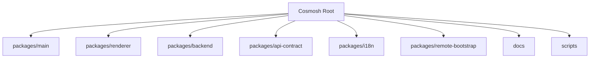
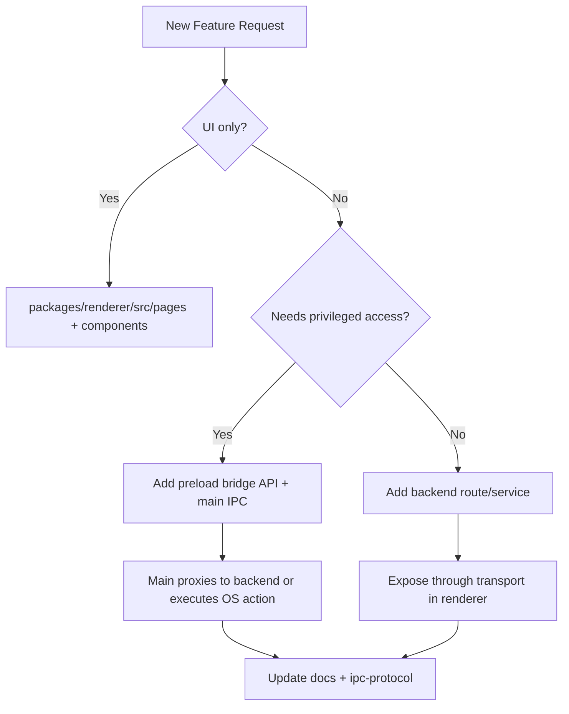

# Cosmosh Project Map

## 1. Monorepo Layout

## 2. Directory Responsibilities

### `scripts`

- **Role**: Repository-level developer and release workflow helpers.
- **Key files**:
  - `dev-profile.mjs`: development profile manager used by `pnpm dev:profile` and `pnpm dev:main:fresh`. It automatically imports the legacy implicit default identity into the protected `default` profile, then creates, switches, resets, deletes, and runs commands with profile-scoped runtime paths under `.cosmosh/dev-profiles/<name>/`.
  - `build-remote-bootstrap-release.mjs`: CI/release helper that cross-compiles Linux remote bootstrap binaries, computes SHA-256 values, and writes the git-ignored manifest under `packages/remote-bootstrap/dist/`. Tagged releases upload those files to the versioned release; `main` pushes upload them to the fixed `remote-bootstrap-dev` prerelease; remote-bootstrap feature branches and manual dispatch runs can upload them to branch-scoped temporary prereleases for end-to-end testing; ordinary PRs use it only for validation.
  - `update-version.js`: version metadata update helper.
  - `precommit-staged.mjs`: staged-file precommit validation helper.
  - `setup-githooks.mjs`: local Git hook bootstrap.

### `packages/main`

- **Role**: Electron host process.
- **Key files**:
  - `src/index.ts`: app bootstrap, BrowserWindow config, IPC handlers, backend subprocess management.
  - `src/ipc/register-app-utility-ipc.ts`: privileged app utility IPC such as native dialogs, file manager integration, SFTP temp-file creation, and validated OS-open/Open With flows.
  - `src/ipc/register-debug-ipc.ts`: development diagnostics IPC, including the backend request mirror list/clear/event channels.
  - `src/ipc/backend-request-trace-store.ts`: development-only sanitized ring buffer for backend proxy request mirrors.
  - `src/ipc/sftp-download-target-authorizations.ts`: renderer-owned exact-path capabilities for local SFTP download destinations.
  - `src/preload.ts`: secure renderer bridge.
  - `src/security/database-encryption.ts`: DB path/key handling helpers, including development profile database overrides.
  - `src/dev/dev-profile.ts`: development-only profile activation that maps selected profiles to Electron `userData`, SQLite, and backend secret storage paths before startup.
  - `resources/installer.nsh`: Windows NSIS installer extensions, including assisted option pages, shell/terminal registration hooks, uninstall data cleanup, and installer DPI manifest settings.
  - `resources/helpers`: packaged OS helpers, including the macOS NSWorkspace SFTP Open With helper source/binary.
  - `resources/remote-bootstrap/manifest-url.json`: git-ignored CI packaging resource that records the default Remote Enhancements manifest URL for packaged backend startup when a release or `main` build provides one.
  - `scripts/compile-macos-open-with-helper.mjs`: macOS-only build hook that compiles the SFTP Open With helper before packaging.
  - `scripts/write-remote-bootstrap-manifest-url.cjs`: CI packaging helper that writes the packaged Remote Enhancements manifest URL resource when `COSMOSH_REMOTE_BOOTSTRAP_MANIFEST_URL` is set, and removes any stale ignored resource when it is not set.
  - `devtools/request-trace-panel`: unpacked development-only DevTools extension loaded by Main in development runs; it reads the renderer mirror cache and does not alter backend transport.

### `packages/renderer`

- **Role**: React UI layer.
- **Key folders**:
  - `src/pages`: feature pages (`Home`, `SSH`, `SFTP`, `Settings`, `SettingsEditor`, etc.). Home owns the SSH server, keychain, and port-forwarding management surfaces.
  - `src/pages/sftp`: SFTP page submodules for browser UI composition, action menus, directory/tree/detail panels, and shared SFTP helpers.
  - `src/pages/settings-editor`: CodeMirror-backed settings JSON editor modules, including schema diagnostics, completion, hover details, and editor lifecycle wrappers.
  - `src/components/ui`: Radix-based primitive wrappers and styling contracts.
  - `src/components/home`: home/SSH shared entity modules (card/icon rendering, visual picker, reusable folder-creation dialog).
  - `src/components/terminal`: terminal interaction composites (context menu, selection bar, autocomplete menu).
  - `src/lib`: backend transport, i18n, settings bootstrap (`app-settings.ts`), renderer request-trace mirror bootstrap (`backend-request-trace-mirror.ts`), shared date-time display formatting (`date-time-format.ts`), shared CodeMirror syntax highlighting, and utility abstractions (including shared entity visual helpers and folder-dialog hook).
  - `theme`: token source used to generate CSS variable system.

### `packages/backend`

- **Role**: Internal API + session orchestration runtime.
- **Key folders**:
  - `src/http/routes`: REST endpoints for settings, SSH entities, port-forwarding rules, and local terminal actions.
  - `src/audit`: local-first audit domain (sanitization, retention policy, query model, write service).
  - `src/ssh`: SSH auth/session logic (`ssh2`, known-host trust, telemetry, keychain-backed credential resolution) plus shared non-shell connection helpers.
  - `src/remote-bootstrap`: Remote Enhancements bootstrap orchestration for live SSH sessions. It loads the deployment manifest, probes the remote platform through bounded side-channel `ssh2 exec`, injects the shell wrapper, forwards `bootstrap-status` WS messages, and logs terminal bootstrap outcomes.
  - `src/port-forward`: SSH port-forwarding rule validation, SOCKS5 parsing, and active runtime session service.
  - `src/sftp`: SFTP browser, download, and file-operation session logic (`ssh2.sftp`, path normalization, entry mapping, session cleanup).
  - `src/settings`: settings payload defaults, validation parsers, and shared AppSettings readers used by HTTP routes and runtime services.
  - `src/validation-utils.ts`: shared backend HTTP-boundary validation primitives used by route and domain payload parsers.
  - `src/local-terminal`: local PTY session logic (`node-pty`).
  - `src/terminal`: shared terminal session primitives (WebSocket message normalization, history parsing, size clamping, history sync timing helpers).
  - `src/terminal/completion`: shared terminal auto-complete domain (spec dataset, ranking engine, completion payload shaping) used by both SSH and local-terminal session services.
  - `src/db`: Prisma initialization and DB lifecycle.

### `packages/api-contract`

Shared protocol constants, request/response types, OpenAPI source, generated contracts.

- `src/http.ts`: API path-token and query-string resolution helpers shared by main IPC proxying and renderer browser transport.
- `src/ipc.ts`: shared IPC-only payload enums and structs that are not generated from OpenAPI, such as app menu actions, SFTP Open With application descriptors, and development backend request traces.
- `src/settings-registry.ts`: **single source of truth** for all settings definitions — types, defaults, constraints, enum sets, UI control metadata, categories, and helper functions. Adding/removing a setting only requires editing this file.
- `src/settings.ts`: generic, registry-driven validation and normalization helpers (`normalizeSettingsValuesStrict`, `normalizeSettingsValuesWithDefaults`) shared by backend and renderer.
- `src/sftp.ts`: shared SFTP entry/name ordering helpers consumed by backend session listings and renderer browser/tree views.

### `packages/i18n`

Locale JSON source files and i18n runtime package for main/backend/renderer scopes.

- Runtime core is payload-agnostic. Consumers import only required locale JSON files and register them through `createMessages(...)` + `createI18n(...)`.
- Backend scope can merge generated completion locale data (for example `backend-inshellisense.json`) via `mergeTranslationTrees(...)` before registration.

### `packages/remote-bootstrap`

Go source for the user-scoped remote installer used by Remote Enhancements. This package does not open SSH connections; backend `RemoteBootstrapService` decides when to run it and how to forward statuses.

- `README.md`: module guide covering purpose, runtime ownership, manifest contract, installed paths, status codes, security boundaries, and test/build commands.
- `cmd/cosmosh-wrappergen`: generates shell-specific bootstrap wrappers for `bash`, `zsh`, `fish`, `ash`, and `sh`.
- `cmd/cosmosh-bootstrap`: installs the downloaded bootstrap binary and thin shell helper into user-scoped remote directories.
- `internal/wrapper`: validates manifest-derived wrapper inputs and renders POSIX/fish shell source with shell-safe quoting.
- `internal/install`: performs idempotent user-level installation, shell profile hook repair, version marker writes, and line-delimited `bootstrap-status` output.

## 3. Feature Placement Rules

## 4. Naming & Structure Guidelines

- Keep cross-process contracts in `api-contract` first, then consume in backend/main/renderer.
- Keep renderer side effects in `src/lib` (transport/services), not directly in presentational components.
- Add new IPC channels only via preload and mirror declaration in `renderer/src/vite-env.d.ts`.
- For backend features:
  - route in `http/routes/*`
  - business/session logic in dedicated service module
  - input validation in `ssh/validation.ts`-style parser modules.

## 5. Not Implemented Yet (Planned)

- Full SFTP transfer queue module (directory upload/download, byte-level progress/cancellation, retry policies, and persisted transfer history).
- Dedicated shared `common` package is not present yet; current sharing is done through `api-contract` + `i18n`.

## 6. Common Change Scenarios

### Add New IPC Action

1. Define or reuse contract types in `packages/api-contract` when needed.
2. Expose the bridge API in `packages/main/src/preload.ts`.
3. Add `ipcMain` handler in `packages/main/src/ipc/*` and, when needed, backend proxy wiring.
4. Wire renderer transport wrapper in `packages/renderer/src/lib`.
5. Update `docs/developer/core/ipc-protocol.md` in the same change set.

### Add New Backend Capability

1. Add route under `packages/backend/src/http/routes`.
2. Add service logic in domain module (`ssh`, `local-terminal`, or new module).
3. Add validation/parser layer for input boundaries.
4. For security-core operations, emit `AuditEventService` events with redacted metadata.
5. Expose consumption path to renderer via main bridge.
6. Sync architecture/runtime docs.

### Add New Port Forwarding Behavior

1. Update `packages/api-contract/openapi/cosmosh.openapi.yaml` first when route or payload shape changes.
2. Keep persistence fields in `packages/backend/prisma/schema.prisma` and matching migrations.
3. Keep runtime ownership in `packages/backend/src/port-forward`, using `packages/backend/src/ssh/connect.ts` for SSH authentication and host trust.
4. Mirror bridge changes through `packages/main/src/preload.ts`, `packages/main/src/ipc/register-backend-ipc.ts`, `packages/renderer/src/vite-env.d.ts`, and renderer API wrappers.
5. Update `docs/developer/runtime/port-forwarding.md` and `docs/zh-CN/developer/runtime/port-forwarding.md`.

### Add New Application Setting

1. In `packages/api-contract/src/settings-registry.ts`:
   - Add the key and its type to the `SettingsValues` interface.
   - Add a `SettingDefinition` entry to the `SETTINGS_REGISTRY` array (default value, constraints, UI control, category, i18n keys, etc.).

2. Add i18n keys in `packages/i18n/locales/en/*.json` and `zh-CN/*.json`.
3. No other files need changes — validation, defaults, and UI rendering are derived from the registry automatically.

## 7. Local-First Audit Ownership Map (2026-03)

- Data model owner:
  - `packages/backend/prisma/schema.prisma` (`AuditEvent`, `AuditSyncCursor`).
  - `packages/backend/prisma/migrations/*` for runtime schema convergence.
- Runtime owner:
  - `packages/backend/src/audit/service.ts` for write/query/retention flow.
  - `packages/backend/src/audit/sanitizer.ts` for metadata redaction and size caps.
  - `packages/backend/src/http/routes/audit.ts` for list/detail API surface.
- Bridge owner:
  - `packages/main/src/ipc/register-backend-ipc.ts` and `packages/main/src/preload.ts` for audit IPC channels.
- Renderer owner:
  - `packages/renderer/src/pages/AuditLogs.tsx` for operator-facing list/detail experience.
  - `packages/renderer/src/lib/api/*` for typed transport/client mapping.
- Documentation owner:
  - `docs/developer/runtime/audit-events.md` and `docs/zh-CN/developer/runtime/audit-events.md` as runtime source pages.

## 8. SSH Keychain Ownership Map (2026-03)

- Data model owner:
  - `packages/backend/prisma/schema.prisma` for `SshKeychain` and `SshServer.keychainId` relation.
  - Keychain folder/tag metadata reuses `SshFolder` and `SshTag` (plus `SshKeychainTagLink`) instead of dedicated keychain-only folder/tag tables.
- Runtime owner:
  - `packages/backend/src/http/routes/ssh.ts` for keychain CRUD + credential fetch routes.
  - `packages/backend/src/ssh/session-service.ts` for server→keychain credential hydration during connect.
- Bridge owner:
  - `packages/main/src/ipc/register-backend-ipc.ts` and `packages/main/src/preload.ts` for keychain IPC proxy channels.
- Renderer owner:
  - `packages/renderer/src/pages/Home.tsx` for the shared Home sidebar and SSH server / keychain / port-forwarding mode bodies. Home is the canonical management surface for servers and keychains.
  - `packages/renderer/src/components/ssh/SSHServerEditorDialog.tsx` for per-server create/edit, including keychain selection and inline fallback editing. When it embeds keychain creation, locally saved keychains must be merged with any in-flight reference-list reload so the server form can select the newly saved keychain immediately.
  - `packages/renderer/src/components/ssh/SSHKeychainEditorDialog.tsx` for shared keychain create/edit. Each Home mode owns an independent sort/group view preference so mode switches do not rewrite another surface's organization state.

## 9. SSH Port Forwarding Ownership Map (2026-05)

- Data model owner:
  - `packages/backend/prisma/schema.prisma` (`PortForwardRule`, `PortForwardRuleType`).
  - `packages/backend/prisma/migrations/*port_forward_rules*` for runtime schema convergence.
- Contract owner:
  - `packages/api-contract/openapi/cosmosh.openapi.yaml` for routes, payloads, API codes, and generated `API_PATHS`.
  - `packages/api-contract/src/index.ts` for exported request/response aliases consumed by main/renderer.
- Runtime owner:
  - `packages/backend/src/http/routes/port-forward.ts` for CRUD/start/stop routes.
  - `packages/backend/src/port-forward/session-service.ts` for active local/remote/dynamic runtime state.
  - `packages/backend/src/port-forward/validation.ts` and `socks5.ts` for input and SOCKS protocol boundaries.
  - `packages/backend/src/ssh/connect.ts` for shared SSH authentication and host trust.
- Bridge owner:
  - `packages/main/src/ipc/register-backend-ipc.ts`, `packages/main/src/preload.ts`, and `packages/renderer/src/vite-env.d.ts`.
- Renderer owner:
  - `packages/renderer/src/pages/Home.tsx` for Home -> Port Forwarding table, mode-local sort/group controls, dialog, actions, and host trust retry.
  - `packages/renderer/src/lib/api/*` and `packages/renderer/src/lib/backend.ts` for typed transport wrappers.
- Documentation owner:
  - `docs/developer/runtime/port-forwarding.md` and `docs/zh-CN/developer/runtime/port-forwarding.md`.

## 10. Server Proxy Ownership Map (2026-06)

- Contract and validation:
  - `packages/api-contract/src/proxy.ts` owns proxy modes, URL validation, protocols, and limits.
  - `packages/api-contract/openapi/cosmosh.openapi.yaml` owns server proxy fields and transient system proxy request fields.
- Persistent model:
  - `packages/backend/prisma/schema.prisma` owns `SshServer.proxyMode` and `SshServer.proxyUrl`.
- Privileged system resolution:
  - `packages/main/src/ipc/register-app-utility-ipc.ts` owns `app:resolve-system-proxy` through Electron `Session.resolveProxy`.
- Renderer orchestration:
  - `packages/renderer/src/lib/server-proxy.ts` decides whether system resolution is needed before SSH, SFTP, or port-forward startup.
- Backend runtime:
  - `packages/backend/src/ssh/proxy.ts` owns precedence, PAC result parsing, tunnel construction, timeout sharing, and credential-safe errors.
