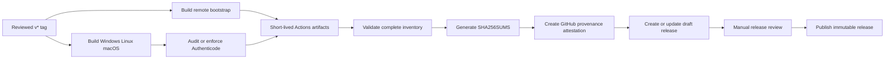

# Release Security

This document defines the trust boundary for Cosmosh CI artifacts and public releases. It distinguishes intentionally mutable development channels from versioned releases, records the current signing policy, and lists the repository controls required before the first public release.

## Channel Model

| Channel | Trigger | Asset mutability | Intended audience |
| --- | --- | --- | --- |
| Pull request and ordinary branch CI | Push or pull request | Short-lived Actions artifacts | Maintainers and reviewers |
| `remote-bootstrap-dev` | Push to `main` | Intentionally replaced in place | Rolling development builds |
| `remote-bootstrap-branch-*` | Matching branch push or explicit dispatch | Intentionally replaced in place | End-to-end branch testing |
| Versioned release | Push of a `v*` tag | Mutable only while draft; immutable after publication | Public users |

The rolling remote-bootstrap channels are not release archives. Their tags and assets move by design so development builds can follow the latest compatible helper. A packaged versioned release always embeds the exact `releases/download/<tag>/cosmosh-remote-bootstrap-manifest.json` URL and must never fall back to a rolling channel.

## Formal Release Flow

- Build and assembly jobs have read-only repository permissions and cannot modify GitHub Releases.
- Checkout steps do not persist workflow credentials. The OIDC attestation job and final writer do not check out or execute repository code; the writer's `GH_TOKEN` is exposed only to the draft create/upload step.
- `electron-builder` always receives `--publish never`; the final `publish-draft` job is the only writer.
- Cross-job artifacts have a seven-day retention period, are reassembled in a flat directory, and are downloaded again as one validated bundle by the writer job.
- `scripts/prepare-release-assets.mjs` fails when any expected platform artifact is missing, then writes deterministic `SHA256SUMS` entries.
- GitHub build-provenance attestations cover every uploaded asset and `SHA256SUMS`.
- A rerun may replace assets only after confirming that the existing release is still a draft. The workflow refuses to modify a published release.
- The release workflow is serialized per tag so two runs cannot intentionally publish the same version concurrently.

## Windows Signing Policy

The repository variable `COSMOSH_WINDOWS_SIGNING_POLICY` accepts exactly two values:

- `audit`: the temporary default while no signing provider is configured. The workflow inspects the installer and packaged `Cosmosh.exe`, records the result, and allows an unsigned draft. The draft title is prefixed with `UNSIGNED - DO NOT PUBLISH`.
- `enforce`: required before the first public Windows release. Every inspected executable must have a trusted Authenticode signature, a timestamp certificate, and a signer subject exactly matching `COSMOSH_WINDOWS_EXPECTED_PUBLISHER`, otherwise the release fails before draft creation.

An unset policy variable behaves as `audit`. Any other policy value fails explicitly. `COSMOSH_WINDOWS_EXPECTED_PUBLISHER` may remain unset in `audit`, but is mandatory in `enforce`; copy its exact value from the signer certificate subject reported by a trusted signed build. This policy is a verification gate, not a signer: a future signing integration must run during the Windows `electron-builder` packaging step so both the application executable and NSIS installer are signed. Signing credentials must live in a protected service or a dedicated protected signing environment and must never be committed to the repository.

Ordinary branch and pull-request builds do not use this policy and remain unsigned unless a developer explicitly configures local signing.

## Linux Authenticity

Current GitHub-hosted Linux assets use two release-level controls:

- `SHA256SUMS` provides deterministic integrity checks.
- GitHub artifact attestations bind the asset digests to this repository and release workflow through GitHub OIDC.

These controls do not make a directly downloaded `.deb` or AppImage a distribution-native signed package. If Cosmosh later operates an APT repository, its `InRelease` metadata must be signed with a separately managed repository key.

An attestation proves which GitHub workflow produced a digest. It does not approve an `audit` draft and does not replace Windows Authenticode, package-repository signing, or manual release review.

## GitHub Repository Controls

The following settings are not stored in workflow YAML and must be configured on GitHub before the first public release:

1. Enable immutable releases so publication locks the release assets and associated tag.
2. Add a tag ruleset for `v*` that blocks tag updates and deletion. Do not apply it to `remote-bootstrap-dev` or `remote-bootstrap-branch-*`.
3. Protect the `release` environment with the appropriate maintainer reviewers. Add a separate protected Windows signing environment when the selected provider requires workflow credentials.
4. Keep default workflow token permissions read-only. Grant write permissions only at the job level.
5. Require review for Dependabot pull requests that update pinned Action commit SHAs.

Draft releases remain intentionally mutable. Immutability begins only when a maintainer publishes the draft, so an `audit` draft must never be published.

## First Public Release Checklist

1. Select a Windows signing provider and configure its identity through a dedicated protected signing environment.
2. Set `COSMOSH_WINDOWS_EXPECTED_PUBLISHER` to the exact verified signer subject, then set `COSMOSH_WINDOWS_SIGNING_POLICY=enforce`.
3. Create the reviewed `v*` tag and wait for every build, signature, checksum, and attestation step to pass.
4. Download representative assets and verify `SHA256SUMS`.
5. Verify provenance with `gh attestation verify <asset> --repo agoudbg/cosmosh`.
6. Inspect the draft asset inventory and Windows publisher identity.
7. Publish the draft only after immutable releases and the `v*` tag ruleset are enabled.

## Current Limitations

- No Windows signing provider or credential contract has been selected.
- `audit` mode allows unsigned draft assets for pipeline validation; it does not approve them for public distribution.
- macOS code signing and notarization are outside the current Windows/Linux signing scope; macOS assets must not be treated as public-ready until that work is completed.
- Linux assets do not yet carry AppImage-embedded or APT repository signatures.
- Repository-side immutable release, ruleset, and environment-review settings require separate GitHub administration.
