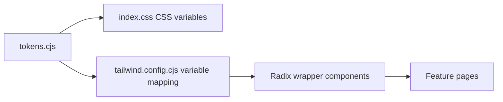
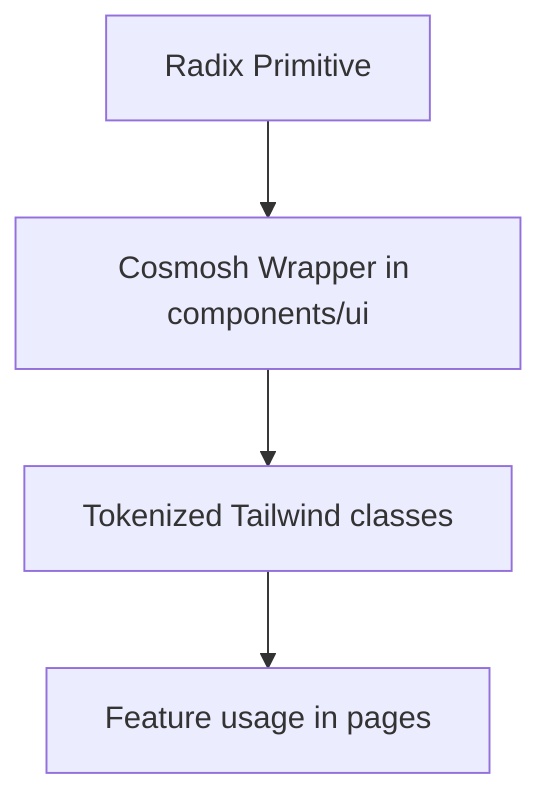

# UI/UX Standards

## 1. Design System Pipeline

Rules:

- Theme values originate from `packages/renderer/theme/tokens.cjs`.
- Tailwind colors/radius/shadow map to CSS variables (no hard-coded ad-hoc palette in feature code).
- UI primitives are wrapped in `packages/renderer/src/components/ui/*` and consumed by pages.
- Windows title-bar system menu symbol color must come from token `color.windows.system-menu-symbol` and be synchronized to main-process overlay at runtime.
- CodeMirror syntax highlighting must use the shared `color.syntax.*` token family and the shared renderer CodeMirror highlighter instead of page-local color maps.

## 2. Visual Consistency Principles

- Define all visual primitives (color, radius, shadow, blur, spacing) through tokens.
- Reuse established surface and control styles instead of per-page one-off styling.
- Keep contrast and state feedback clear for focus, hover, active, and disabled states.

## 3. Typography Standard

- Keep typography compact, readable, and consistent across controls and content areas.
- Preserve a stable body/control baseline and avoid arbitrary size jumps between adjacent components.
- Use clear hierarchy for titles, labels, helper text, and status messages.

## 4. Radius Logic

- Keep corner radius semantics coherent across surfaces and interactive controls.
- Prefer token-level radius presets; avoid introducing ad-hoc radius values.
- Ensure radius choices match component purpose (containers, controls, overlays).

## 5. Radix UI Encapsulation Principle

Implementation principles:

- Use Radix primitives only via internal wrappers (`dialog.tsx`, `menubar.tsx`, `toast.tsx`, etc.).
- Store style contracts in dedicated style maps (`menu-styles.ts`, `form-styles.ts`, `dialog-styles.ts`, `toast-styles.ts`).
- Keep accessibility/state selectors (`data-state`, collision handling, keyboard semantics) inside wrappers.
- Floating menu wrappers must cap their size with Radix available-size custom properties plus the shared viewport gutter so dropdowns, context menus, menubars, and selects never render outside the visible app viewport.
- Scroll affordances inside menu wrappers must stay outside normal item flow; showing or hiding up/down indicators must not reserve blank rows, resize the active viewport, or shift the current scroll position. Overlay affordances must carry a tokenized surface background and backdrop blur so translucent menus do not reveal items underneath.
- Menu single-choice/radio items must use the shared leading checkmark indicator, matching checkbox/menu selection affordances instead of dot markers.
- Third-party editor overlays that cannot use Radix wrappers, such as CodeMirror autocomplete and info tooltips, must still use the shared menu/tooltip token rhythm: `bg-bg-subtle`, `shadow-menu-content` or `shadow-soft`, 4px panel gutters, 6px/10px item padding, `rounded-lg` panels, `rounded-md` items, and `bg-menu-control-hover` for hover/selection.
- Reusable search/replace panels must use `SearchReplacePanel` from `packages/renderer/src/components/ui`. The panel is controlled by its caller, supports hidden/readonly/editable replacement modes, configurable filter toggles, match-count display, compact density, and action-level disabled/hidden states. Surface-specific adapters own search algorithms and map their state into this generic panel instead of forking the UI.
- CodeMirror editor syntax uses a VS Code-inspired default palette through semantic tokens; editor chrome, autocomplete, diagnostics, search/replace panels, and context menus still follow Cosmosh surface/menu tokens.

## 6. Interaction Density Rules

- Keep layout dense but breathable, prioritizing efficient scanning and frequent actions.
- Maintain consistent control rhythm and spacing within each feature surface.
- Scrollable category or navigation changes, including Settings page categories, should reset the content pane to the top of the newly selected surface.
- Avoid decorative patterns that reduce clarity or compete with task-focused content.

### 6.1 Entity Visual Picker Virtualization

- `EntityVisualPicker` uses `@tanstack/react-virtual` to keep the full Lucide icon catalog searchable while mounting only visible fixed-grid rows plus a small overscan window.
- The virtual grid preserves the established eight-column, 32 px icon-button rhythm and 4 px gap; virtualization must not resize or shift the picker while scrolling.
- TanStack Virtual owns range calculation, total scroll size, overscan, and row scrolling. Feature code owns search, selection, keyboard semantics, and focus restoration; do not add a parallel manual windowing algorithm.
- Arrow-key and forward-Tab navigation must call the virtualizer to reveal an offscreen target row before moving focus. Search updates keep the selected icon, or the first filtered icon when the selection is absent, as the active grid item.
- Virtualization reduces mounted DOM only. Changes to icon-module loading or bundle composition remain a separate concern.

## 7. Orbit Bar Standard

Terminal text selection interactions in SSH pages must follow these rules:

- Use tokenized Menubar-like surface style (`menu-control`, `menu-divider`, `shadow-menu`) for the Orbit Bar.
- Show Orbit Bar only when terminal selection exists and place it above selection first.
- If above placement would overlap selection or exceed viewport bounds, place it below selection.
- Keep Orbit Bar position synchronized with selection movement and viewport/layout updates.
- Provide tooltip labels for each icon action and keep labels localized through renderer i18n resources.
- Non-implemented actions must use explicit "coming soon" feedback instead of silent no-op behavior.

## 7.1 SSH Split-Pane Context Menu Standard

- SSH terminal split/close actions are exposed only through the terminal context menu.
- Split progression is intentionally constrained to a fixed dense layout sequence (1 → 2 → 3 → 4 panes) to keep power-user scanning rhythm predictable.
- Pane separators must use tokenized divider colors with lighter contrast than card boundaries.
- SSH split-pane separators should use the dedicated token `color.ssh.terminal.split.divider` (Tailwind: `border-ssh-terminal-split-divider`) instead of reusing generic home/card divider colors.
- Split panes must reuse the current live terminal session stream when technically feasible; avoid opening redundant backend sessions by default.
- Pane close action should be available on each pane context menu while keeping at least one visible pane.

## 7.2 Tab Reorder Runtime Continuity

- Dragging/reordering tabs should affect strip order only; it must not remount/recreate page runtimes.
- Runtime-heavy pages (for example SSH/xterm sessions) must preserve in-memory session state when tab order changes.
- Reorder state updates should be id-based and must preserve the latest tab objects from state instead of writing stale drag snapshots back.
- Global tab creation entry points, including the tab-strip plus button, Header user menu, app menu, and command palette, append new tabs to the end of the strip.
- The tab-strip plus button keeps single-click creation as the fastest path, while hover or keyboard focus held for 500 ms and right-click open its add menu below the button.
- The plus-button add menu must expose Command Palette, Servers, Keychains, and Port Forwarding using the shared menu wrapper; arrow keys navigate items, `Esc` closes the menu, and moving the pointer away from the button/menu closes it.
- Contextual tab creation from inside an existing tab must pass an explicit anchor id and insert the new tab immediately to the right of that source tab.
- The tab context menu exposes `New Tab to the Right` as the explicit user-facing affordance for anchored tab creation.

## 7.3 Server-Backed Tab Visuals

- In light mode, active server-backed tabs must deepen the server color through `color.header.tab.server-active-overlay`; do not change the generic `color.header.tab.active` token to solve server-color contrast.
- SSH and SFTP tabs may apply the source server color background when the shared server-visual tab setting is enabled.
- SFTP tabs must keep a folder icon even when they inherit server color, so users can distinguish file-system tabs from terminal tabs quickly.
- Inactive server-backed tabs must dim through the theme-aware `color.header.tab.server-inactive-overlay` token family rather than hard-coded black overlays, so light mode preserves a clean inactive tint.
- Colorized command-palette rows must use the matching `color.command.item.color-visual-active-overlay` and `color.command.item.color-visual-overlay` token families so active route switching visuals stay clearly distinguishable while remaining aligned with tab chrome across themes.

## 7.4 Page-State Tab Identity

- Pages with major internal categories should keep the tab strip aligned with the active category when that category changes the user's task context.
- Home tabs in Keychains or Port Forwarding mode must show that category's localized title and matching icon; returning to SSH mode restores the standard Home title and icon.

## 7.5 Plain Text Selection Context Menu

- Non-editable DOM text selections should expose a minimal fallback context menu with Copy only.
- The fallback menu must open only when the pointer is inside the selected text rectangle, not merely because the page has an active selection.
- Existing specialized menus keep priority: inputs, textareas, contenteditable regions, CodeMirror editor surfaces, xterm/terminal surfaces, SFTP rows, tabs, and any component-level context menu trigger must not be replaced by the fallback menu. CodeMirror editor surfaces that need text editing commands should expose those commands through the shared internal `ContextMenu` styling and localized text-editing labels instead of falling back to the browser menu.
- The fallback menu must reuse the internal `ContextMenu` wrapper, tokenized menu styles, localized renderer copy, and platform shortcut hint.
- Standalone renderer documents, including SFTP entry properties popup windows, must mount the same fallback provider at the renderer root.

## 7.6 Command Palette Keyboard Focus

- The global quick-pick overlay is shared by the command palette and tab switcher: a query starting with `>` shows commands, while a query without `>` shows the tab list.
- Command-palette shortcuts must open the shared overlay with the `>` prefix already present; `Ctrl+Tab` must open the same overlay in tab-list mode and only the real held `Ctrl+Tab` flow may commit on Control key release.
- When a command palette displays its search input, the input owns navigation keys even if a mouse click or nested control focus temporarily moves DOM focus to a list action or footer control.
- Arrow navigation and palette-close shortcuts from non-text-entry descendants must first restore focus to the input, then run the same handler path used by the input.
- Nested buttons must keep their normal activation semantics; focus handoff should not convert every descendant key into a command selection.

## 7.7 Composite Control Accessibility

- Custom command/search controls that render option lists must expose a labeled `combobox` tied to a labeled `listbox` with stable `aria-controls`, `aria-expanded`, `aria-activedescendant`, and per-option `aria-selected`.
- Icon-only controls must carry a localized accessible name through `aria-label`; tooltips remain visual help and must not be the only name.
- Registry-driven settings controls must connect visible labels to the rendered control with stable `htmlFor`/`id` pairs, including switches, selects, text fields, textareas, and JSON edit buttons.
- SFTP directory rows that support roving focus or selection must use `listbox`/`option` semantics and keep `aria-selected` aligned with entry selection instead of mixing selectable rows with `role="button"`.
- SFTP directory lists must support desktop-style pointer marquee selection from list whitespace and the panel padding beside the list. The marquee must use a clearly visible token-based border and fill, preview intersecting rows as selected while dragging, and continuously auto-scroll near the list's vertical edges. It must not replace entry drag-and-drop, header column dragging, or inline editing; `Ctrl`/`Cmd` extends the existing selection.

## 8. Compliance Checklist

Before merging UI changes:

1. New colors/radius/shadow values must come from token pipeline.
2. New interactive primitives should be Radix wrappers under `components/ui`.
3. Typography and spacing follow existing system-level scale.
4. Component behavior and states stay consistent with existing wrappers.
