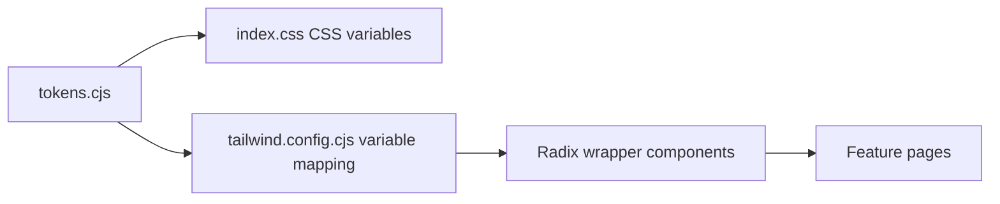
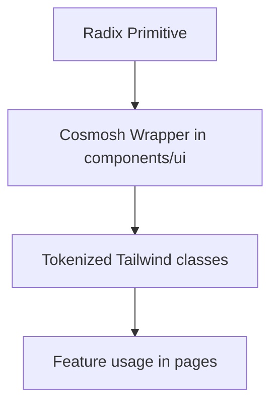

# UI/UX Standards

## 1. Design System Pipeline

Rules:

- Theme values originate from `packages/renderer/theme/tokens.cjs`.
- Tailwind colors/radius/shadow map to CSS variables (no hard-coded ad-hoc palette in feature code).
- UI primitives are wrapped in `packages/renderer/src/components/ui/*` and consumed by pages.
- Windows title-bar system menu symbol color must come from token `color.windows.system-menu-symbol` and be synchronized to main-process overlay at runtime.

## 2. Visual Consistency Principles

- Define all visual primitives (color, radius, shadow, blur, spacing) through tokens.
- Reuse established surface and control styles instead of per-page one-off styling.
- Keep contrast and state feedback clear for focus, hover, active, and disabled states.

## 3. Typography Standard

- Keep typography compact, readable, and consistent across controls and content areas.
- Preserve a stable body/control baseline and avoid arbitrary size jumps between adjacent components.
- Use clear hierarchy for titles, labels, helper text, and status messages.

## 4. Radius Logic

- Keep corner radius semantics coherent across surfaces and interactive controls.
- Prefer token-level radius presets; avoid introducing ad-hoc radius values.
- Ensure radius choices match component purpose (containers, controls, overlays).

## 5. Radix UI Encapsulation Principle

Implementation principles:

- Use Radix primitives only via internal wrappers (`dialog.tsx`, `menubar.tsx`, `toast.tsx`, etc.).
- Store style contracts in dedicated style maps (`menu-styles.ts`, `form-styles.ts`, `dialog-styles.ts`, `toast-styles.ts`).
- Keep accessibility/state selectors (`data-state`, collision handling, keyboard semantics) inside wrappers.
- Menu single-choice/radio items must use the shared leading checkmark indicator, matching checkbox/menu selection affordances instead of dot markers.

## 6. Interaction Density Rules

- Keep layout dense but breathable, prioritizing efficient scanning and frequent actions.
- Maintain consistent control rhythm and spacing within each feature surface.
- Scrollable category or navigation changes, including Settings page categories, should reset the content pane to the top of the newly selected surface.
- Avoid decorative patterns that reduce clarity or compete with task-focused content.

## 7. Orbit Bar Standard

Terminal text selection interactions in SSH pages must follow these rules:

- Use tokenized Menubar-like surface style (`menu-control`, `menu-divider`, `shadow-menu`) for the Orbit Bar.
- Show Orbit Bar only when terminal selection exists and place it above selection first.
- If above placement would overlap selection or exceed viewport bounds, place it below selection.
- Keep Orbit Bar position synchronized with selection movement and viewport/layout updates.
- Provide tooltip labels for each icon action and keep labels localized through renderer i18n resources.
- Non-implemented actions must use explicit "coming soon" feedback instead of silent no-op behavior.

## 7.1 SSH Split-Pane Context Menu Standard

- SSH terminal split/close actions are exposed only through the terminal context menu.
- Split progression is intentionally constrained to a fixed dense layout sequence (1 → 2 → 3 → 4 panes) to keep power-user scanning rhythm predictable.
- Pane separators must use tokenized divider colors with lighter contrast than card boundaries.
- SSH split-pane separators should use the dedicated token `color.ssh.terminal.split.divider` (Tailwind: `border-ssh-terminal-split-divider`) instead of reusing generic home/card divider colors.
- Split panes must reuse the current live terminal session stream when technically feasible; avoid opening redundant backend sessions by default.
- Pane close action should be available on each pane context menu while keeping at least one visible pane.

## 7.2 Tab Reorder Runtime Continuity

- Dragging/reordering tabs should affect strip order only; it must not remount/recreate page runtimes.
- Runtime-heavy pages (for example SSH/xterm sessions) must preserve in-memory session state when tab order changes.
- Reorder state updates should be id-based and must preserve the latest tab objects from state instead of writing stale drag snapshots back.
- Global tab creation entry points, including the tab-strip plus button, Header user menu, app menu, and command palette, append new tabs to the end of the strip.
- Contextual tab creation from inside an existing tab must pass an explicit anchor id and insert the new tab immediately to the right of that source tab.
- The tab context menu exposes `New Tab to the Right` as the explicit user-facing affordance for anchored tab creation.

## 7.3 Server-Backed Tab Visuals

- SSH and SFTP tabs may apply the source server color background when the shared server-visual tab setting is enabled.
- SFTP tabs must keep a folder icon even when they inherit server color, so users can distinguish file-system tabs from terminal tabs quickly.

## 7.4 Plain Text Selection Context Menu

- Non-editable DOM text selections should expose a minimal fallback context menu with Copy only.
- The fallback menu must open only when the pointer is inside the selected text rectangle, not merely because the page has an active selection.
- Existing specialized menus keep priority: inputs, textareas, contenteditable regions, Monaco, xterm/terminal surfaces, SFTP rows, tabs, and any component-level context menu trigger must not be replaced by the fallback menu.
- The fallback menu must reuse the internal `ContextMenu` wrapper, tokenized menu styles, localized renderer copy, and platform shortcut hint.
- Standalone renderer documents, including SFTP entry properties popup windows, must mount the same fallback provider at the renderer root.

## 7.5 Command Palette Keyboard Focus

- When a command palette displays its search input, the input owns navigation keys even if a mouse click or nested control focus temporarily moves DOM focus to a list action or footer control.
- Arrow navigation and palette-close shortcuts from non-text-entry descendants must first restore focus to the input, then run the same handler path used by the input.
- Nested buttons must keep their normal activation semantics; focus handoff should not convert every descendant key into a command selection.

## 8. Compliance Checklist

Before merging UI changes:

1. New colors/radius/shadow values must come from token pipeline.
2. New interactive primitives should be Radix wrappers under `components/ui`.
3. Typography and spacing follow existing system-level scale.
4. Component behavior and states stay consistent with existing wrappers.
