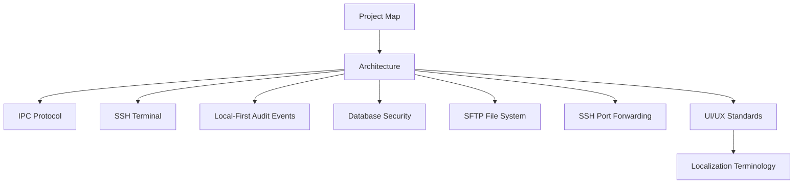

# Developer Documentation

This section is the engineering source of truth for Cosmosh implementation and governance.

## Recommended Read Order

## Sections

- Core
  - [Project Map](./core/project-map.md)
  - [Architecture](./core/architecture.md)
  - [IPC Protocol](./core/ipc-protocol.md)
- Runtime
  - [SSH Terminal](./runtime/ssh-terminal.md)
  - [Local-First Audit Events](./runtime/audit-events.md)
  - [Database Security](./runtime/database-security.md)
  - [SFTP File System](./runtime/sftp-file-system.md)
  - [SSH Port Forwarding](./runtime/port-forwarding.md)
- Design & Governance
  - [UI/UX Standards](./design/ui-ux-standards.md)
  - [Localization Terminology](./design/localization-terminology.md)

## Task-Oriented Entry Points

- Adding a new runtime feature: start from [Project Map](./core/project-map.md), then [Architecture](./core/architecture.md), then [IPC Protocol](./core/ipc-protocol.md).
- Updating SSH behavior: read [SSH Terminal](./runtime/ssh-terminal.md) and align protocol notes in [IPC Protocol](./core/ipc-protocol.md).
- Updating SSH port forwarding: read [SSH Port Forwarding](./runtime/port-forwarding.md), then verify IPC coverage in [IPC Protocol](./core/ipc-protocol.md).
- Reviewing security-sensitive action traces: read [Local-First Audit Events](./runtime/audit-events.md), then verify bridge coverage in [IPC Protocol](./core/ipc-protocol.md).
- Debugging DB encryption startup: read [Database Security](./runtime/database-security.md), then verify process flow in [Architecture](./core/architecture.md).
- Updating visual behavior: follow [UI/UX Standards](./design/ui-ux-standards.md) before touching page-level styles.
- Updating product-surface copy or feature names: follow [Localization Terminology](./design/localization-terminology.md) and keep locale files synchronized.

## Governance Reference

- Documentation governance and writing conventions are maintained in `docs/README.md` and repository root `AGENTS.md`.
