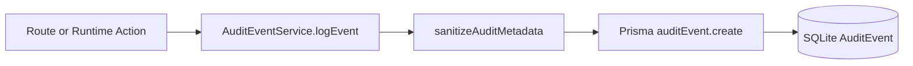

# Local-First Audit Events

## 1. Purpose and Scope

Cosmosh records security-core actions into a local-first audit stream so operators can trace sensitive operations without shipping data to external services.

Current scope covers high-value operational events:

- SSH connection lifecycle (`ssh-session`)
- Host fingerprint trust actions (`ssh-host-trust`)
- SSH server and keychain entity mutations (`ssh-server`, `ssh-keychain`)
- SSH port forwarding rule and runtime actions (`port-forward`)
- Settings mutation events (`settings`)

Compatibility note:

- Existing `SshLoginAudit` is still retained for SSH last-used sorting and legacy flows.
- New `AuditEvent` is the canonical event log for cross-domain security auditing.

## 2. Data Model

Audit persistence is implemented in backend Prisma schema:

- `AuditEvent`: immutable event records with time-ordered IDs and query indexes
- `AuditSyncCursor`: reserved local state for future remote-sync checkpoints

Core fields in `AuditEvent`:

- Event identity: `eventId`, `occurredAt`, `createdAt`
- Semantics: `category`, `action`, `outcome`, `severity`
- Scope: `scopeAccountId`, `scopeDeviceId`
- Correlation: `entityType`, `entityId`, `sessionId`, `requestId`, `correlationId`, `relatedRecordId`
- Metadata: `metadataJson`
- Retention: `retentionUntilAt`

## 3. Write Path and Failure Model

`AuditEventService.logEvent(...)` is the single backend write entry point.

Write behavior constraints:

- **Redaction first**: metadata keys like `password`, `token`, `privateKey`, `passphrase`, `secret` are replaced by a placeholder.
- **Size cap**: metadata JSON is truncated to a fixed upper bound (default 8 KB) to avoid runaway payload growth.
- **Best effort**: write failures are logged server-side and never break the parent request/session action.
- **Retention sweep**: service performs interval cleanup for expired rows (default retention: 180 days, sweep every 6 hours).

## 4. Query Contract

Audit APIs are exposed by backend routes and API contract types:

- `GET /api/v1/audit/events`
  - Filters: category, action, outcome, severity, entityType, entityId, sessionId, requestId, keyword, time range
  - Pagination: `page`, `pageSize`
- `GET /api/v1/audit/events/{eventId}`
  - Returns full record including parsed metadata

Standard result codes:

- `AUDIT_EVENT_LIST_OK`
- `AUDIT_EVENT_DETAIL_OK`
- `AUDIT_VALIDATION_FAILED`
- `AUDIT_EVENT_NOT_FOUND`

## 5. Electron Bridge and Renderer Integration

Main/preload/renderer chain exposes two channels:

- `backend:audit-list-events`
- `backend:audit-get-event-by-id`

Renderer integration points:

- `AuditLogs` page (`packages/renderer/src/pages/AuditLogs.tsx`)
- Tab route id: `audit-logs`
- Header quick entry opens the audit tab directly

The page uses a dense split layout:

- Left: filter controls
- Center: paginated event list
- Right: selected event details with formatted metadata

## 6. Security and Privacy Constraints

- Raw secrets and credential payloads are never persisted in audit metadata.
- Correlation IDs (`requestId`, `sessionId`, `relatedRecordId`) are kept to support forensic traceability without exposing secret values.
- Audit storage remains local-first by default; sync-cursor model is pre-provisioned for future optional synchronization.
