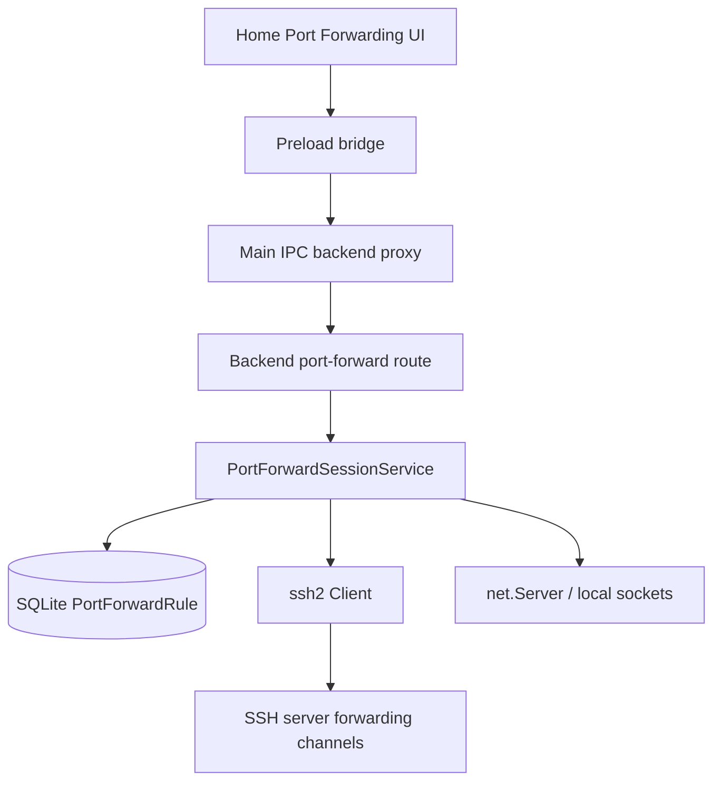

# SSH Port Forwarding

## 1. Purpose and Scope

Cosmosh supports manual SSH port forwarding from Home -> Port Forwarding:

- Local forwarding, equivalent to `ssh -L`.
- Remote forwarding, equivalent to `ssh -R`.
- Dynamic SOCKS5 forwarding, equivalent to `ssh -D`.

Rules are persisted in SQLite, but runtime state is intentionally backend-memory only. After app/backend restart every rule is listed as stopped and must be started manually again.

## 2. Data Model

The backend Prisma schema owns persisted rule metadata in `PortForwardRule`.

Core fields:

- Identity and ownership: `id`, `name`, `serverId`, `type`.
- Local bind fields: `localBindHost`, `localBindPort`.
- Remote bind fields: `remoteBindHost`, `remoteBindPort`.
- Target fields: `targetHost`, `targetPort`.
- Operator metadata: `note`, `createdAt`, `updatedAt`.
- Last runtime markers: `lastStartedAt`, `lastStoppedAt`, `lastFailureMessage`.

Runtime status is not persisted. The API list response merges persisted rules with the backend `PortForwardSessionService` in-memory registry and returns `runtime.status`, `activeConnectionCount`, optional bound endpoint, start time, and last runtime error.

## 3. API and IPC Contract

The contract source is `packages/api-contract/openapi/cosmosh.openapi.yaml`.

HTTP routes:

- `GET /api/v1/port-forwards/rules`
- `POST /api/v1/port-forwards/rules`
- `PUT /api/v1/port-forwards/rules/{ruleId}`
- `DELETE /api/v1/port-forwards/rules/{ruleId}`
- `POST /api/v1/port-forwards/rules/{ruleId}/start`
- `POST /api/v1/port-forwards/rules/{ruleId}/stop`

Electron bridge channels mirror those routes through Main's backend proxy:

- `backend:port-forward-list-rules`
- `backend:port-forward-create-rule`
- `backend:port-forward-update-rule`
- `backend:port-forward-start-rule`
- `backend:port-forward-stop-rule`
- `backend:port-forward-delete-rule`

Start can return the shared `SSH_HOST_UNTRUSTED` shape. The renderer must prompt for host fingerprint trust, call `backend:ssh-trust-fingerprint`, and retry start after acceptance.

## 4. Runtime Architecture

`PortForwardSessionService` owns all active sockets, SSH clients, channels, and remote-forward listeners. Backend shutdown calls `stop()` and closes every active runtime entry.

Unexpected SSH close/error cleanup is best-effort: runtime resources are removed first, and a failure to persist the final stopped/error metadata is logged without surfacing as an unhandled rejection that terminates the backend.

Explicit stop removes the runtime registry entry before closing SSH/listener resources, so transport close events cannot re-enter the unexpected-close path and dispose the same rule twice.

Forwarding implementations:

- Local: backend opens a `net.Server`; each inbound socket opens `ssh2.Client.forwardOut(...)` to `targetHost:targetPort` from the SSH server side.
- Remote: backend calls `client.forwardIn(remoteBindHost, remoteBindPort)`; each SSH `tcp connection` channel is accepted and connected from backend to `targetHost:targetPort`.
- Dynamic: backend opens a local `net.Server`, parses SOCKS5 no-auth TCP CONNECT, then uses `forwardOut(...)` for the requested host/port.

## 5. Validation and Safety Boundaries

Validation rules:

- `type` is `local`, `remote`, or `dynamic`.
- Port values must be integers in `1..65535`; ephemeral port `0` is not accepted in v1.
- Host fields must be non-empty and no longer than 255 characters.
- Name is required and capped at 120 characters.
- Note is optional and capped at 3000 characters.
- Active rules cannot be edited or deleted; stop first.

Runtime constraints:

- Startup is exclusive per rule id. A rule is treated as active while its SSH/listener setup is in flight, so duplicate start, update, and delete requests cannot create or orphan overlapping runtimes.
- Default local bind host is `127.0.0.1`.
- Non-localhost local bind hosts are allowed for advanced users, but renderer UI must show an explicit risk warning.
- Each active rule is limited to 64 concurrent connections.
- Individual connection setup timeout is 15 seconds.
- SOCKS5 supports no-auth TCP CONNECT for IPv4, IPv6, and domain targets. UDP ASSOCIATE, BIND, and authentication are unsupported.

## 6. Authentication and Host Trust

Forwarding opens SSH clients through the shared connection helper in `packages/backend/src/ssh/connect.ts`.

This helper centralizes:

- server -> keychain credential resolution,
- credential decryption,
- strict host key policy,
- server-scoped SSH transport compression negotiation,
- SHA256 known-host verification,
- normalized host-trust failure shape.

Shell, SFTP, and port forwarding must keep this behavior aligned. Do not duplicate SSH authentication logic in the port-forward domain.

## 7. Audit Events

Port forwarding emits local-first audit events with category `port-forward` for create, update, delete, start, stop, and start failure/host-trust failure paths.

Metadata includes rule name, type, server id, bind endpoints, and target endpoints. Secret values are not present in rule metadata and still pass through the audit sanitizer.

## 8. UI Integration

Renderer owner is `packages/renderer/src/pages/Home.tsx`.

Home -> Port Forwarding:

- Keeps search, mode-local sort/group controls, and a single New Rule action.
- Stores Home sort/group preference independently from the SSH and Keychains Home modes.
- Filters rules by the folder and tag metadata of the SSH server referenced by each rule, because forwarding rules do not own separate folder or tag fields.
- Displays a dense table with status, type, server, bind endpoint, target endpoint, activity, and actions.
- Supports ungrouped, status-grouped, and forwarding-type-grouped table views; the status grouping uses running/stopped runtime state.
- Provides New/Edit dialog, Start/Stop, Copy Endpoint, Delete, and host trust retry flow.

Running state should update from start/stop responses and refresh from list on Home reload. A backend restart intentionally resets all rows to stopped.

## 9. Server Proxy Behavior

- The start request carries optional transient `systemProxyRules`; renderer resolves it through Main only when the referenced server effectively uses the global system proxy.
- `PortForwardSessionService` uses the shared SSH proxy helper, so HTTP, HTTPS CONNECT, SOCKS5, explicit `DIRECT`, credentials, timeout, and host-trust behavior remain aligned with SSH and SFTP.
- Start failures never silently bypass the selected proxy.
- Audit metadata records resolved proxy mode/protocol only. Proxy URLs and credentials are excluded.
