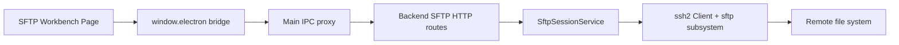
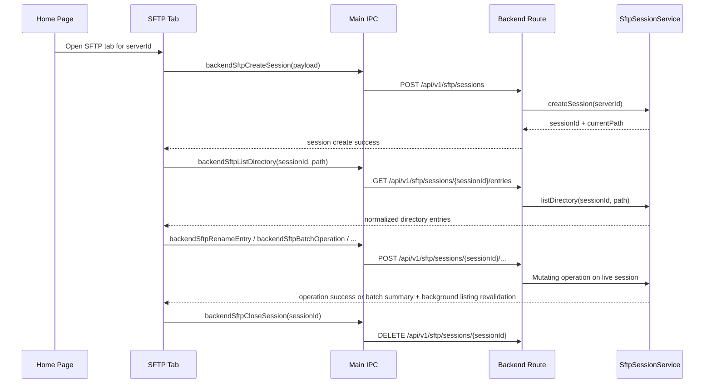

# SFTP File System

## 1. Current Status

Cosmosh implements a tab-scoped SFTP file-system workbench.

Implemented in v1:

- Home server context menu and file action can open an SFTP tab.
- Each SFTP tab creates a backend SFTP session and owns that session lifecycle.
- Directory listing supports breadcrumb path navigation with editable text fallback, persistent text-address display mode, back/forward history, parent navigation, refresh, current-directory filtering, loading, empty, expired-session, and operation-failed states.
- The renderer shows directory entries, metadata details, and a standalone Properties window. Double-clicking a regular file downloads it into the Cosmosh-controlled SFTP temp directory and opens it with the OS default application.
- The left directory tree shows the current directory ancestry, caches loaded child directories as users browse, and exposes directory-scoped right-click actions for open, new-tab open, refresh, paste, new file, and new folder.
- Center-list context menus and the top action bar expose open, open folder in a new tab, properties, open SSH here, copy path, copy relative path, save regular files locally, Open With where supported, cut, copy, paste, delete, new file, new folder, and inline rename. The directory list supports multi-selection with `Ctrl`/`Cmd` toggle and `Shift` range selection.
- SFTP settings control delete-confirmation scope, whether the center file list shows a leading `..` parent-directory row, and whether the address bar always renders as text.
- Backend write operations support empty-file creation, directory creation, rename/move, recursive copy, and recursive delete.

Intentionally not included in v1:

- upload, directory download, chmod, drag/drop, global search, file editing, and transfer queues.
- reuse of an active SSH terminal session. SFTP tabs establish their own SSH + SFTP connection.
- persisted SFTP history or additional database tables.

## 2. Runtime Architecture

### Ownership

- **API contract**: `packages/api-contract/openapi/cosmosh.openapi.yaml` defines SFTP paths, schemas, success codes, and error codes.
- **Backend**: `packages/backend/src/http/routes/sftp.ts` validates HTTP input and maps service results to API envelopes. `packages/backend/src/sftp/session-service.ts` owns SSH/SFTP connection setup, session registry, directory normalization, entry mapping, and cleanup.
- **Main/preload**: `packages/main/src/ipc/register-backend-ipc.ts` proxies SFTP requests to backend routes. `packages/main/src/ipc/register-app-utility-ipc.ts` owns native save/open helpers, validates Cosmosh SFTP temp paths, and launches platform Open With behavior. `packages/main/src/preload.ts` exposes the minimal renderer bridge.
- **Renderer**: `packages/renderer/src/pages/SFTP.tsx` owns tab-scoped UI state, file actions, inline rename/create state, and preview state.
- **Settings registry**: `packages/api-contract/src/settings-registry.ts` owns the SFTP delete-confirmation and parent-directory-row preferences consumed by the renderer settings store.

## 3. API Contract

All callers must use generated exports from `@cosmosh/api-contract`, especially `API_PATHS` and generated request/response payload types.

| Method | Path | Purpose |
|---|---|---|
| `POST` | `/api/v1/sftp/sessions` | Create an SFTP file-system session for one SSH server. |
| `GET` | `/api/v1/sftp/sessions/{sessionId}/entries?path=...` | List one remote directory for an active SFTP session. |
| `POST` | `/api/v1/sftp/sessions/{sessionId}/entries/details` | Fetch non-recursive metadata for selected remote entries, including `lstat` fields and symbolic-link target metadata. |
| `GET` | `/api/v1/sftp/sessions/{sessionId}/file?path=...&maxBytes=...` | Read a bounded UTF-8 preview for one remote file. |
| `POST` | `/api/v1/sftp/sessions/{sessionId}/download` | Stream one regular remote file to a local destination selected by main/preload. |
| `POST` | `/api/v1/sftp/sessions/{sessionId}/files` | Create one empty remote file. |
| `POST` | `/api/v1/sftp/sessions/{sessionId}/directories` | Create one remote directory. |
| `POST` | `/api/v1/sftp/sessions/{sessionId}/rename` | Rename or move one remote entry. |
| `POST` | `/api/v1/sftp/sessions/{sessionId}/copy` | Copy one remote file or directory tree. |
| `POST` | `/api/v1/sftp/sessions/{sessionId}/entries/delete` | Delete one remote file, symlink, or directory tree. |
| `POST` | `/api/v1/sftp/sessions/{sessionId}/batch` | Run one ordered batch copy, move, or delete operation across multiple remote entries. |
| `DELETE` | `/api/v1/sftp/sessions/{sessionId}` | Close one SFTP session and release the SSH connection. |

Success codes:

- `SFTP_SESSION_CREATE_OK`
- `SFTP_DIRECTORY_LIST_OK`
- `SFTP_ENTRY_DETAILS_OK`
- `SFTP_FILE_READ_OK`
- `SFTP_OPERATION_OK`

SFTP-specific error codes:

- `SFTP_SESSION_NOT_FOUND`
- `SFTP_VALIDATION_FAILED`
- `SFTP_OPERATION_FAILED`

Host fingerprint trust failures reuse the SSH host-trust envelope and code because SFTP uses the same SSH transport security model.

## 4. Session Lifecycle

Lifecycle rules:

- A normal Home context-menu action reuses an existing SFTP tab for the same server when one is already open.
- SSH Orbit Bar and terminal context-menu handoffs always create a new SFTP tab with the selected directory path, even when another SFTP tab for the same server is already open.
- Explicit new-tab actions create a new SFTP tab and therefore a separate backend SFTP session.
- Hidden SFTP tabs remain mounted and keep their session alive.
- Closing the tab or changing its connection intent closes the previous SFTP session on a best-effort basis.
- Backend shutdown closes all registered SFTP sessions.

## 5. Directory Listing And File Operations

The backend treats SFTP paths as POSIX paths regardless of the host OS running Cosmosh.

SSH-to-SFTP handoff accepts only explicit remote directory path selections: absolute paths, home-relative paths, dot-relative paths, and `file://` URLs. The renderer strips simple wrapping quotes and trailing punctuation before passing the path as structured `initialPath`; it does not execute shell commands or infer the terminal's current working directory for bare relative names.

Directory listing steps:

1. Normalize the requested path.
2. Resolve it with `realpath`.
3. Run `readdir` for the resolved directory.
4. Map each entry through the shared SFTP metadata mapper. The list response includes cheap, non-recursive fields: `name`, `path`, `parentPath`, `type`, `size`, `mode`, `permissions`, `permissionOctal`, `uid`, `gid`, `modifiedAt`, `accessedAt`, `extension`, `shellEscapedPath`, `isHidden`, and optional `longname`.
5. Sort directories first, then sort by name with numeric-aware locale comparison.

Entry types are reduced to:

- `directory`
- `file`
- `symlink`
- `other`

The backend sets `isHidden` when a server-provided SFTP extended attribute contains a recognizable hidden marker, or when the entry name starts with `.` and is not `.` or `..`. The renderer keeps full directory results in memory and applies the hidden-entry preference only to visible surfaces.

The renderer currently displays columns for name, size, modified time, and mode. The directory panel supports filtering entries in the current directory only; it is not a remote recursive search. `sftpShowHiddenEntries` defaults to `true` and controls whether hidden files and folders appear in the center list, left tree, and breadcrumb directory menus. `sftpDimHiddenEntries` also defaults to `true`; when hidden entries are visible, it applies 80% opacity only to the entry icon and name, leaving row selection, metadata columns, buttons, hover state, and context menus unchanged. The top toolbar overflow menu contains a checkbox for `Show Hidden Files`; row, blank-area, and tree context menus do not expose this preference. The details panel shows metadata for a single selected entry and shows a selected-count summary for multiple entries. The row info button and row context-menu `Properties` item open a standalone same-origin renderer popup that fetches selected entries through the existing details endpoint and renders Windows/macOS-style general, permissions, and symlink sections, including the entry hidden state. Multiple-entry properties show shared values, mixed markers, common parent directory, type counts, failed metadata count, hidden-state agreement, and total size. Raw metadata is no longer shown in the details sidebar; the Properties window can reveal the selected-entry details payload after an intentional seven-click gesture on its entry header. Electron popups use the current preload-backed SFTP session; browser popups show an explicit unsupported message until web SFTP runtime support exists. When `sftpShowParentDirectoryEntry` is enabled and the backend reports a parent path, the center list prepends a non-selectable `..` row that navigates to the parent directory without changing backend data.

Directory results are cached in the renderer for the lifetime of the SFTP tab. Revisiting an already loaded path uses that in-memory result immediately. The refresh action bypasses the cache and requests a fresh listing from the active backend session while preserving the visible list until the new result arrives.

Entry details use the same metadata mapper as the directory list and add only the fields that require entry-specific calls. The backend runs `lstat` for each selected path so symbolic links are described as links. For symlinks it also runs `readlink`, resolves relative targets against the link parent, and attempts `stat` on the target. Target status is reported as `exists`, `broken`, `permission-denied`, or `unknown`; target stats are included only when the target exists and is readable. Directory size is never calculated recursively by list or details requests.

Mutation rules:

- All mutating requests target the current live SFTP session and use POSIX-style paths.
- Empty files are created with exclusive write semantics so existing remote files are not overwritten.
- Directory copy is recursive. The backend chooses a `copy`, `copy 2`, ... suffix when the requested destination already exists.
- Copying a directory into itself or one of its descendants is rejected.
- Delete uses `lstat` so symlinks are removed as links instead of following their targets.
- Directory delete is recursive when requested by the renderer.
- Delete confirmation is a renderer-side safety gate controlled by `sftpDeleteConfirmationMode`: `always` asks before every delete, `batch` asks only when deleting more than one selected entry, `shortcut` asks only for keyboard-triggered deletes, and `off` calls the backend delete flow immediately.
- Multi-entry cut/copy/delete/paste uses one backend batch API request against the current SFTP session. The service executes entries in order, stops on the first failure, returns per-entry `success`/`failed`/`skipped` results, and does not roll back already completed entries. Rename, open, Open With, and open-in-new-tab remain single-entry actions.
- Local save actions remain single-entry actions and only support regular files. `Save to Downloads` asks main for the OS downloads path, `Save to...` asks main to show a native save dialog, and the backend streams the remote file through the live SFTP session into a temporary local file before replacing the final destination.
- Default file open and Open With actions also remain single-entry actions for regular files. The renderer asks main for a unique path under `app.getPath('temp')/cosmosh-sftp`, reuses the existing SFTP download endpoint to materialize the file, then asks main to open only that validated temp path.
- On Windows, `Open With...` is a plain menu item with no submenu and first uses the shell `openas` verb through a hidden PowerShell process; the validated temp file path is passed through the child process environment to avoid PowerShell argument parsing edge cases. If that shell verb is rejected by the OS for a file type, main falls back to `rundll32.exe shell32.dll,OpenAs_RunDLL`. On macOS, `Open With...` is a submenu populated by the NSWorkspace helper in `packages/main/resources/helpers`; `prebuild` compiles the helper binary on macOS, while development can fall back to the Swift source. Linux does not render the Open With action.
- Successful operations invalidate the current directory cache and revalidate the visible listing in the background, preserving the current list, filter, and selection until the server result arrives.

## 6. Security And Error Model

SFTP uses the same server, keychain, credential decryption, and host fingerprint trust model as SSH:

- Credentials are resolved from `SshServer` -> `SshKeychain` in the backend process.
- Decrypted secrets never cross into renderer or preload.
- Main injects the internal backend auth token and locale headers.
- Unknown or untrusted host fingerprints are returned through the same confirmation flow used by SSH.

Error mapping:

- Missing or invalid request data -> `SFTP_VALIDATION_FAILED`.
- Missing session id or closed session -> `SFTP_SESSION_NOT_FOUND`.
- Connection failures, permission errors, unreadable paths, copy/delete/rename failures, and remote SFTP errors -> `SFTP_OPERATION_FAILED`.
- Unknown host fingerprint -> `SSH_HOST_UNTRUSTED` with fingerprint confirmation data.

Security constraints:

- Renderer and preload never receive decrypted SSH credentials.
- SFTP paths are passed as structured API payloads, not shell commands.
- Local save destinations are selected or resolved by main/preload and passed to backend as explicit paths; renderer does not receive filesystem write primitives.
- Local OS-open actions are restricted to paths under the Cosmosh SFTP temp root. Main normalizes the candidate path, verifies it stays inside that root, and checks that it is an existing file before calling `shell.openPath`, Windows `openas`, or the macOS helper.
- Backend rejects empty mutable targets and root/current-directory markers for write operations.

## 7. Renderer UX Contract

The SFTP page follows Cosmosh workbench layout rules:

- Use three dense rounded workbench cards: left directory tree, center directory list, and right details/preview.
- Keep the tree panel narrow and task-oriented, currently aligned to the 250 px Cosmosh sidebar rhythm.
- Use internal UI wrappers (`Button`, `Tooltip`, `Dialog`) and tokenized classes.
- SFTP tabs use a folder icon and inherit the server color background when the shared SSH/SFTP server-visual tab setting is enabled.
- Keep the toolbar compact and ordered as path controls, remote path address bar, file-operation buttons, and current-directory filter.
- The address bar defaults to a Windows-style breadcrumb control. Segment labels navigate to that path, segment arrows open that level's available child directories from the renderer directory cache or lazy-load them from the active session, and the blank area temporarily switches back to the editable text input. The address-bar context menu keeps `Copy Address` and `Edit Address`, plus a `Show Address as Text` action that persists `sftpShowAddressAsText`. When that setting is enabled, the address bar always renders as the plain input, including when it is not actively focused; the input context menu exposes the reverse display action so users can return to the breadcrumb control without leaving the field first.
- The back and forward toolbar controls use plain directional arrow icons. Left-click jumps one step; right-click opens a context menu only when reachable history targets exist, listing them in nearest-first order to match desktop file-manager navigation.
- Use `MenubarSeparator` for toolbar separators so divider metrics and colors stay aligned with shared menu tokens.
- Expose file actions in the center list context menu and toolbar; unavailable actions must be disabled.
- Row info icons open the standalone Properties window for that entry and must not trigger row double-click open.
- Expose tree-node actions through the left directory tree context menu. These actions are scoped to the clicked directory and must not inherit center-list multi-selection state.
- Directory-list row selection matches desktop file-manager conventions: plain click replaces the selection, `Ctrl`/`Cmd` toggles one row, and `Shift` selects the visible range from the current anchor. Row context menus preserve an existing multi-selection when the clicked row is already selected.
- The left directory tree and center file list use roving focus: `Tab` enters each list once, then `ArrowUp`/`ArrowDown` move between rows. In the file list, arrow navigation selects the focused file row while the optional `..` parent row remains activation-only.
- Avoid duplicated menu entries across the toolbar overflow menu and the context-menu surface. Row context menus focus on the selected entry, blank-area context menus focus on paste/create actions, tree context menus focus on the clicked directory, and the toolbar overflow menu contains actions that do not already have dedicated toolbar buttons.
- The Properties surface is a separate Electron/browser window. Its first version reuses existing SFTP card, text, and button styles, keeps field labels and values selectable, and reserves permissions editing through a standard edit button at the end of the permissions section.
- Inline rename and create inputs stay inside the row grid without changing icon or text baseline position.
- Inline rename and create actions launched from context or overflow menus must defer the edit-state transition until menu close handling begins, suppress menu close autofocus while the input is being mounted, and then focus/select the row input. This prevents the first menu-triggered edit from being blurred and committed or cancelled before the user can type.
- Platform shortcut labels follow desktop convention: `Cmd` on macOS and `Ctrl`/`Delete` on Windows/Linux. Context menus and toolbar overflow menus must show the same shortcut labels for actions that have keyboard handlers.
- `Open in New Tab` is only rendered for directory targets, and `Open With...` is placed directly after it in the open-action group. `Open With...` must not include a leading icon. Windows shows it as a single item that opens the system picker. macOS shows it as a submenu with application names and icons returned from main; Linux omits the action.
- Delete confirmation uses the shared `Dialog` wrapper and must preserve the pending operation until the user confirms or cancels. Keyboard-triggered delete passes an explicit shortcut source so the confirmation setting can distinguish shortcut-only safety prompts from toolbar and context-menu deletes.
- The optional `..` parent-directory row belongs to the center file list only. It must render before real entries, stay out of selection and detail state, use double-click/Enter activation like regular file rows, and show a disabled state at the remote root when no parent path exists.
- Show the current directory and all parent directories in the tree; expanding a tree row loads its child directory list and shows an inline spinner while loading.
- Match file-manager behavior: expanding or collapsing a tree row does not navigate the center directory list. Opening a directory from the center list or path toolbar changes the current directory.
- Preserve stable list columns and truncate long names/paths instead of allowing layout shift. The address bar must collapse older path levels behind an ellipsis menu when the path is too deep so the current directory remains visible within narrow toolbars.

## 8. Future Scope

Future SFTP work should be planned separately. Likely next phases:

1. Streamed download/upload with progress and cancellation.
2. chmod and richer permissions editing.
3. Transfer queue and conflict handling for long-running copies/uploads/downloads.
4. Full file editor integration with save/write-back semantics.
5. Optional terminal-path handoff once the SSH terminal and SFTP session model can share state safely.
