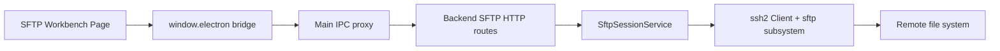
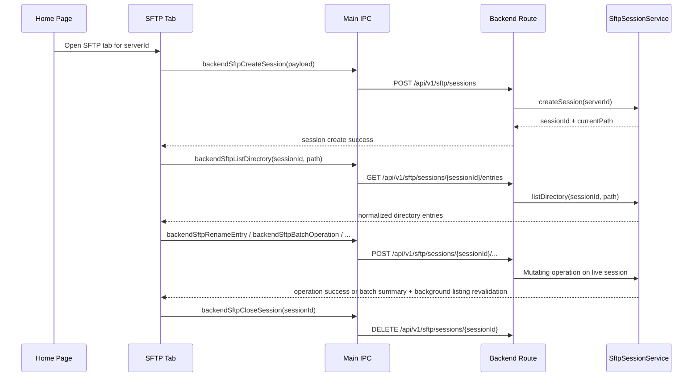

# SFTP File System

## 1. Current Status

Cosmosh implements a tab-scoped SFTP file-system workbench.

Implemented in v1:

- Home server context menu and file action can open an SFTP tab.
- Each SFTP tab creates a backend SFTP session and owns that session lifecycle.
- Directory listing supports breadcrumb path navigation with editable text fallback, persistent text-address display mode, back/forward history, parent navigation, refresh, current-directory filtering, configurable metadata columns, header sorting, header drag-reorder, loading, empty, expired-session, and operation-failed states.
- The directory tree and center file list preserve their complete logical collections while virtual scrolling mounts only the viewport, a small overscan window, and interaction-owned pinned rows.
- The renderer shows directory entries, metadata details, editable text/code previews, image previews, and a standalone Properties window. Double-clicking a regular file downloads it into the Cosmosh-controlled SFTP temp directory and opens it with the OS default application.
- Opened regular files are watched from the Cosmosh-controlled SFTP temp directory. When a watched temp file changes, the renderer asks whether to upload the change back to the remote file. If the remote size or modified time no longer matches the version that was opened, the renderer asks for explicit overwrite confirmation before retrying.
- Preview mode follows a Windows Explorer-style auxiliary sidebar. Text/code previews use CodeMirror 6 and can save UTF-8 changes back through SFTP; image previews materialize through the same controlled temp-file download path. Large text and image previews require explicit user confirmation before opening, with thresholds backed by settings.
- The left directory tree shows the current directory ancestry, caches loaded child directories as users browse, automatically scrolls the current directory row near the upper third of the tree viewport after directory navigation only when the logical parent/current/expanded-child context is outside the visible viewport, and exposes directory-scoped right-click actions for open, new-tab open, refresh, paste, Paste as Link from the SFTP clipboard, new file, and new folder.
- Center-list context menus and the top action bar expose open, open folder in a new tab, properties, open SSH here, copy path, copy relative path, save regular files locally, Open With where supported, cut, copy, paste, Paste as Link from the SFTP clipboard, delete, new file, new folder, and inline rename. Symlink rows render with dedicated file/folder symlink icons and expose `Open File Location`, which resolves the link target on demand and navigates to the target's containing directory. The directory list supports mouse and keyboard multi-selection with `Ctrl`/`Cmd` toggle, `Ctrl`/`Cmd+A` select-all, and `Shift` range selection.
- Internal same-tab dragging starts from one or more directory-list entries and drops only on explicit remote directory targets: left tree rows, center-list directory rows, breadcrumb directory segments, and address-bar directory dropdown entries. The resolved action is ask, move, copy, or create-link, with a separate platform-primary-modifier setting (`Ctrl` on Windows/Linux, `Cmd` on macOS).
- The toolbar, directory blank-area menu, tree-directory menu, and external file drops can upload one or more local regular files into the selected remote directory. Main stages native-picker selections and preload-resolved dropped files under the controlled SFTP temp root; uploads run sequentially through the tab-local task queue, and existing remote names require explicit overwrite confirmation. External folder drops are rejected with renderer feedback until recursive directory upload is implemented.
- Renderer-managed file operations are queued per SFTP tab and surfaced in a compact toolbar task menu with queued, running, success, and failed states. Single-file uploads and explicit downloads add byte progress, percentage, and rolling transfer speed; failed tasks retain both the file name and backend error reason and also raise a localized error notification.
- SFTP settings control reconnect mode, delete-confirmation scope, internal-drag default and modifier actions, file-list column/sort view state, whether the center file list shows a leading `..` parent-directory row, whether the address bar always renders as text, the auxiliary sidebar mode, and the text/image preview warning thresholds.
- Backend write operations support local-file upload, empty-file creation, directory creation, rename/move, recursive copy, absolute symlink creation, and recursive delete.

Intentionally not included in v1:

- directory upload/download, chmod, cross-tab drag/drop targets, file-row/text-address drop targets, global search, and backend-owned transfer scheduling with cancellation, resume, or persisted history.
- reuse of an active SSH terminal session. SFTP tabs establish their own SSH + SFTP connection.
- persisted SFTP history or additional database tables.

## 2. Runtime Architecture

### Ownership

- **API contract**: `packages/api-contract/openapi/cosmosh.openapi.yaml` defines SFTP paths, schemas, success codes, and error codes.
- **Backend**: `packages/backend/src/http/routes/sftp.ts` validates HTTP input and maps service results to API envelopes. `packages/backend/src/sftp/session-service.ts` owns SSH/SFTP connection setup, session registry, directory normalization, entry mapping, and cleanup.
- **Main/preload**: `packages/main/src/ipc/register-backend-ipc.ts` proxies SFTP requests to backend routes. `packages/main/src/ipc/register-app-utility-ipc.ts` owns native save/open helpers, validates Cosmosh SFTP temp paths, and launches platform Open With behavior. `packages/main/src/preload.ts` exposes the minimal renderer bridge.
- **Renderer**: `packages/renderer/src/pages/SFTP.tsx` owns tab-scoped UI state, file actions, inline rename/create state, and preview state.
- **Settings registry**: `packages/api-contract/src/settings-registry.ts` owns the SFTP reconnect, delete-confirmation, internal-drag action, directory-list view, parent-directory-row, hidden-entry, address-display, auxiliary-sidebar, and preview-threshold preferences consumed by the renderer settings store.

## 3. API Contract

All callers must use generated exports from `@cosmosh/api-contract`, especially `API_PATHS` and generated request/response payload types.

| Method   | Path                                                           | Purpose                                                                                                                                         |
| -------- | -------------------------------------------------------------- | ----------------------------------------------------------------------------------------------------------------------------------------------- |
| `POST`   | `/api/v1/sftp/sessions`                                        | Create an SFTP file-system session for one SSH server.                                                                                          |
| `GET`    | `/api/v1/sftp/sessions/{sessionId}/entries?path=...`           | List one remote directory for an active SFTP session.                                                                                           |
| `POST`   | `/api/v1/sftp/sessions/{sessionId}/entries/details`            | Fetch non-recursive metadata for selected remote entries, including `lstat` fields and symbolic-link target metadata.                           |
| `GET`    | `/api/v1/sftp/sessions/{sessionId}/file?path=...&maxBytes=...` | Read a bounded UTF-8 preview for one remote file.                                                                                               |
| `POST`   | `/api/v1/sftp/sessions/{sessionId}/file`                       | Save editable UTF-8 preview content back to one regular remote file after size/mtime conflict checks.                                           |
| `POST`   | `/api/v1/sftp/sessions/{sessionId}/download`                   | Stream one regular remote file to a local destination selected by main/preload.                                                                 |
| `POST`   | `/api/v1/sftp/sessions/{sessionId}/upload`                     | Stream one controlled local temp file to a new remote path, or replace an existing regular file after snapshot/explicit overwrite confirmation. |
| `GET`    | `/api/v1/sftp/transfers/{transferId}`                           | Read byte progress, rolling speed, status, and an optional failure reason for one active or recently completed single-file transfer.              |
| `POST`   | `/api/v1/sftp/sessions/{sessionId}/files`                      | Create one empty remote file.                                                                                                                   |
| `POST`   | `/api/v1/sftp/sessions/{sessionId}/directories`                | Create one remote directory.                                                                                                                    |
| `POST`   | `/api/v1/sftp/sessions/{sessionId}/rename`                     | Rename or move one remote entry.                                                                                                                |
| `POST`   | `/api/v1/sftp/sessions/{sessionId}/copy`                       | Copy one remote file or directory tree.                                                                                                         |
| `POST`   | `/api/v1/sftp/sessions/{sessionId}/entries/delete`             | Delete one remote file, symlink, or directory tree.                                                                                             |
| `POST`   | `/api/v1/sftp/sessions/{sessionId}/batch`                      | Run one ordered batch copy, move, link, or delete operation across multiple remote entries.                                                     |
| `GET`    | `/api/v1/sftp/sessions/{sessionId}/archive-capabilities`       | Probe and cache remote POSIX archive tools for the active session.                                                                              |
| `POST`   | `/api/v1/sftp/sessions/{sessionId}/archive-operations`         | Start one structured asynchronous compress or extract operation.                                                                                |
| `GET`    | `/api/v1/sftp/sessions/{sessionId}/archive-operations/{operationId}` | Poll archive state, stage, conflicts, results, or a stable error.                                                                          |
| `POST`   | `/api/v1/sftp/sessions/{sessionId}/archive-operations/{operationId}/conflict-resolution` | Apply one overwrite, keep-both, or cancel decision to all pending conflicts.                                              |
| `DELETE` | `/api/v1/sftp/sessions/{sessionId}/archive-operations/{operationId}` | Request bounded cancellation and cleanup.                                                                                                 |
| `DELETE` | `/api/v1/sftp/sessions/{sessionId}`                            | Close one SFTP session and release the SSH connection.                                                                                          |

Success codes:

- `SFTP_SESSION_CREATE_OK`
- `SFTP_DIRECTORY_LIST_OK`
- `SFTP_ENTRY_DETAILS_OK`
- `SFTP_FILE_READ_OK`
- `SFTP_OPERATION_OK`
- `SFTP_ARCHIVE_CAPABILITIES_OK`
- `SFTP_ARCHIVE_OPERATION_ACCEPTED`
- `SFTP_ARCHIVE_OPERATION_STATUS_OK`

SFTP-specific error codes:

- `SFTP_SESSION_NOT_FOUND`
- `SFTP_VALIDATION_FAILED`
- `SFTP_OPERATION_FAILED`
- `SFTP_UPLOAD_CONFLICT`
- `SFTP_ARCHIVE_UNSUPPORTED`
- `SFTP_ARCHIVE_BUSY`
- `SFTP_ARCHIVE_TARGET_EXISTS`
- `SFTP_ARCHIVE_UNSAFE_ENTRY`
- `SFTP_ARCHIVE_OPERATION_NOT_FOUND`
- `SFTP_ARCHIVE_OPERATION_FAILED`
- `SFTP_ARCHIVE_TIMEOUT`
- `SFTP_ARCHIVE_CANCEL_FAILED`

Host fingerprint trust failures reuse the SSH host-trust envelope and code because SFTP uses the same SSH transport security model.

## 4. Session Lifecycle

Lifecycle rules:

- A normal Home context-menu action reuses an existing SFTP tab for the same server when one is already open.
- SSH Orbit Bar and terminal context-menu handoffs always create a new SFTP tab with the selected directory path, even when another SFTP tab for the same server is already open.
- Explicit new-tab actions create a new SFTP tab and therefore a separate backend SFTP session.
- Hidden SFTP tabs remain mounted and keep their session alive.
- Closing the tab or changing its connection intent first cancels and cleans an active archive job within a bounded wait, then closes the previous SFTP SSH connection.
- `SftpSessionService` watches the underlying `ssh2` client and SFTP stream for `close`, `end`, and `error`. Once either transport becomes unusable, the session is evicted from the registry so later requests return `SFTP_SESSION_NOT_FOUND` quickly instead of hanging behind a dead socket.
- `sftpReconnectMode` defaults to `passive`. In passive mode, renderer SFTP requests that receive `SFTP_SESSION_NOT_FOUND` create one replacement session, update the tab `sessionId`, and retry the original request once.
- Explicit download tasks keep the Main-issued exact local-path authorization bound to the same renderer and `transferId` for at most one reconnect retry. The retry becomes usable only after `SFTP_SESSION_NOT_FOUND`, expires after 60 seconds, and is revoked immediately by any other terminal response.
- `active` is currently a user-selectable setting that uses the same reconnect pipeline when the page already knows the current session expired. It does not add backend push events or polling.
- `off` disables renderer retry. The backend still evicts closed sessions, so operations fail quickly with the session-not-found message instead of remaining pending.
- Backend shutdown closes all registered SFTP sessions.
- Main treats every entry still held by `SftpSessionService` as active when evaluating a window/app close. When shown, the renderer warning dialog intentionally summarizes all in-progress sessions without exposing per-protocol counts.
- The General > Behavior `Ask Before Closing Window` setting defaults on. When disabled, Main skips the renderer dialog but still closes active SFTP sessions through the bulk-close endpoint before continuing the close; setting read failures retain the warning.
- After confirmation, or immediately when confirmation is disabled, `DELETE /api/v1/runtime/active-connections` closes each registered SFTP SSH client before window destruction. This is required on macOS, where closing the last window does not quit the application or stop Backend.
- Bulk SFTP close runs session cleanup in parallel; activity counts and the close-warning contract remain session-based rather than task-based.

## 5. Directory Listing And File Operations

The backend treats SFTP paths as POSIX paths regardless of the host OS running Cosmosh.

SSH-to-SFTP handoff accepts only explicit remote directory path selections: absolute paths, home-relative paths, dot-relative paths, and `file://` URLs. The renderer strips simple wrapping quotes and trailing punctuation before passing the path as structured `initialPath`; it does not execute shell commands or infer the terminal's current working directory for bare relative names.

Directory listing steps:

1. Normalize the requested path.
2. Resolve it with `realpath`.
3. Run `readdir` for the resolved directory.
4. Map each entry through the shared SFTP metadata mapper. The list response includes non-recursive fields: `name`, `path`, `parentPath`, `type`, `size`, `mode`, `permissions`, `permissionOctal`, `uid`, `gid`, `modifiedAt`, `accessedAt`, `extension`, `shellEscapedPath`, `isHidden`, optional `longname`, and optional `symlinkTarget` metadata for symlink rows.
5. Store directory results in renderer memory and derive visible ordering with directories first, then the configured `sftpDirectoryListView.sort` field and direction. Name fallback uses numeric-aware locale comparison.

Entry types are reduced to:

- `directory`
- `file`
- `symlink`
- `other`

The backend sets `isHidden` when a server-provided SFTP extended attribute contains a recognizable hidden marker, or when the entry name starts with `.` and is not `.` or `..`. The renderer keeps full directory results in memory and applies the hidden-entry preference only to visible surfaces.

The center list uses configurable columns backed by `sftpDirectoryListView`, an internal JSON setting stored through the shared settings registry. Supported columns intentionally stay within fields already returned by the directory list response: `name`, `modifiedAt`, `type`, `size`, `accessedAt`, `permissions`, `permissionOctal`, `mode`, `uid`, `gid`, `extension`, `isHidden`, `path`, `parentPath`, `shellEscapedPath`, `longname`, and optional `symlinkTarget` metadata for symlink rows. Showing columns does not add per-entry `lstat`, recursive size, or non-symlink target calls. Symlink rows resolve `readlink` plus one target `stat` so the renderer can distinguish file and folder symlink icons and drive `Open File Location`; failures are captured as target status metadata instead of failing the directory list. The Properties window uses the details endpoint for richer selected-entry inspection.

The renderer retains the complete filtered/sorted entry array and flattened expanded-tree order for selection, keyboard navigation, and drag/drop. `@tanstack/react-virtual` limits mounted DOM to fixed-height viewport rows plus overscan, using stable remote paths as item keys. The active roving-focus row and rows that own inline editing, an open context menu, or a native drag remain mounted when required; moving to an offscreen row reveals it before focus changes. The sticky directory header is not part of the virtual row collection.

Column visibility, order, and sort are changed from the directory header context menu and the toolbar overflow menu. Header clicks sort by that column or toggle ascending/descending when the column is already active. Dragging visible headers updates the persisted column order. The list keeps directories grouped before non-directories for every supported sort field.

The directory panel supports filtering entries in the current directory only; it is not a remote recursive search. `sftpShowHiddenEntries` defaults to `true` and controls whether hidden files and folders appear in the center list, left tree, and breadcrumb directory menus. `sftpDimHiddenEntries` also defaults to `true`; when hidden entries are visible, it applies 80% opacity only to the entry icon and name, leaving row selection, metadata columns, hover state, and context menus unchanged. The top toolbar overflow menu contains a checkbox for `Show Hidden Files`; row, blank-area, and tree context menus do not expose this preference. The details panel shows metadata for a single selected entry and shows a selected-count summary for multiple entries. The row context-menu `Properties` item opens a standalone same-origin renderer popup that fetches selected entries through the existing details endpoint and renders Windows/macOS-style general, permissions, and symlink sections, including the entry hidden state. Multiple-entry properties show shared values, mixed markers, common parent directory, type counts, failed metadata count, hidden-state agreement, and total size. Raw metadata is no longer shown in the details sidebar; the Properties window can reveal the selected-entry details payload after an intentional seven-click gesture on its entry header. Electron popups use the current preload-backed SFTP session; browser popups show an explicit unsupported message until web SFTP runtime support exists. When `sftpShowParentDirectoryEntry` is enabled and the backend reports a parent path, the center list prepends a non-selectable `..` row that navigates to the parent directory without changing backend data.

The auxiliary sidebar is controlled by `sftpAuxiliarySidebarMode` and can be `details`, `preview`, or `off`. Details mode is the existing metadata sidebar. Preview mode renders one selected regular file when supported: text/code extensions open in CodeMirror 6 with editing enabled, image extensions show an image preview, and unsupported entries show `No preview`. Multiple selection and empty selection do not issue preview reads or downloads.

Directory results are cached in the renderer for the lifetime of the SFTP tab. Revisiting an already loaded path uses that in-memory result immediately. The refresh action bypasses the cache and requests a fresh listing from the active backend session while preserving the visible list until the new result arrives.

Entry details use the same metadata mapper and symlink-target resolver as the directory list. The backend runs `lstat` for each selected path so symbolic links are described as links; for symlinks it returns the same `readlink`, resolved target path, target `stat`, and target status metadata used by the list. Target status is reported as `exists`, `broken`, `permission-denied`, or `unknown`; target stats are included only when the target exists and is readable. Directory size is never calculated recursively by list or details requests.

Mutation rules:

- All mutating requests target the current live SFTP session and use POSIX-style paths.
- Empty files are created with exclusive write semantics so existing remote files are not overwritten.
- Directory copy is recursive. The backend chooses a `copy`, `copy 2`, ... suffix when the requested destination already exists.
- Copying a directory into itself or one of its descendants is rejected.
- Moving a directory into itself or one of its descendants is rejected before issuing the remote rename.
- Batch `link` creates an absolute symbolic link in the target directory that points to the source remote absolute path. The link name uses the source basename and the same `copy`, `copy 2`, ... conflict suffix policy as copy.
- Delete uses `lstat` so symlinks are removed as links instead of following their targets.
- Directory delete is recursive when requested by the renderer.
- Delete confirmation is a renderer-side safety gate controlled by `sftpDeleteConfirmationMode`: `always` asks before every delete, `batch` asks only when deleting more than one selected entry, `shortcut` asks only for keyboard-triggered deletes, and `off` calls the backend delete flow immediately.
- Renderer file operations enter a tab-local FIFO task queue before calling the backend. The queue keeps navigation, selection, filtering, and refresh usable while work is pending, and the toolbar task menu remains visible until completed tasks expire after a short inspection window. Explicit upload/download tasks generate a UUID `transferId`, poll `GET /api/v1/sftp/transfers/{transferId}` every 500 ms while the final request is pending, and render byte progress plus speed without moving file contents through IPC.
- `SftpSessionService` stores active and terminal progress records in memory. Stream chunks update transferred bytes immediately and refresh a smoothed bytes-per-second sample no more than every 250 ms. Completed and failed records remain queryable for 60 seconds, are never persisted, and are pruned lazily.
- Local upload selection is owned by main through a native multi-file dialog, while external file drops are resolved to local paths only inside preload before main staging. Each selected or dropped regular file is copied into an isolated directory under the Cosmosh SFTP temp root before its descriptor reaches renderer; the source workstation path is never exposed to backend HTTP or retained by renderer. Dropped directories and non-regular entries are reported back as rejected entries and are not recursively traversed in v1.
- Each staged local file becomes one FIFO upload task. A missing remote target is created with exclusive-write semantics; an existing regular-file target returns `SFTP_UPLOAD_CONFLICT` unless the request carries the original opened-file snapshot or renderer retries with `overwrite: true` after explicit confirmation.
- Staged upload files are removed after their task settles. Connection resets and tab unmount also request best-effort cleanup for queued staging paths that did not start.
- Passive reconnect is surfaced as a regular `Reconnect` task in the same task menu. Concurrent SFTP operations that observe the same stale session share one in-flight reconnect promise, then each operation retries once against the new session id. If reconnect succeeds but the original operation still fails, the renderer reports that operation failure and does not start a second reconnect loop.
- Reconnect prefers the tab's current path (`currentPathRef.current`) when creating the replacement session and falls back to the original connection intent path, or `.` when no initial path was provided.
- Multi-entry cut/copy/link/delete/paste and internal drag operations use one backend batch API request against the current SFTP session. The service executes entries in order, stops on the first failure, returns per-entry `success`/`failed`/`skipped` results, and does not roll back already completed entries. `Paste as Link` uses the current SFTP clipboard snapshot as its source list, creates absolute symlinks in the chosen target directory, and does not consume the clipboard. Rename, open, Open With, local save, empty-file creation, and directory creation remain single-entry tasks. Open-in-new-tab remains immediate because it does not mutate the current session.
- Local save actions remain single-entry actions and only support regular files. `Save to Downloads` asks main to authorize one exact file under the OS Downloads directory, while `Save to...` asks main to authorize the native save-dialog selection. Both capabilities are owner-bound and single-use; the backend proxy rejects arbitrary renderer-provided destinations before streaming the remote file through the live SFTP session into a temporary local file and replacing the final destination.
- Default file open and Open With actions also remain single-entry actions for regular files. The renderer asks main for a unique, reusable owner-bound path under the Main-owned per-run SFTP temp root, reuses the existing SFTP download endpoint to materialize the file, then asks main to open only that validated temp path.
- Preview reads are renderer-driven and single-entry only. Text/code preview reads call the bounded UTF-8 file endpoint; files above `sftpTextPreviewWarningThresholdBytes` require confirmation before reading, and reads are capped by the backend maximum. Image previews reuse the temp download path with a preview-owned, size/mtime-validated cache that is separate from Open/Open With temp files; images above `sftpImagePreviewWarningThresholdBytes` require confirmation before downloading, but confirmation never bypasses the hard image preview size cap checked before download.
- CodeMirror preview saves queue a `Save` task in the same tab-local FIFO queue. The request sends UTF-8 content plus the selected file's `size` and `modifiedAt` snapshot to `POST /api/v1/sftp/sessions/{sessionId}/file`. Remote snapshot mismatches return `SFTP_UPLOAD_CONFLICT`; the renderer then reuses the overwrite confirmation dialog and only retries with `overwrite: true` after explicit confirmation.
- CodeMirror preview keyboard shortcuts, including `Ctrl`/`Cmd+S` save and `Ctrl`/`Cmd+F` find/replace, stay scoped to the editor. Its context menu uses the shared Cosmosh text-editing menu surface for undo, redo, find/replace, cut, copy, paste, and select-all. The find/replace panel uses the reusable renderer `SearchReplacePanel`; read-only previews keep find enabled and expose replacement controls in a readonly state. SFTP page-level file-list shortcuts and global fallback context menus ignore events that originate from editor, text-input, or contenteditable targets.
- Unsaved CodeMirror preview edits block selection changes and toolbar sidebar mode changes that would hide or replace the edited preview. Hard runtime resets such as opening a different SFTP connection still clear tab-local preview state because the original remote session context is no longer valid.
- After a default open or Open With action succeeds, main starts a debounced watcher for that exact temp file and pushes change events only to the owning renderer webContents. The renderer keeps one pending upload prompt per remote path, so repeated editor save events collapse into one prompt until the user uploads or ignores the change.
- Accepting an upload prompt queues an `Upload` task in the same tab-local FIFO task queue used by other SFTP operations. The upload request includes the opened remote file's `size` and `modifiedAt`; backend compares those values to the current remote `stat` before writing. If they differ, the backend returns `SFTP_UPLOAD_CONFLICT` and does not overwrite the remote file on that request.
- When the renderer receives `SFTP_UPLOAD_CONFLICT`, it keeps the same upload task running and opens a second confirmation dialog for overwriting remote changes. Canceling that dialog skips the upload. Confirming it retries the same upload with `overwrite: true`, which explicitly bypasses the original opening snapshot check while still requiring a regular remote target and a validated Cosmosh temp local file.
- Successful uploads write to a remote temp file in the target directory before replacing the original file. The backend prefers the OpenSSH POSIX rename extension, falls back to ordinary SFTP rename when supported, and only uses an `unlink` + `rename` compatibility path after rechecking the remote `size`/`modifiedAt` conflict guard for non-overwrite uploads. Explicit overwrite uploads skip that recheck because the user already confirmed the conflict. The renderer then refreshes the visible directory and updates the watched file's remote snapshot from the upload response and refreshed listing. Ignoring the prompt clears the pending change without stopping the watcher, so later local saves can prompt again.
- On Windows, `Open With...` is a plain menu item with no submenu and first uses the shell `openas` verb through a hidden PowerShell process. Main resolves the kernel-owned `\\?\GLOBALROOT\SystemRoot\System32` namespace to the canonical System32 directory, then independently verifies the PowerShell primary route and the rundll32/shell32 fallback as regular files inside that real, non-symlink directory. Inherited `SystemRoot`, `WINDIR`, PATH, and CWD values never select these commands. Before opening, trusted PowerShell queries `Environment.SpecialFolder` APIs for Program Files, Common Files, ProgramData, and user-profile paths; main validates the bounded output and uses it to enrich the child environment required by registered Shell handlers. Child processes use canonical System32 as CWD, set `shell: false`, and still omit PATH, PATHEXT, ComSpec, and PowerShell module lookup variables. The validated temp file path is passed through the child environment to avoid PowerShell argument parsing edge cases. If PowerShell is unavailable, known-folder discovery fails, or the PowerShell shell verb is rejected, main invokes the independently validated rundll32/shell32 fallback. The fallback reuses the enriched environment when discovery succeeded and otherwise runs with only canonical system-root variables plus the validated target path. On macOS, `Open With...` is a submenu populated by the NSWorkspace helper in `packages/main/resources/helpers`; `prebuild` compiles the helper binary on macOS. Packaged runs accept only a real, executable helper inside `process.resourcesPath/helpers` and fail closed when it is unavailable; only unpackaged development may fall back to repository binaries or the Swift source. Linux does not render the Open With action.
- Successful operations invalidate the current directory cache and revalidate the visible listing in the background, preserving the current list, filter, and selection until the server result arrives.

### Remote Compression And Extraction

`SftpArchiveService` is a dedicated backend service. `SftpSessionService` authorizes the active session and delegates its `ssh2.Client`/`SFTPWrapper`; renderer and preload never receive an exec primitive.

Supported canonical formats are `tar`, `tar-gzip` (`.tar.gz`/`.tgz`), `zip`, `tar-xz` (`.tar.xz`/`.txz`), `tar-bzip2` (`.tar.bz2`/`.tbz2`), and `7z`. Creation/extraction availability is derived from a fixed `command -v` probe for `tar`, `gzip`, `xz`, `bzip2`, `zip`, `unzip`, `7z`, and `7zz`. Missing optional executables are normal probe results and do not fail the probe; only an exec/channel/timeout or command failure disables archive operations. Native `zip`/`unzip` are preferred; 7-Zip is the fallback for ZIP. A failed or disabled exec probe returns no archive formats and does not affect ordinary SFTP.

Runtime rules:

1. Only one archive operation may be active per SFTP session. Requests are also serialized by the existing renderer tab FIFO; multiple archives extract in selection order.
2. Compression accepts only non-empty structured paths from one source directory, a basename archive name, a canonical format, and `store`/`fast`/`standard`/`maximum`. Output at `/` or `.` is rejected. The backend writes a random `.cosmosh-*` sibling file, rechecks non-existence, then renames it to the final archive.
3. Extraction accepts one regular archive file plus an absolute destination directory in the active SFTP session; missing destination segments are created with directory-only validation, while the remote root is rejected. Directories created by an operation remain provisional until commit and are removed on failure/cancellation only while still empty. The archive and destination may be in different directories. The backend combines compound extension detection, a bounded header check, and a tool list/test command. The complete member list must fit the validation output bound; truncation fails closed before extraction. Absolute/traversal members and staged symbolic links that escape the random `0700` extraction directory are rejected before commit.
4. Smart extraction commits one top-level entry directly to the current directory. Empty or multi-top-level output is renamed to an archive-named directory, using `name (2)`, `name (3)`, and so on when necessary. Explicit current/archive-name modes suspend on conflicts. Custom destinations use current-directory commit and conflict semantics inside the selected remote directory, creating that directory when necessary.
5. `overwrite` recursively merges directories, replaces colliding entries, and preserves unrelated destination content. `keep-both` chooses numbered siblings. One decision applies to the task. Waiting conflicts expire after 10 minutes.
6. Public phases are `preparing`, `compressing`, `extracting`, `verifying`, `awaiting-conflict`, `committing`, `cleaning`, and `completed`; no percentage is invented. Post-extraction verification reuses `readdir` mode data instead of issuing one `lstat` per ordinary file. Renderer polls every 750 ms. Terminal state is retained for 60 seconds.
7. Each operation receives one absolute 24-hour deadline shared by remote exec, SFTP validation and commit requests, conflict waiting, and cleanup. Deadline expiry fails with `SFTP_ARCHIVE_TIMEOUT` and releases the session archive slot even when a remote callback never arrives. Cancellation requests `TERM` even when the exec callback arrives after the request, and always retains the three-second channel-close fallback when the remote server rejects that signal. Fixed extraction commands replace the remote shell process with the archive executable so signals reach the active tool. Verification and commit loops, including recursive overwrite merges, check cancellation between SFTP requests. Once all requested output has been committed, a late cancellation does not relabel the completed result as cancelled. The operation otherwise reaches `cancelled` only after command termination and cleanup. Renderer keeps the cancelling label while polling; if the cancellation HTTP request itself fails, it re-enables the task action so the user can retry. Normal failure, cancellation, conflict cancellation, and session close clean only paths registered by the operation while deadline time remains. Session close shares the operation's active cleanup attempt and stops waiting at its bounded close deadline so SSH transport shutdown can continue when a remote SFTP request stalls.

Commands come from fixed backend templates. Every path token uses POSIX single-quote escaping, `--`, and `./basename`; renderer flags and arbitrary commands are impossible by contract. Remote command output is bounded; archive-member list truncation is a hard validation failure, while diagnostic output is reduced to a sanitized summary. Status responses never include commands, full output, credentials, or staging paths. Audit events record operation type, format, source count, target, result, and stable error code only.

Windows remote shells, local streaming fallback, passwords/encrypted archives, split volumes, RAR, raw single-file gzip/xz/bzip2, resume, persistence, percentage progress, and archive browsing are out of scope. Hard app/host/network crashes can leave random hidden staging entries; v1 intentionally does not perform a broad directory sweep that could delete user data.

## 6. Security And Error Model

SFTP uses the same server, keychain, credential decryption, and host fingerprint trust model as SSH:

- Credentials are resolved from `SshServer` -> `SshKeychain` in the backend process.
- Decrypted secrets never cross into renderer or preload.
- Main injects the internal backend auth token and locale headers.
- Unknown or untrusted host fingerprints are returned through the same confirmation flow used by SSH.
- SSH transport compression follows the server's persisted `enableSshCompression` flag. It defaults off and is negotiated only when enabled on the server record.
- Reconnect creates a normal new SFTP session and therefore reuses the same host fingerprint trust confirmation flow. If the user rejects the fingerprint prompt, the reconnect task fails and the original operation is not retried.

Error mapping:

- Missing or invalid request data -> `SFTP_VALIDATION_FAILED`.
- Missing session id, evicted session, or closed SSH/SFTP transport -> `SFTP_SESSION_NOT_FOUND`.
- Connection failures, permission errors, unreadable paths, copy/link/delete/rename failures, and remote SFTP errors -> `SFTP_OPERATION_FAILED`.
- Unknown host fingerprint -> `SSH_HOST_UNTRUSTED` with fingerprint confirmation data.

Security constraints:

- Renderer and preload never receive decrypted SSH credentials.
- Ordinary SFTP paths are passed as structured API payloads, not shell commands. Remote archives are the narrow exception: backend-only code turns validated structured paths into fixed POSIX templates; no shell string or flag crosses the renderer/preload contract.
- Internal drag payloads are renderer-local structured data with the source SFTP `sessionId`; directory drop targets accept them only when the payload session matches the current tab.
- Local save destinations are selected or resolved by main/preload and passed to backend as explicit paths; renderer does not receive filesystem write primitives.
- Main owns one per-run SFTP temp root created with `mkdtemp` under Electron's temp directory. Main validates the root with `lstat` and `realpath`, rejects symlink roots, uses private POSIX modes for the root, child temp directories, and staged files, then passes the canonical root to backend through `COSMOSH_SFTP_TEMP_ROOT`. Backend refuses to start with a missing, symlinked, non-directory, or non-private root on POSIX platforms.
- Local OS-open actions are restricted to paths under the canonical Main-owned SFTP temp root. Main normalizes the candidate path, verifies it stays inside that root, rejects symlinks through `lstat`, confirms the canonical `realpath` still stays inside the root, and checks that it is an existing file before calling `shell.openPath`, Windows `openas`, or the macOS helper.
- Open With child commands must be absolute and validated before spawn. Windows primary and fallback system commands/libraries are independently anchored through the kernel-owned SystemRoot namespace, remain inside canonical System32, and run without command-search environment variables. Shell-handler path variables come from Windows known-folder APIs rather than inherited environment values when trusted PowerShell discovery is available; fallback reachability never depends on that discovery. Packaged macOS never consults `__dirname`, `process.cwd()`, repository source, or the Swift interpreter; a missing or invalid packaged helper is an explicit failure rather than a development fallback.
- SFTP temp-file watchers use the same temp-root validation and are owned by the renderer webContents that requested them. Watchers stop when the tab runtime resets, the renderer is destroyed, or the renderer explicitly stops the watch.
- Image previews never load `file://` URLs directly. Main/preload validates the temp path under the canonical Main-owned SFTP temp root, checks the image extension and size cap, and returns a data URL for the renderer image element.
- Text preview writes accept UTF-8 strings only, enforce the backend preview-write size cap, require a regular remote file, and preserve the existing remote conflict guard before replacing the target through a remote temp file.
- Upload write-back only accepts local paths selected through the validated temp-file flow and rejects remote writes when the target is not a regular file. Backend validates upload sources with lexical containment, `lstat`, and `realpath` against the canonical Main-owned root before opening them. Non-overwrite writes are also rejected when the remote conflict snapshot no longer matches; overwrite writes require the renderer's explicit second confirmation and `overwrite: true`.
- Native upload selection and external file drops do not grant renderer arbitrary filesystem read access. For drops, renderer passes `File` objects to preload; preload uses Electron `webUtils.getPathForFile(...)` to create a narrow IPC payload for main. Main copies only user-selected or dropped regular files into the controlled temp root, backend accepts uploads only from that canonical root, and cleanup IPC validates every candidate before deleting the staged file.
- Backend rejects empty mutable targets and root/current-directory markers for write operations.

## 7. Renderer UX Contract

The SFTP page follows Cosmosh workbench layout rules:

- Use up to three dense rounded workbench cards: left directory tree, center directory list, and the optional right details/preview sidebar.
- Keep the tree panel narrow and task-oriented, currently aligned to the 250 px Cosmosh sidebar rhythm.
- Use internal UI wrappers (`Button`, `Tooltip`, `Dialog`) and tokenized classes.
- The toolbar overflow menu owns the `Auxiliary Sidebar` submenu with `Details`, `Preview`, and `Off` radio choices. The value is persisted through `sftpAuxiliarySidebarMode`, so changing it from the toolbar and changing it from Settings are the same action.
- When a CodeMirror text/code preview is active, the toolbar inserts editor controls for undo, redo, and save next to the task menu. Save is enabled only while the preview content differs from the last saved remote snapshot.
- SFTP tabs use a folder icon and inherit the server color background when the shared SSH/SFTP server-visual tab setting is enabled.
- Keep the toolbar compact and ordered as path controls, remote path address bar, file-operation buttons, and current-directory filter.
- The address bar defaults to a Windows-style breadcrumb control. Segment labels navigate to that path, segment arrows open that level's available child directories from the renderer directory cache or lazy-load them from the active session, and the blank area temporarily switches back to the editable text input. While a requested directory is still unresolved, breadcrumb mode renders a localized inline loading state instead of the `.` placeholder. The address display tracks the most recently requested path separately from the last successfully loaded directory, so a failed listing keeps the attempted path visible without changing the directory used by file operations. Failed-path segments remain navigable so users can retry the target or return to a known ancestor. The address-bar context menu keeps `Copy Address` and `Edit Address`, plus a `Show Address as Text` action that persists `sftpShowAddressAsText`. When that setting is enabled, the address bar always renders as the plain input, including when it is not actively focused; the input context menu exposes the reverse display action so users can return to the breadcrumb control without leaving the field first.
- The back and forward toolbar controls use plain directional arrow icons. Left-click jumps one step; right-click opens a context menu only when reachable history targets exist, listing them in nearest-first order to match desktop file-manager navigation.
- Use `MenubarSeparator` for toolbar separators so divider metrics and colors stay aligned with shared menu tokens.
- Show the SFTP task trigger only while the tab has active or recently completed tasks. The trigger belongs between the address control and file-operation buttons, uses `ListTodo`/spinner iconography, and opens a right-aligned dense task menu with per-task status text and compact progress bars. Byte transfers show percentage plus `transferred / total · speed`; failures keep the original file detail, add the localized backend reason in the error color, and also raise the shared error toast.
- Archive jobs reuse this task menu but show named phases instead of a fabricated percentage. Running and conflict-waiting archive tasks expose a compact cancel icon. Row context menus expose `Compress...`; recognized archives expose `Smart Extract Here` plus an `Extract...` submenu for current-directory, archive-named-directory, and custom remote directory modes. A missing custom directory is created by the operation. Compression, destination, and conflict choices use shared `Dialog`, `Input`, and `Select` wrappers.
- Reconnect progress must use that task trigger instead of adding a separate banner, toast-only state, floating overlay, or persistent warning region.
- Expose file actions in the center list context menu and toolbar; unavailable actions must be disabled.
- Expose `Upload Files` as a dedicated toolbar action and in directory-scoped blank-area/tree menus. It is disabled outside the Electron desktop bridge, while multi-file selections are queued in picker order. External local regular files can also be dropped onto tree rows, center-list directory rows, breadcrumb directory segments, address-bar directory dropdown entries, and the center-list blank/empty/search-empty area for the current directory; this external drop path always means upload/copy to remote and is independent of internal move/copy/link settings.
- Row and toolbar overflow menu `Properties` items open the standalone Properties window for the selected entry or selection.
- Expose tree-node actions through the left directory tree context menu. These actions are scoped to the clicked directory and must not inherit center-list multi-selection state.
- Directory-list row selection matches desktop file-manager conventions: plain click replaces the selection, `Ctrl`/`Cmd` toggles one row, `Ctrl`/`Cmd+A` selects every visible entry, `Shift` selects the visible range from the current anchor, `Space` selects the focused row, and primary-clicking blank space in the center list clears the current selection. Row context menus preserve an existing multi-selection when the clicked row is already selected.
- Internal SFTP dragging follows selection ownership: dragging an unselected row drags only that row, while dragging an already selected row drags the current multi-selection. Internal drags accept only explicit directory drop targets in the same tab: tree rows, center-list directory rows, breadcrumb segments, and address-bar directory dropdown entries. Dropping internal entries on blank areas, file rows, the address text input, another SFTP tab, or a selected directory itself/descendant is intentionally ignored for the whole dragged set.
- Drop-target hover state is scoped to the rendered target surface, so the same remote path shown in the tree, file list, and address bar does not highlight every matching surface at once.
- Drag-drop action resolution is controlled by `sftpInternalDragDefaultAction` and `sftpInternalDragModifierAction`. Defaults are `ask` for unmodified drops and `copy` when the platform-primary modifier is held. The `ask` path opens the shared Radix/Tailwind dropdown at the drop coordinates with Move, Copy, and Create Link actions; canceling the menu does not queue work.
- The left directory tree and center file list use roving focus: `Tab` enters each list once, then `ArrowUp`/`ArrowDown` move between rows. In the file list, unmodified arrow navigation selects the focused file row, `Ctrl`/`Cmd` plus arrow navigation moves focus without changing selection, and `Shift` plus arrow/Home/End expands the selected range while the optional `..` parent row remains activation-only.
- The tree and file list use fixed-row virtual scrolling with stable remote-path keys. Offscreen keyboard targets are revealed before focus moves, while selection, inline editing, context menus, and native drag sources keep only the rows required by their active interaction mounted.
- File-list marquee intersection uses the complete logical fixed-row order rather than mounted DOM rectangles, so edge auto-scroll can select rows across multiple virtual windows without changing modifier, blank-area, or dirty-preview behavior.
- Avoid duplicated menu entries across the toolbar overflow menu and the context-menu surface. Row context menus focus on the selected entry, blank-area context menus focus on paste/paste-as-link/create actions, tree context menus focus on the clicked directory, and the toolbar overflow menu contains actions that do not already have dedicated toolbar buttons.
- The Properties surface is a separate Electron/browser window. Its first version reuses existing SFTP card, text, and button styles, keeps field labels and values selectable, and reserves permissions editing through a standard edit button at the end of the permissions section.
- The Properties window receives the session id that was current when it opened. If that session expires, the window shows the existing properties-load failure state and does not start an independent reconnect flow.
- Inline rename and create inputs stay inside the row grid without changing icon or text baseline position.
- Inline rename and create actions launched from context or overflow menus must defer the edit-state transition until menu close handling begins, suppress menu close autofocus while the input is being mounted, and then focus/select the row input. This prevents the first menu-triggered edit from being blurred and committed or cancelled before the user can type.
- Platform shortcut labels follow desktop convention: `Cmd` on macOS and `Ctrl`/`Delete` on Windows/Linux. Context menus and toolbar overflow menus must show the same shortcut labels for actions that have keyboard handlers.
- `Open in New Tab` is only rendered for directory targets, and `Open With...` is placed directly after it in the open-action group. `Open With...` must not include a leading icon. Windows shows it as a single item that opens the system picker. macOS shows it as a submenu with application names and icons returned from main; Linux omits the action.
- Delete confirmation uses the shared `Dialog` wrapper and must preserve the pending operation until the user confirms or cancels. Keyboard-triggered delete passes an explicit shortcut source so the confirmation setting can distinguish shortcut-only safety prompts from toolbar and context-menu deletes.
- Opened-file upload prompts use the shared `Dialog` wrapper. The first dialog appears only after a debounced local temp-file change and offers `Ignore` and `Upload`. A second dialog appears only after the backend reports `SFTP_UPLOAD_CONFLICT`, offering `Cancel` and `Overwrite`; overwrite is never implicit.
- The optional `..` parent-directory row belongs to the center file list only. It must render before real entries, stay out of selection and detail state, use double-click/Enter activation like regular file rows, and show a disabled state at the remote root when no parent path exists.
- Show the current directory and all parent directories in the tree; expanding a tree row loads its child directory list and shows an inline spinner while loading.
- After opening a directory from any SFTP navigation surface, leave the matching left-tree row in place only when its logical parent/current/expanded-child context fits inside the visible tree viewport; otherwise, reveal the current row and place it near the upper third of the tree viewport.
- Match file-manager behavior: expanding or collapsing a tree row does not navigate the center directory list. Opening a directory from the center list or path toolbar changes the current directory.
- Preserve stable list columns and truncate long names/paths instead of allowing layout shift. Directory-list headers are draggable only horizontally, and right-clicking the header must expose the same column/sort view controls as the toolbar overflow menu. The address bar must collapse older path levels behind an ellipsis menu when the path is too deep so the current directory remains visible within narrow toolbars.

## 8. Future Scope

Future SFTP work should be planned separately. Likely next phases:

1. Directory upload/download plus cancellation and resumable transfer controls.
2. chmod and richer permissions editing.
3. Backend-owned transfer scheduling, retry policy, and persisted history for long-running copies/uploads/downloads.
4. Recursive external directory uploads, cross-tab drag/drop, file-row/text-address drop targets, and richer target-resolution rules.
5. Richer editor workflows such as encoding choices and explicit reload/compare actions.
6. Optional terminal-path handoff once the SSH terminal and SFTP session model can share state safely.

## 9. Server Proxy Behavior

- SFTP session creation uses the same effective global/per-server proxy policy and shared backend proxy tunnel as SSH shell sessions.
- Passive or active reconnect resolves the current system proxy again before opening the replacement session.
- Proxy failure never bypasses the selected policy. Direct SFTP transport is used only for proxy mode `off` or an explicit system `DIRECT` rule.
