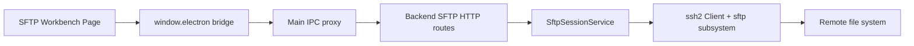
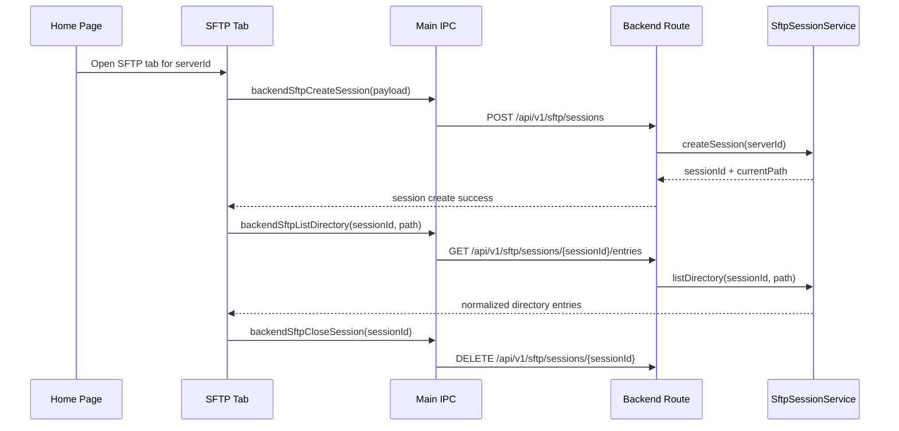

# SFTP File System

## 1. Current Status

Cosmosh implements a baseline read-only SFTP browser.

Implemented in v1:

- Home server context menu and file action can open an SFTP tab.
- Each SFTP tab creates a backend SFTP session and owns that session lifecycle.
- Directory listing supports path navigation, back/forward history, parent navigation, refresh, current-directory filtering, loading, empty, expired-session, and operation-failed states.
- The renderer shows directory entries and read-only metadata details.
- The left directory tree shows the current directory ancestry and caches loaded child directories as users browse.

Intentionally not included in v1:

- upload, download, delete, rename, chmod, mkdir, drag/drop, global search, file preview, file editing, recursive traversal, and transfer queues.
- reuse of an active SSH terminal session. SFTP tabs establish their own SSH + SFTP connection.
- persisted SFTP history or additional database tables.

## 2. Runtime Architecture

### Ownership

- **API contract**: `packages/api-contract/openapi/cosmosh.openapi.yaml` defines SFTP paths, schemas, success codes, and error codes.
- **Backend**: `packages/backend/src/http/routes/sftp.ts` validates HTTP input and maps service results to API envelopes. `packages/backend/src/sftp/session-service.ts` owns SSH/SFTP connection setup, session registry, directory normalization, entry mapping, and cleanup.
- **Main/preload**: `packages/main/src/ipc/register-backend-ipc.ts` proxies SFTP requests to backend routes. `packages/main/src/preload.ts` exposes the minimal renderer bridge.
- **Renderer**: `packages/renderer/src/pages/SFTP.tsx` owns tab-scoped UI state and read-only browsing interactions.

## 3. API Contract

All callers must use generated exports from `@cosmosh/api-contract`, especially `API_PATHS` and generated request/response payload types.

| Method | Path | Purpose |
|---|---|---|
| `POST` | `/api/v1/sftp/sessions` | Create a read-only SFTP browser session for one SSH server. |
| `GET` | `/api/v1/sftp/sessions/{sessionId}/entries?path=...` | List one remote directory for an active SFTP session. |
| `DELETE` | `/api/v1/sftp/sessions/{sessionId}` | Close one SFTP session and release the SSH connection. |

Success codes:

- `SFTP_SESSION_CREATE_OK`
- `SFTP_DIRECTORY_LIST_OK`

SFTP-specific error codes:

- `SFTP_SESSION_NOT_FOUND`
- `SFTP_VALIDATION_FAILED`
- `SFTP_OPERATION_FAILED`

Host fingerprint trust failures reuse the SSH host-trust envelope and code because SFTP uses the same SSH transport security model.

## 4. Session Lifecycle

Lifecycle rules:

- A normal Home context-menu action reuses an existing SFTP tab for the same server when one is already open.
- Explicit new-tab actions create a new SFTP tab and therefore a separate backend SFTP session.
- Hidden SFTP tabs remain mounted and keep their session alive.
- Closing the tab or changing its connection intent closes the previous SFTP session on a best-effort basis.
- Backend shutdown closes all registered SFTP sessions.

## 5. Directory Listing Behavior

The backend treats SFTP paths as POSIX paths regardless of the host OS running Cosmosh.

Directory listing steps:

1. Normalize the requested path.
2. Resolve it with `realpath`.
3. Run `readdir` for the resolved directory.
4. Map each entry to `{ name, path, type, size, mode, permissions, modifiedAt }`.
5. Sort directories first, then sort by name with numeric-aware locale comparison.

Entry types are reduced to:

- `directory`
- `file`
- `symlink`
- `other`

The renderer currently displays columns for name, size, modified time, and mode. The directory panel supports filtering entries in the current directory only; it is not a remote recursive search. The details panel only shows metadata for the selected entry and does not read file contents.

Directory results are cached in the renderer for the lifetime of the SFTP tab. Revisiting an already loaded path uses that in-memory result immediately. The refresh action bypasses the cache and requests a fresh listing from the active backend session.

## 6. Security And Error Model

SFTP uses the same server, keychain, credential decryption, and host fingerprint trust model as SSH:

- Credentials are resolved from `SshServer` -> `SshKeychain` in the backend process.
- Decrypted secrets never cross into renderer or preload.
- Main injects the internal backend auth token and locale headers.
- Unknown or untrusted host fingerprints are returned through the same confirmation flow used by SSH.

Error mapping:

- Missing or invalid request data -> `SFTP_VALIDATION_FAILED`.
- Missing session id or closed session -> `SFTP_SESSION_NOT_FOUND`.
- Connection failures, permission errors, unreadable paths, and remote SFTP errors -> `SFTP_OPERATION_FAILED`.
- Unknown host fingerprint -> `SSH_HOST_UNTRUSTED` with fingerprint confirmation data.

## 7. Renderer UX Contract

The SFTP page follows Cosmosh workbench layout rules:

- Use three dense rounded workbench cards: left directory tree, center directory list, and right read-only details.
- Keep the tree panel narrow and task-oriented, currently aligned to the 250 px Cosmosh sidebar rhythm.
- Use internal UI wrappers (`Button`, `Tooltip`, `Dialog`) and tokenized classes.
- Keep the toolbar compact: back, forward, parent, refresh, remote path input, and current-directory filter.
- Show the current directory and all parent directories in the tree; expanding a tree row loads its child directory list and shows an inline spinner while loading.
- Match file-manager behavior: expanding or collapsing a tree row does not navigate the center directory list. Opening a directory from the center list or path toolbar changes the current directory.
- Keep write operations absent rather than disabled in v1, so the UI does not imply unavailable actions are ready.
- Preserve stable list columns and truncate long names/paths instead of allowing layout shift.

## 8. Future Scope

Future SFTP work should be planned separately. Likely next phases:

1. Streamed download/upload with progress and cancellation.
2. Mutating operations: mkdir, rename, delete, chmod.
3. Transfer queue and conflict handling.
4. File preview/editor integration.
5. Optional terminal-path handoff once the SSH terminal and SFTP session model can share state safely.
