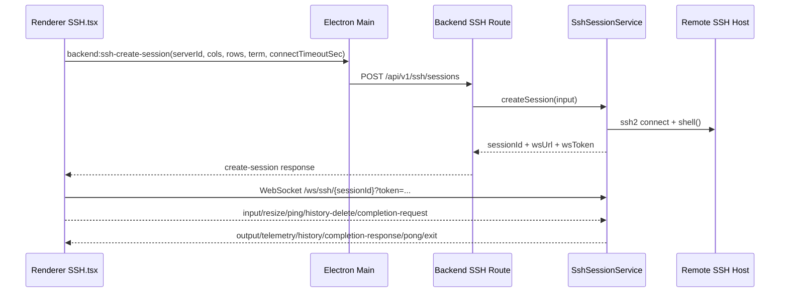
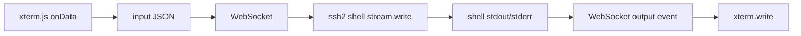

# SSH Terminal Implementation

## 1. Integration Overview (`ssh2` + `xterm.js`)

Cosmosh terminal path is split into control plane and data plane:

- **Control plane**: Renderer calls backend session creation through Main IPC bridge.
- **Data plane**: Renderer connects directly to backend WebSocket session endpoint and streams terminal I/O.

## 2. Backend Session Lifecycle

### Create Session

- Route: `POST /api/v1/ssh/sessions`
- Service: `SshSessionService.createSession`
- Request fields:
  - `cols` / `rows`: terminal viewport dimensions.
  - `connectTimeoutSec`: per-session SSH handshake timeout from Settings (`sshConnectionTimeoutSec`).
  - `strictHostKey`: explicit per-attempt host key policy propagated from SSH server configuration.
  - `enableSshCompression`: explicit per-attempt SSH transport compression policy propagated from SSH server configuration.
- Steps:
  1. Load server record + linked keychain encrypted credentials.
  2. Resolve trusted host fingerprints.
  3. Open SSH shell via `ssh2.Client.shell` with server-scoped compression negotiation.
  4. Write `SshLoginAudit` record:
     - `result = success` on successful session creation, with `sessionId` and `sessionStartedAt`.
     - `result = failed` on host-trust/auth/connect failures, with `failureReason`.
  5. Register live session state in memory (`Map<sessionId, SshLiveSession>`).
  6. Return short-lived attach token + WS endpoint.

### Attach WebSocket

- Path: `/ws/ssh/{sessionId}?token=...`
- Invalid or malformed path encoding, token, or session is rejected (`1008`) without allowing URL decode errors to escape the connection boundary.
- Existing attached socket is replaced (`1012`) to support single active attach. Close/error events from the superseded socket are ignored after ownership moves to the new socket.
- Pending output is buffered before attach and flushed after ready.

### Close Session

- API-driven close: `DELETE /api/v1/ssh/sessions/{sessionId}`
- Transport-driven close: socket close/error, SSH stream close, SSH client error.
- Dispose behavior: send terminal `exit` event before marking the session disposed, then clear runtime ownership, close SSH stream/client, and close WS.
- Audit finalization: update matching `SshLoginAudit` with `sessionEndedAt` and `commandCount`.

## 2.1 Connection Audit and Last-Used Sorting

- Server list payload maps `lastLoginAudit` to the latest **successful** login audit (`result = success`).
- This keeps "sort by last used" aligned with actual successful connections instead of failed attempts.
- Failed attempts are still persisted in `SshLoginAudit` for future query/audit features.

## 2.2 Local-First Security Audit Integration

- SSH runtime now emits additional local-first `AuditEvent` records for security-core operations while preserving `SshLoginAudit` compatibility.
- Current SSH-adjacent audit categories include:
  - `ssh-session`: connect success/failure and close lifecycle events.
  - `ssh-host-trust`: explicit trust-fingerprint confirmation events.
  - `ssh-server` / `ssh-keychain`: server/keychain entity mutations in route layer.
- Correlation strategy:
  - `requestId` tracks request-scope action chains.
  - `sessionId` tracks runtime session continuity.
  - `relatedRecordId` links compatible records (for example existing login-audit IDs where applicable).
- Metadata is sanitized before persistence, so secret-like fields are redacted by key policy and size-capped.
- Audit emission is best-effort and does not fail SSH session creation/close flows when logging fails.

## 3. Data Stream Protocol

### Client → Server

- `input`: raw terminal input bytes as UTF-8 string.
- `resize`: terminal cols/rows with bounded normalization.
- `ping`: heartbeat.
- `close`: explicit disconnect request.
- `history-delete`: request backend to delete a selected command from remote shell history.
- `completion-request`: request ranked command suggestions for current command prefix and cursor position.

### Server → Client

- `ready`: attach acknowledged.
- `output`: shell stdout/stderr output.
- `telemetry`: CPU/memory/network + command history snapshot.
- `history`: history-only snapshot push for immediate UI sync.
- `completion-response`: ranked completion candidates for the active command token.
- `bootstrap-status`: remote bootstrap probe/download/install status from the backend side-channel installer.
- `pong`: ping response.
- `error`: protocol/runtime error.
- `exit`: terminal session closed with reason.

### 3.1 History Synchronization Model

- Backend command history is sourced from remote history probes and parsed shell history entries.
- On every SSH session creation, backend executes remote history probes and parses shell history into normalized commands.
- Remote history sources are probed in a compatibility order (shell builtin + common files), including Bash/Zsh/Fish/Ksh/Ash-style files and optional PowerShell PSReadLine history when available.
- Runtime-specific REPL stores (for example `.node_repl_history`) are intentionally excluded from shell command history aggregation.
- When renderer sends `input` containing line-submit characters (`\r` / `\n`), backend schedules a delayed + throttled history refresh to avoid over-fetching.
- History refresh and telemetry are decoupled: telemetry stays interval-based, while history can be pushed immediately through `history` events.
- Delete action in `SSH.tsx` sends `history-delete`; backend performs best-effort remote history file cleanup and then re-syncs history.

### 3.2 Auto-Complete Model

- Renderer queues typing-trigger autocomplete on local input and dispatches `completion-request` only after corresponding xterm output echo arrives (plus a short debounce), so popup anchoring always uses rendered cursor geometry. Manual `Tab` still triggers an immediate request.
- Renderer gates autocomplete while xterm is in alternate screen buffer (for example `vim`, `less`, `top`) so shell completion does not hijack editor/TUI key handling.
- Renderer suppresses empty-input completion by default (no real command text), and only allows empty-prefix requests for explicit secret-prompt flow.
- Renderer keeps a per-pane local command-prefix shadow from xterm input events, so typing-trigger completion does not wait for remote shell echo before computing request prefix.
- Command-start boundary detection no longer depends on a fixed prompt-token list. Renderer first parses shell command segment boundaries around cursor context (quotes + separators such as `;`, `&&`, `||`, `|`) and only then applies prompt-boundary heuristics.
- Prompt parsing is user-configurable via `terminalAutoCompletePromptRegex` (Settings > Terminal > Auto Complete). When set, this regex is applied as an override for prompt-prefix trimming; when empty or invalid, renderer falls back to built-in heuristics.
- Renderer also forwards source filter toggles in `completion-request` (`includeHistory`, `includeBuiltInCommands`, `includePathSuggestions`, `includePasswordSuggestions`) based on Settings and defaults each source to enabled.
- Backend completion engine is shared by SSH and local-terminal session services and merges:
  - current session interactive commands captured from live input stream (history signal, isolated per session),
  - synchronized shell history snapshots merged into completion history cache so completion remains available before fresh interactive input,
  - command metadata imported from inshellisense/Fig resources (spec signal), generated from full command-path index rather than root-only subset,
  - runtime providers (path provider and interactive secret-prompt provider) composed in the same ranking pipeline.
- Token parsing is shell-aware in completion engine: SSH uses POSIX tokenization, local PowerShell/CMD sessions use Windows-friendly tokenization where backslash is preserved as a literal path character instead of generic escape.
- `packages/backend/scripts/generate-inshellisense.mjs` generates spec dataset plus locale resources with language-specific policy:
  - `packages/backend/src/terminal/completion/generated-inshellisense.ts` keeps command structure as a compact tuple payload and inflates it at module load; generated entries keep `descriptionI18nKey` references only (no duplicated raw description text payload).
  - `packages/i18n/locales/en/backend-inshellisense.json` is fully regenerated from upstream descriptions.
  - `packages/i18n/locales/zh-CN/backend-inshellisense.json` keeps only manually translated keys whose English source text is unchanged; new keys are not auto-filled, and keys are pruned when source text changes or is removed.
- Backend scope i18n merges `backend-inshellisense.json` into `backend.json`, so completion descriptions can be translated without mixing generated keys into base backend locale files.
- Generator sanitizes LS/PS Unicode separators (`U+2028`/`U+2029`) to keep generated TypeScript files free of unusual-line-terminator warnings.
- Ranking strategy in current implementation:
  - command-path-aware matching first (for example, `git push -` resolves against `git push` spec before falling back to root `git`),
  - prefix match first, then optional fuzzy subsequence match,
  - built-in command-spec candidates are prioritized above generic history matches,
  - history candidates are filtered by command context and receive dynamic recency bonus based on distance from latest run.
- Suggestions are rendered as full command paths (for example, `git push --force`).
- Source-specific toggles are available in Settings runtime section so power users can independently disable history fills, built-in command fills, path fills, or password fills while keeping other completion sources active.
- Option parsing is argument-aware:
  - repeated option combinations are supported without losing command context,
  - known value-taking options (from Fig `args` metadata) can surface value suggestions,
  - already used options are deprioritized/filtered to reduce noisy duplicates in the same command line.
- Path completion is provider-based and command-context-aware:
  - built-in path rules currently cover directory-first navigation (`cd`, `pushd`) and common file/path consumers (`cat`, `vim`, `vi`, `nvim`, `nano`, `less`, `more`, `head`, `tail`, `grep`, `rg`, `sed`, `awk`, `find`, `ls`, `touch`, `rm`, `cp`, `mv`, `chmod`, `chown`, `chgrp`, `ln`, `tar`, `unzip`, `zip`, `scp`, `sftp`, `rsync`), plus direct executable-style path prefixes (`./`, `../`, `/`, `~`) at command position,
  - relative-path partial input (for example, `cd ../../c`) is resolved against tracked session working directory and ranked with "prefix first, contains fallback" matching,
  - typing-trigger requests apply a short path-provider timeout budget so command/history/spec candidates are not blocked by slow filesystem probes; manual `Tab` trigger still uses full provider results,
  - remote SSH path scans use POSIX parameter expansion (`${p##*/}`) instead of GNU-specific `basename --`, so path completion remains portable across GNU/Linux, BSD/macOS, and BusyBox environments,
  - typing-trigger history scoring is bounded to a recent history window to keep completion latency stable when shell history snapshots are large,
  - when current token starts with `-`, option/value suggestions keep priority and path provider is gated off for that token.
- Interactive secret prompt detection is output-driven:
  - backend tracks recent output tail and detects common prompts (`sudo` password, `su`/generic password prompts, key passphrase prompts),
  - when prompt is active and a reusable session secret exists, completion can emit runtime `secret` action item (`Fill password`) for one-step insertion.
- After accepting `Fill password`, renderer does not auto-open a follow-up completion cycle; next suggestions only appear on new user input or explicit manual trigger.
- Acceptance replaces the active token segment by default (`replacePrefixLength`), and can optionally use per-item `replacePrefixLength` override (for example root history items that should replace full typed prefix).
- For partial-token history completion (for example `docker e` -> `docker exec`), item-level `replacePrefixLength` is calculated from current typed token length to avoid over-delete and duplicated command segments.
- For history candidates accepted at non-root token positions, backend returns the command suffix from current token to end (not only one token), so selection can complete the full historical command continuation in one accept action.
- `completion-response` contains base `replacePrefixLength` plus items (`label`, `insertText`, optional item `replacePrefixLength`, `detail`, `source`, `kind`, `score`).
- Completion `detail` is localized in backend session services before response emission, with fallback chain: translated `detailI18nKey` → localized source label (`History` / `Command spec` / runtime labels such as `Directory`, `File`, `Fill password`).
- Renderer keyboard policy when suggestions are visible:
  - `ArrowUp/ArrowDown` changes active suggestion and is consumed by completion navigation,
  - suggestion apply shortcut is configurable via Settings (`terminalAutoCompleteAcceptKeys`): `Tab` (default/current), `Enter`, or both,
  - when `Tab` is enabled and no suggestion is visible, pressing `Tab` triggers an immediate manual completion request,
  - `Escape` closes suggestion menu,
  - when `Enter` is not selected as apply shortcut, it remains shell submit behavior.
- Suggestion panel layout constraints:
  - panel anchor is clamped to terminal viewport bounds,
  - panel width is computed from current pane available space (capped at desktop width target) and anchor clamping uses the computed width to avoid horizontal overflow,
  - panel body uses max height + vertical scroll (`max-h`) to keep large candidate sets fully reachable,
  - long labels/details are truncated to avoid horizontal overflow.

## 4. Host Verification & Trust Flow

- SSH connect uses `hostHash: 'sha256'` and `hostVerifier`.
- `strictHostKey=true`: host fingerprint must be trusted; unknown fingerprint returns `SSH_HOST_UNTRUSTED`.
- `strictHostKey=false`: unknown host fingerprint is accepted for that session attempt.
- If fingerprint is unknown:
  - backend returns `SSH_HOST_UNTRUSTED` payload.
  - renderer opens trust dialog.
  - user confirmation calls trust endpoint.
  - renderer retries create-session.

## 4.1 SSH Transport Compression

- SSH server records persist `enableSshCompression`, defaulting to `false`.
- The SSH server editor exposes this as a server-level switch under Security.
- When disabled, backend passes `algorithms.compress = ['none']` to `ssh2`, making the default "no transport compression" policy explicit.
- When enabled, backend prefers `zlib@openssh.com`, then `zlib`, and finally `none` as a compatibility fallback.
- SSH terminal session creation may carry an explicit `enableSshCompression` value so retry/split flows stay bound to the resolved server snapshot.
- SFTP sessions and port-forwarding starts read the same persisted server flag on the backend, so shell, file-system, and forwarding transports remain aligned.

## 5. Exception Handling & Reconnect

### Current Behavior (Implemented)

- Session attach timeout: 30s.
- Any socket close/error transitions UI state to failed.
- Retry is **manual** via UI retry button (`SSH.tsx`), which creates a new session.
- Retry is bound to the tab's latest resolved target snapshot and never re-reads global target selection.
- If the first connect fails before any snapshot is captured, manual retry falls back to fresh intent resolution for that tab.
- Each connect attempt has attempt identity (`attemptId`) with stale-result dropping and abortable pre-connect resolution.
- Hidden tabs do not trigger new connection side effects; only active tab can start connect flow.
- No automatic exponential reconnection loop is implemented yet.

### Recommended Next Step (Planned)

- Add bounded auto-reconnect only for transient WS transport failures.
- Keep host-verification and auth failures as terminal (non-retriable) errors.

## 6. Performance Strategies in Current Code

- Renderer binds Settings `sshMaxRows` to xterm `scrollback` when initializing SSH terminal.
- Renderer uses `FitAddon` + resize observer to keep shell size synchronized.
- Renderer uses `@xterm/addon-webgl` for hardware-accelerated terminal rendering when Settings `terminalHardwareAccelerationEnabled` is enabled (default on).
- Renderer uses `@xterm/addon-web-links` to detect HTTP/HTTPS URLs in terminal output when Settings `terminalWebLinksEnabled` is enabled (default on).
- Backend normalizes terminal sizes to prevent extreme allocations (`20-400 cols`, `10-200 rows`).
- Backend rejects any single client WebSocket message above 1 MiB with close code `1009`, before terminal JSON parsing or transport writes.
- Pending output queue avoids losing early SSH output before WS attach.
- Pending output buffering is bounded by chunk count and total bytes; overflow drops oldest chunks and emits drop logs.
- Telemetry sampling is interval-based (5s) and lightweight text parsing to reduce per-frame cost.
- Background SSH exec probes used by telemetry, history, and completion are capped at 15 seconds and 1 MiB stdout; timeout, excessive output, synchronous client failure, or channel error resolves as unavailable data instead of leaving periodic work in flight.
- History refresh uses debounce + throttle to balance freshness and remote execution overhead.

## 6.1 Renderer-Configurable xterm Options (Settings-Driven)

Renderer now maps terminal runtime behavior from Settings to `ITerminalOptions` during `Terminal` initialization in `SSH.tsx`.

- **Theme / SSH Style**:
  - `altClickMovesCursor`, `cursorBlink`
  - `fontFamily`, `fontSize`
- **Theme / Advanced Style**:
  - `cursorInactiveStyle`, `cursorStyle`, optional `cursorWidth`
  - `customGlyphs`, `fontWeight`, `fontWeightBold`, `letterSpacing`, `lineHeight`
- **Terminal / Advanced Terminal**:
  - `drawBoldTextInBrightColors`
  - `scrollSensitivity`, `fastScrollSensitivity`, `minimumContrastRatio`
  - `screenReaderMode`, `scrollOnUserInput`, `smoothScrollDuration`, `tabStopWidth`
- **Terminal / Runtime**:
  - `terminalHardwareAccelerationEnabled` controls optional `WebglAddon` loading for SSH and local terminal sessions, including split panes. The setting defaults to enabled.
  - `ignoreBracketedPasteMode` is derived from Settings `terminalBracketedPasteEnabled` (`false` when enabled, `true` when disabled).
  - Paste safety warnings are page-level guards in `SSH.tsx` before input reaches `terminal.paste(...)` or raw websocket `input`. Defaults are: `terminalWarnOnMultiLinePaste=true`, `terminalWarnOnLargePaste=true`, `terminalLargePasteWarningThreshold=5120`, and `terminalWarnOnControlCharactersPaste=true`.
  - Control-character paste detection checks for embedded ESC, BEL, ANSI control sequences, and C0/C1 control bytes other than tab/newline forms. Warning dialogs are per-paste decisions; accepting one paste does not disable later warnings.
  - Character width compatibility is derived from Settings `terminalCharacterWidthCompatibilityModeEnabled`; when enabled, renderer loads `@xterm/addon-unicode11` and switches xterm to Unicode 11 width tables for newly created terminal instances.
  - Unicode width switching uses xterm's proposed `unicode` namespace, so renderer-created SSH/local terminal instances set `allowProposedApi: true` before loading `@xterm/addon-unicode11`.
  - Context-menu paste, drag-and-drop text insertion, and selection-toolbar insert route through xterm `terminal.paste(...)` when enabled, so shell-side bracketed paste mode can keep multiline payloads from executing immediately.
  - `terminalCopyOnSelectionEnabled` defaults to `false`. When enabled, xterm selection-change events copy non-blank terminal selections to the system clipboard through `navigator.clipboard`; pure whitespace selections are ignored.
  - `terminalRightClickSelectsWord` maps directly to xterm `rightClickSelectsWord` and defaults to `false`.
  - `terminalForceSelectionModifier` defaults to `off`. `alt` maps to xterm `macOptionClickForcesSelection=true` and disables `macOptionIsMeta` for that terminal instance to avoid Option-key conflicts on macOS. `shift` and `ctrl` are persisted as setting values for future platform-specific selection handling, but current xterm-native behavior is only the macOS Option-click path.
  - `@xterm/addon-clipboard` is loaded with a Cosmosh-owned provider for terminal clipboard reads/writes (OSC 52).
  - Remote SSH sessions read clipboard policy from the server record field `terminalClipboardAccess`; local-terminal sessions read Settings `localTerminalClipboardAccess`.
  - Both policies default to `off`. Supported modes are `off`, `writeAskRead`, `readWrite`, and `askAlways`.
  - Write/read operations always surface a toast unless the operation was just approved through the explicit permission dialog; that approval is scoped to the single clipboard request.
  - `@xterm/addon-clipboard` handles protocol base64 encoding/decoding; the provider only receives and returns decoded text before calling `navigator.clipboard`.
  - `terminalWebLinksEnabled` controls `@xterm/addon-web-links` loading for SSH and local terminal sessions, including split panes. The setting defaults to enabled, applies only to newly created xterm instances, and opens recognized HTTP/HTTPS links through Cosmosh's Electron external URL bridge.
  - `terminalWebLinksRequireModifierKey` defaults to enabled. When enabled, Windows/Linux links require `Ctrl+Click`, macOS links require `Cmd+Click`, plain clicks only select/focus terminal text, and link hovers show the pointer cursor only while the required modifier key is held. When disabled, a primary-button click opens links directly. Secondary-button clicks never open terminal links so right-click remains reserved for terminal context menus; on macOS, `Ctrl+Click` is also reserved for that context-menu gesture and never opens terminal links.

Notes:

- Optional numeric values (for example `cursorWidth`) are parsed defensively; invalid or empty input falls back to xterm defaults.
- Existing `sshMaxRows` remains bound to xterm `scrollback`.
- SSH server records may opt out with `disableCharacterWidthCompatibilityMode`; the effective rule is global setting enabled and server opt-out disabled. Local terminal sessions only use the global setting.
- Character width changes apply only to newly created xterm instances; existing SSH panes keep their active Unicode width provider until the pane/session is recreated.
- WebGL loading is best-effort: initialization failures fall back to xterm's default renderer without failing the terminal session. If WebGL context is lost, renderer disposes the add-on, disables WebGL retries for that SSH page runtime, and shows a one-time warning.

## 6.2 Split-Pane Terminal Interaction Model

- Renderer supports a constrained split progression in `SSH.tsx`:
  1. single pane,
  2. two side-by-side panes,
  3. three side-by-side panes,
  4. right-most pane split into two stacked panes.
- Split action is exposed from the terminal context menu (`Split Terminal`), and close action is exposed as `Close Terminal`.
- Terminal context menu renders platform-resolved shortcut hints for `Copy`, `Paste`, `Find...`, and `Clear Terminal`, and matching keyboard handling is wired for these actions (`⌘C`/`⌘V`/`⇧⌘F`/`⌃L` on macOS hints, `Ctrl+Shift+C`/`Ctrl+Shift+V`/`Ctrl+Shift+F`/`Ctrl+L` on non-macOS with active handlers).
- Terminal right-click behavior is controlled by Settings `terminalRightClickAction` and defaults to `contextMenu`. `paste` consumes right-click and pastes clipboard text through the same paste-warning path. `copyOnSelectionElsePaste` copies the active pane selection when one exists, otherwise it pastes through the same paste-warning path.
- When an SSH tab becomes active, renderer restores keyboard focus to the active xterm instance so typing lands in the terminal immediately after tab switching.
- Maximum visible panes are capped at 4 in current implementation.
- Each split pane creates its own backend terminal session against the same resolved target (same SSH server/local profile), so panes can run independent commands.
- Mirror panes always reuse the primary pane's resolved target snapshot semantics on retries.
- New split panes start from an empty viewport and render only their own session stream to avoid stale buffer carry-over from other panes.
- Closing a pane only affects renderer layout state; backend session lifecycle remains unchanged until the page-level session closes.
- Closing a pane disposes only that pane’s session/socket; the remaining panes continue running.
- Completion popup anchoring is resolved against the currently active pane container, and primary-pane ref updates must not overwrite active mirror-pane geometry after rerenders.
- In-terminal text search is implemented with xterm `SearchAddon` in both primary and mirror panes. `Find...` opens a command-palette input, and footer controls include two toggles (`Case Sensitive` / `Regex`) plus compact navigation actions (`Prev` / `Next` / `First` / `Last`) to navigate and highlight matches in the active pane.
- Search highlight decorations are explicitly cleared when the query becomes empty or the palette is dismissed, which prevents stale search markers from keeping extra memory alive after search exits.
- Orbit Bar stays suppressed for the full search lifecycle (including empty query state and ESC close path) so search highlight flows do not re-open selection actions unexpectedly.
- Orbit Bar and selection-dependent terminal context-menu actions resolve selection geometry from xterm `getSelectionPosition()` first, with DOM selection blocks only as fallback. This keeps `WebglAddon` canvas rendering compatible with Orbit Bar placement and `Search Online` enablement.
- Orbit Bar and the terminal context menu can hand off a selected remote directory to SFTP. The action is available only for SSH-server sessions and explicit POSIX-like paths (`/path`, `~/path`, `./path`, `../path`, or `file:///path`); bare relative names stay disabled because SSH shell cwd is not shared with SFTP tabs.
- Opening a selected directory in SFTP always creates a new SFTP tab with that `initialPath`, even when another SFTP tab for the same server already exists, and does not replace the active SSH terminal tab.

## 7. Developer Debug Checklist

When SSH session behavior is wrong, verify in order:

1. Session creation API payload and validation path.
2. Host verification branch (`SSH_HOST_UNTRUSTED` vs direct session creation).
3. WS attach token/sessionId matching.
4. Stream direction integrity (`input` write and `output` flush).
5. Session disposal path (API close vs transport close vs SSH error).

## 8. Remote Enhancements Runtime

- Remote Enhancements are the opt-in runtime feature gate for OS/distribution detection, SFTP enhancement, and command shortcut sniffing/completion support. v1 gates the existing Go remote bootstrap installer only; deeper capability behavior is introduced behind this same gate in later runtime work.
- The gate is enabled only when Settings `remoteEnhancementsEnabled` is true and the SSH server record `remoteEnhancementsEnabled` is true. Both defaults are true, so configured deployments can enable the feature by providing a manifest URL.
- When either gate is disabled, backend does not run any remote command and emits a skipped `bootstrap-status` with code `REMOTE_ENHANCEMENTS_DISABLED`.
- When both gates are enabled, backend starts bootstrap after the first WebSocket attach of an SSH session through `RemoteBootstrapService` on a separate bounded `ssh2 exec` channel. Installer output is parsed as JSON lines and never written into the interactive shell stream.
- v1 targets Linux `amd64` and `arm64` remotes with `bash`, `zsh`, `fish`, `ash`, or `sh`. Unsupported OS, architecture, or shell returns a failed `bootstrap-status` message.
- Backend requires `COSMOSH_REMOTE_BOOTSTRAP_MANIFEST_URL` to load the release manifest. Missing configuration remains an explicit `MANIFEST_URL_NOT_CONFIGURED` failure when Remote Enhancements are enabled.
- Manifest assets must include HTTPS `url` and lowercase 64-character `sha256`. The injected wrapper downloads the binary with `curl` or `wget`, verifies it with `sha256sum` or `shasum`, then runs `cosmosh-bootstrap install`.
- The Go installer persists files under the remote user's XDG paths and only updates shell profile files inside a Cosmosh marker block. It does not require root and does not write global locations.
- Renderer displays the latest `bootstrap-status` in the SSH sidebar under Remote Enhancements. The status is informational and does not block terminal I/O.

## 9. Windows Context-Launch to Local Terminal CWD

- Installer integration can register `Open terminal in Cosmosh` in Explorer context menus.
- Installer writes shell verb metadata (`MUIVerb`, icon) for Explorer context menu compatibility.
- Explorer launches Cosmosh with `--working-directory <path>`.
- When terminal-app registration is enabled, installer also generates `%LOCALAPPDATA%\Microsoft\WindowsApps\cosmosh.cmd` as a stable CLI launcher shim.
- Main process parses this argument and keeps it as one-shot pending launch context.
- Renderer launch behavior is controlled by Settings `terminalContextLaunchBehavior`:
  - `openDefaultLocalTerminal`: auto-opens an SSH tab with the default local terminal profile.
  - `openLocalTerminalList`: opens Home and focuses the Local Terminals group.
  - `off`: ignores context-launch auto-navigation.
- When `openDefaultLocalTerminal` is enabled, profile selection honors Settings `defaultLocalTerminalProfile` (`auto` or a concrete profile id loaded from current local terminal profiles) and falls back to first available profile.
- If Cosmosh is already running, `second-instance` pushes launch context to renderer via IPC event.

## 10. Keychain Credential Runtime Notes (2026-03)

- Session connect flow now resolves auth material from `SshServer.keychainId`.
- Supported keychain auth variants remain `password`, `key`, `both`; this keeps SSH runtime behavior stable while allowing future auth variant expansion in one place.
- Hidden keychains are eligible for automatic cleanup when no server references remain, preventing long-term secret record drift.
- `second-instance` resolution uses both CLI args and Electron `workingDirectory` as fallback, reducing context-loss cases where only focus happened.
- On local terminal session creation (`POST /api/v1/local-terminals/sessions`), Main forwards `cwd` once.
- Backend validates `cwd` and falls back to `os.homedir()` when path is invalid or inaccessible.

## 11. macOS CLI Context-Launch to Local Terminal CWD

- On packaged macOS builds, Main prepares a user-level launcher script at `~/Library/Application Support/Cosmosh/bin/cosmosh`.
- The launcher invokes the app executable with `--working-directory "$PWD"`, so terminal launch context is inherited from the current shell directory.
- Main tries to create a symlink to that launcher in common PATH locations (`/opt/homebrew/bin`, `/usr/local/bin`) without requiring runtime crashes on permission failures.
- If symlink creation fails due to permission restrictions, app startup continues and warns in logs; users can add the launcher directory to PATH or create a symlink manually.
- Once launched, context handling path is identical to Windows: Main resolves pending launch cwd and forwards it into the next local terminal session creation.
