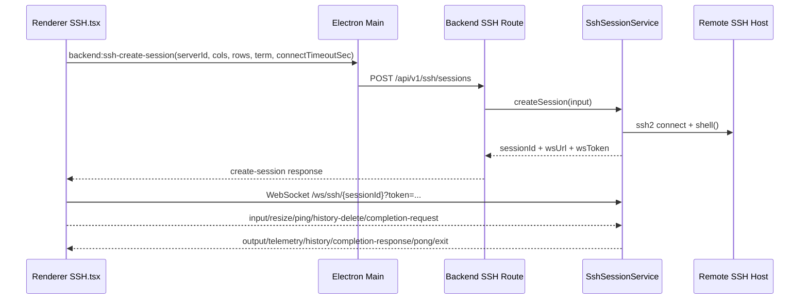
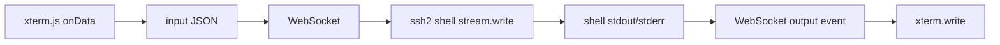
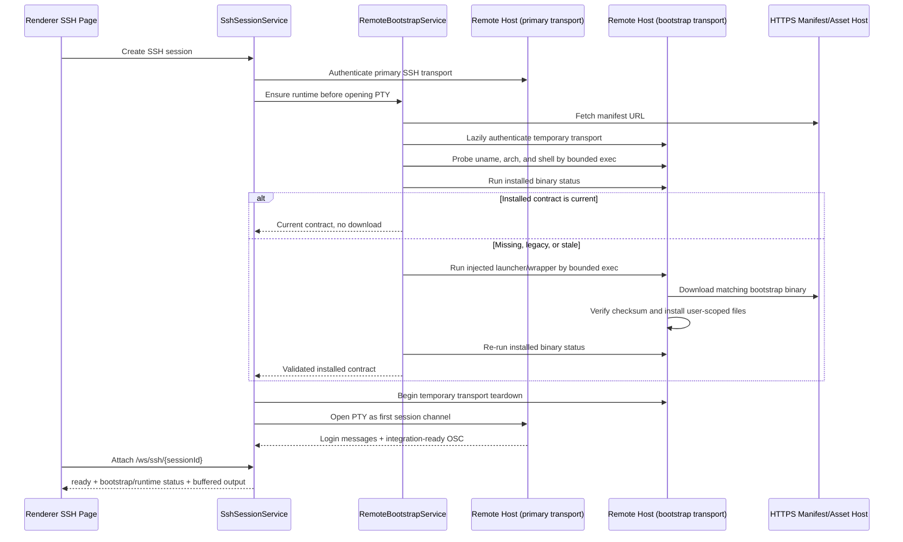

# SSH Terminal Implementation

## 1. Integration Overview (`ssh2` + `xterm.js`)

Cosmosh terminal path is split into control plane and data plane:

- **Control plane**: Renderer calls backend session creation through Main IPC bridge.
- **Data plane**: Renderer connects directly to backend WebSocket session endpoint and streams terminal I/O.



## 2. Backend Session Lifecycle

### Create Session

- Route: `POST /api/v1/ssh/sessions`
- Service: `SshSessionService.createSession`
- Request fields:
  - `cols` / `rows`: terminal viewport dimensions.
  - `connectTimeoutSec`: per-session SSH handshake timeout from Settings (`sshConnectionTimeoutSec`).
  - `strictHostKey`: explicit per-attempt host key policy propagated from SSH server configuration.
  - `enableSshCompression`: explicit per-attempt SSH transport compression policy propagated from SSH server configuration.
- Steps:
  1. Load server record + linked keychain encrypted credentials.
  2. Resolve trusted host fingerprints.
  3. Authenticate the primary SSH transport, complete optional pre-shell Remote Enhancements work on a temporary transport with the same connection policy, then open the primary shell through `ssh2.Client.shell` with a UTF-8 locale request.
  4. Write `SshLoginAudit` record:
     - `result = success` on successful session creation, with `sessionId` and `sessionStartedAt`.
     - `result = failed` on host-trust/auth/connect failures, with `failureReason`.
  5. Register live session state in memory (`Map<sessionId, SshLiveSession>`).
  6. Return short-lived attach token + WS endpoint.

Locale behavior:

- SSH shell creation requests `LANG=C.UTF-8` and `LC_CTYPE=C.UTF-8` through `ssh2` shell environment options, so UTF-8-aware terminal programs inherit a Unicode character type locale by default.
- `LC_ALL` is not set, leaving remote user preferences for time, collation, and numeric formatting intact.
- Cosmosh does not inject locale commands into the interactive shell stream. SSH servers may ignore these environment requests when their `sshd_config` does not accept them.

### Attach WebSocket

- Path: `/ws/ssh/{sessionId}?token=...`
- Invalid or malformed path encoding, token, or session is rejected (`1008`) without allowing URL decode errors to escape the connection boundary.
- Existing attached socket is replaced (`1012`) to support single active attach. Close/error events from the superseded socket are ignored after ownership moves to the new socket.
- Pending output is buffered before attach and flushed after ready.

### Close Session

- API-driven close: `DELETE /api/v1/ssh/sessions/{sessionId}`
- Transport-driven close: socket close/error, SSH stream close, SSH client error.
- Dispose behavior: send terminal `exit` event before marking the session disposed, then clear runtime ownership, close SSH stream/client, and close WS.
- Audit finalization: update matching `SshLoginAudit` with `sessionEndedAt` and `commandCount`.
- Main treats every non-disposed entry in the SSH session registry as active when evaluating a window/app close. If the user approves the renderer warning dialog, `DELETE /api/v1/runtime/active-connections` closes all SSH sessions through the same service disposal path before the window is destroyed.
- The General > Behavior `Ask Before Closing Window` setting defaults on. When disabled, Main skips the renderer dialog but still calls the bulk-close endpoint before continuing the close; setting read failures retain the warning.
- Local terminal sessions and SSH transports owned only by port-forwarding rules are not counted by this close warning.

## 2.1 Connection Audit and Last-Used Sorting

- Server list payload maps `lastLoginAudit` to the latest **successful** login audit (`result = success`).
- This keeps "sort by last used" aligned with actual successful connections instead of failed attempts.
- Failed attempts are still persisted in `SshLoginAudit` for future query/audit features.

## 2.2 Local-First Security Audit Integration

- SSH runtime now emits additional local-first `AuditEvent` records for security-core operations while preserving `SshLoginAudit` compatibility.
- Current SSH-adjacent audit categories include:
  - `ssh-session`: connect success/failure and close lifecycle events.
  - `ssh-host-trust`: explicit trust-fingerprint confirmation events.
  - `ssh-server` / `ssh-keychain`: server/keychain entity mutations in route layer.
- Correlation strategy:
  - `requestId` tracks request-scope action chains.
  - `sessionId` tracks runtime session continuity.
  - `relatedRecordId` links compatible records (for example existing login-audit IDs where applicable).
- Metadata is sanitized before persistence, so secret-like fields are redacted by key policy and size-capped.
- Audit emission is best-effort and does not fail SSH session creation/close flows when logging fails.

## 3. Data Stream Protocol

### Client → Server

- `input`: raw terminal input bytes as UTF-8 string.
- `resize`: terminal cols/rows with bounded normalization.
- `ping`: heartbeat.
- `close`: explicit disconnect request.
- `history-delete`: request backend to delete a selected command from remote shell history.
- `completion-request`: request ranked command suggestions for current command prefix and cursor position.

### Server → Client

- `ready`: attach acknowledged.
- `output`: shell stdout/stderr output.
- `telemetry`: CPU/memory/network + command history snapshot.
- `history`: history-only snapshot push for immediate UI sync.
- `completion-response`: ranked completion candidates for the active command token.
- `bootstrap-status`: remote bootstrap probe/download/install status from the backend side-channel installer.
- `remote-enhancement-runtime-status`: backend-owned `pending`, `active`, or `disabled` trust state plus the validated helper contract.
- `remote-shell-event`: helper shell state forwarded only through the active runtime gate.
- `pong`: ping response.
- `error`: protocol/runtime error.
- `exit`: terminal session closed with reason.

### 3.1 History Synchronization Model

- Backend command history is sourced from remote history probes and parsed shell history entries.
- On every SSH session creation, backend executes remote history probes and parses shell history into normalized commands.
- Remote history sources are probed in a compatibility order (shell builtin + common files), including Bash/Zsh/Fish/Ksh/Ash-style files and optional PowerShell PSReadLine history when available.
- Runtime-specific REPL stores (for example `.node_repl_history`) are intentionally excluded from shell command history aggregation.
- When an active trusted helper advertises `command-start`, backend treats each unique `commandId` as the authoritative command-count and delayed history-refresh trigger. Duplicate lifecycle events do not double count.
- Raw `input` line-submit characters (`\r` / `\n`) trigger the existing delayed + throttled history refresh only when the session has no active structured command lifecycle, preserving a conservative fallback for disabled/degraded helpers.
- History refresh and telemetry are decoupled: telemetry stays interval-based, while history can be pushed immediately through `history` events.
- Delete action in `SSH.tsx` sends `history-delete`; backend performs best-effort remote history file cleanup and then re-syncs history.

### 3.2 Auto-Complete Model

- Renderer queues typing-trigger autocomplete on local input and dispatches `completion-request` only after corresponding xterm output echo arrives (plus a short debounce), so popup anchoring always uses rendered cursor geometry. Manual `Tab` still triggers an immediate request.
- Renderer gates autocomplete while xterm is in alternate screen buffer (for example `vim`, `less`, `top`) so shell completion does not hijack editor/TUI key handling.
- Renderer suppresses empty-input completion by default (no real command text), and only allows empty-prefix requests for explicit secret-prompt flow.
- Renderer keeps a per-pane local command-prefix shadow from xterm input events, so typing-trigger completion does not wait for remote shell echo before computing request prefix.
- Completion requests, output-echo wakeups, secret-prompt triggers, responses, and popup anchors carry an explicit pane id. Responses for a non-active pane or an older request id are discarded.
- When trusted `line-state` metadata is available, renderer calibrates the reconstructed prefix with `lineLength`, `cursorIndex`, and `promptGeneration`. It uses the cursor only when the reconstructed length and prompt generation agree; otherwise it keeps the conservative xterm/local-shadow result. The helper never sends the line buffer itself.
- After readline/history navigation control sequences (`ArrowUp`/`ArrowDown`/`Ctrl+P` style recall), renderer treats the next local input shadow as a suffix and reconciles it with the rendered xterm command line before sending completion requests. This keeps recalled commands such as `echo 1` in the completion prefix when the user continues typing.
- Command-start boundary detection no longer depends on a fixed prompt-token list. Renderer first parses shell command segment boundaries around cursor context (quotes + separators such as `;`, `&&`, `||`, `|`) and only then applies prompt-boundary heuristics.
- Prompt parsing is user-configurable via `terminalAutoCompletePromptRegex` (Settings > Terminal > Auto Complete). When set, this regex is applied as an override for prompt-prefix trimming; when empty or invalid, renderer falls back to built-in heuristics.
- Renderer also forwards source filter toggles in `completion-request` (`includeHistory`, `includeBuiltInCommands`, `includePathSuggestions`, `includePasswordSuggestions`) based on Settings and defaults each source to enabled.
- Backend completion engine is shared by SSH and local-terminal session services and merges:
  - current session interactive commands captured from live input stream (history signal, isolated per session),
  - synchronized shell history snapshots merged into completion history cache so completion remains available before fresh interactive input,
  - command metadata imported from inshellisense/Fig resources (spec signal), generated from full command-path index rather than root-only subset,
  - runtime providers (path provider and interactive secret-prompt provider) composed in the same ranking pipeline.
- Token parsing is shell-aware in completion engine: SSH uses POSIX tokenization, local PowerShell/CMD sessions use Windows-friendly tokenization where backslash is preserved as a literal path character instead of generic escape.
- `packages/backend/scripts/generate-inshellisense.mjs` generates spec dataset plus locale resources with language-specific policy:
  - `packages/backend/src/terminal/completion/generated-inshellisense.ts` keeps command structure as a compact tuple payload and inflates it at module load; generated entries keep `descriptionI18nKey` references only (no duplicated raw description text payload).
  - `packages/i18n/locales/en/backend-inshellisense.json` is fully regenerated from upstream descriptions.
  - `packages/i18n/locales/zh-CN/backend-inshellisense.json` keeps only manually translated keys whose English source text is unchanged; new keys are not auto-filled, and keys are pruned when source text changes or is removed.
- Backend scope i18n merges `backend-inshellisense.json` into `backend.json`, so completion descriptions can be translated without mixing generated keys into base backend locale files.
- Generator sanitizes LS/PS Unicode separators (`U+2028`/`U+2029`) to keep generated TypeScript files free of unusual-line-terminator warnings.
- Ranking strategy in current implementation:
  - command-path-aware matching first (for example, `git push -` resolves against `git push` spec before falling back to root `git`),
  - prefix match first, then optional fuzzy subsequence match,
  - built-in command-spec candidates are prioritized above generic history matches,
  - history candidates are filtered by command context and receive dynamic recency bonus based on distance from latest run.
- Suggestions are rendered as full command paths (for example, `git push --force`).
- Source-specific toggles are available in Settings runtime section so power users can independently disable history fills, built-in command fills, path fills, or password fills while keeping other completion sources active.
- Option parsing is argument-aware:
  - repeated option combinations are supported without losing command context,
  - known value-taking options (from Fig `args` metadata) can surface value suggestions,
  - already used options are deprioritized/filtered to reduce noisy duplicates in the same command line.
- Path completion is provider-based and command-context-aware:
  - built-in path rules currently cover directory-first navigation (`cd`, `pushd`) and common file/path consumers (`cat`, `vim`, `vi`, `nvim`, `nano`, `less`, `more`, `head`, `tail`, `grep`, `rg`, `sed`, `awk`, `find`, `ls`, `touch`, `rm`, `cp`, `mv`, `chmod`, `chown`, `chgrp`, `ln`, `tar`, `unzip`, `zip`, `scp`, `sftp`, `rsync`), plus direct executable-style path prefixes (`./`, `../`, `/`, `~`) at command position,
  - relative-path partial input (for example, `cd ../../c`) is resolved against tracked session working directory and ranked with "prefix first, contains fallback" matching,
  - SSH home-relative partial input (`~` / `~/...`) expands against the probed remote `$HOME` for directory scanning while preserving the typed `~/` prefix in returned candidates,
  - SSH sessions initialize completion cwd/home in the background and share that in-flight probe with path requests; `cd` commands submitted before cwd is known are replayed after the first cwd probe so early relative-path completion does not fall back to the login directory,
  - typing-trigger requests apply a short path-provider timeout budget so command/history/spec candidates are not blocked by slow filesystem probes; manual `Tab` trigger still uses full provider results,
  - SSH path completion uses a larger typing budget than local terminals because remote exec latency is network-bound; this keeps overseas/high-latency servers from returning empty runtime path suggestions merely because the first directory scan exceeded a local-filesystem budget,
  - remote SSH path scans use POSIX parameter expansion (`${p##*/}`) instead of GNU-specific `basename --`, so path completion remains portable across GNU/Linux, BSD/macOS, and BusyBox environments,
  - typing-trigger history scoring is bounded to a recent history window to keep completion latency stable when shell history snapshots are large,
  - when current token starts with `-`, option/value suggestions keep priority and path provider is gated off for that token.
- Interactive secret prompt detection is output-driven:
  - backend tracks recent output tail and detects common prompts (`sudo` password, `su`/generic password prompts, key passphrase prompts),
  - when prompt is active and a reusable session secret exists, completion can emit runtime `secret` action item (`Fill password`) for one-step insertion.
- After accepting `Fill password`, renderer does not auto-open a follow-up completion cycle; next suggestions only appear on new user input or explicit manual trigger.
- Acceptance replaces the active token segment by default (`replacePrefixLength`), and can optionally use per-item `replacePrefixLength` override (for example root history items that should replace full typed prefix).
- For partial-token history completion (for example `docker e` -> `docker exec`), item-level `replacePrefixLength` is calculated from current typed token length to avoid over-delete and duplicated command segments.
- For history candidates accepted at non-root token positions, backend returns the command suffix from current token to end (not only one token), so selection can complete the full historical command continuation in one accept action.
- `completion-response` contains base `replacePrefixLength` plus items (`label`, `insertText`, optional item `replacePrefixLength`, `detail`, `source`, `kind`, `score`).
- Completion `detail` is localized in backend session services before response emission, with fallback chain: translated `detailI18nKey` → localized source label (`History` / `Command spec` / runtime labels such as `Directory`, `File`, `Fill password`).
- Renderer keyboard policy when suggestions are visible:
  - `ArrowUp/ArrowDown` changes active suggestion and is consumed by completion navigation,
  - suggestion apply shortcut is configurable via Settings (`terminalAutoCompleteAcceptKeys`): `Tab` (default/current), `Enter`, or both,
  - when `Tab` is enabled and no suggestion is visible, pressing `Tab` triggers an immediate manual completion request,
  - `Escape` closes suggestion menu,
  - when `Enter` is not selected as apply shortcut, it remains shell submit behavior.
- Suggestion panel layout constraints:
  - panel anchor is clamped to terminal viewport bounds,
  - panel width is computed from current pane available space (capped at desktop width target) and anchor clamping uses the computed width to avoid horizontal overflow,
  - panel body uses max height + vertical scroll (`max-h`) to keep large candidate sets fully reachable,
  - long labels/details are truncated to avoid horizontal overflow.



## 4. Host Verification & Trust Flow

- SSH connect uses `hostHash: 'sha256'` and `hostVerifier`.
- `strictHostKey=true`: host fingerprint must be trusted; unknown fingerprint returns `SSH_HOST_UNTRUSTED`.
- `strictHostKey=false`: unknown host fingerprint is accepted for that session attempt.
- If fingerprint is unknown:
  - backend returns `SSH_HOST_UNTRUSTED` payload.
  - renderer opens trust dialog.
  - user confirmation calls trust endpoint.
  - renderer retries create-session.

## 4.1 SSH Transport Compression

- SSH server records persist `enableSshCompression`, defaulting to `false`.
- The SSH server editor exposes this as a server-level switch under Security.
- When disabled, backend passes `algorithms.compress = ['none']` to `ssh2`, making the default "no transport compression" policy explicit.
- When enabled, backend prefers `zlib@openssh.com`, then `zlib`, and finally `none` as a compatibility fallback.
- SSH terminal session creation may carry an explicit `enableSshCompression` value so retry/split flows stay bound to the resolved server snapshot.
- SFTP sessions and port-forwarding starts read the same persisted server flag on the backend, so shell, file-system, and forwarding transports remain aligned.

## 5. Exception Handling & Reconnect

### Current Behavior (Implemented)

- Session attach timeout: 30s.
- Any socket close/error transitions UI state to failed.
- Retry is available manually through the UI retry button (`SSH.tsx`) and targets the active pane only. Its temporary target-readiness transition does not dispose or reconnect sibling pane runtimes.
- Retry is bound to the tab's latest resolved target snapshot and never re-reads global target selection.
- If the first connect fails before any snapshot is captured, manual retry falls back to fresh intent resolution for that tab.
- Each connect attempt has attempt identity (`attemptId`) with stale-result dropping and abortable pre-connect resolution.
- Hidden tabs do not trigger new connection side effects; only active tab can start connect flow.
- When `sshReconnectOnFocus` is enabled, reactivating a tab reconnects every failed pane that has no connecting/open socket. The first activation of a deferred tab always starts its primary pane, independently of that preference.
- No automatic exponential reconnection loop is implemented yet.

### Recommended Next Step (Planned)

- Add bounded auto-reconnect only for transient WS transport failures.
- Keep host-verification and auth failures as terminal (non-retriable) errors.

## 6. Performance Strategies in Current Code

- Renderer binds Settings `sshMaxRows` to xterm `scrollback` when initializing SSH terminal.
- Renderer uses `FitAddon` + resize observer to keep shell size synchronized.
- Renderer uses `@xterm/addon-webgl` for hardware-accelerated terminal rendering when Settings `terminalHardwareAccelerationEnabled` is enabled (default on).
- Renderer can use `@xterm/addon-image` for experimental terminal inline images when Settings `terminalInlineImagesEnabled` is enabled (default off). The addon parses SIXEL and iTerm inline image protocol output for newly created SSH and local-terminal panes.
- Renderer uses `@xterm/addon-web-links` to detect HTTP/HTTPS URLs in terminal output when Settings `terminalWebLinksEnabled` is enabled (default on).
- Backend normalizes terminal sizes to prevent extreme allocations (`20-400 cols`, `10-200 rows`).
- Backend rejects any single client WebSocket message above 1 MiB with close code `1009`, before terminal JSON parsing or transport writes.
- Pending output queue avoids losing early SSH output before WS attach.
- Pending output buffering is bounded by chunk count and total bytes; overflow drops oldest chunks and emits drop logs.
- Telemetry sampling is interval-based (5s) and lightweight text parsing to reduce per-frame cost.
- Background SSH exec probes used by telemetry, history, and completion are capped at 15 seconds and 1 MiB stdout; timeout, excessive output, synchronous client failure, or channel error resolves as unavailable data instead of leaving periodic work in flight.
- History refresh uses debounce + throttle to balance freshness and remote execution overhead.

## 6.1 Renderer-Configurable xterm Options (Settings-Driven)

Renderer now maps terminal runtime behavior from Settings to `ITerminalOptions` during `Terminal` initialization in `SSH.tsx`.

- **Theme / SSH Style**:
  - `altClickMovesCursor`, `cursorBlink`
  - `fontFamily`, `fontSize`
- **Theme / Advanced Style**:
  - `cursorInactiveStyle`, `cursorStyle`, optional `cursorWidth`
  - `customGlyphs`, `fontWeight`, `fontWeightBold`, `letterSpacing`, `lineHeight`
- **Terminal / Advanced Terminal**:
  - `drawBoldTextInBrightColors`
  - `scrollSensitivity`, `fastScrollSensitivity`, `minimumContrastRatio`
  - `screenReaderMode`, `scrollOnUserInput`, `smoothScrollDuration`, `tabStopWidth`
- **Terminal / Runtime**:
  - `terminalHardwareAccelerationEnabled` controls optional `WebglAddon` loading for SSH and local terminal sessions, including split panes. The setting defaults to enabled.
  - `terminalInlineImagesEnabled` controls optional `ImageAddon` loading for SSH and local terminal sessions, including split panes. The setting defaults to disabled and is constructor-driven: changing it applies to newly created terminal instances.
  - `terminalInlineImageOptions` is a JSON setting edited through Settings Editor with a strict JSON Schema. Exposed fields are limited to `enableSizeReports`, `pixelLimit`, `sixelSupport`, `sixelScrolling`, `sixelPaletteLimit`, `sixelSizeLimit`, `storageLimit`, `showPlaceholder`, `iipSupport`, and `iipSizeLimit`; Kitty/TGP options are intentionally not exposed in this pass.
  - Inline images support SIXEL and iTerm inline image protocol output only when enabled. Remote output can allocate decoded image buffers, so validation bounds pixel count, sequence byte limits, storage MB, and caps `sixelPaletteLimit` at `4096`.
  - Inline image and WebGL addons are designed to coexist: renderer loads `ImageAddon` before `terminal.open(...)`, then synchronizes `WebglAddon` after open so WebGL can bind the mounted renderer. Image addon initialization failures log a warning and do not disable WebGL or block terminal startup.
  - Inline image rendering pins only the image canvas above renderer canvases and forces that image layer to use a synchronized transparent 2D context. xterm remains responsible for DOM row, selection, decoration, and link stacking so selection text contrast stays consistent with the default renderer; the transparent context prevents the full image canvas layer from becoming an opaque black overlay when WebGL is active.
  - Inline image decoding depends on WebAssembly inside `@xterm/addon-image`, so the renderer CSP allows `script-src 'wasm-unsafe-eval'` while still omitting general JavaScript `unsafe-eval`.
  - `ignoreBracketedPasteMode` is derived from Settings `terminalBracketedPasteEnabled` (`false` when enabled, `true` when disabled).
  - Paste safety warnings are page-level guards in `SSH.tsx` before input reaches `terminal.paste(...)` or raw websocket `input`. Defaults are: `terminalWarnOnMultiLinePaste=true`, `terminalWarnOnLargePaste=true`, `terminalLargePasteWarningThreshold=5120`, and `terminalWarnOnControlCharactersPaste=true`.
  - Control-character paste detection checks for embedded ESC, BEL, ANSI control sequences, and C0/C1 control bytes other than tab/newline forms. Warning dialogs are per-paste decisions; accepting one paste does not disable later warnings.
  - Character width compatibility is derived from Settings `terminalCharacterWidthCompatibilityModeEnabled`; when enabled, renderer loads `@xterm/addon-unicode11` and switches xterm to Unicode 11 width tables for newly created terminal instances.
  - Unicode width switching uses xterm's proposed `unicode` namespace, so renderer-created SSH/local terminal instances set `allowProposedApi: true` before loading `@xterm/addon-unicode11`.
  - Context-menu paste, drag-and-drop text insertion, and selection-toolbar insert route through xterm `terminal.paste(...)` when enabled, so shell-side bracketed paste mode can keep multiline payloads from executing immediately.
  - `terminalCopyOnSelectionEnabled` defaults to `false`. When enabled, xterm selection-change events copy non-blank terminal selections to the system clipboard through `navigator.clipboard`; pure whitespace selections are ignored.
  - `terminalRightClickSelectsWord` maps directly to xterm `rightClickSelectsWord` and defaults to `false`.
  - `terminalForceSelectionModifier` defaults to `off`. `alt` maps to xterm `macOptionClickForcesSelection=true` and disables `macOptionIsMeta` for that terminal instance to avoid Option-key conflicts on macOS. `shift` and `ctrl` are persisted as setting values for future platform-specific selection handling, but current xterm-native behavior is only the macOS Option-click path.
  - `@xterm/addon-clipboard` is loaded with a Cosmosh-owned provider for terminal clipboard reads/writes (OSC 52).
  - Remote SSH sessions read clipboard policy from the server record field `terminalClipboardAccess`; local-terminal sessions read Settings `localTerminalClipboardAccess`.
  - Both policies default to `off`. Supported modes are `off`, `writeAskRead`, `readWrite`, and `askAlways`.
  - Write/read operations always surface a toast unless the operation was just approved through the explicit permission dialog; that approval is scoped to the single clipboard request.
  - `@xterm/addon-clipboard` handles protocol base64 encoding/decoding; the provider only receives and returns decoded text before calling `navigator.clipboard`.
  - `@xterm/addon-serialize` is loaded for every SSH/local xterm instance, including split panes, so renderer actions can serialize active selections without reaching into xterm internals.
  - The terminal context menu exposes `Copy as HTML` only when the active pane has a selection. The action serializes only the selected range with `serializeAsHTML({ onlySelection: true, includeGlobalBackground: true })` and writes one Clipboard API item containing both `text/html` and `text/plain`; it does not send data to backend sessions or persist clipboard history.
  - `terminalWebLinksEnabled` controls `@xterm/addon-web-links` loading for SSH and local terminal sessions, including split panes. The setting defaults to enabled, applies only to newly created xterm instances, and opens recognized HTTP/HTTPS links through Cosmosh's Electron external URL bridge.
  - `terminalWebLinksRequireModifierKey` defaults to enabled. When enabled, Windows/Linux links require `Ctrl+Click`, macOS links require `Cmd+Click`, plain clicks only select/focus terminal text, and link hovers show the pointer cursor only while the required modifier key is held. When disabled, a primary-button click opens links directly. Secondary-button clicks never open terminal links so right-click remains reserved for terminal context menus; on macOS, `Ctrl+Click` is also reserved for that context-menu gesture and never opens terminal links.

Notes:

- Optional numeric values (for example `cursorWidth`) are parsed defensively; invalid or empty input falls back to xterm defaults.
- Existing `sshMaxRows` remains bound to xterm `scrollback`.
- SSH server records may opt out with `disableCharacterWidthCompatibilityMode`; the effective rule is global setting enabled and server opt-out disabled. Local terminal sessions only use the global setting.
- Character width changes apply only to newly created xterm instances; existing SSH panes keep their active Unicode width provider until the pane/session is recreated.
- WebGL loading is best-effort: initialization failures fall back to xterm's default renderer without failing the terminal session. If WebGL context is lost, renderer disposes the add-on, disables WebGL retries for that SSH page runtime, and shows a one-time warning.

## 6.2 Split-Pane Terminal Interaction Model

- Renderer supports a constrained split progression in `SSH.tsx`:
  1. single pane,
  2. two side-by-side panes,
  3. three side-by-side panes,
  4. right-most pane split into two stacked panes.
- Split action is exposed from the terminal context menu (`Split Terminal`), and close action is exposed as `Close Terminal`.
- Terminal context menu renders platform-resolved shortcut hints for `Copy`, `Paste`, `Find...`, and `Clear Terminal`, and matching keyboard handling is wired for these actions (`⌘C`/`⌘V`/`⇧⌘F`/`⌃L` on macOS hints, `Ctrl+Shift+C`/`Ctrl+Shift+V`/`Ctrl+Shift+F`/`Ctrl+L` on non-macOS with active handlers). `Copy as HTML` is intentionally menu-only because it depends on a selected rich xterm range rather than a terminal-standard keyboard shortcut.
- Terminal right-click behavior is controlled by Settings `terminalRightClickAction` and defaults to `contextMenu`. `paste` consumes right-click and pastes clipboard text through the same paste-warning path. `copyOnSelectionElsePaste` copies the active pane selection when one exists, otherwise it pastes through the same paste-warning path.
- When an SSH tab becomes active, renderer restores keyboard focus to the active xterm instance so typing lands in the terminal immediately after tab switching.
- Maximum visible panes are capped at 4 in current implementation.
- Each split pane creates its own backend terminal session against the same resolved target (same SSH server/local profile), so panes can run independent commands.
- Secondary panes reuse the primary pane's resolved target snapshot semantics on retries.
- New split panes start from an empty viewport and render only their own session stream to avoid stale buffer carry-over from other panes.
- Every pane owns an independent xterm, WebSocket, backend session, transport state, telemetry, completion state, Remote Enhancements trust state, cwd, line state, debug history, and command markers. Primary and secondary messages pass through the same pane-aware reducer.
- Closing any pane disposes only that pane's socket/backend session and leaves surviving pane ids and runtimes unchanged. Closing the original primary does not transfer ownership by renaming another pane.
- Completion popup anchoring is resolved against the currently active pane container, and primary-pane ref updates must not overwrite active mirror-pane geometry after rerenders.
- In-terminal text search is implemented with xterm `SearchAddon` in both primary and mirror panes. `Find...` opens the shared `SearchReplacePanel` in find-only mode, with configurable filter toggles (`Case Sensitive` / `Regex`) plus compact previous/next navigation actions to highlight matches in the active pane.
- Search highlight decorations are explicitly cleared when the query becomes empty or the search panel is dismissed, which prevents stale search markers from keeping extra memory alive after search exits.
- Orbit Bar stays suppressed for the full search lifecycle (including empty query state and ESC close path) so search highlight flows do not re-open selection actions unexpectedly.
- Orbit Bar and selection-dependent terminal context-menu actions resolve selection geometry from xterm `getSelectionPosition()` first, with DOM selection blocks only as fallback. This keeps `WebglAddon` canvas rendering compatible with Orbit Bar placement and `Search Online` enablement.
- Orbit Bar and the terminal context menu can hand off a selected remote directory to SFTP. The action is available only for SSH-server sessions and explicit POSIX-like paths (`/path`, `~/path`, `./path`, `../path`, or `file:///path`). Dot-relative paths use only the source pane's trusted helper cwd; without a trusted absolute cwd they retain the previous strict behavior. Bare relative names remain disabled.
- Opening a selected directory in SFTP always creates a new SFTP tab with that `initialPath`, even when another SFTP tab for the same server already exists, and does not replace the active SSH terminal tab.

## 6.3 Trusted Command Timeline

- Each SSH pane reserves a 40 px command timeline rail on its right edge only while that pane's authenticated Remote Enhancements runtime is active and advertises `command-start`. Ordinary SSH, local terminals, disabled helpers, failed handshakes, and helpers without that capability do not get a fallback timeline.
- Pressing Enter records a hidden pane-local xterm input marker. A trusted `command-start` consumes the oldest pending marker only after earlier terminal output has been parsed, records the output-start row, and reconstructs the complete displayed command from xterm rows. The helper's sanitized executable remains lifecycle metadata and never replaces the displayed input. `command-end` records the output-end row.
- The rail remains empty until it retains at least three trusted commands and the normal xterm buffer has scrollback (`baseY > 0`). Visible commands stay in submission order inside a vertically centered group whose height is `min(availableHeight, commandCount * 16px)`; the group grows equally upward and downward, compresses only at its height limit, and keeps the newest command at the bottom.
- Each line uses `clamp(8 + 4 * log2(outputRows + 1), 8, 28)` CSS pixels, hover reveals the complete original command, clicking reveals its input row, and the top/bottom chevrons move to the bounded previous/next item without wrapping. The newest marker is current while xterm is at the bottom; after the user scrolls upward, the marker nearest the viewport center becomes current.
- Full command strings stay in renderer memory only. They are never persisted, logged, sent, added to telemetry, or copied into Remote Enhancements diagnostics. Trust loss, reconnect/reset, pane disposal, or xterm scrollback disposal releases both markers and command text; entries therefore belong only to the current pane, current connection, and retained normal-buffer scrollback.
- Alternate-screen programs hide the timeline content while retaining rail width, preventing TUI entry/exit from changing PTY columns. Primary and secondary runtimes refresh the model after parsed writes, scrolling, resizing, buffer changes, and marker disposal.

## 7. Developer Debug Checklist

When SSH session behavior is wrong, verify in order:

1. Session creation API payload and validation path.
2. Host verification branch (`SSH_HOST_UNTRUSTED` vs direct session creation).
3. WS attach token/sessionId matching.
4. Stream direction integrity (`input` write and `output` flush).
5. Session disposal path (API close vs transport close vs SSH error).

## 8. Remote Enhancements Runtime

Remote Enhancements are the optional runtime layer for host-aware SSH features such as OS/distribution detection, future SFTP helpers, and command shortcut/completion support. The current phase maintains a versioned helper contract and exposes bounded cwd/command-lifecycle events; later capabilities must attach behind the same gates and reuse the same user-scoped remote helper boundary.

### 8.1 Ownership and Gates

- `packages/backend/src/remote-bootstrap/service.ts` owns pre-shell orchestration. It fetches the manifest, probes the remote host, reads installed status, injects a download wrapper only when required, verifies the result, returns a trusted runtime contract, parses JSON-line statuses, and writes audit events.
- `packages/remote-bootstrap` owns the Go installer, helper generator, OSC protocol/capability declarations, installed-state validator, and wrapper renderer. See `packages/remote-bootstrap/README.md` for module-level build, test, path, and security details.
- The effective gate is `global setting && persisted server field && request override !== false`. The request field is disable-only: a stale renderer snapshot cannot re-enable a server that the current database record has disabled. The global and persisted server defaults are true, so deployment-level activation is controlled by the manifest URL until a user disables either gate.
- When either gate is disabled, backend does not run any remote command, ignores runtime shell OSC events from previously installed helpers, and emits a skipped `bootstrap-status` with code `REMOTE_ENHANCEMENTS_DISABLED`.
- Backend requires a manifest URL to load the bootstrap manifest. `COSMOSH_REMOTE_BOOTSTRAP_MANIFEST_URL` is the first-class override. Unpackaged development runs default to the rolling `remote-bootstrap-dev` manifest so local development can exercise Remote Enhancements without per-shell setup. Packaged CI builds may also carry `remote-bootstrap/manifest-url.json`, generated before app packaging, so installers can discover the GitHub-hosted manifest without a user-provided environment variable. Tagged releases point at the same versioned GitHub Release as the app installers; `main` push builds point at `remote-bootstrap-dev`; pushed branches whose name contains `remote-bootstrap` and manual workflow dispatch runs can point at branch-scoped temporary prereleases such as `remote-bootstrap-branch-codex-remote-bootstrap-ci-release`. Ordinary PR and feature-branch builds do not package a default URL. Missing configuration does not run a remote probe or any other remote command; it only emits an explicit `MANIFEST_URL_NOT_CONFIGURED` failure when Remote Enhancements are enabled.

During development, the default manifest URL is `https://github.com/agoudbg/Cosmosh/releases/download/remote-bootstrap-dev/cosmosh-remote-bootstrap-manifest.json`. Set `COSMOSH_REMOTE_BOOTSTRAP_MANIFEST_URL` in the same terminal that launches Cosmosh only when you need to override that default, for example to test a branch-scoped temporary prerelease:

Start `pnpm dev:renderer` first and wait for `http://127.0.0.1:2767`, then start `pnpm dev:main` in a second terminal. Remote Enhancements must be tested in the Electron window: opening the Vite URL directly has no preload bridge and does not start Main's managed backend child, so renderer-only browser testing cannot complete bootstrap or create an SSH session.

```powershell
$env:COSMOSH_REMOTE_BOOTSTRAP_MANIFEST_URL="<manifest-url>"
pnpm dev:main
```

```sh
COSMOSH_REMOTE_BOOTSTRAP_MANIFEST_URL="<manifest-url>" pnpm dev:main
```

### 8.2 Session Flow



- The primary SSH transport authenticates first but opens no channel before bootstrap completes. When the first remote command is required, backend lazily opens a second authenticated transport with the same credentials, host-key policy, compression setting, and proxy policy. Every proxy-backed transport receives its own socket.
- All bootstrap probe/install/status `exec` channels run only on the temporary transport. Backend begins its teardown before the primary calls `client.shell(...)`; actual socket closure may complete asynchronously. The primary transport's first session channel is therefore the interactive PTY, preserving OpenSSH/PAM login messages such as Debian MOTD while still loading a newly installed profile hook in that same first shell.
- Disabled gates or missing/invalid manifest data never open the temporary transport. Its decrypted completion secret is discarded and is never copied into session state, status payloads, or audit metadata.
- Backend checks the installed binary before downloading. It skips download only when manifest version and asset SHA-256, supported protocol, helper contents, and profile hook are current. Missing fields from an older binary are incompatible and trigger reinstall. A second status read validates the installation before PTY creation.
- Successfully validated manifests are cached for five minutes and concurrent sessions share one in-flight load. Failed loads are not cached. Cancelling one session only stops that session from waiting and does not cancel the shared manifest request for other sessions.
- Each side-channel command uses `ssh2 exec` with `REMOTE_BOOTSTRAP_EXEC_OPTIONS`: 60 seconds and 256 KiB output. The entire optional pre-shell ensure has a stricter shared 15-second budget across settings, manifest I/O, temporary proxy/SSH connection, and exec work. Expiry stops waiting for proxy preparation, closes active exec channels, destroys the temporary client, emits `BOOTSTRAP_ENSURE_TIMEOUT`, and immediately continues to ordinary PTY creation. A preconnected proxy socket that completes after cancellation is destroyed on arrival. Installer output is parsed as JSON lines and never written into the interactive terminal stream.
- Ensure connection failure or timeout never turns a valid primary SSH authentication into a failed shell session. Backend begins temporary-transport teardown, opens the primary PTY with runtime state `disabled`, reports the failure, and ignores all helper-derived events for that session. If the primary transport itself fails during ensure, its error cancels temporary work and the ordinary session creation fails through the existing SSH error path.
- Go `install`/`status` output establishes installation identity and trust state; it does not directly provide cwd, input state, or command lifecycle data. Live shell data comes later from the Go-generated helper over OSC 777 and remains subject to the runtime gate.
- Renderer stores bootstrap status, runtime trust state, trusted cwd/line state, telemetry, lifecycle state, and a bounded 200-entry Remote Enhancements debug history independently for every pane. When Settings `remoteEnhancementsDebugEnabled` is enabled, the terminal context menu exposes `Remote Enhancements Debug` for the source pane; its overlay follows the active pane and never substitutes primary-pane data.
- Renderer reconstructs command-only timeline labels from its own rendered xterm rows after trusted `command-start`; helper event payloads continue to carry only the sanitized executable. Prompt identity metadata is discarded before retention, and timeline labels never enter the debug history or transport protocol.
- The debug overlay records status/event payloads only. It does not record terminal `input`, terminal `output`, passwords, private key material, or full screen output.
- Terminal `ready`, `output`, telemetry, history, completion, and shell-state messages remain independent from bootstrap progress.

### 8.2.1 Remote Shell Event Protocol

After Remote Bootstrap installs the helper, interactive shell startup files source a user-scoped shell integration. The helper emits runtime shell state through OSC 777 control sequences on the interactive PTY:

```text
ESC ] 777 ; cosmosh ; <base64-json> BEL
```

Backend parsing rules:

- `SshSessionService` streams SSH output through `RemoteShellEventOscParser` before writing to xterm.
- The parser returns an ordered sequence of visible-output and helper-event frames, and `SshSessionService` forwards those frames without regrouping them by type. Visible bytes before an event, especially the echoed input/newline before `command-start`, must reach xterm first so renderer markers capture valid input/output boundaries.
- Cosmosh OSC sequences are stripped from visible terminal output and decoded, but events are forwarded and applied only after the backend runtime gate becomes `active`.
- The gate starts `pending` only after pre-shell status validation. It becomes `active` on a matching `integration-ready`. If no valid handshake arrives within 10 seconds, it changes to `disabled` with `HELPER_HANDSHAKE_TIMEOUT`; any shell, helper-version, protocol-version, or capability mismatch also changes it to `disabled` and clears helper-derived state.
- Non-Cosmosh OSC sequences and ordinary ANSI output stream through visibly and unchanged, including sequences split across SSH chunks.
- Invalid JSON, invalid event shapes, and payloads over 8 KiB are dropped without crashing the session.
- Split SSH chunks are supported; incomplete OSC data is buffered until a BEL or ST terminator arrives.
- Protocol constants and the discriminated Backend/Renderer message unions are shared from `packages/api-contract/src/terminal-protocol.ts`. The current helper protocol is v2.

Server-to-renderer payload:

```ts
type RemoteShellEventMessage = {
  type: 'remote-shell-event';
  event:
    | 'integration-ready'
    | 'prompt-ready'
    | 'cwd'
    | 'command-start'
    | 'command-end'
    | 'foreground-command'
    | 'line-state';
  shell: 'bash' | 'zsh' | 'fish' | 'sh' | 'ash';
  helperVersion: string;
  protocolVersion: number;
  capabilities: string[];
  cwd?: string;
  command?: string;
  exitCode?: number;
  durationMs?: number;
  commandId?: string;
  promptGeneration?: number;
  lineLength?: number;
  cursorIndex?: number;
  timestamp: number;
};
```

The shared TypeScript type is a discriminated union rather than the optional-field sketch above. `cwd` requires an absolute decoded cwd; command events require a bounded sanitized executable and `commandId`; `command-end` additionally requires `exitCode` and `durationMs`; `line-state` requires `lineLength`, `cursorIndex`, and `promptGeneration`. An event is rejected unless its name is advertised by the exact capability set. Dynamic cwd/command strings are canonical Base64 fields inside the helper JSON envelope, preventing tabs, newlines, quotes, or backslashes from corrupting JSON.

Current first-phase helper behavior:

- Bash uses `PROMPT_COMMAND` to preserve any existing prompt hook and then emit `cwd`, `prompt-ready`, and a `command-end` with matching command id, exit code, and duration. A guarded `DEBUG` trap emits one `command-start` and one `foreground-command` per submitted command line after prompt setup finishes.
- Zsh uses `precmd`, `preexec`, and `chpwd` hooks plus `line-pre-redraw` for line length/cursor calibration. The helper becomes ready only when all required hook registrations succeed.
- Fish uses `fish_preexec`, `fish_prompt`, `fish_postexec`, and `PWD` variable events.
- Sh/Ash install a prompt-capture fallback and advertise only `cwd` and `prompt-ready`; they do not claim command lifecycle support.
- Every shell emits `integration-ready` only after its advertised hook set has installed successfully. Non-interactive shells emit no OSC events.
- `command-start` and `foreground-command` are emitted for every submitted command that can be reduced to an executable name; they carry only that sanitized executable name (for example `vim`), not the full command line or arguments.
- The helper intentionally does not emit full command text, line-buffer contents, password input, or native shell completion lists. Zsh `line-state` contains numeric length/cursor metadata only.

Backend state model:

- Each session owns an explicit `pending`, `active`, or `disabled` enhancement runtime state, the contract validated before PTY creation, and a handshake timer that is cleared on activation, disablement, or session disposal.
- Each `SshLiveSession` keeps trusted cwd/foreground state plus the latest command id, sanitized executable, exit code, and duration. Unique structured `command-start` events drive command counting and history refresh; raw Enter parsing is the fallback only when that capability is unavailable.
- `remoteShellCwd` is the preferred path-completion cwd source; existing exec probes and renderer hints remain fallback paths.
- When `remoteShellForegroundCommand` is set by `foreground-command`, backend returns an empty completion response until the next `prompt-ready`; `command-end` does not clear suppression early. This covers short commands, long-running foreground processes, and unknown TUI/REPL programs without maintaining a command whitelist.
- Renderer clears trusted cwd/line calibration immediately whenever backend trust leaves `active`, and applies prompt-generation checks before using `line-state` for completion. Command lifecycle events also maintain pane-local xterm navigation markers.
- Password prompts and reusable secret suggestions remain output-driven local backend behavior; shell hooks never capture password input.

### 8.3 Manifest and Asset Contract

```json
{
  "version": "1.2.3",
  "assets": [
    {
      "os": "linux",
      "arch": "amd64",
      "url": "https://downloads.example.test/cosmosh-remote-bootstrap-linux-amd64",
      "sha256": "0123456789abcdef0123456789abcdef0123456789abcdef0123456789abcdef"
    },
    {
      "os": "linux",
      "arch": "arm64",
      "url": "https://downloads.example.test/cosmosh-remote-bootstrap-linux-arm64",
      "sha256": "fedcba9876543210fedcba9876543210fedcba9876543210fedcba9876543210"
    }
  ]
}
```

- `version` must contain only letters, digits, `.`, `_`, `+`, or `-`.
- `assets` must be non-empty.
- Every manifest asset must include an HTTPS `url` and lowercase 64-character `sha256`; one malformed asset invalidates the whole manifest so polluted release metadata fails visibly.
- The current target matrix selects assets only for Linux `amd64` and `arm64` remotes.
- The injected wrapper treats all manifest fields as quoted data, never as executable shell source, then downloads the binary with `curl` or `wget`, verifies it with `sha256sum` or `shasum`, and runs `cosmosh-bootstrap install`.
- `cosmosh-wrappergen` independently enforces the manifest version grammar, HTTPS asset URLs, and lowercase SHA-256 input validation before rendering shell source.
- `scripts/build-remote-bootstrap-release.mjs` builds `cosmosh-remote-bootstrap-linux-amd64` and `cosmosh-remote-bootstrap-linux-arm64`, computes SHA-256 values, and writes the git-ignored `packages/remote-bootstrap/dist/cosmosh-remote-bootstrap-manifest.json`. CI can override the download tag/base URL and the manifest `version`, so a fixed GitHub release tag can still publish a manifest version such as `dev-<commit-sha>`.
- Tagged release CI stages the helper assets plus manifest with the desktop packages, validates the complete inventory, generates checksums and provenance attestations, and only then uploads the bundle to the draft GitHub Release for the same tag. The app packages that tagged manifest URL. The `cosmosh-remote-bootstrap-*` prefix intentionally distinguishes helper assets from user-facing app installers on the release page.
- `build-main` CI always validates the Go package and manifest generation path. On `push` to `main`, a separate write-scoped job rebuilds the helper assets, publishes them to the fixed prerelease tag `remote-bootstrap-dev` with `--clobber`, and packages `https://github.com/<repo>/releases/download/remote-bootstrap-dev/cosmosh-remote-bootstrap-manifest.json` into the main build artifacts. On `push` to any branch whose name contains `remote-bootstrap`, or on manual `workflow_dispatch` with `publishRemoteBootstrap=true`, the same job publishes to a branch-scoped prerelease tag `remote-bootstrap-branch-<sanitized-branch>` and packages that manifest URL into the branch build artifacts. These branch prereleases are temporary internal test buckets and can be deleted after the PR is merged or abandoned. Ordinary branches and PRs only validate the build path unless a maintainer explicitly opts into the publish path.

### 8.4 Remote Requirements and Installed Files

Supported remote hosts:

| Dimension | Supported values |
| --- | --- |
| OS | `linux` |
| Architecture | `amd64`, `arm64` |
| Shell | `bash`, `zsh`, `fish`, `ash`, `sh` |

Required remote tools:

- `mktemp` for temporary wrapper and download directories.
- `base64` for decoding the backend-injected wrapper payload.
- `curl` or `wget` for HTTPS asset download.
- `sha256sum` or `shasum` for checksum verification.
- The target shell selected by the probe.

Installed files stay under the remote user's scope:

| Purpose | Default path |
| --- | --- |
| Bootstrap binary | `$XDG_DATA_HOME/cosmosh/bootstrap/bin/cosmosh-bootstrap` or `~/.local/share/cosmosh/bootstrap/bin/cosmosh-bootstrap` |
| Version marker | `$XDG_DATA_HOME/cosmosh/bootstrap/bin/.version` or `~/.local/share/cosmosh/bootstrap/bin/.version` |
| POSIX helper | `$XDG_CONFIG_HOME/cosmosh/bootstrap/helper.sh` or `~/.config/cosmosh/bootstrap/helper.sh` |
| Fish helper | `$XDG_CONFIG_HOME/cosmosh/bootstrap/helper.fish` or `~/.config/cosmosh/bootstrap/helper.fish` |
| Bash hooks | `~/.bashrc` plus the active login profile (`~/.bash_profile`, else `~/.bash_login`, else `~/.profile`) inside Cosmosh marker blocks |
| Zsh hook | `~/.zshrc` inside a Cosmosh marker block |
| Sh/Ash hook | `~/.profile` inside a Cosmosh marker block |
| Fish hook | `$XDG_CONFIG_HOME/fish/conf.d/cosmosh.fish` or `~/.config/fish/conf.d/cosmosh.fish` |

The installer is idempotent. It emits `skipped` only when the installed version, exact binary contents, exact Go-generated helper contents, and every required shell hook are current. Bash login-profile blocks guard on `BASH_VERSION`, so a generic `.profile` read by Dash does not load the Bash helper. Binary/helper/version/profile replacement is atomic; existing profile permissions and symlink targets are preserved. The version marker is written only after all file and profile updates succeed. `status` reports both the compatibility `profilePath` and complete `profilePaths` collection.

### 8.5 Security and Failure Model

- Wrapper files and bootstrap working directories are created with `mktemp` under `${TMPDIR:-/tmp}` using restrictive permissions and exit cleanup.
- The remote wrapper uses `umask 077`; installer files use `0700` for directories/binaries and `0600` for new helpers/profiles where applicable. Existing profile modes are retained during atomic replacement.
- Missing `mktemp`, `base64`, downloader, hash tool, or target shell remains an explicit `bootstrap-status` failure rather than a silent fallback.
- The Go installer persists files under the remote user's XDG paths and only updates shell profile files inside a Cosmosh marker block. It does not require root and does not write global locations.
- Bootstrap audit metadata is status-only and must stay secret-free. SSH credentials, private keys, and terminal input are not part of this contract.
- Bootstrap/settings/manifest/install failures fail closed for enhancement data but fail open for the ordinary authenticated SSH shell. Previously installed helpers cannot be consumed unless the current ensure succeeded and the live helper handshake matches it.

Common status codes:

| Code | Meaning |
| --- | --- |
| `REMOTE_ENHANCEMENTS_DISABLED` | Global Settings or server-level gate disabled bootstrap before any remote command; runtime shell OSC events are ignored for the session. |
| `MANIFEST_URL_NOT_CONFIGURED` | Remote Enhancements are enabled, but backend has no manifest URL. |
| `MANIFEST_FETCH_FAILED` | Backend could not fetch the manifest URL. |
| `MANIFEST_INVALID` | Manifest shape, asset URL, or SHA-256 failed validation. |
| `ASSET_NOT_FOUND` | Manifest has no asset for the probed OS/architecture. |
| `PROBE_FAILED` | Remote OS, architecture, or shell is unsupported or could not be parsed. |
| `BASE64_NOT_FOUND` | Remote host cannot decode the injected wrapper payload. |
| `MKTEMP_NOT_FOUND` | Remote host lacks `mktemp`. |
| `DOWNLOADER_NOT_FOUND` | Remote host has neither `curl` nor `wget`. |
| `HASH_TOOL_NOT_FOUND` | Remote host has neither `sha256sum` nor `shasum`. |
| `CHECKSUM_MISMATCH` | Downloaded binary did not match the manifest SHA-256. |
| `BOOTSTRAP_ENSURE_TIMEOUT` | The complete optional pre-shell ensure exceeded 15 seconds; active side-channel work was cancelled and ordinary PTY creation continued. |
| `INSTALLATION_NOT_CURRENT` | Post-install status did not match the selected version and supported runtime contract. |
| `HELPER_HANDSHAKE_TIMEOUT` | No valid `integration-ready` event arrived within 10 seconds after PTY creation; runtime helper data was disabled. |
| `HELPER_CONTRACT_MISMATCH` | Live `integration-ready` or a later helper event did not match the pre-shell contract; runtime data was disabled. |
| `FILE_INSTALL_FAILED` | Installer could not create or copy user-scoped files. |
| `PROFILE_UPDATE_FAILED` | Installer could not update the target shell profile hook. |
| `VERSION_WRITE_FAILED` | Installer could not write the final version marker. |

When debugging bootstrap behavior, first check which gate stopped the run, then verify manifest validity, remote probe support, remote tool availability, and finally user profile write permissions. A missing manifest URL should produce no remote probe command at all.

## 9. Windows Context-Launch to Local Terminal CWD

- Installer integration can register `Open terminal in Cosmosh` in Explorer context menus.
- Installer writes shell verb metadata (`MUIVerb`, icon) for Explorer context menu compatibility.
- Explorer launches Cosmosh with `--working-directory <path>`.
- When terminal-app registration is enabled, installer also generates `%LOCALAPPDATA%\Microsoft\WindowsApps\cosmosh.cmd` as a stable CLI launcher shim.
- Main process parses this argument and keeps it as one-shot pending launch context.
- Renderer launch behavior is controlled by Settings `terminalContextLaunchBehavior`:
  - `openDefaultLocalTerminal`: auto-opens an SSH tab with the default local terminal profile.
  - `openLocalTerminalList`: opens Home and focuses the Local Terminals group.
  - `off`: ignores context-launch auto-navigation.
- When `openDefaultLocalTerminal` is enabled, profile selection honors Settings `defaultLocalTerminalProfile` (`auto` or a concrete profile id loaded from current local terminal profiles) and falls back to first available profile.
- If Cosmosh is already running, `second-instance` pushes launch context to renderer via IPC event.

## 10. Keychain Credential Runtime Notes (2026-03)

- Session connect flow now resolves auth material from `SshServer.keychainId`.
- Supported keychain auth variants remain `password`, `key`, `both`; this keeps SSH runtime behavior stable while allowing future auth variant expansion in one place.
- Hidden keychains are eligible for automatic cleanup when no server references remain, preventing long-term secret record drift.
- `second-instance` resolution uses both CLI args and Electron `workingDirectory` as fallback, reducing context-loss cases where only focus happened.
- On local terminal session creation (`POST /api/v1/local-terminals/sessions`), Main forwards `cwd` once.
- Backend validates `cwd` and falls back to `os.homedir()` when path is invalid or inaccessible.

## 11. macOS CLI Context-Launch to Local Terminal CWD

- On packaged macOS builds, Main prepares a user-level launcher script at `~/Library/Application Support/Cosmosh/bin/cosmosh`.
- The launcher invokes the app executable with `--working-directory "$PWD"`, so terminal launch context is inherited from the current shell directory.
- Main tries to create a symlink to that launcher in common PATH locations (`/opt/homebrew/bin`, `/usr/local/bin`) without requiring runtime crashes on permission failures.
- If symlink creation fails due to permission restrictions, app startup continues and warns in logs; users can add the launcher directory to PATH or create a symlink manually.
- Once launched, context handling path is identical to Windows: Main resolves pending launch cwd and forwards it into the next local terminal session creation.

## 12. Server Proxy Resolution

- Global proxy mode is `off`, `system`, or `custom`; default is `system`.
- Server proxy mode is `default`, `off`, or `custom`; `default` inherits global settings.
- Custom URLs support `http://`, `https://`, and `socks5://`, including URL credentials. Paths, query strings, and fragments are rejected.
- For system mode, renderer asks Main to resolve `https://{host}:{port}/` through Electron `Session.resolveProxy` and sends the transient rule string with session creation.
- Backend parses ordered `PROXY`, `HTTPS`, `SOCKS5`, and `DIRECT` candidates, opens the tunnel, and injects the resulting socket into `ssh2`.
- Proxy candidates share the session connection timeout. Failure is terminal unless the system rules explicitly include a later `DIRECT` candidate.
