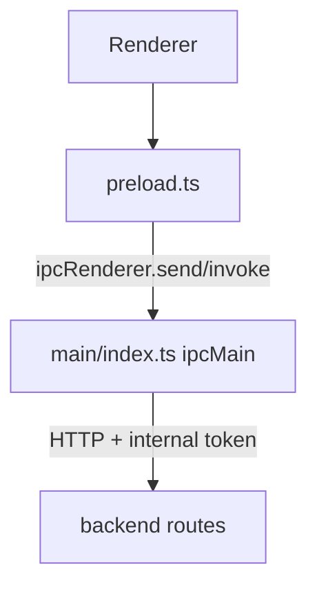

# IPC 协议字典

## 1. Channel 拓扑

## 2. Channel 字典

| Channel | IPC Type | Params | Return Schema | Main Handler Behavior |
|---|---|---|---|---|
| `app:close-window` | `send` | none | none | Closes focused window or main window |
| `i18n:get-locale` | `invoke` | none | `Promise<string>` | Returns current resolved locale |
| `i18n:set-locale` | `invoke` | `locale: string` | `Promise<string>` | Resolves/persists in-memory locale and updates title |
| `app:get-runtime-user-name` | `invoke` | none | `Promise<string>` | Returns OS username fallback chain |
| `app:get-version-info` | `invoke` | none | `Promise<{ appName: string; version: string; buildVersion: string; buildTime: string; commit: string; electron: string; chromium: string; node: string; v8: string; os: string }>` | 为关于页返回应用名称、版本号、构建时间与运行时技术信息 |
| `app:get-pending-launch-working-directory` | `invoke` | none | `Promise<string \| null>` | 返回当前待消费的上下文启动工作目录（来自 CLI 参数） |
| `app:get-downloads-path` | `invoke` | none | `Promise<string>` | 返回系统下载目录，供本地保存默认路径使用 |
| `app:create-sftp-temporary-file` | `invoke` | `fileName: string` | `Promise<string>` | 在 Cosmosh SFTP 临时根目录下创建唯一的本地目标路径，供 backend 下载与打开流程使用 |
| `app:create-sftp-downloads-file` | `invoke` | `fileName: string` | `Promise<string>` | 在系统 Downloads 目录下为发起请求的 renderer 授权一个精确的单次下载目标 |
| `app:select-sftp-upload-files` | `invoke` | none | `Promise<{ canceled: boolean; files: Array<{ name: string; localPath: string; size: number; modifiedAt: string }> }>` | 打开原生多文件选择器，并将所选普通文件复制到受控 SFTP 临时根目录下的隔离目录 |
| `app:cleanup-sftp-temporary-files` | `invoke` | `localPaths: string[]` | `Promise<boolean>` | 尽力删除经过校验的上传暂存文件及其已清空的隔离临时目录 |
| `app:open-sftp-temporary-file` | `invoke` | `localPath: string` | `Promise<boolean>` | 使用系统默认应用打开 Cosmosh SFTP 临时根目录下的既有文件 |
| `app:read-sftp-temporary-image-preview` | `invoke` | `localPath: string` | `Promise<string>` | 校验 Cosmosh SFTP 临时根目录下的既有图片文件，并返回有大小上限的 data URL 供 renderer 图片预览使用 |
| `app:start-sftp-temporary-file-watch` | `invoke` | `localPath: string` | `Promise<string>` | 为 Cosmosh SFTP 临时根目录下的既有文件启动防抖监听，并返回 watch id |
| `app:stop-sftp-temporary-file-watch` | `invoke` | `watchId: string` | `Promise<boolean>` | 停止此前创建的 SFTP 临时文件监听 |
| `app:show-sftp-open-with-dialog` | `invoke` | `localPath: string` | `Promise<boolean>` | 仅 Windows：校验临时文件路径，并通过 shell `openas` verb 打开系统“打开方式”选择器 |
| `app:list-sftp-open-with-applications` | `invoke` | `localPath: string` | `Promise<Array<{ id: string; name: string; path: string; bundleIdentifier?: string; iconDataUrl?: string }>>` | 仅 macOS：校验临时文件路径，并返回 NSWorkspace 判定可打开该文件的应用列表 |
| `app:open-sftp-file-with-application` | `invoke` | `localPath: string, applicationPath: string` | `Promise<boolean>` | 仅 macOS：校验临时文件与所选应用属于可用应用列表后，使用该应用打开文件 |
| `app:sftp-temporary-file-changed` | `event (main -> renderer)` | `{ watchId: string; localPath: string; size: number; modifiedAt: string }` | none | 向拥有该监听的 renderer webContents 推送一次防抖后的 SFTP 临时文件变更事件 |
| `app:get-database-security-info` | `invoke` | none | `Promise<{ runtimeMode: 'development' \| 'production'; resolverMode: 'development-fixed-key' \| 'safe-storage' \| 'master-password-fallback'; safeStorageAvailable: boolean; databasePath: string; securityConfigPath: string; hasEncryptedDbMasterKey: boolean; hasMasterPasswordHash: boolean; hasMasterPasswordSalt: boolean; hasMasterPasswordEnv: boolean; fallbackReady: boolean }>` | 为设置 → 高级页返回非敏感的数据库加密引导诊断信息 |
| `app:launch-working-directory` | `event (main -> renderer)` | `cwd: string` | none | 当第二实例触发时，向渲染层推送上下文启动工作目录 |
| `app:menu-action` | `event (main -> renderer)` | `action: 'open-about' \| 'open-settings' \| 'new-tab' \| 'close-current-tab' \| 'close-right-tabs' \| 'show-tab-switcher'` | none | 将 macOS 系统菜单触发的应用菜单命令以受控枚举形式分发到渲染层标签页/状态处理器 |
| `app:open-devtools` | `invoke` | none | `Promise<boolean>` | 为当前主窗口打开 DevTools（窗口可用时） |
| `app:toggle-devtools` | `invoke` | none | `Promise<boolean>` | 切换当前主窗口的分离式 DevTools（已打开则关闭，已关闭则打开） |
| `app:reload-webview` | `invoke` | none | `Promise<boolean>` | 重新加载当前活动 renderer webContents，并忽略缓存以保证调试刷新可预测 |
| `app:restart-backend-runtime` | `invoke` | none | `Promise<boolean>` | 在开发环境中原位重启 backend 运行时，无需重启整个应用 |
| `app:show-in-file-manager` | `invoke` | `targetPath?: string` | `Promise<boolean>` | Opens file/folder in OS file manager |
| `app:open-external-url` | `invoke` | `targetUrl: string` | `Promise<boolean>` | 使用系统默认浏览器打开受信任的 HTTP(S) 链接 |
| `app:set-windows-system-menu-symbol-color` | `invoke` | `symbolColor: string` | `Promise<boolean>` | 将 token 驱动的 Windows 标题栏系统菜单符号色应用到当前主窗口 overlay |
| `app:show-save-file-dialog` | `invoke` | `defaultPath?: string` | `Promise<{ canceled: boolean; filePath?: string }>` | 打开原生保存对话框，并为发起请求的 renderer 授权所选路径执行一次 SFTP 下载 |
| `app:import-private-key` | `invoke` | none | `Promise<{ canceled: boolean; content?: string }>` | 调起系统文件选择器并在选择后返回 UTF-8 私钥内容 |
| `app:get-process-performance-stats` | `invoke` | none | `Promise<{ sampledAt: number; cpuPercent: number \| null; mainProcessMemory: { rssBytes: number; heapTotalBytes: number; heapUsedBytes: number; externalBytes: number; arrayBuffersBytes: number }; rendererProcessMemory: { residentSetBytes: number; privateBytes: number; sharedBytes: number } \| null; backendProcess: { pid: number; cpuPercent: number \| null; memoryRssBytes: number \| null } \| null }>` | 为调试浮层采样主进程 CPU/内存，基于当前活动窗口获取渲染进程内存，并补充 backend 子进程 CPU/RSS 内存数据 |
| `app:export-main-heap-snapshot` | `invoke` | none | `Promise<{ ok: boolean; filePath?: string; message?: string }>` | 将主进程 V8 堆快照写入应用 user-data 下的 debug 快照目录 |
| `backend:test-ping` | `invoke` | none | `Promise<ApiTestPingResponse \| ApiErrorResponse>` | Calls backend health test endpoint |
| `backend:settings-get` | `invoke` | none | `Promise<ApiSettingsGetResponse \| ApiErrorResponse>` | GET 已持久化设置 |
| `backend:settings-update` | `invoke` | `payload: ApiSettingsUpdateRequest` | `Promise<ApiSettingsUpdateResponse \| ApiErrorResponse>` | PUT 设置快照 |
| `backend:audit-list-events` | `invoke` | `query?: ApiAuditEventListQuery` | `Promise<ApiAuditEventListResponse \| ApiErrorResponse>` | GET 审计事件列表（支持过滤与分页） |
| `backend:audit-get-event-by-id` | `invoke` | `eventId: string` | `Promise<ApiAuditEventDetailResponse \| ApiErrorResponse>` | GET 单条审计事件详情 |
| `backend:ssh-list-servers` | `invoke` | none | `Promise<ApiSshListServersResponse \| ApiErrorResponse>` | GET SSH server list |
| `backend:ssh-create-server` | `invoke` | `payload: ApiSshCreateServerRequest` | `Promise<ApiSshCreateServerResponse \| ApiErrorResponse>` | POST create SSH server |
| `backend:ssh-update-server` | `invoke` | `serverId: string, payload: ApiSshUpdateServerRequest` | `Promise<ApiSshUpdateServerResponse \| ApiErrorResponse>` | PUT update SSH server |
| `backend:ssh-get-server-credentials` | `invoke` | `serverId: string` | `Promise<ApiSshGetServerCredentialsResponse \| ApiErrorResponse>` | GET decrypted credentials |
| `backend:ssh-list-folders` | `invoke` | none | `Promise<ApiSshListFoldersResponse \| ApiErrorResponse>` | GET folder list |
| `backend:ssh-create-folder` | `invoke` | `payload: ApiSshCreateFolderRequest` | `Promise<ApiSshCreateFolderResponse \| ApiErrorResponse>` | POST create folder |
| `backend:ssh-update-folder` | `invoke` | `folderId: string, payload: ApiSshUpdateFolderRequest` | `Promise<ApiSshUpdateFolderResponse \| ApiErrorResponse>` | PUT update folder |
| `backend:ssh-list-tags` | `invoke` | none | `Promise<ApiSshListTagsResponse \| ApiErrorResponse>` | GET tag list |
| `backend:ssh-create-tag` | `invoke` | `payload: ApiSshCreateTagRequest` | `Promise<ApiSshCreateTagResponse \| ApiErrorResponse>` | POST create tag |
| `backend:ssh-list-keychains` | `invoke` | none | `Promise<ApiSshListKeychainsResponse \| ApiErrorResponse>` | GET 钥匙链列表 |
| `backend:ssh-create-keychain` | `invoke` | `payload: ApiSshCreateKeychainRequest` | `Promise<ApiSshCreateKeychainResponse \| ApiErrorResponse>` | POST 创建钥匙链 |
| `backend:ssh-update-keychain` | `invoke` | `keychainId: string, payload: ApiSshUpdateKeychainRequest` | `Promise<ApiSshUpdateKeychainResponse \| ApiErrorResponse>` | PUT 更新钥匙链 |
| `backend:ssh-get-keychain-credentials` | `invoke` | `keychainId: string` | `Promise<ApiSshGetKeychainCredentialsResponse \| ApiErrorResponse>` | GET 解密后的钥匙链凭据 |
| `backend:ssh-create-session` | `invoke` | `payload: ApiSshCreateSessionRequest` | `Promise<ApiSshCreateSessionResponse \| ApiSshCreateSessionHostVerificationRequiredResponse \| ApiErrorResponse>` | POST create SSH shell session |
| `backend:ssh-trust-fingerprint` | `invoke` | `payload: ApiSshTrustFingerprintRequest` | `Promise<ApiSshTrustFingerprintResponse \| ApiErrorResponse>` | POST trust host fingerprint |
| `backend:ssh-close-session` | `invoke` | `sessionId: string` | `Promise<{ success: boolean }>` | DELETE SSH session |
| `backend:ssh-delete-server` | `invoke` | `serverId: string` | `Promise<{ success: boolean }>` | DELETE SSH server |
| `backend:ssh-delete-folder` | `invoke` | `folderId: string` | `Promise<{ success: boolean }>` | DELETE SSH folder |
| `backend:ssh-delete-keychain` | `invoke` | `keychainId: string` | `Promise<{ success: boolean }>` | DELETE SSH 钥匙链 |
| `backend:port-forward-list-rules` | `invoke` | none | `Promise<ApiPortForwardListRulesResponse \| ApiErrorResponse>` | GET 已持久化的 SSH 端口转发规则，并合并内存运行状态 |
| `backend:port-forward-create-rule` | `invoke` | `payload: ApiPortForwardCreateRuleRequest` | `Promise<ApiPortForwardCreateRuleResponse \| ApiErrorResponse>` | POST 创建一条 stopped 端口转发规则 |
| `backend:port-forward-update-rule` | `invoke` | `ruleId: string, payload: ApiPortForwardUpdateRuleRequest` | `Promise<ApiPortForwardUpdateRuleResponse \| ApiErrorResponse>` | PUT 更新一条 stopped 端口转发规则 |
| `backend:port-forward-start-rule` | `invoke` | `ruleId: string` | `Promise<ApiPortForwardStartRuleResponse \| ApiErrorResponse>` | POST 启动一条规则；可能返回共享 `SSH_HOST_UNTRUSTED` payload 供指纹信任后重试 |
| `backend:port-forward-stop-rule` | `invoke` | `ruleId: string` | `Promise<ApiPortForwardStopRuleResponse \| ApiErrorResponse>` | POST 停止一条活动规则；已停止规则由 backend 幂等处理 |
| `backend:port-forward-delete-rule` | `invoke` | `ruleId: string` | `Promise<{ success: boolean }>` | DELETE 一条 stopped 端口转发规则 |
| `backend:sftp-create-session` | `invoke` | `payload: ApiSftpCreateSessionRequest` | `Promise<ApiSftpCreateSessionResponse \| ApiSftpCreateSessionHostVerificationRequiredResponse \| ApiErrorResponse>` | POST 创建 SFTP 文件系统会话 |
| `backend:sftp-list-directory` | `invoke` | `sessionId: string, query?: ApiSftpListDirectoryQuery` | `Promise<ApiSftpListDirectoryResponse \| ApiErrorResponse>` | GET 单个 SFTP 目录列表 |
| `backend:sftp-get-entry-details` | `invoke` | `sessionId: string, payload: ApiSftpEntryDetailsRequest` | `Promise<ApiSftpEntryDetailsResponse \| ApiErrorResponse>` | POST 获取已选 SFTP 条目的非递归元数据 |
| `backend:sftp-read-file` | `invoke` | `sessionId: string, query: ApiSftpReadFileQuery` | `Promise<ApiSftpReadFileResponse \| ApiErrorResponse>` | GET 当前 SFTP 会话内有上限的 UTF-8 文件预览 |
| `backend:sftp-write-file` | `invoke` | `sessionId: string, payload: ApiSftpWriteFileRequest` | `Promise<ApiSftpWriteFileResponse \| ApiErrorResponse>` | POST 经过远程 size/mtime 冲突检查后，将可编辑 UTF-8 SFTP 预览内容保存回一个远程普通文件；远程冲突返回 `SFTP_UPLOAD_CONFLICT` |
| `backend:sftp-download-file` | `invoke` | `sessionId: string, payload: ApiSftpDownloadFileRequest` | `Promise<ApiSftpDownloadFileResponse \| ApiErrorResponse>` | POST 仅将一个远程普通 SFTP 文件流式写入 app utility IPC 为该 renderer 所有者授权的精确路径 |
| `backend:sftp-upload-file` | `invoke` | `sessionId: string, payload: ApiSftpUploadFileRequest` | `Promise<ApiSftpUploadFileResponse \| ApiErrorResponse>` | POST 将一个受控本地临时文件流式写入新的远程路径，或在快照/显式覆盖确认后替换既有普通文件；冲突返回 `SFTP_UPLOAD_CONFLICT` |
| `backend:sftp-create-directory` | `invoke` | `sessionId: string, payload: ApiSftpCreateDirectoryRequest` | `Promise<ApiSftpCreateDirectoryResponse \| ApiErrorResponse>` | POST 创建远程 SFTP 目录 |
| `backend:sftp-create-file` | `invoke` | `sessionId: string, payload: ApiSftpCreateFileRequest` | `Promise<ApiSftpCreateFileResponse \| ApiErrorResponse>` | POST 创建远程 SFTP 空文件 |
| `backend:sftp-rename-entry` | `invoke` | `sessionId: string, payload: ApiSftpRenameRequest` | `Promise<ApiSftpRenameResponse \| ApiErrorResponse>` | POST 重命名或移动远程 SFTP 条目 |
| `backend:sftp-copy-entry` | `invoke` | `sessionId: string, payload: ApiSftpCopyRequest` | `Promise<ApiSftpCopyResponse \| ApiErrorResponse>` | POST 复制远程 SFTP 文件或目录树 |
| `backend:sftp-delete-entry` | `invoke` | `sessionId: string, payload: ApiSftpDeleteRequest` | `Promise<ApiSftpDeleteResponse \| ApiErrorResponse>` | POST 删除远程 SFTP 文件、符号链接或目录树 |
| `backend:sftp-batch-operation` | `invoke` | `sessionId: string, payload: ApiSftpBatchOperationRequest` | `Promise<ApiSftpBatchOperationResponse \| ApiErrorResponse>` | POST 对多个 SFTP 条目执行有序批量复制、移动或删除 |
| `backend:sftp-close-session` | `invoke` | `sessionId: string` | `Promise<{ success: boolean }>` | DELETE SFTP 会话 |
| `backend:local-terminal-list-profiles` | `invoke` | none | `Promise<ApiLocalTerminalListProfilesResponse \| ApiErrorResponse>` | GET local terminal profile list |
| `backend:local-terminal-create-session` | `invoke` | `payload: ApiLocalTerminalCreateSessionRequest` | `Promise<ApiLocalTerminalCreateSessionResponse \| ApiErrorResponse>` | POST 本地终端会话（Main 可能注入一次性 `cwd` 上下文） |
| `backend:local-terminal-close-session` | `invoke` | `sessionId: string` | `Promise<{ success: boolean }>` | DELETE local terminal session |

## 3. Schema 来源

- API payload 类型来自 `@cosmosh/api-contract`，并由 `packages/api-contract/openapi/cosmosh.openapi.yaml` 生成。
- Backend、Main IPC 代理与 renderer HTTP 调用端必须通过 `@cosmosh/api-contract` 中生成的 `API_PATHS` 及相关合同导出访问 API，不允许硬编码路由字符串。
- 未由 OpenAPI 生成的 IPC-only payload（包括 `AppMenuAction`、`SftpOpenWithApplication` 与 `SftpTemporaryFileWatchChange`）定义在 `packages/api-contract/src/ipc.ts`，供 main、preload 与 renderer 类型声明共同消费。

### 3.1 SSH 视觉元数据字段

以下 SSH 实体相关载荷已包含用于持久化图标/配色自定义的视觉字段：

- `ApiSshCreateServerRequest` / `ApiSshUpdateServerRequest`：可选 `iconKey`、可选 `colorKey`。
- `ApiSshCreateFolderRequest` / `ApiSshUpdateFolderRequest`：可选 `iconKey`、可选 `colorKey`。
- `ApiSshListServersResponse`：每个服务器条目包含 `iconKey` 与 `colorKey`。
- `ApiSshListFoldersResponse`：每个文件夹条目包含 `iconKey` 与 `colorKey`。

`colorKey` 受 API 契约中的预设配色枚举约束。

当前 SSH 安全策略相关字段：

- `ApiSshCreateServerRequest` / `ApiSshUpdateServerRequest`：`strictHostKey`、`enableSshCompression` 以及仅供 renderer 使用的 `disableCharacterWidthCompatibilityMode` 布尔值。
- `ApiSshListServersResponse`：每个 server 条目返回持久化 `strictHostKey`、`enableSshCompression` 与 `disableCharacterWidthCompatibilityMode`。
- `ApiSshCreateSessionRequest`：可选 `strictHostKey` 与 `enableSshCompression`，可用于单次会话尝试覆盖。
- 字符宽度兼容模式不会传入 SSH session create 或终端 WS 消息；renderer 会在创建 xterm 实例时应用该规则。

### 3.2 SSH 端口转发契约

端口转发 payload 由 OpenAPI 源生成，并被 backend、main、preload 与 renderer wrapper 共同消费：

- `ApiPortForwardListRulesResponse`
- `ApiPortForwardCreateRuleRequest` / `ApiPortForwardCreateRuleResponse`
- `ApiPortForwardUpdateRuleRequest` / `ApiPortForwardUpdateRuleResponse`
- `ApiPortForwardStartRuleResponse`
- `ApiPortForwardStopRuleResponse`

规则类型为 `local`、`remote` 或 `dynamic`。

类型专属字段：

- Local：`localBindHost`、`localBindPort`、`targetHost`、`targetPort`
- Remote：`remoteBindHost`、`remoteBindPort`、`targetHost`、`targetPort`
- Dynamic：`localBindHost`、`localBindPort`

运行状态通过 `runtime.status` 返回，但不会持久化。Start 可能返回 `SSH_HOST_UNTRUSTED`；renderer 必须先通过 `backend:ssh-trust-fingerprint` 信任指纹，然后再重试。

## 3.3 终端 WebSocket 契约（Renderer ↔ Backend）

终端流式消息虽然不属于 Electron IPC channel，但同样属于跨进程契约面，必须与 IPC 变更一起维护版本一致性。

- 客户端到服务端（`/ws/ssh/{sessionId}` 与 `/ws/local-terminal/{sessionId}`）：
  - `input`、`resize`、`ping`、`close`、`history-delete`
  - `completion-request`，包含 `requestId`、`linePrefix`、`cursorIndex`、可选 `workingDirectoryHint`、可选 `limit`、可选 `fuzzyMatch`、可选来源过滤字段（`includeHistory`、`includeBuiltInCommands`、`includePathSuggestions`、`includePasswordSuggestions`）、`trigger`（`typing` 或 `manual`）
- 服务端到客户端：
  - `ready`、`output`、`telemetry`、`history`、`pong`、`error`、`exit`
  - `completion-response`，包含 `requestId`、`replacePrefixLength` 与排序后的候选 `items`

补全候选契约说明：

- `items[].source` 目前包含 `history`、`inshellisense` 与运行时计算来源 `runtime`。
- `items[].kind` 在原有命令规范/历史分类之外，新增运行时分类（`path`、`secret`）。
- 运行时分类用于路径候选与交互式密钥填充动作，但仍复用相同的 `completion-response` 外层结构。

当前实现说明：

- 补全消息在 `SshSessionService` 与 `LocalTerminalSessionService` 中处理，输入规范化由 `terminal/shared.ts` 统一，排序引擎由 `terminal/completion/engine.ts` 共享。

## 4. 变更规则

当新增/修改 channel 时，必须在一个变更中同步更新：

1. `packages/main/src/preload.ts`
2. `packages/main/src/index.ts`
3. `packages/renderer/src/vite-env.d.ts`
4. 相关 renderer transport/service 封装
5. 本文件（`docs/zh-CN/developer/core/ipc-protocol.md`）

## 5. Channel 新增模板

新增 channel 时建议按以下清单执行：

1. Channel 命名：`domain:action-name`
2. IPC 类型：`invoke` 或 `send`
3. 参数 schema：在 bridge 与 renderer 声明中显式类型化
4. 返回 schema：成功与错误结构
5. Main 行为：后端代理或本地特权动作
6. 安全说明：token/header 处理、权限边界、暴露范围
7. 文档同步：同一变更集更新中英文协议文档
