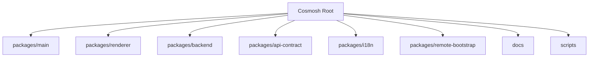
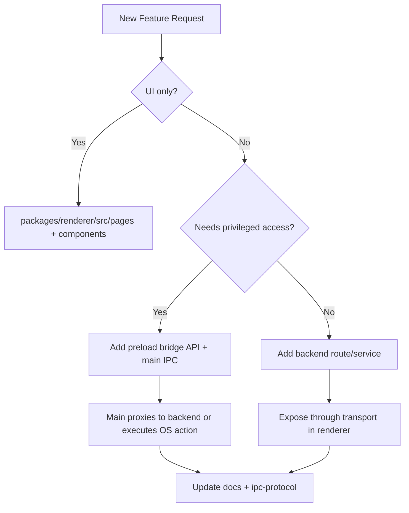

# Cosmosh 项目地图

## 1. Monorepo 布局

## 2. 目录职责

### `scripts`

- **角色**：仓库级开发与发布流程辅助脚本。
- **关键文件**：
  - `dev-profile.mjs`：`pnpm dev:profile` 与 `pnpm dev:main:fresh` 使用的开发身份管理器。它会自动把旧的隐式默认身份导入到受保护的 `default` 身份，然后在 `.cosmosh/dev-profiles/<name>/` 下创建、切换、重置、删除身份，并可用身份级运行路径执行命令。
  - `build-remote-bootstrap-release.mjs`：CI/发布辅助脚本，用于交叉编译 Linux 远端 bootstrap binary、计算 SHA-256，并在 `packages/remote-bootstrap/dist/` 下写入被 git ignore 的 manifest。正式 tag release 会把这些文件上传到版本化 release；`main` push 会上传到固定 `remote-bootstrap-dev` prerelease；分支名包含 `remote-bootstrap` 的 push 和手动 dispatch 可以上传到分支专用临时 prerelease 做端到端测试；普通 PR 只用它做校验。
  - `update-version.js`：版本元数据更新辅助。
  - `precommit-staged.mjs`：暂存文件 precommit 校验辅助。
  - `setup-githooks.mjs`：本地 Git hook 初始化。

### `packages/main`

- **角色**：Electron 宿主进程。
- **关键文件**：
  - `src/index.ts`：应用启动、窗口配置、IPC 处理器、后端子进程管理。
  - `src/ipc/register-app-utility-ipc.ts`：特权应用工具 IPC，例如原生对话框、文件管理器集成、SFTP 临时文件创建，以及已校验的系统打开/打开方式流程。
  - `src/ipc/register-debug-ipc.ts`：开发诊断 IPC，包括 backend 请求镜像的列表、清空与事件通道。
  - `src/ipc/backend-request-trace-store.ts`：仅开发态使用的 backend proxy 请求镜像脱敏 ring buffer。
  - `src/ipc/sftp-download-target-authorizations.ts`：面向 renderer 所有者的本地 SFTP 下载目标精确路径能力授权。
  - `src/preload.ts`：安全渲染层桥接。
  - `src/security/database-encryption.ts`：数据库路径/密钥处理辅助，包含开发身份数据库路径覆盖。
  - `src/dev/dev-profile.ts`：仅开发态使用的身份激活逻辑，在启动前将选中身份映射到 Electron `userData`、SQLite 与 backend secret 存储路径。
  - `resources/installer.nsh`：Windows NSIS 安装器扩展，包括辅助安装选项页、shell/terminal 注册钩子、卸载数据清理，以及安装器 DPI manifest 设置。
  - `resources/helpers`：打包的系统 helper，包括 macOS NSWorkspace SFTP 打开方式 helper 源码/二进制。
  - `resources/remote-bootstrap/manifest-url.json`：被 git ignore 的 CI 打包资源，在 release 或 `main` 构建提供默认 URL 时记录 packaged backend 启动使用的远端增强 manifest URL。
  - `scripts/compile-macos-open-with-helper.mjs`：仅 macOS 生效的构建钩子，在打包前编译 SFTP 打开方式 helper。
  - `scripts/write-remote-bootstrap-manifest-url.cjs`：CI 打包辅助脚本，在设置 `COSMOSH_REMOTE_BOOTSTRAP_MANIFEST_URL` 时写入 packaged 远端增强 manifest URL 资源；未设置时会删除陈旧的被 ignore 资源。
  - `devtools/request-trace-panel`：未打包的仅开发态 DevTools extension，由 Main 在开发运行中加载；它读取 renderer 镜像缓存，不改变 backend transport。

### `packages/renderer`

- **角色**：React UI 层。
- **关键目录**：
  - `src/pages`：功能页面（`Home`、`SSH`、`SFTP`、`Settings`、`SettingsEditor`等）。Home 负责 SSH 服务器、钥匙链与端口转发管理界面。
  - `src/pages/sftp`：SFTP 页面子模块，负责浏览器式 UI 编排、动作菜单、目录/树/详情面板与共享 SFTP 辅助函数。
  - `src/pages/settings-editor`：基于 CodeMirror 的设置 JSON 编辑器模块，包含 schema 诊断、补全、悬浮详情与编辑器生命周期封装。
  - `src/components/ui`：基于 Radix 的原子组件封装、可复用查找/替换面板、CodeMirror 文本右键菜单与样式契约。
  - `src/components/home`：Home/SSH 共享实体模块（卡片/图标渲染、视觉编辑器、可复用的创建文件夹弹窗）。
  - `src/components/terminal`：终端交互复合组件（右键菜单、选区工具条、自动补全面板）。
  - `src/lib`：后端传输、i18n、设置启动应用（`app-settings.ts`）、renderer 请求 trace 镜像启动逻辑（`backend-request-trace-mirror.ts`）、共享时间显示格式化工具（`date-time-format.ts`）、共享 CodeMirror 语法高亮与查找/替换 adapter，以及工具抽象（含共享实体视觉工具与创建文件夹 Hook）。
  - `theme`：生成 CSS Variables 的令牌源。

### `packages/backend`

- **角色**：内部 API + 会话编排运行时。
- **关键目录**：
  - `src/http/routes`：设置、SSH 实体、端口转发规则与本地终端动作 REST 路由。
  - `src/audit`：本地优先审计领域（脱敏、保留策略、查询模型与写入服务）。
  - `src/ssh`：SSH 认证/会话逻辑（`ssh2`、known-host 信任、遥测），以及非 shell SSH 连接共享 helper。
  - `src/remote-bootstrap`：面向活跃 SSH 会话的远端增强 bootstrap 编排。它负责加载部署 manifest、通过有界侧通道 `ssh2 exec` 探测远端平台、注入 shell wrapper、转发 `bootstrap-status` WS 消息，并记录 bootstrap 终态审计。
  - `src/port-forward`：SSH 端口转发规则校验、SOCKS5 解析与活动运行时会话服务。
  - `src/sftp`：SFTP 浏览、下载与文件操作会话逻辑（`ssh2.sftp`、路径归一化、条目映射与会话清理）。
  - `src/settings`：设置默认值、请求校验解析，以及供 HTTP 路由和运行时服务复用的 AppSettings 读取器。
  - `src/validation-utils.ts`：后端 HTTP 边界校验共享原语，供路由与领域 payload 解析器复用。
  - `src/local-terminal`：本地 PTY 会话逻辑（`node-pty`）。
  - `src/terminal`：终端会话共享原语（WebSocket 消息规范化、历史命令解析、尺寸收敛、历史同步时序辅助）。
  - `src/terminal/completion`：终端自动补全共享领域模块（规范数据、排序引擎、补全响应组装），由 SSH 与本地终端会话服务共同使用。
  - `src/db`：Prisma 初始化与数据库生命周期。

### `packages/api-contract`

共享协议常量、请求/响应类型、OpenAPI 源与生成产物。

- `src/http.ts`：API path token 与 query string 解析 helper，供 main IPC 代理与 renderer browser transport 共享。
- `src/ipc.ts`：共享未由 OpenAPI 生成的 IPC-only payload 枚举与结构，例如应用菜单动作、SFTP 打开方式应用描述与开发态 backend 请求 trace。
- `src/settings-registry.ts`：所有设置定义的**唯一来源**——类型、默认值、约束、枚举集、UI 控件元数据、分类与辅助函数。增删设置项仅需编辑此文件。
- `src/settings.ts`：基于注册表的通用校验与规范化辅助函数（`normalizeSettingsValuesStrict`、`normalizeSettingsValuesWithDefaults`），供 backend 与 renderer 共享。
- `src/sftp.ts`：SFTP 条目/名称排序共享 helper，供后端会话列表与渲染层浏览器/树视图复用。

### `packages/i18n`

main/backend/renderer 作用域共用的语言 JSON 源与运行时 i18n 包。

- 运行时核心与具体文案资源解耦。消费端通过 `createMessages(...)` + `createI18n(...)` 显式注册所需语言 JSON。
- backend 作用域可在注册前通过 `mergeTranslationTrees(...)` 合并生成语料（如 `backend-inshellisense.json`）。

### `packages/remote-bootstrap`

远端增强使用的用户级远端安装器 Go 源码。该 package 不负责打开 SSH 连接；backend 的 `RemoteBootstrapService` 决定何时运行它，以及如何转发状态。

- `README.md`：模块指南，覆盖目的、运行时归属、manifest 契约、安装路径、状态码、安全边界以及测试/构建命令。
- `cmd/cosmosh-wrappergen`：为 `bash`、`zsh`、`fish`、`ash`、`sh` 生成 shell 专属 bootstrap wrapper。
- `cmd/cosmosh-bootstrap`：将下载得到的 bootstrap binary 与薄 shell helper 安装到远端用户级目录。
- `internal/wrapper`：校验来自 manifest 的 wrapper 输入，并用 shell-safe quoting 渲染 POSIX/fish shell source。
- `internal/install`：执行幂等用户级安装、shell profile hook 修复、version marker 写入，以及 line-delimited `bootstrap-status` 输出。

## 3. 功能落位规则

## 4. 命名与结构指南

- 进程间契约先落在 `api-contract`，再供 backend/main/renderer 消费。
- 渲染层副作用放在 `src/lib`（transport/services），不要直接写在展示组件中。
- 新增 IPC channel 必须通过 preload 暴露，并同步到 `renderer/src/vite-env.d.ts`。
- 对于后端能力：
  - 路由放在 `http/routes/*`
  - 业务/会话逻辑放在独立 service 模块
  - 输入校验采用 `ssh/validation.ts` 风格解析模块。

## 5. 尚未实现（规划中）

- 完整 SFTP 传输队列模块（目录上传/下载、字节级进度/取消、重试策略与持久化传输历史）。
- 尚无独立 `common` 共享包；当前共享通过 `api-contract` + `i18n` 实现。

## 6. 常见改动场景

### 新增 IPC 动作

1. 需要时先在 `packages/api-contract` 定义或复用契约类型。
2. 在 `packages/main/src/preload.ts` 暴露 bridge API。
3. 在 `packages/main/src/ipc/*` 增加 `ipcMain` 处理，并在需要时补充后端代理 wiring。
4. 在 `packages/renderer/src/lib` 接入 transport 封装。
5. 同步更新 `docs/zh-CN/developer/core/ipc-protocol.md`。

### 新增后端能力

1. 在 `packages/backend/src/http/routes` 新增路由。
2. 在对应领域模块（`ssh`、`local-terminal` 或新模块）新增 service 逻辑。
3. 增加输入边界校验/解析层。
4. 若属于安全核心操作，调用 `AuditEventService` 写入脱敏后的审计事件。
5. 通过 main bridge 暴露给 renderer。
6. 同步架构与运行时文档。

### 新增端口转发行为

1. 当路由或 payload 形状变化时，先更新 `packages/api-contract/openapi/cosmosh.openapi.yaml`。
2. 持久化字段维护在 `packages/backend/prisma/schema.prisma` 及对应 migration 中。
3. 运行时归属保持在 `packages/backend/src/port-forward`，并通过 `packages/backend/src/ssh/connect.ts` 复用 SSH 认证与主机信任逻辑。
4. Bridge 变更同步到 `packages/main/src/preload.ts`、`packages/main/src/ipc/register-backend-ipc.ts`、`packages/renderer/src/vite-env.d.ts` 与 renderer API wrapper。
5. 更新 `docs/developer/runtime/port-forwarding.md` 与 `docs/zh-CN/developer/runtime/port-forwarding.md`。

### 新增应用设置项

1. 在 `packages/api-contract/src/settings-registry.ts` 中：
   - 在 `SettingsValues` 接口中添加 key 及其类型。
   - 在 `SETTINGS_REGISTRY` 数组中添加一条 `SettingDefinition` 条目（默认值、约束、UI 控件、分类、i18n key 等）。

2. 在 `packages/i18n/locales/en/*.json` 和 `zh-CN/*.json` 中添加 i18n key。
3. 无需修改其他文件——校验、默认值与 UI 渲染均从注册表自动派生。

## 7. 本地优先审计模块归属（2026-03）

- 数据模型归属：
  - `packages/backend/prisma/schema.prisma`（`AuditEvent`、`AuditSyncCursor`）。
  - `packages/backend/prisma/migrations/*` 负责运行时 schema 收敛。
- 运行时归属：
  - `packages/backend/src/audit/service.ts` 负责写入、查询与保留清理。
  - `packages/backend/src/audit/sanitizer.ts` 负责 metadata 脱敏与大小限制。
  - `packages/backend/src/http/routes/audit.ts` 负责审计列表/详情 API。
- Bridge 归属：
  - `packages/main/src/ipc/register-backend-ipc.ts` 与 `packages/main/src/preload.ts` 负责审计 IPC 通道。
- Renderer 归属：
  - `packages/renderer/src/pages/AuditLogs.tsx` 负责审计列表/详情界面。
  - `packages/renderer/src/lib/api/*` 负责类型化 transport/client 映射。
- 文档归属：
  - `docs/developer/runtime/audit-events.md` 与 `docs/zh-CN/developer/runtime/audit-events.md` 为运行时主文档。

## 8. SSH 钥匙链模块归属（2026-03）

- 数据模型归属：
  - `packages/backend/prisma/schema.prisma` 定义 `SshKeychain` 与 `SshServer.keychainId` 关系。
  - 钥匙链的文件夹/标签元数据复用 `SshFolder`、`SshTag`（以及 `SshKeychainTagLink`），不再维护钥匙链专属文件夹/标签表。
- 运行时归属：
  - `packages/backend/src/http/routes/ssh.ts` 负责钥匙链 CRUD 与凭据读取接口。
  - `packages/backend/src/ssh/session-service.ts` 负责连接阶段 server→keychain 凭据解析。
- Bridge 归属：
  - `packages/main/src/ipc/register-backend-ipc.ts` 与 `packages/main/src/preload.ts` 负责钥匙链 IPC 代理通道。
- Renderer 归属：
  - `packages/renderer/src/pages/Home.tsx` 负责主页共享侧栏以及 SSH 服务器 / 钥匙链 / 端口转发模式正文。Home 是服务器与钥匙链的标准管理界面。
  - `packages/renderer/src/components/ssh/SSHServerEditorDialog.tsx` 负责单服务器创建/编辑，包括钥匙链选择与内联认证回退。当它内嵌创建钥匙链时，本地刚保存的钥匙链必须与进行中的引用列表重载结果合并，确保服务器表单能立即选中刚保存的钥匙链。
  - `packages/renderer/src/components/ssh/SSHKeychainEditorDialog.tsx` 负责公用钥匙链创建/编辑。每个 Home 模式都拥有独立的排序/分组视图偏好，切换模式不会改写另一个界面的组织状态。

## 9. SSH 端口转发模块归属（2026-05）

- 数据模型归属：
  - `packages/backend/prisma/schema.prisma`（`PortForwardRule`、`PortForwardRuleType`）。
  - `packages/backend/prisma/migrations/*port_forward_rules*` 负责运行时 schema 收敛。
- 契约归属：
  - `packages/api-contract/openapi/cosmosh.openapi.yaml` 负责路由、payload、API code 与生成的 `API_PATHS`。
  - `packages/api-contract/src/index.ts` 负责 main/renderer 消费的请求/响应类型别名。
- 运行时归属：
  - `packages/backend/src/http/routes/port-forward.ts` 负责 CRUD/start/stop 路由。
  - `packages/backend/src/port-forward/session-service.ts` 负责 local/remote/dynamic 活动运行时状态。
  - `packages/backend/src/port-forward/validation.ts` 与 `socks5.ts` 负责输入与 SOCKS 协议边界。
  - `packages/backend/src/ssh/connect.ts` 负责共享 SSH 认证与主机信任。
- Bridge 归属：
  - `packages/main/src/ipc/register-backend-ipc.ts`、`packages/main/src/preload.ts` 与 `packages/renderer/src/vite-env.d.ts`。
- Renderer 归属：
  - `packages/renderer/src/pages/Home.tsx` 负责 Home -> Port Forwarding 表格、当前模式独立的排序/分组控件、弹窗、动作与 host trust retry。
  - `packages/renderer/src/lib/api/*` 与 `packages/renderer/src/lib/backend.ts` 负责类型化 transport wrapper。
- 文档归属：
  - `docs/developer/runtime/port-forwarding.md` 与 `docs/zh-CN/developer/runtime/port-forwarding.md`。

## 10. 服务器代理模块归属（2026-06）

- 契约与校验：
  - `packages/api-contract/src/proxy.ts` 负责代理模式、URL 校验、支持协议与长度限制。
  - `packages/api-contract/openapi/cosmosh.openapi.yaml` 负责服务器代理字段与临时系统代理请求字段。
- 持久模型：
  - `packages/backend/prisma/schema.prisma` 负责 `SshServer.proxyMode` 与 `SshServer.proxyUrl`。
- 特权系统解析：
  - `packages/main/src/ipc/register-app-utility-ipc.ts` 通过 Electron `Session.resolveProxy` 负责 `app:resolve-system-proxy`。
- Renderer 编排：
  - `packages/renderer/src/lib/server-proxy.ts` 在 SSH、SFTP 或端口转发启动前判断是否需要系统代理解析。
- Backend 运行时：
  - `packages/backend/src/ssh/proxy.ts` 负责优先级、PAC 结果解析、隧道建立、共享超时与凭据安全错误。
