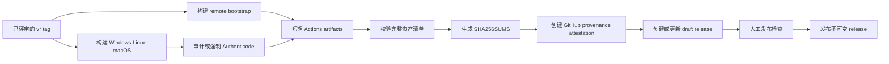

# 发布安全

本文档定义 Cosmosh CI 产物与公开发布的信任边界。它区分有意保持可变的开发通道与版本化发布，记录当前签名策略，并列出首次公开发布前必须完成的仓库控制项。

## 通道模型

| 通道 | 触发方式 | 资产可变性 | 目标受众 |
| --- | --- | --- | --- |
| Pull request 与普通分支 CI | Push 或 pull request | 短期 Actions artifacts | 维护者与评审者 |
| `remote-bootstrap-dev` | Push 到 `main` | 按设计原位替换 | 滚动开发构建 |
| `remote-bootstrap-branch-*` | 匹配分支 push 或显式 dispatch | 按设计原位替换 | 分支端到端测试 |
| 版本化发布 | Push `v*` tag | 仅 draft 阶段可变；发布后不可变 | 公开用户 |

滚动 remote-bootstrap 通道不是发布归档。其 tag 与资产按设计移动，使开发构建可以跟随最新兼容 helper。版本化发布安装包始终嵌入精确的 `releases/download/<tag>/cosmosh-remote-bootstrap-manifest.json` URL，绝不能回退到滚动通道。

## 正式发布流程

- 构建与组装任务只有仓库只读权限，不能修改 GitHub Releases。
- Checkout 步骤不会持久化 workflow 凭据。OIDC attestation 任务与最终写入任务都不会 checkout 或执行仓库代码；写入任务的 `GH_TOKEN` 只暴露给 draft 创建/上传步骤。
- `electron-builder` 始终接收 `--publish never`；最终 `publish-draft` 任务是唯一写入者。
- 跨任务产物保留七天，在一个扁平目录中重新组装，并由写入任务以单一已验证 bundle 再次下载。
- `scripts/prepare-release-assets.mjs` 会在缺少任一平台资产时失败，然后写入确定性的 `SHA256SUMS` 条目。
- GitHub build-provenance attestations 覆盖所有上传资产及 `SHA256SUMS`。
- 重跑 workflow 只能在确认现有 release 仍为 draft 后替换资产。workflow 会拒绝修改已发布 release。
- Release workflow 按 tag 串行化，避免两个运行有意并发发布同一版本。

## Windows 签名策略

仓库变量 `COSMOSH_WINDOWS_SIGNING_POLICY` 只接受两个值：

- `audit`：尚未配置签名供应商时的临时默认值。workflow 检查安装器与打包后的 `Cosmosh.exe`、记录结果，并允许生成未签名 draft。Draft 标题会添加 `UNSIGNED - DO NOT PUBLISH` 前缀。
- `enforce`：首次公开 Windows 发布前的必选值。所有被检查的可执行文件都必须具有受信任的 Authenticode 签名、时间戳证书，并且签名者 Subject 必须与 `COSMOSH_WINDOWS_EXPECTED_PUBLISHER` 精确匹配，否则 release 会在创建 draft 前失败。

签名策略变量未设置时按 `audit` 处理，任何其他策略值都会明确失败。`COSMOSH_WINDOWS_EXPECTED_PUBLISHER` 在 `audit` 下可以不设置，但在 `enforce` 下必填；其精确值应来自可信签名构建报告的签名者证书 Subject。此策略只是验证门禁，不负责执行签名：未来签名集成必须在 Windows `electron-builder` 打包期间运行，确保应用可执行文件与 NSIS 安装器都被签名。签名凭据必须保存在受保护服务或专用的受保护签名 environment 中，绝不能提交到仓库。

普通分支与 pull request 构建不使用此策略；除非开发者显式配置本地签名，否则它们保持未签名。

## Linux 真实性

当前 GitHub 托管的 Linux 资产使用两项发布级控制：

- `SHA256SUMS` 提供确定性的完整性校验。
- GitHub artifact attestations 通过 GitHub OIDC 将资产摘要绑定到本仓库及 release workflow。

这些控制不会让直接下载的 `.deb` 或 AppImage 变成发行版原生签名包。如果 Cosmosh 以后运营 APT 仓库，其 `InRelease` 元数据必须使用单独管理的仓库密钥签名。

Attestation 只能证明某个摘要由哪个 GitHub workflow 生成。它不会批准 `audit` draft，也不能替代 Windows Authenticode、软件包仓库签名或人工发布检查。

## GitHub 仓库控制项

以下设置不存储在 workflow YAML 中，必须在首次公开发布前通过 GitHub 配置：

1. 启用 immutable releases，使 release 发布后锁定资产及关联 tag。
2. 为 `v*` 添加 tag ruleset，禁止更新和删除 tag。不要将该规则应用到 `remote-bootstrap-dev` 或 `remote-bootstrap-branch-*`。
3. 为 `release` environment 配置适当的维护者审批人。若所选供应商需要 workflow 凭据，再添加独立的受保护 Windows 签名 environment。
4. 保持 workflow token 默认只读，只在单个任务级别授予写权限。
5. 对更新 Action 固定 commit SHA 的 Dependabot pull request 保持人工评审。

Draft release 按设计保持可变。只有维护者发布 draft 后才进入不可变状态，因此绝不能发布 `audit` draft。

## 首次公开发布检查清单

1. 选择 Windows 签名供应商，并通过专用的受保护签名 environment 配置其身份。
2. 将 `COSMOSH_WINDOWS_EXPECTED_PUBLISHER` 设置为经过核实的精确签名者 Subject，再设置 `COSMOSH_WINDOWS_SIGNING_POLICY=enforce`。
3. 创建已评审的 `v*` tag，等待所有构建、签名、校验和与 attestation 步骤通过。
4. 下载代表性资产并验证 `SHA256SUMS`。
5. 使用 `gh attestation verify <asset> --repo agoudbg/cosmosh` 验证 provenance。
6. 检查 draft 资产清单与 Windows 发布者身份。
7. 仅在启用 immutable releases 与 `v*` tag ruleset 后发布 draft。

## 当前限制

- 尚未选择 Windows 签名供应商或凭据契约。
- `audit` 模式允许生成未签名 draft 资产以验证流水线，但不批准其公开分发。
- macOS 代码签名与 notarization 不在当前 Windows/Linux 签名范围内；完成对应工作前，不应将 macOS 资产视为可公开发布。
- Linux 资产尚未携带 AppImage 内嵌签名或 APT 仓库签名。
- 仓库侧 immutable release、ruleset 与 environment 审批设置需要单独进行 GitHub 管理。
