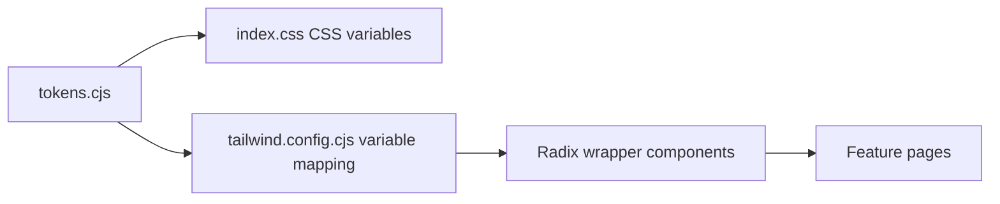
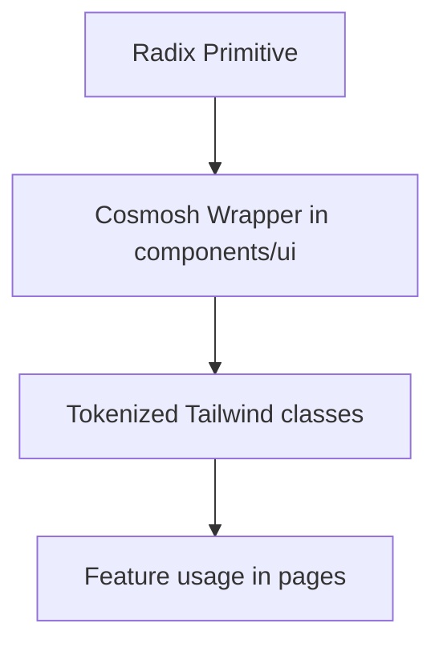

# UI/UX 规范

## 1. 设计系统流水线

规则：

- 主题值来源于 `packages/renderer/theme/tokens.cjs`。
- Tailwind color/radius/shadow 必须映射到 CSS Variables（功能代码中禁止硬编码临时色板）。
- UI 原子组件通过 `packages/renderer/src/components/ui/*` 封装后供页面消费。
- Windows 标题栏系统菜单符号色必须来自 token `color.windows.system-menu-symbol`，并在运行时同步到 main 进程 overlay。
- CodeMirror 语法高亮必须使用共享的 `color.syntax.*` token 系列和 renderer 共享 CodeMirror highlighter，避免在页面内维护局部色表。

## 2. 视觉一致性原则

- 所有视觉原语（颜色、圆角、阴影、模糊、间距）统一由 token 定义。
- 优先复用既有表面与控件样式，避免每个页面新增一次性样式。
- 焦点、悬停、激活、禁用状态需保持清晰可识别。

## 3. 字体规范

- 字体应保持紧凑、可读，并在各类控件和内容区间保持一致。
- 正文与控件字号基线应稳定，避免相邻组件出现突兀跳变。
- 标题、标签、辅助文案、状态信息需要明确层级。

## 4. 圆角逻辑

- 圆角语义在容器与交互控件之间应保持一致逻辑。
- 优先使用 token 级别的圆角预设，避免临时圆角值。
- 圆角选择需与组件用途匹配（容器、控件、浮层）。

## 5. Radix UI 封装原则

实现原则：

- Radix 原语仅通过内部封装使用（`dialog.tsx`、`menubar.tsx`、`toast.tsx` 等）。
- 样式契约集中在独立 style map（`menu-styles.ts`、`form-styles.ts`、`dialog-styles.ts`、`toast-styles.ts`）。
- 可访问性/状态选择器（`data-state`、碰撞处理、键盘语义）放在封装层内部。
- 浮层菜单封装必须使用 Radix available-size 自定义属性加共享视口留白限制尺寸，确保 dropdown、context menu、menubar 和 select 不会渲染到应用可视区域之外。
- 菜单封装内的滚动提示必须脱离普通项目流；上下指示的显示或隐藏不得预留空白行、改变当前 viewport 尺寸，也不得导致当前滚动位置跳动。叠层提示必须带有 token 化表面背景和 backdrop blur，避免半透明菜单透出下方内容。
- 菜单中的单选/Radio 项必须使用共享的前置对勾选中标识，与 checkbox/menu 选中反馈保持一致，不使用小点标记。
- 无法使用 Radix 封装的第三方编辑器浮层（例如 CodeMirror autocomplete 与 info tooltip）仍必须遵循共享菜单/tooltip 的 token 节奏：`bg-bg-subtle`、`shadow-menu-content` 或 `shadow-soft`、4px 面板边距、6px/10px 项目内边距、`rounded-lg` 面板、`rounded-md` 项目，以及用于 hover/selection 的 `bg-menu-control-hover`。
- CodeMirror 编辑器语法使用受 VS Code 启发的默认调色板，并通过语义 token 落地；编辑器外壳、补全、诊断与右键菜单仍沿用 Cosmosh 表面/菜单 token。

## 6. 交互密度规则

- 布局应保持紧凑且可呼吸，优先保证信息扫描效率与高频操作效率。
- 同一功能区域内的控件节奏与间距应保持一致。
- 可滚动内容中的类目或导航切换（包括设置页面类目）应将内容面板复位到新选中内容的顶部。
- 避免影响可读性和任务聚焦的纯装饰性样式。

## 7. Orbit Bar 规范

SSH 页面中的终端文本选区交互必须满足以下规则：

- Orbit Bar 必须使用基于 token 的 Menubar 风格表面（`menu-control`、`menu-divider`、`shadow-menu`）。
- 仅在终端存在选区时显示 Orbit Bar，且优先放置在选区上方。
- 若上方放置会遮挡选区或超出可视边界，则放置在选区下方。
- Orbit Bar 位置需随选区移动及视口/布局变化持续同步。
- 所有图标动作必须提供 Tooltip 文案，并通过 renderer i18n 本地化。
- 暂未实现的动作必须提供明确“即将支持”反馈，禁止静默无响应。

## 7.1 SSH 分屏右键交互规范

- SSH 终端的分屏/关闭动作仅通过终端右键菜单暴露。
- 分屏序列固定为高密度布局（1 → 2 → 3 → 4），以保持可预测的操作与扫描节奏。
- 窗格分隔线必须使用 token 化分隔色，并保持比卡片边界更浅的对比度。
- SSH 分屏分隔线应使用专用 token `color.ssh.terminal.split.divider`（Tailwind 类：`border-ssh-terminal-split-divider`），不要复用 Home/Card 通用分隔色。
- 在技术可行时，分屏默认复用当前活动终端会话流，避免无必要地新增后端会话。
- 每个窗格右键菜单都应提供关闭入口，但界面上至少保留一个可见窗格。

## 7.2 Tab 重排运行时连续性

- 拖拽/重排 tab 只应影响标签条顺序，不得触发页面运行时卸载或重建。
- 对运行时负载较重的页面（例如 SSH/xterm 会话），tab 顺序变化时必须保持内存会话状态连续。
- 重排状态更新应基于 id，并且必须复用 state 中最新 tab 对象，禁止把拖拽期间的过期快照直接回写。
- 全局新建标签页入口（包括标签条加号、Header 用户菜单、应用菜单和命令面板）应将新标签追加到标签条末尾。
- 从现有标签页内部触发的新建标签页必须传入显式锚点 id，并把新标签插入到来源标签页右侧。
- 标签页右键菜单提供“在右侧新建标签页”作为锚点式新建标签页的明确入口。

## 7.3 服务器来源标签页视觉

- 浅色模式下，活动的服务器来源标签页必须通过 `color.header.tab.server-active-overlay` 加深服务器色；不要通过修改通用 `color.header.tab.active` token 来解决服务器色对比问题。
- 启用共享的服务器视觉标签页设置时，SSH 与 SFTP 标签页可以应用来源服务器的颜色背景。
- SFTP 标签页即使继承服务器配色，也必须保持文件夹图标，以便用户快速区分文件系统标签页与终端标签页。
- 非活动的服务器来源标签页必须通过主题感知的 `color.header.tab.server-inactive-overlay` token 系列进行弱化，不得使用硬编码黑色遮罩，以确保浅色模式保持干净的非活动色调。
- 彩色命令面板行必须使用对应的 `color.command.item.color-visual-active-overlay` 与 `color.command.item.color-visual-overlay` token 系列，确保活动路由切换项足够清晰，同时在不同主题下与标签页外壳保持一致。

## 7.4 页面状态标签页身份

- 当页面内部存在会显著改变用户任务语境的主类别时，类别变化应同步反映到标签栏。
- Home 标签页处于Keychains或Port Forwarding模式时，必须显示该类别的本地化标题和匹配图标；切回 SSH 模式时恢复标准 Home 标题与图标。

## 7.5 普通文本选区右键菜单

- 非编辑态 DOM 文本选区应提供仅包含“复制”的极简兜底右键菜单。
- 兜底菜单只有在指针位于已选中文本矩形内部时才能打开，不能仅因为页面存在选区就接管右键。
- 既有专用菜单保持优先级：input、textarea、contenteditable 区域、CodeMirror 编辑器表面、xterm/终端表面、SFTP 行、标签页，以及任何组件级右键菜单触发区域，都不能被兜底菜单替换。需要文本编辑命令的 CodeMirror 编辑器表面应通过共享内部 `ContextMenu` 样式和本地化文本编辑标签暴露这些命令，而不是回退到浏览器菜单。
- 兜底菜单必须复用内部 `ContextMenu` 封装、token 化菜单样式、本地化后的 renderer 复制文案，以及平台快捷键提示。
- 独立 renderer document（包括 SFTP 条目属性弹窗）必须在 renderer 根部挂载同一套兜底 provider。

## 7.6 命令面板键盘焦点

- 当命令面板显示搜索输入框时，即使鼠标点击或嵌套控件焦点临时把 DOM 焦点移动到列表动作或 footer 控件，输入框仍然拥有导航按键语义。
- 来自非文本输入后代的方向键导航和命令面板关闭快捷键，必须先将焦点恢复到输入框，再执行与输入框相同的处理路径。
- 嵌套按钮必须保留自身的正常激活语义；焦点交还不应把所有后代按键都转换为命令选择。

## 7.7 组合控件无障碍语义

- 渲染选项列表的自定义命令/搜索控件必须暴露带名称的 `combobox`，并通过稳定的 `aria-controls`、`aria-expanded`、`aria-activedescendant` 关联到带名称的 `listbox`，每个选项需提供 `aria-selected`。
- 仅图标控件必须通过本地化 `aria-label` 提供可访问名称；tooltip 只作为视觉辅助，不能作为唯一名称。
- 注册表驱动的设置控件必须用稳定的 `htmlFor`/`id` 把可见标签连接到实际控件，包括开关、选择器、文本输入、文本区域和 JSON 编辑按钮。
- 支持 roving focus 或选择状态的 SFTP 目录行必须使用 `listbox`/`option` 语义，并让 `aria-selected` 对齐条目选择状态，不能把可选择行混用为 `role="button"`。

## 8. 合规检查清单

合并 UI 变更前：

1. 新颜色/圆角/阴影值必须来自 token 流水线。
2. 新交互原语应为 `components/ui` 下的 Radix 封装。
3. 字体与间距遵循既有系统级比例。
4. 组件行为与状态反馈与现有封装保持一致。
