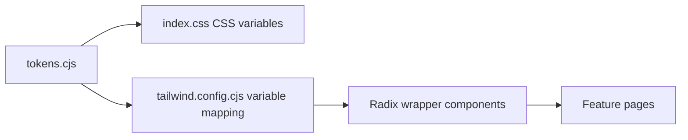
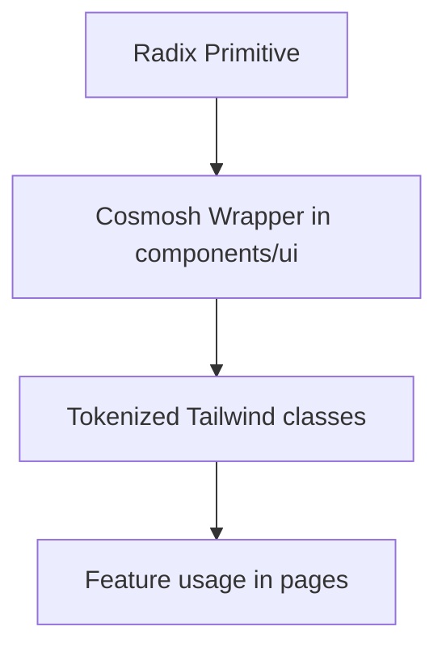

# UI/UX 规范

## 1. 设计系统流水线

规则：

- 主题值来源于 `packages/renderer/theme/tokens.cjs`。
- Tailwind color/radius/shadow 必须映射到 CSS Variables（功能代码中禁止硬编码临时色板）。
- UI 原子组件通过 `packages/renderer/src/components/ui/*` 封装后供页面消费。
- Windows 标题栏系统菜单符号色必须来自 token `color.windows.system-menu-symbol`，并在运行时同步到 main 进程 overlay。
- CodeMirror 语法高亮必须使用共享的 `color.syntax.*` token 系列和 renderer 共享 CodeMirror highlighter，避免在页面内维护局部色表。

## 2. 视觉一致性原则

- 所有视觉原语（颜色、圆角、阴影、模糊、间距）统一由 token 定义。
- 优先复用既有表面与控件样式，避免每个页面新增一次性样式。
- 焦点、悬停、激活、禁用状态需保持清晰可识别。

## 3. 字体规范

- 字体应保持紧凑、可读，并在各类控件和内容区间保持一致。
- 正文与控件字号基线应稳定，避免相邻组件出现突兀跳变。
- 标题、标签、辅助文案、状态信息需要明确层级。

## 4. 圆角逻辑

- 圆角语义在容器与交互控件之间应保持一致逻辑。
- 优先使用 token 级别的圆角预设，避免临时圆角值。
- 圆角选择需与组件用途匹配（容器、控件、浮层）。

## 5. Radix UI 封装原则

实现原则：

- Radix 原语仅通过内部封装使用（`dialog.tsx`、`menubar.tsx`、`toast.tsx` 等）。
- 样式契约集中在独立 style map（`menu-styles.ts`、`form-styles.ts`、`dialog-styles.ts`、`toast-styles.ts`）。
- 可访问性/状态选择器（`data-state`、碰撞处理、键盘语义）放在封装层内部。
- 浮层菜单封装必须使用 Radix available-size 自定义属性加共享视口留白限制尺寸，确保 dropdown、context menu、menubar 和 select 不会渲染到应用可视区域之外。
- 菜单封装内的滚动提示必须脱离普通项目流；上下指示的显示或隐藏不得预留空白行、改变当前 viewport 尺寸，也不得导致当前滚动位置跳动。叠层提示必须带有 token 化表面背景和 backdrop blur，避免半透明菜单透出下方内容。
- 菜单中的单选/Radio 项必须使用共享的前置对勾选中标识，与 checkbox/menu 选中反馈保持一致，不使用小点标记。
- 无法使用 Radix 封装的第三方编辑器浮层（例如 CodeMirror autocomplete 与 info tooltip）仍必须遵循共享菜单/tooltip 的 token 节奏：`bg-bg-subtle`、`shadow-menu-content` 或 `shadow-soft`、4px 面板边距、6px/10px 项目内边距、`rounded-lg` 面板、`rounded-md` 项目，以及用于 hover/selection 的 `bg-menu-control-hover`。
- 可复用查找/替换面板必须使用 `packages/renderer/src/components/ui` 中的 `SearchReplacePanel`。该面板由调用方受控，支持隐藏/只读/可编辑替换模式、可配置 filter toggle、匹配计数显示、紧凑密度，以及 action 级禁用/隐藏状态。具体 surface 的 adapter 负责搜索算法，并将自身状态映射到这个通用面板，而不是复制 UI。
- CodeMirror 编辑器语法使用受 VS Code 启发的默认调色板，并通过语义 token 落地；编辑器外壳、补全、诊断、查找/替换面板与右键菜单仍沿用 Cosmosh 表面/菜单 token。

### 5.1 对话框退场状态生命周期

- 将 `open` 设为 `false` 只负责启动对话框退场动画；在内容离开视口前，动态标签、prompt payload 和受控字段值不得提前消失。
- 共享对话框退场行为归属于 `packages/renderer/src/components/ui/dialog-lifecycle.ts`。`DialogContent` 与 `AlertDialogContent` 提供 `onExitComplete`，它仅在内容元素自身的 `data-state="closed"` 动画结束后执行。
- 当 prompt 驱动的对话框 owner 会立即清空 nullable payload 时，展示内容必须通过 `useDialogExitSnapshot` 读取，并在 `onExitComplete` 中释放快照。
- 表单与草稿状态应在 `onExitComplete` 中重置；若允许关闭期间保留状态，也可在下一次打开前初始化。不得使用写死动画时长的 timer 同步清理时机。

## 6. 交互密度规则

- 布局应保持紧凑且可呼吸，优先保证信息扫描效率与高频操作效率。
- 同一功能区域内的控件节奏与间距应保持一致。
- 可滚动内容中的类目或导航切换（包括设置页面类目）应将内容面板复位到新选中内容的顶部。
- 避免影响可读性和任务聚焦的纯装饰性样式。

### 6.1 实体视觉选择器虚拟化

- `EntityVisualPicker` 使用 `@tanstack/react-virtual` 保留完整 Lucide 图标目录的可搜索能力，同时只挂载可见的固定网格行和少量 overscan 窗口。
- 虚拟网格保持既有的八列、32 px 图标按钮和 4 px 间距节奏；滚动时虚拟化不得调整选择器尺寸或造成布局位移。
- TanStack Virtual 负责范围计算、完整滚动尺寸、overscan 与行滚动；功能代码负责搜索、选择、键盘语义与焦点恢复，不得再并行引入手写窗口算法。
- 方向键与正向 Tab 导航必须先调用虚拟化器显示离屏目标行，再移动焦点。搜索结果变化后，应以已选图标为活动网格项；若已选图标不在结果中，则以首个过滤结果为活动项。
- 虚拟化仅减少已挂载 DOM；图标模块加载方式或打包组成属于独立优化事项。

### 6.2 SFTP 集合虚拟化

- SFTP 目录树与中间文件列表使用 `@tanstack/react-virtual`，采用稳定的远程路径 key、固定 30 px 树行、固定 34 px 目录行和少量 overscan 窗口。30 px sticky 目录表头保持在逻辑行集合之外。
- 虚拟化只改变已挂载 DOM。`SFTP.tsx` 继续持有完整的筛选/排序条目集合、展开树顺序、选择模型、键盘导航顺序和拖放契约。
- 当前 roving-focus 行，以及承载行内编辑、已打开右键菜单或原生拖拽源的行，必须在需要时保持挂载。键盘移动到离屏行时必须先通过虚拟化器将其显示再移动焦点，虚拟化 option/treeitem 还必须向辅助技术暴露其逻辑位置、集合大小与树层级。
- 当前目录树定位使用扁平化逻辑行几何；当父级/当前/已展开子级上下文无法完整放入视口时，继续保持视口上方约三分之一的目标位置。
- 目录框选必须基于完整固定行模型计算相交项，包括通过边缘自动滚动触达的未挂载行。虚拟化不得削弱空白区域选择、修饰键扩展、拖放目标、行内编辑或脏预览保护。

## 7. Orbit Bar 规范

SSH 页面中的终端文本选区交互必须满足以下规则：

- Orbit Bar 必须使用基于 token 的 Menubar 风格表面（`menu-control`、`menu-divider`、`shadow-menu`）。
- 仅在终端存在选区时显示 Orbit Bar，且优先放置在选区上方。
- 若上方放置会遮挡选区或超出可视边界，则放置在选区下方。
- Orbit Bar 位置需随选区移动及视口/布局变化持续同步。
- 所有图标动作必须提供 Tooltip 文案，并通过 renderer i18n 本地化。
- 暂未实现的动作必须提供明确“即将支持”反馈，禁止静默无响应。

## 7.1 SSH 分屏与命令时间线规范

- SSH 终端的分屏/关闭动作仅通过终端右键菜单暴露。
- 分屏序列固定为高密度布局（1 → 2 → 3 → 4），以保持可预测的操作与扫描节奏。
- 窗格分隔线必须使用 token 化分隔色，并保持比卡片边界更浅的对比度。
- SSH 分屏分隔线应使用专用 token `color.ssh.terminal.split.divider`（Tailwind 类：`border-ssh-terminal-split-divider`），不要复用 Home/Card 通用分隔色。
- 每个分屏 pane 都是独立命令操作面，因此针对同一已解析目标分别持有 xterm、backend session、WebSocket、补全/状态与命令 marker。UI 动作与浮层必须通过明确 pane id 路由。
- 每个 pane 右键菜单都应提供关闭入口，但界面上至少保留一个可见 pane。关闭任意 pane（包括原始 primary）必须保留其余 pane id 与运行时。
- 通过认证的远端增强处于 active 状态并声明 `command-start` 后，每个符合条件的 pane 都在右侧使用固定 40 px 命令槽：34 px 最近命令轨道紧邻 xterm 的 6 px 滚动条左侧，命令槽与 pane 右边缘之间不保留额外内边距。终端列数通过 xterm 内边距预留，原生滚动条则保留在扩展后的 scrollable element 内，确保 xterm 自身的悬浮显示、点击轨道和拖动滑块行为正常。符合条件期间轨道始终保留在 pane DOM 中，视觉状态变化不得重挂载 xterm 或改变 PTY 列数。
- 只有 normal buffer 内容超过两个可见屏幕且保留的可信命令超过三条时，才启用最近命令入口。该阈值只控制入口与菜单；符合 helper 能力条件的完整生命周期内仍固定预留轨道，跨越阈值时不得改变终端列数。运行 alternate-screen 程序时隐藏入口；在 normal buffer 中，终端内的鼠标移动会显示入口，连续五秒无鼠标移动后隐藏。在 xterm 内进行键盘/IME 输入或粘贴时，应立即关闭最近命令界面并隐藏入口，避免干扰持续输入。鼠标活动必须在 pane 的捕获阶段边界监听，确保 xterm 画布或滚动条内部处理不会阻断入口显示；可信历史首次满足阈值时也应启动新的可见窗口，即使组件刚经历仅影响视觉的重新挂载。闲置隐藏会移除键盘焦点与无障碍暴露，但继续保留紧凑鼠标命中区域，使该区域内的鼠标移动可以可靠地显示并打开入口。菜单打开期间保持入口可见，直至菜单关闭或被 xterm 输入收起。
- 入口为垂直居中的线条组，最多呈现最新八条装饰线。每条线宽 12 px、高 2 px，间距 10 px，在轨道内水平居中，并以约 60% 透明度使用 `color.text`。这些线共同构成列表入口，不再编码命令输出量，也不是独立导航目标。
- 鼠标命中范围仅限线条组的视觉高度及其上下各 8 px 的内边距。34 px 轨道的其余区域必须允许指针穿透，相邻滚动条的轨道与滑块都必须可以直接拖动。
- 鼠标悬浮时，整组线条会 morph 为一个固定 256 px 宽、复用共享菜单的卡片；卡片锚定滚动条边缘，覆盖轨道并向左展开。卡片正常挂载，并通过 CSS `@starting-style` 以 transform/opacity 完成 180 ms 入场；只有鼠标离开触发的退场会在 140 ms transform/opacity 过渡期间保留 Portal，使快速反向操作可中断，同时避免隐藏菜单长期进入焦点或 Escape 处理链。入口、命令卡片与命令行操作菜单之间统一通过 `relatedTarget` 判断及 80 ms Portal 跨越宽限消除偶发悬浮失效，包括打开行右键菜单后的鼠标移动。命令行操作菜单不能把悬浮打开的父菜单主动恢复 xterm 焦点误判为 focus-out 关闭；鼠标离开、外部交互、Escape 与选择菜单项仍是有效关闭路径。由于无需点击、悬浮即会打开菜单，紧凑命中区域保持默认箭头光标。紧凑命中区域与菜单表面都不绘制外层焦点轮廓；键盘焦点改用全不透明紧凑线条，并保留菜单项高亮反馈。过渡始终露出滚动条，并把 token 化线条交叉淡化为命令行；键盘打开保持即时，reduced-motion 模式仅保留短暂透明度过渡。
- 卡片通过共享菜单 wrapper 仅投影仍保留命令中最新的 100 条；不足 100 条时全部展示。该有界投影按从旧到新的顺序排列并自动滚动到底部。每行使用标准 UI 字体，并且只显示重建出的用户输入，不包含虚拟环境、用户名、主机名、工作目录或 prompt 文本。选择命令会定位其 pane-local xterm 输入 marker；右键命令行提供`复制命令`和`插入到终端`，插入时不附加 Enter。鼠标离开入口/菜单或按 Escape 会关闭整个界面。
- 仅当 `remoteEnhancementsDebugEnabled` 启用时显示`远端增强调试`，并且必须展示来源/活动 pane 数据，不得回退到 primary pane 数据。

## 7.2 Tab 重排运行时连续性

- 拖拽/重排 tab 只应影响标签条顺序，不得触发页面运行时卸载或重建。
- 对运行时负载较重的页面（例如 SSH/xterm 会话），tab 顺序变化时必须保持内存会话状态连续。
- 重排状态更新应基于 id，并且必须复用 state 中最新 tab 对象，禁止把拖拽期间的过期快照直接回写。
- 全局新建标签页入口（包括标签条加号、Header 用户菜单、应用菜单和命令面板）应将新标签追加到标签条末尾。
- 标签条加号按钮保留单击即新建的最快路径；鼠标悬浮或键盘焦点停留 500 ms，以及右键点击时，在按钮下方打开新增菜单。
- 加号按钮新增菜单必须通过共享菜单封装提供命令面板、服务器、钥匙链和端口转发入口；方向键可在菜单项间移动，`Esc` 关闭菜单，指针移出按钮/菜单区域时关闭菜单。
- 从现有标签页内部触发的新建标签页必须传入显式锚点 id，并把新标签插入到来源标签页右侧。
- 标签页右键菜单提供“在右侧新建标签页”作为锚点式新建标签页的明确入口。

## 7.3 服务器来源标签页视觉

- 浅色模式下，活动的服务器来源标签页必须通过 `color.header.tab.server-active-overlay` 加深服务器色；不要通过修改通用 `color.header.tab.active` token 来解决服务器色对比问题。
- 启用共享的服务器视觉标签页设置时，SSH 与 SFTP 标签页可以应用来源服务器的颜色背景。
- SFTP 标签页即使继承服务器配色，也必须保持文件夹图标，以便用户快速区分文件系统标签页与终端标签页。
- 非活动的服务器来源标签页必须通过主题感知的 `color.header.tab.server-inactive-overlay` token 系列进行弱化，不得使用硬编码黑色遮罩，以确保浅色模式保持干净的非活动色调。
- 彩色命令面板行必须使用对应的 `color.command.item.color-visual-active-overlay` 与 `color.command.item.color-visual-overlay` token 系列，确保活动路由切换项足够清晰，同时在不同主题下与标签页外壳保持一致。

## 7.4 页面状态标签页身份

- 当页面内部存在会显著改变用户任务语境的主类别时，类别变化应同步反映到标签栏。
- Home 标签页处于Keychains或Port Forwarding模式时，必须显示该类别的本地化标题和匹配图标；切回 SSH 模式时恢复标准 Home 标题与图标。

### 7.4.1 Home 实体卡片右键菜单

- Home 实体卡片必须使用共享 `ContextMenu` 封装，并保持卡片主点击行为和 roving focus 行为不变。
- Keychain 卡片菜单按顺序提供收藏/取消收藏、复制名称、编辑和删除，并使用分隔线划分动作组。
- Keychain 收藏状态必须通过仅包含元数据的更新来变更。右键菜单动作不得获取、复制或重新提交密码、私钥或私钥口令。
- 删除 Keychain 前必须明确确认。删除被拒绝时保留列表中的 Keychain，显示后端错误，并保持确认界面打开。

## 7.5 普通文本选区右键菜单

- 非编辑态 DOM 文本选区应提供仅包含“复制”的极简兜底右键菜单。
- 兜底菜单只有在指针位于已选中文本矩形内部时才能打开，不能仅因为页面存在选区就接管右键。
- 既有专用菜单保持优先级：input、textarea、contenteditable 区域、CodeMirror 编辑器表面、xterm/终端表面、SFTP 行、标签页，以及任何组件级右键菜单触发区域，都不能被兜底菜单替换。需要文本编辑命令的 CodeMirror 编辑器表面应通过共享内部 `ContextMenu` 样式和本地化文本编辑标签暴露这些命令，而不是回退到浏览器菜单。
- 兜底菜单必须复用内部 `ContextMenu` 封装、token 化菜单样式、本地化后的 renderer 复制文案，以及平台快捷键提示。
- 独立 renderer document（包括 SFTP 条目属性弹窗）必须在 renderer 根部挂载同一套兜底 provider。

## 7.6 命令面板键盘焦点

- 全局 quick-pick 浮层由命令面板与标签页切换器共享：查询以`>`开头时显示命令，不带`>`时显示标签页列表。
- 命令面板快捷键必须打开已带`>`前缀的共享浮层；`Ctrl+Tab`必须打开同一浮层的标签页列表模式，并且只有真实按住`Ctrl+Tab`的流程可以在松开 Control 时提交切换。
- 当命令面板显示搜索输入框时，即使鼠标点击或嵌套控件焦点临时把 DOM 焦点移动到列表动作或 footer 控件，输入框仍然拥有导航按键语义。
- 来自非文本输入后代的方向键导航和命令面板关闭快捷键，必须先将焦点恢复到输入框，再执行与输入框相同的处理路径。
- 嵌套按钮必须保留自身的正常激活语义；焦点交还不应把所有后代按键都转换为命令选择。

## 7.7 组合控件无障碍语义

- 渲染选项列表的自定义命令/搜索控件必须暴露带名称的 `combobox`，并通过稳定的 `aria-controls`、`aria-expanded`、`aria-activedescendant` 关联到带名称的 `listbox`，每个选项需提供 `aria-selected`。
- 仅图标控件必须通过本地化 `aria-label` 提供可访问名称；tooltip 只作为视觉辅助，不能作为唯一名称。
- 每个对话框必须为标题配套有意义的 `DialogDescription`；当常驻辅助文案会造成视觉冗余时，高密度表单对话框可通过 `sr-only` 在视觉上隐藏描述。
- 注册表驱动的设置控件必须用稳定的 `htmlFor`/`id` 把可见标签连接到实际控件，包括开关、选择器、文本输入、文本区域和 JSON 编辑按钮。
- 支持 roving focus 或选择状态的 SFTP 目录行必须使用 `listbox`/`option` 语义，并让 `aria-selected` 对齐条目选择状态，不能把可选择行混用为 `role="button"`。
- SFTP 目录列表必须支持从列表空白区域及列表旁的面板内边距开始桌面式鼠标框选。选择框必须使用清晰可见的 token 化边框和填充，拖动中实时以选中样式预览相交条目，并在接近列表上下边缘时持续自动滚动。框选不得取代条目拖放、表头列拖动或行内编辑；按住 `Ctrl`/`Cmd` 时应在现有选择上追加。

## 7.8 Renderer 窗口关闭守卫

- 销毁 renderer 前，主窗口关闭与应用退出请求必须检查 backend 持有的 SSH/SFTP 活动状态。
- “通用 > 行为”提供默认开启的“关闭窗口时询问”开关。关闭后只抑制 renderer 弹窗；关闭窗口前仍必须断开活动 SSH/SFTP 会话。持久化设置读取失败时保留默认询问行为。
- 使用共享 renderer `Dialog` 组件展示警告。Main 保留生命周期权威性，并且只在 backend 活动状态检查需要用户确认后发送不透明确认请求。
- 使用精简标题“关闭窗口？”与正文“当前仍有正在进行的会话。确定要关闭窗口吗？”；对话框不展示实现细节或各协议会话数量。
- 安全动作“取消”必须作为默认焦点与取消动作；关闭必须由用户显式点击“关闭”。
- 重复关闭请求必须共用一个进行中的警告；取消后窗口与活动会话都保持不变。

## 7.9 SFTP 传输任务反馈

- 上传/下载进度复用现有标签页本地工具栏任务菜单；常规进度不得新增浮动传输窗口、页面横幅或模态框。
- 运行中的字节传输展示稳定进度条、百分比、已传输/总大小与当前速度。轮询更新必须节流，不能让流数据块直接驱动 React 渲染。
- 失败任务保留原操作名称与文件详情，使用语义错误色补充本地化 backend 原因，并显示共享错误 toast。错误文本必须在高密度任务表面内换行，不能改变工具栏触发器尺寸。
- 近期终态任务可短暂保留以供检查，但该表面不是持久化传输历史，也不得暗示尚未实现的取消或续传控制。

## 8. 合规检查清单

合并 UI 变更前：

1. 新颜色/圆角/阴影值必须来自 token 流水线。
2. 新交互原语应为 `components/ui` 下的 Radix 封装。
3. 字体与间距遵循既有系统级比例。
4. 组件行为与状态反馈与现有封装保持一致。
