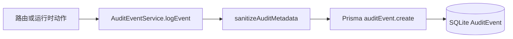

# 本地优先审计事件

## 1. 目标与范围

Cosmosh 将安全核心操作记录为本地优先审计流，帮助运维在不依赖外部服务的前提下追溯敏感操作。

当前范围覆盖高价值运行时事件：

- SSH 连接生命周期（`ssh-session`）
- 主机指纹信任动作（`ssh-host-trust`）
- SSH 服务器与钥匙链实体变更（`ssh-server`、`ssh-keychain`）
- SSH 端口转发规则与运行时动作（`port-forward`）
- 设置项变更事件（`settings`）

兼容性说明：

- 现有 `SshLoginAudit` 仍保留，用于 SSH 最近使用排序与兼容旧流程。
- 新增 `AuditEvent` 作为跨领域安全审计的主日志来源。

## 2. 数据模型

审计持久化定义在后端 Prisma schema：

- `AuditEvent`：不可变事件记录，具备按时间查询的索引
- `AuditSyncCursor`：为未来远端同步预留的本地游标状态

`AuditEvent` 核心字段：

- 事件标识：`eventId`、`occurredAt`、`createdAt`
- 语义字段：`category`、`action`、`outcome`、`severity`
- 作用域：`scopeAccountId`、`scopeDeviceId`
- 关联字段：`entityType`、`entityId`、`sessionId`、`requestId`、`correlationId`、`relatedRecordId`
- 元数据：`metadataJson`
- 保留策略：`retentionUntilAt`

## 3. 写入链路与失败模型

`AuditEventService.logEvent(...)` 是后端统一写入入口。

写入行为约束：

- **先脱敏**：`password`、`token`、`privateKey`、`passphrase`、`secret` 等键会被占位符替换。
- **大小上限**：metadata JSON 会截断到固定上限（默认 8 KB），避免异常膨胀。
- **尽力而为**：写入失败只在后端记录日志，不会中断上层请求或会话动作。
- **保留清理**：服务会周期性清理过期记录（默认保留 180 天，每 6 小时清理一次）。

## 4. 查询契约

审计 API 由后端路由和 API 契约统一暴露：

- `GET /api/v1/audit/events`
  - 过滤：category、action、outcome、severity、entityType、entityId、sessionId、requestId、keyword、时间范围
  - 分页：`page`、`pageSize`
- `GET /api/v1/audit/events/{eventId}`
  - 返回完整事件记录及解析后的 metadata

标准结果码：

- `AUDIT_EVENT_LIST_OK`
- `AUDIT_EVENT_DETAIL_OK`
- `AUDIT_VALIDATION_FAILED`
- `AUDIT_EVENT_NOT_FOUND`

## 5. Electron 桥接与渲染层接入

Main/preload/renderer 链路暴露两个通道：

- `backend:audit-list-events`
- `backend:audit-get-event-by-id`

渲染层接入点：

- `AuditLogs` 页面（`packages/renderer/src/pages/AuditLogs.tsx`）
- 页签路由 id：`audit-logs`
- Header 快捷入口可直接打开审计页签

页面布局采用高信息密度三栏：

- 左侧：筛选条件
- 中间：分页事件列表
- 右侧：选中事件详情与格式化 metadata

## 6. 安全与隐私约束

- 审计 metadata 不持久化原始密码/私钥等敏感值。
- 保留 `requestId`、`sessionId`、`relatedRecordId` 等关联字段，支持取证追踪但不暴露密钥内容。
- 审计存储默认本地优先；同步游标模型已预留，支持后续可选同步能力扩展。
