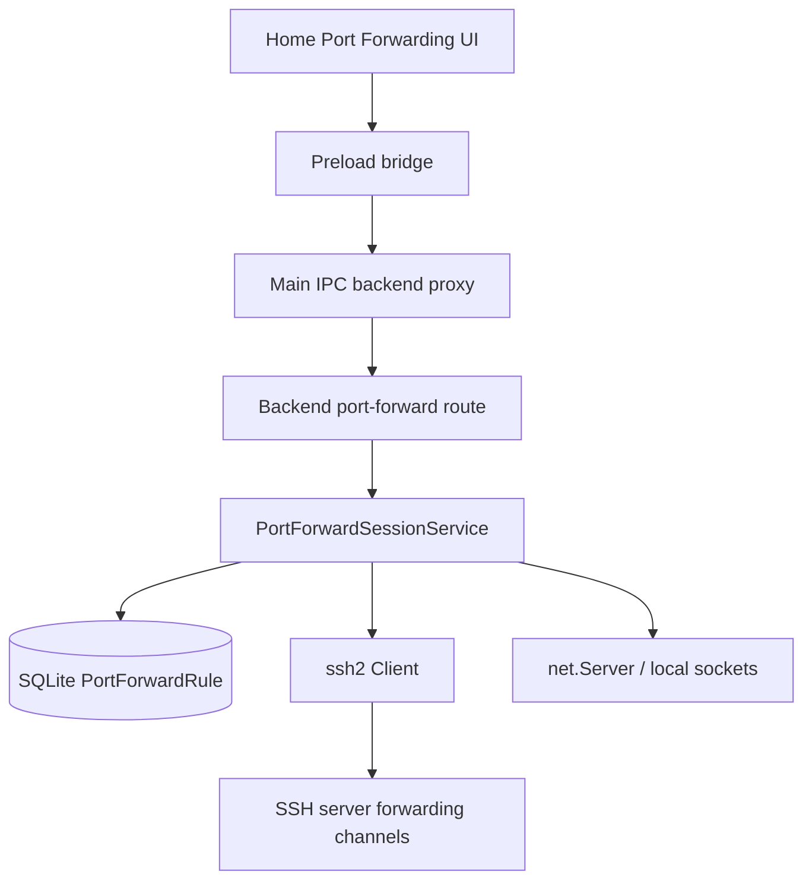

# SSH 端口转发

## 1. 目标与范围

Cosmosh 在 Home -> Port Forwarding 中支持手动 SSH 端口转发：

- 本地转发，等价于 `ssh -L`。
- 远端转发，等价于 `ssh -R`。
- 动态 SOCKS5 转发，等价于 `ssh -D`。

规则会持久化到 SQLite，但运行状态只保存在 backend 内存中。App/backend 重启后，所有规则都会显示为已停止，需要用户手动再次启动。

## 2. 数据模型

backend Prisma schema 通过 `PortForwardRule` 持久化规则元数据。

核心字段：

- 身份与归属：`id`、`name`、`serverId`、`type`。
- 本地监听字段：`localBindHost`、`localBindPort`。
- 远端监听字段：`remoteBindHost`、`remoteBindPort`。
- 目标字段：`targetHost`、`targetPort`。
- 操作员元数据：`note`、`createdAt`、`updatedAt`。
- 最近运行标记：`lastStartedAt`、`lastStoppedAt`、`lastFailureMessage`。

运行状态不持久化。API 列表响应会将持久化规则与 backend `PortForwardSessionService` 的内存注册表合并，并返回 `runtime.status`、`activeConnectionCount`、可选绑定端点、启动时间和最近运行错误。

## 3. API 与 IPC 契约

契约来源是 `packages/api-contract/openapi/cosmosh.openapi.yaml`。

HTTP 路由：

- `GET /api/v1/port-forwards/rules`
- `POST /api/v1/port-forwards/rules`
- `PUT /api/v1/port-forwards/rules/{ruleId}`
- `DELETE /api/v1/port-forwards/rules/{ruleId}`
- `POST /api/v1/port-forwards/rules/{ruleId}/start`
- `POST /api/v1/port-forwards/rules/{ruleId}/stop`

Electron bridge channel 通过 Main 的 backend 代理映射这些路由：

- `backend:port-forward-list-rules`
- `backend:port-forward-create-rule`
- `backend:port-forward-update-rule`
- `backend:port-forward-start-rule`
- `backend:port-forward-stop-rule`
- `backend:port-forward-delete-rule`

Start 可能返回共享的 `SSH_HOST_UNTRUSTED` 结构。renderer 必须弹出主机指纹信任确认，用户接受后调用 `backend:ssh-trust-fingerprint`，再重试 start。

## 4. 运行时架构

`PortForwardSessionService` 拥有所有活动 socket、SSH client、channel 与远端转发监听。backend 关闭时会调用 `stop()`，并关闭每一个活动运行时条目。

SSH 意外 close/error 的清理采用 best-effort 语义：先移除运行时资源；若最终 stopped/error 元数据持久化失败，只记录错误，不得形成导致 backend 退出的未处理 rejection。

显式 stop 会先移除运行时注册表条目，再关闭 SSH/listener 资源，因此 transport close 事件无法重新进入意外断线路径并对同一规则执行两次释放。

转发实现：

- 本地转发：backend 打开 `net.Server`；每个进入的本地 socket 通过 `ssh2.Client.forwardOut(...)` 从 SSH server 侧连接到 `targetHost:targetPort`。
- 远端转发：backend 调用 `client.forwardIn(remoteBindHost, remoteBindPort)`；每个 SSH `tcp connection` channel 被 accept 后，由 backend 本机连接到 `targetHost:targetPort`。
- 动态转发：backend 打开本地 `net.Server`，解析 SOCKS5 no-auth TCP CONNECT，再通过 `forwardOut(...)` 连接请求中的 host/port。

## 5. 校验与安全边界

校验规则：

- `type` 必须是 `local`、`remote` 或 `dynamic`。
- 端口必须是 `1..65535` 的整数；v1 不接受临时端口 `0`。
- host 字段必须非空，且不超过 255 字符。
- name 必填，且不超过 120 字符。
- note 可选，且不超过 3000 字符。
- 活动规则不可编辑或删除；必须先停止。

运行时约束：

- 每个 rule id 的启动流程保持互斥。SSH/listener 建立期间该规则也视为 active，避免重复 start、update、delete 请求创建或遗留重叠运行时。
- 默认本地监听地址是 `127.0.0.1`。
- 允许高级用户显式绑定非 localhost 本地地址，但 renderer UI 必须显示明确风险提示。
- 每条活动规则最多 64 个并发连接。
- 单次连接建立超时为 15 秒。
- SOCKS5 支持 no-auth TCP CONNECT，目标可以是 IPv4、IPv6 或域名。不支持 UDP ASSOCIATE、BIND 和认证。

## 6. 认证与主机信任

端口转发通过 `packages/backend/src/ssh/connect.ts` 中的共享连接 helper 打开 SSH client。

该 helper 集中处理：

- server -> keychain 凭据解析，
- 凭据解密，
- strict host key 策略，
- 服务器作用域的 SSH 传输压缩协商，
- SHA256 known-host 校验，
- 标准化主机信任失败结构。

Shell、SFTP 与端口转发必须保持这套行为一致。不要在 port-forward 领域重复实现 SSH 认证逻辑。

## 7. 审计事件

端口转发会以 `port-forward` 分类写入本地优先审计事件，覆盖 create、update、delete、start、stop，以及启动失败/主机信任失败路径。

metadata 包含规则名称、类型、服务器 id、监听端点与目标端点。规则元数据不包含密钥值，并且仍会经过审计脱敏器。

## 8. UI 集成

renderer 归属文件是 `packages/renderer/src/pages/Home.tsx`。

Home -> Port Forwarding：

- 保留搜索、当前模式独立的排序/分组控件，以及单一 New Rule 操作。
- Home 的排序/分组偏好与 SSH、钥匙链两个 Home 模式相互独立保存。
- 使用高密度表格展示 status、type、server、bind endpoint、target endpoint、activity 与 actions。
- 支持不分组、按状态分组、按转发类型分组的表格视图；状态分组使用 running/stopped 运行时状态。
- 提供 New/Edit dialog、Start/Stop、Copy Endpoint、Delete，以及 host trust retry 流程。

运行状态应根据 start/stop 响应更新，并在 Home 重新加载时从列表接口刷新。backend 重启后所有行有意回到 stopped。
