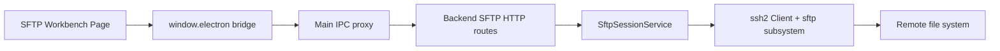
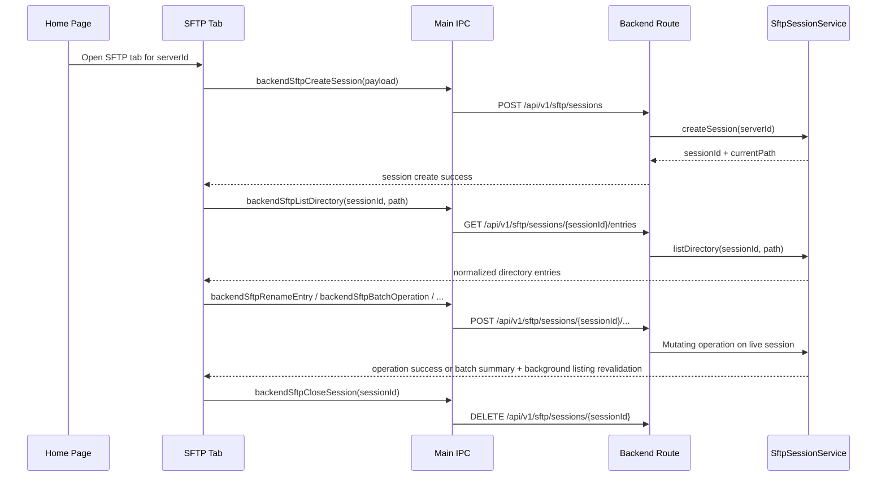

# SFTP 文件系统

## 1. 当前状态

Cosmosh 已实现基于标签页作用域的 SFTP 文件系统工作台。

v1 已实现：

- Home 服务器右键菜单与文件动作可以打开 SFTP 标签页。
- 每个 SFTP 标签页创建一个 backend SFTP 会话，并拥有该会话生命周期。
- 目录列表支持路径跳转、前进/后退历史、返回上级、刷新、当前目录过滤、loading、empty、会话过期与操作失败状态。
- Renderer 展示目录项、元数据详情与有上限的 UTF-8 文件预览。
- 左侧目录树展示当前目录的父级链路，并在用户浏览时缓存已加载的子目录，还提供目录作用域的右键操作：打开、在新标签页打开、刷新、粘贴、新建文件与新建文件夹。
- 中间列表右键菜单与顶部操作栏提供打开、文件夹新标签打开、剪切、复制、粘贴、删除、新建文件、新建文件夹与行内重命名。目录列表支持 `Ctrl`/`Cmd` 切换多选与 `Shift` 范围选择。
- SFTP 设置控制删除确认的触发范围，以及中间文件列表是否显示开头的 `..` 父目录行。
- Backend 写操作支持空文件创建、目录创建、重命名/移动、递归复制与递归删除。

v1 明确不包含：

- 上传、下载、chmod、拖放、全局搜索、文件编辑与传输队列。
- 复用当前 SSH terminal 会话。SFTP 标签页会建立独立的 SSH + SFTP 连接。
- 持久化 SFTP history 或新增数据库表。

## 2. 运行时架构

### 模块归属

- **API contract**：`packages/api-contract/openapi/cosmosh.openapi.yaml` 定义 SFTP path、schema、成功码与错误码。
- **Backend**：`packages/backend/src/http/routes/sftp.ts` 负责 HTTP 输入校验与 API envelope 映射。`packages/backend/src/sftp/session-service.ts` 负责 SSH/SFTP 连接、会话注册表、目录路径归一化、条目映射与资源释放。
- **Main/preload**：`packages/main/src/ipc/register-backend-ipc.ts` 将 SFTP 请求代理到 backend route。`packages/main/src/preload.ts` 暴露最小 renderer bridge。
- **Renderer**：`packages/renderer/src/pages/SFTP.tsx` 负责标签页作用域 UI 状态、文件操作、行内重命名/新建状态与预览状态。
- **Settings registry**：`packages/api-contract/src/settings-registry.ts` 负责 renderer settings store 消费的 SFTP 删除确认与父目录行偏好。

## 3. API 契约

所有调用端必须使用 `@cosmosh/api-contract` 生成导出，尤其是 `API_PATHS` 与生成的请求/响应 payload 类型。

| Method | Path | Purpose |
|---|---|---|
| `POST` | `/api/v1/sftp/sessions` | 为一个 SSH server 创建 SFTP 文件系统会话。 |
| `GET` | `/api/v1/sftp/sessions/{sessionId}/entries?path=...` | 为活动 SFTP 会话列出一个远程目录。 |
| `GET` | `/api/v1/sftp/sessions/{sessionId}/file?path=...&maxBytes=...` | 为一个远程文件读取有上限的 UTF-8 预览。 |
| `POST` | `/api/v1/sftp/sessions/{sessionId}/files` | 创建一个远程空文件。 |
| `POST` | `/api/v1/sftp/sessions/{sessionId}/directories` | 创建一个远程目录。 |
| `POST` | `/api/v1/sftp/sessions/{sessionId}/rename` | 重命名或移动一个远程条目。 |
| `POST` | `/api/v1/sftp/sessions/{sessionId}/copy` | 复制一个远程文件或目录树。 |
| `POST` | `/api/v1/sftp/sessions/{sessionId}/entries/delete` | 删除一个远程文件、符号链接或目录树。 |
| `POST` | `/api/v1/sftp/sessions/{sessionId}/batch` | 对多个远程条目执行一次有序批量复制、移动或删除操作。 |
| `DELETE` | `/api/v1/sftp/sessions/{sessionId}` | 关闭 SFTP 会话并释放 SSH 连接。 |

成功码：

- `SFTP_SESSION_CREATE_OK`
- `SFTP_DIRECTORY_LIST_OK`
- `SFTP_FILE_READ_OK`
- `SFTP_OPERATION_OK`

SFTP 专属错误码：

- `SFTP_SESSION_NOT_FOUND`
- `SFTP_VALIDATION_FAILED`
- `SFTP_OPERATION_FAILED`

Host fingerprint 信任失败复用 SSH 的 host-trust envelope 与错误码，因为 SFTP 使用同一套 SSH 传输安全模型。

## 4. 会话生命周期

生命周期规则：

- 普通 Home 右键菜单动作会在同一服务器已有 SFTP 标签页时复用该标签页。
- 显式新标签动作会创建新的 SFTP 标签页，因此也会创建独立 backend SFTP 会话。
- 隐藏的 SFTP 标签页保持挂载，并继续持有会话。
- 关闭标签页或变更连接意图时，会尽力关闭旧 SFTP 会话。
- Backend 关闭时会关闭所有已注册的 SFTP 会话。

## 5. 目录列表与文件操作

Backend 始终将 SFTP 路径视为 POSIX 路径，不受运行 Cosmosh 的宿主 OS 影响。

目录列表步骤：

1. 归一化请求路径。
2. 使用 `realpath` 解析路径。
3. 对解析后的目录执行 `readdir`。
4. 将每个条目映射为 `{ name, path, type, size, mode, permissions, modifiedAt }`。
5. 目录优先排序，再按名称进行支持数字感知的 locale 排序。

条目类型收敛为：

- `directory`
- `file`
- `symlink`
- `other`

Renderer 当前显示名称、大小、修改时间与 mode 列。目录面板只支持过滤当前目录条目，不是远端递归搜索。详情面板在单选时展示已选条目的元数据，多选时展示已选择数量，并在打开普通文件后切换为有上限的预览。启用 `sftpShowParentDirectoryEntry` 且 backend 返回父路径时，中间列表会在真实条目前添加一个不可选择的 `..` 行，用于返回上一级目录且不改变 backend 数据。

目录结果会在 SFTP 标签页生命周期内缓存在 renderer 内存中。再次访问已加载路径会立即使用缓存结果；刷新动作会绕过缓存，并从当前 backend 会话重新请求目录列表，同时在新结果返回前保留当前可见列表。

写操作规则：

- 所有写请求都作用于当前活动 SFTP 会话，并使用 POSIX 风格路径。
- 创建空文件使用独占写语义，不覆盖已有远程文件。
- 目录复制是递归操作。当请求的目标已存在时，backend 会选择 `copy`、`copy 2` 等后缀。
- 不允许将目录复制到自身或其子目录中。
- 删除使用 `lstat`，因此符号链接会作为链接本身删除，而不会跟随到目标。
- Renderer 请求删除目录时使用递归删除。
- 删除确认是 renderer 侧安全门，由 `sftpDeleteConfirmationMode` 控制：`always` 每次删除前确认，`batch` 仅在删除多个已选条目时确认，`shortcut` 仅在键盘快捷键触发删除时确认，`off` 直接调用 backend 删除流程。
- 多条目剪切、复制、删除与粘贴会对当前 SFTP 会话发起一次 backend 批量 API 请求。Service 按顺序执行条目，遇到第一个失败后停止，返回每个条目的 `success`/`failed`/`skipped` 结果，且不会回滚已经完成的条目。重命名、打开、新标签打开与预览仍是单条目动作。
- 操作成功后会使当前目录缓存失效，并在后台重新校验可见列表；在服务器结果返回前保留当前列表、过滤条件与选择状态。
- 文件预览按请求的字节上限读取，并返回结果是否被截断。

## 6. 安全与错误模型

SFTP 使用与 SSH 相同的服务器、钥匙链、凭据解密与 host fingerprint 信任模型：

- 凭据在 backend 进程中通过 `SshServer` -> `SshKeychain` 解析。
- 解密后的 secret 不会跨到 renderer 或 preload。
- Main 注入内部 backend 鉴权 token 与 locale header。
- 未知或不受信任的 host fingerprint 通过与 SSH 相同的确认流程返回。

错误映射：

- 缺失或非法请求数据 -> `SFTP_VALIDATION_FAILED`。
- 缺失 session id 或会话已关闭 -> `SFTP_SESSION_NOT_FOUND`。
- 连接失败、权限不足、路径不可读、复制/删除/重命名失败与远端 SFTP 错误 -> `SFTP_OPERATION_FAILED`。
- 未知 host fingerprint -> `SSH_HOST_UNTRUSTED`，并携带 fingerprint 确认数据。

安全约束：

- Renderer 与 preload 永远不会接收解密后的 SSH 凭据。
- SFTP 路径通过结构化 API payload 传递，不通过 shell 命令执行。
- Backend 会拒绝空的可变目标，以及用于写操作的根目录/当前目录标记。
- 文件预览带字节上限，避免无界内存读取。

## 7. Renderer UX 契约

SFTP 页面遵循 Cosmosh workbench 布局规则：

- 使用三个高密度圆角工作台卡片：左侧目录树、中间目录列表、右侧详情/预览。
- 目录树面板保持窄而任务导向，目前对齐 Cosmosh 250 px 侧栏节奏。
- 使用内部 UI wrappers（`Button`、`Tooltip`、`Dialog`）与 tokenized classes。
- SFTP 标签页使用文件夹图标；启用共享的 SSH/SFTP 服务器视觉标签页设置时，继承对应服务器的颜色背景。
- 顶部工具栏保持紧凑，并按路径控制、远程路径输入、文件操作按钮与当前目录过滤的顺序排列。
- 工具栏分割线使用 `MenubarSeparator`，确保分割线尺寸与颜色跟随共享菜单 token。
- 中间列表右键菜单与工具栏暴露文件操作；不可用操作必须禁用。
- 通过左侧目录树右键菜单暴露树节点操作。这些操作以被点击的目录为作用域，不得继承中间列表的多选状态。
- 目录列表行选择对齐桌面文件管理器习惯：普通点击替换选择，`Ctrl`/`Cmd` 切换单行，`Shift` 从当前锚点选择可见范围。对已选行打开右键菜单时保留现有多选。
- 左侧目录树与中间文件列表使用 roving focus：`Tab` 只进入每个列表一次，随后通过 `ArrowUp`/`ArrowDown` 在行之间移动。文件列表中，方向键导航会选中当前聚焦的文件行；可选的 `..` 父目录行仅用于激活跳转，不参与选择。
- 避免工具栏 overflow 菜单与右键菜单之间出现重复项。行右键菜单聚焦已选条目，空白区域右键菜单聚焦粘贴/新建动作，树右键菜单聚焦被点击的目录，工具栏 overflow 菜单只放没有独立工具栏按钮的动作。
- 行内重命名与新建 input 保持在同一行网格中，不改变图标或文字 baseline 位置。
- 快捷键标签遵循平台习惯：macOS 使用 `Cmd`，Windows/Linux 使用 `Ctrl`/`Delete`。右键菜单与工具栏 overflow 菜单必须为已有键盘处理的动作显示一致的快捷键标签。
- 删除确认使用共享 `Dialog` wrapper，必须在用户确认或取消前保留待执行操作。键盘触发删除时会传入明确的 shortcut 来源，让确认设置区分仅快捷键安全提示与工具栏/右键菜单删除。
- 可选 `..` 父目录行只属于中间文件列表。它必须渲染在真实条目前，不参与选择与详情状态，像普通文件行一样使用双击/Enter 激活，并在远端根目录没有父路径时显示为禁用状态。
- 目录树展示当前目录和所有父级目录；展开目录行会加载其子目录列表，加载期间显示行内 spinner。
- 对齐文件管理器行为：展开或收起目录树节点不会切换中间目录列表。通过中间列表打开目录或在路径工具栏跳转时，才会改变当前目录。
- 保持稳定列表列宽，长名称/路径截断，避免布局抖动。

## 8. 后续范围

后续 SFTP 能力应单独规划。可能的下一阶段：

1. 带进度与取消的流式下载/上传。
2. chmod 与更完整的权限编辑。
3. 面向长时间复制/上传/下载的传输队列与冲突处理。
4. 带保存/写回语义的完整文件编辑器集成。
5. 在 SSH terminal 与 SFTP 会话模型能安全共享状态后，再考虑 terminal path handoff。
