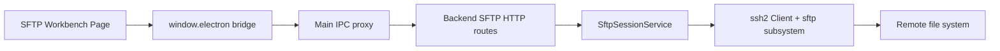
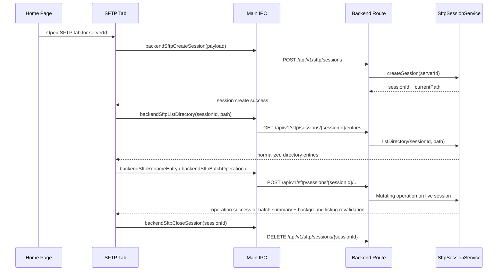

# SFTP 文件系统

## 1. 当前状态

Cosmosh 已实现基于标签页作用域的 SFTP 文件系统工作台。

v1 已实现：

- Home 服务器右键菜单与文件动作可以打开 SFTP 标签页。
- 每个 SFTP 标签页创建一个 backend SFTP 会话，并拥有该会话生命周期。
- 目录列表支持面包屑路径跳转、可回退到文本输入的地址编辑、持久化文本地址显示模式、前进/后退历史、返回上级、刷新、当前目录过滤、可配置元数据列、表头排序、表头拖拽重排、loading、empty、会话过期与操作失败状态。
- Renderer 展示目录项、元数据详情、可编辑文本/代码预览、图片预览与独立属性窗口。双击普通文件会将其下载到 Cosmosh 受控的 SFTP 临时目录，并使用系统默认应用打开。
- 已打开的普通文件会从 Cosmosh 受控的 SFTP 临时目录被监听。本地临时文件变化后，renderer 会询问是否将更改上传回远程文件；如果远程文件 size 或修改时间已经不同于打开时版本，则会在重试前询问用户是否显式覆盖。
- 预览模式遵循类似 Windows 资源管理器的辅助侧栏。文本/代码预览使用 Monaco，并可通过 SFTP 保存 UTF-8 更改；图片预览通过同一套受控临时文件下载路径落地。较大的文本与图片预览在打开前需要用户显式确认，阈值由设置项控制。
- 左侧目录树展示当前目录的父级链路，并在用户浏览时缓存已加载的子目录；目录导航后，只有已挂载的上级/当前/已展开下级目录上下文不在树视口内时，才会自动将当前目录行滚动到树视口上方约三分之一的位置；还提供目录作用域的右键操作：打开、在新标签页打开、刷新、粘贴、新建文件与新建文件夹。
- 中间列表右键菜单与顶部操作栏提供打开、文件夹新标签打开、属性、在此处打开 SSH、复制地址、复制相对地址、保存普通文件到本地、支持平台上的打开方式、剪切、复制、粘贴、删除、新建文件、新建文件夹与行内重命名。目录列表支持鼠标和键盘通过 `Ctrl`/`Cmd` 切换多选、`Ctrl`/`Cmd+A` 全选与 `Shift` 范围选择。
- 工具栏、目录空白区域菜单与树目录菜单可以将一个或多个本地普通文件上传到所选远程目录。Main 会把原生选择器选中的文件暂存到受控 SFTP 临时根目录；上传通过标签页本地任务队列顺序执行，远程存在同名文件时必须显式确认覆盖。
- Renderer 管理的文件操作会按 SFTP 标签页进入本地队列，并在紧凑的工具栏任务菜单中展示排队、运行、成功、失败与进度状态。
- SFTP 设置控制重连模式、删除确认的触发范围、文件列表列/排序视图状态、中间文件列表是否显示开头的 `..` 父目录行、地址栏是否始终以文本形式显示、辅助侧栏模式，以及文本/图片预览警告阈值。
- Backend 写操作支持本地文件上传、空文件创建、目录创建、重命名/移动、递归复制与递归删除。

v1 明确不包含：

- 目录上传/下载、chmod、拖放、全局搜索，以及带字节级进度与取消的 backend 级传输队列。
- 复用当前 SSH terminal 会话。SFTP 标签页会建立独立的 SSH + SFTP 连接。
- 持久化 SFTP history 或新增数据库表。

## 2. 运行时架构

### 模块归属

- **API contract**：`packages/api-contract/openapi/cosmosh.openapi.yaml` 定义 SFTP path、schema、成功码与错误码。
- **Backend**：`packages/backend/src/http/routes/sftp.ts` 负责 HTTP 输入校验与 API envelope 映射。`packages/backend/src/sftp/session-service.ts` 负责 SSH/SFTP 连接、会话注册表、目录路径归一化、条目映射与资源释放。
- **Main/preload**：`packages/main/src/ipc/register-backend-ipc.ts` 将 SFTP 请求代理到 backend route。`packages/main/src/ipc/register-app-utility-ipc.ts` 负责原生保存/打开辅助能力、校验 Cosmosh SFTP 临时路径，并启动平台级打开方式行为。`packages/main/src/preload.ts` 暴露最小 renderer bridge。
- **Renderer**：`packages/renderer/src/pages/SFTP.tsx` 负责标签页作用域 UI 状态、文件操作、行内重命名/新建状态与预览状态。
- **Settings registry**：`packages/api-contract/src/settings-registry.ts` 负责 renderer settings store 消费的 SFTP 重连、删除确认、目录列表视图、父目录行、隐藏条目、地址显示、辅助侧栏与预览阈值偏好。

## 3. API 契约

所有调用端必须使用 `@cosmosh/api-contract` 生成导出，尤其是 `API_PATHS` 与生成的请求/响应 payload 类型。

| Method | Path | Purpose |
|---|---|---|
| `POST` | `/api/v1/sftp/sessions` | 为一个 SSH server 创建 SFTP 文件系统会话。 |
| `GET` | `/api/v1/sftp/sessions/{sessionId}/entries?path=...` | 为活动 SFTP 会话列出一个远程目录。 |
| `POST` | `/api/v1/sftp/sessions/{sessionId}/entries/details` | 获取已选远程条目的非递归元数据，包括 `lstat` 字段和符号链接目标元数据。 |
| `GET` | `/api/v1/sftp/sessions/{sessionId}/file?path=...&maxBytes=...` | 为一个远程文件读取有上限的 UTF-8 预览。 |
| `POST` | `/api/v1/sftp/sessions/{sessionId}/file` | 经过 size/mtime 冲突检查后，将可编辑 UTF-8 预览内容保存回一个远程普通文件。 |
| `POST` | `/api/v1/sftp/sessions/{sessionId}/download` | 将一个远程普通文件流式保存到 main/preload 选定的本地目标。 |
| `POST` | `/api/v1/sftp/sessions/{sessionId}/upload` | 将一个受控本地临时文件流式写入新的远程路径，或在快照/显式覆盖确认后替换既有普通文件。 |
| `POST` | `/api/v1/sftp/sessions/{sessionId}/files` | 创建一个远程空文件。 |
| `POST` | `/api/v1/sftp/sessions/{sessionId}/directories` | 创建一个远程目录。 |
| `POST` | `/api/v1/sftp/sessions/{sessionId}/rename` | 重命名或移动一个远程条目。 |
| `POST` | `/api/v1/sftp/sessions/{sessionId}/copy` | 复制一个远程文件或目录树。 |
| `POST` | `/api/v1/sftp/sessions/{sessionId}/entries/delete` | 删除一个远程文件、符号链接或目录树。 |
| `POST` | `/api/v1/sftp/sessions/{sessionId}/batch` | 对多个远程条目执行一次有序批量复制、移动或删除操作。 |
| `DELETE` | `/api/v1/sftp/sessions/{sessionId}` | 关闭 SFTP 会话并释放 SSH 连接。 |

成功码：

- `SFTP_SESSION_CREATE_OK`
- `SFTP_DIRECTORY_LIST_OK`
- `SFTP_ENTRY_DETAILS_OK`
- `SFTP_FILE_READ_OK`
- `SFTP_OPERATION_OK`

SFTP 专属错误码：

- `SFTP_SESSION_NOT_FOUND`
- `SFTP_VALIDATION_FAILED`
- `SFTP_OPERATION_FAILED`
- `SFTP_UPLOAD_CONFLICT`

Host fingerprint 信任失败复用 SSH 的 host-trust envelope 与错误码，因为 SFTP 使用同一套 SSH 传输安全模型。

## 4. 会话生命周期

生命周期规则：

- 普通 Home 右键菜单动作会在同一服务器已有 SFTP 标签页时复用该标签页。
- SSH Orbit Bar 与终端右键菜单交接过来的目录始终会用选中的目录路径创建新的 SFTP 标签页，即使同一服务器已经存在其他 SFTP 标签页。
- 显式新标签动作会创建新的 SFTP 标签页，因此也会创建独立 backend SFTP 会话。
- 隐藏的 SFTP 标签页保持挂载，并继续持有会话。
- 关闭标签页或变更连接意图时，会尽力关闭旧 SFTP 会话。
- `SftpSessionService` 会监听底层 `ssh2` client 与 SFTP stream 的 `close`、`end` 和 `error`。一旦任一传输不可用，会话会从注册表中移除，使后续请求快速返回 `SFTP_SESSION_NOT_FOUND`，避免卡在已断开的 socket 后面。
- `sftpReconnectMode` 默认值为 `passive`。被动模式下，renderer SFTP 请求收到 `SFTP_SESSION_NOT_FOUND` 后，会创建一个替代会话、更新标签页 `sessionId`，并对原请求重试一次。
- `active` 当前作为用户可选设置落地：当页面已经知道当前会话过期时，使用同一套重连流程。它不会新增 backend 推送事件或轮询。
- `off` 会禁用 renderer 重试。Backend 仍会移除已关闭会话，因此操作会快速以 session-not-found 信息失败，而不是保持 pending。
- Backend 关闭时会关闭所有已注册的 SFTP 会话。

## 5. 目录列表与文件操作

Backend 始终将 SFTP 路径视为 POSIX 路径，不受运行 Cosmosh 的宿主 OS 影响。

SSH 到 SFTP 的交接只接受显式远程目录选区：绝对路径、home 相对路径、点相对路径，以及 `file://` URL。Renderer 会在作为结构化 `initialPath` 传递前去掉简单包裹引号和末尾标点；它不会执行 shell 命令，也不会为裸相对名称推断终端当前工作目录。

目录列表步骤：

1. 归一化请求路径。
2. 使用 `realpath` 解析路径。
3. 对解析后的目录执行 `readdir`。
4. 通过共享的 SFTP 元数据 mapper 映射每个条目。目录列表响应包含低成本、非递归字段：`name`、`path`、`parentPath`、`type`、`size`、`mode`、`permissions`、`permissionOctal`、`uid`、`gid`、`modifiedAt`、`accessedAt`、`extension`、`shellEscapedPath`、`isHidden`，以及可选的 `longname`。
5. 在 renderer 内存中保存目录结果，并用目录优先、随后按 `sftpDirectoryListView.sort` 字段与方向派生可见顺序。名称回退排序使用支持数字感知的 locale 比较。

条目类型收敛为：

- `directory`
- `file`
- `symlink`
- `other`

当服务器提供的 SFTP extended attribute 包含可识别的隐藏标记，或条目名称以`.`开头且不是`.`/`..`时，backend 会设置 `isHidden`。Renderer 会在内存中保留完整目录结果，并只在可见界面上应用隐藏条目偏好。

中间列表使用 `sftpDirectoryListView` 提供可配置列，该设置是通过共享 settings registry 保存的内部 JSON 设置。支持的列有意限定在目录列表响应已经返回的字段内：`name`、`modifiedAt`、`type`、`size`、`accessedAt`、`permissions`、`permissionOctal`、`mode`、`uid`、`gid`、`extension`、`isHidden`、`path`、`parentPath`、`shellEscapedPath` 与 `longname`。显示这些列不会增加逐条 `lstat`、`readlink`、`stat`、递归大小计算或符号链接目标调用。属性窗口仍是更丰富逐条检查的入口，因为它使用 details 端点，只会为已选条目付出额外调用成本。

列显示、列顺序与排序可通过目录表头右键菜单和工具栏 overflow 菜单调整。点击表头会按该列排序；如果该列已经是当前排序列，则切换递增/递减。拖动可见表头会更新持久化列顺序。每个受支持排序字段都会保持目录在非目录之前。

目录面板只支持过滤当前目录条目，不是远端递归搜索。`sftpShowHiddenEntries` 默认值为 `true`，控制隐藏文件与文件夹是否出现在中间列表、左侧目录树和面包屑目录菜单中。`sftpDimHiddenEntries` 也默认开启；隐藏条目可见时，只对条目图标和名称应用 80% 透明度，不改变行选择、元数据列、hover 状态与右键菜单。顶部工具栏 overflow 菜单包含`显示隐藏文件`复选项；行、空白区域和树节点右键菜单不暴露该偏好。详情面板在单选时展示已选条目的元数据，多选时展示已选择数量。行右键菜单的`属性`动作会打开独立的同源 renderer 弹窗，通过现有详情端点拉取所选条目，并以接近 Windows/macOS 的属性页形式展示常规、权限与符号链接分区，同时包含条目的隐藏状态。多条目属性会显示共通值、混合标记、共同父目录、类型数量、元数据失败数量、隐藏状态一致性与总大小。Raw metadata 不再展示在详情侧边栏；属性窗口可在条目标题区触发有意的七连击后显示所选条目的 details payload。Electron 弹窗使用当前 preload 支持的 SFTP 会话；网页弹窗在 web SFTP runtime 支持前显示明确的未支持提示。启用 `sftpShowParentDirectoryEntry` 且 backend 返回父路径时，中间列表会在真实条目前添加一个不可选择的 `..` 行，用于返回上一级目录且不改变 backend 数据。

辅助侧栏由 `sftpAuxiliarySidebarMode` 控制，可取 `details`、`preview` 或 `off`。详细信息模式是既有元数据侧栏。预览模式只在单选普通文件且文件类型受支持时渲染：文本/代码扩展名通过 Monaco 打开并允许编辑，图片扩展名显示图片预览，不支持的条目显示`没有预览`。多选与空选不会发起预览读取或下载。

目录结果会在 SFTP 标签页生命周期内缓存在 renderer 内存中。再次访问已加载路径会立即使用缓存结果；刷新动作会绕过缓存，并从当前 backend 会话重新请求目录列表，同时在新结果返回前保留当前可见列表。

条目详情使用与目录列表相同的元数据 mapper，并只额外添加需要逐条调用才能得到的字段。Backend 会对每个已选路径执行 `lstat`，因此符号链接会按链接自身描述。对于符号链接，backend 还会执行 `readlink`，将相对目标按链接父目录解析，并尝试对目标执行 `stat`。目标状态会报告为 `exists`、`broken`、`permission-denied` 或 `unknown`；只有目标存在且可读时才包含目标 stats。目录列表和详情请求都不会递归计算目录大小。

写操作规则：

- 所有写请求都作用于当前活动 SFTP 会话，并使用 POSIX 风格路径。
- 创建空文件使用独占写语义，不覆盖已有远程文件。
- 目录复制是递归操作。当请求的目标已存在时，backend 会选择 `copy`、`copy 2` 等后缀。
- 不允许将目录复制到自身或其子目录中。
- 删除使用 `lstat`，因此符号链接会作为链接本身删除，而不会跟随到目标。
- Renderer 请求删除目录时使用递归删除。
- 删除确认是 renderer 侧安全门，由 `sftpDeleteConfirmationMode` 控制：`always` 每次删除前确认，`batch` 仅在删除多个已选条目时确认，`shortcut` 仅在键盘快捷键触发删除时确认，`off` 直接调用 backend 删除流程。
- Renderer 文件操作会先进入标签页本地 FIFO 任务队列，再调用 backend。队列运行期间仍可继续使用导航、选择、过滤与刷新；工具栏任务菜单会在任务完成后保留一小段可检查时间再移除。
- 本地上传选择由 main 通过原生多文件对话框负责。每个所选普通文件都会先复制到 Cosmosh SFTP 临时根目录下的隔离目录，再把描述信息交给 renderer；本机源路径不会暴露给 backend HTTP，也不会由 renderer 保留。
- 每个上传暂存文件会成为一个 FIFO 上传任务。远程目标不存在时使用独占写语义创建；既有普通文件目标会返回 `SFTP_UPLOAD_CONFLICT`，除非请求携带原始打开快照，或 renderer 在显式确认后使用 `overwrite: true` 重试。
- 上传任务结束后会删除对应暂存文件；连接重置与标签页卸载也会请求尽力清理尚未开始的排队暂存路径。
- 被动重连会作为普通 `重连` 任务展示在同一个任务菜单中。多个 SFTP 操作遇到同一个过期会话时共享一个正在进行的 reconnect promise，随后各自使用新 session id 对原操作重试一次。如果重连成功但原操作仍失败，renderer 会报告该操作失败，并且不会开启第二轮重连循环。
- 重连创建替代会话时优先使用标签页当前路径（`currentPathRef.current`），失败时回退到原始连接意图路径；没有初始路径时回退到 `.`。
- 多条目剪切、复制、删除与粘贴会对当前 SFTP 会话发起一次 backend 批量 API 请求。Service 按顺序执行条目，遇到第一个失败后停止，返回每个条目的 `success`/`failed`/`skipped` 结果，且不会回滚已经完成的条目。重命名、打开、打开方式、本地保存、空文件创建与目录创建仍是单条目任务。新标签打开仍是即时动作，因为它不会修改当前会话。
- 本地保存仍是单条目动作，仅支持普通文件。`保存到“下载”` 会向 main 请求授权系统下载目录下的一个精确文件，`保存到...` 会请求 main 授权原生保存对话框选中的路径。两种能力都绑定 renderer 所有者且只能使用一次；backend 代理会先拒绝 renderer 任意指定的目标，再通过当前 SFTP 会话将远程文件流式写入本地临时文件，成功后替换最终目标。
- 默认文件打开与打开方式也仍是普通文件的单条目动作。Renderer 会先向 main 请求 `app.getPath('temp')/cosmosh-sftp` 下绑定所有者且可复用的唯一路径，复用现有 SFTP 下载端点将文件落地，再要求 main 仅打开该已校验的临时路径。
- 预览读取由 renderer 驱动，且仅支持单条目。文本/代码预览调用有上限的 UTF-8 文件读取端点；超过 `sftpTextPreviewWarningThresholdBytes` 的文件在读取前需要确认，读取大小仍受 backend 最大值限制。图片预览复用临时下载路径，但使用预览专属、经过 size/mtime 校验的缓存，并与 Open/Open With 临时文件分离；超过 `sftpImagePreviewWarningThresholdBytes` 的图片在下载前需要确认，但确认不会绕过下载前检查的图片预览硬大小上限。
- Monaco 预览保存会在同一个标签页本地 FIFO 队列中加入`保存`任务。请求会携带 UTF-8 内容，以及已选文件打开时的 `size` 与 `modifiedAt` 快照到 `POST /api/v1/sftp/sessions/{sessionId}/file`。远程快照不匹配时返回 `SFTP_UPLOAD_CONFLICT`；renderer 会复用覆盖确认弹窗，并且只在用户显式确认后用 `overwrite: true` 重试。
- 未保存的 Monaco 预览编辑会阻止那些会隐藏或替换当前预览的选择切换和工具栏侧栏模式切换。打开另一个 SFTP 连接等硬运行时重置仍会清除标签页内预览状态，因为原远程会话上下文已经不再有效。
- 默认打开或打开方式动作成功后，main 会为该临时文件启动防抖监听，并且只向拥有该监听的 renderer webContents 推送变更事件。Renderer 对每个远程路径只保留一个待处理上传提示，因此编辑器连续保存事件会合并到一次提示，直到用户上传或忽略。
- 用户接受上传提示后，会在同一个标签页本地 FIFO 任务队列中加入`上传`任务。上传请求携带打开远程文件时的 `size` 与 `modifiedAt`；backend 写入前会将这些值与当前远程 `stat` 比较。不一致时，backend 返回 `SFTP_UPLOAD_CONFLICT`，且这次请求不会覆盖远程文件。
- Renderer 收到 `SFTP_UPLOAD_CONFLICT` 后，会让同一个上传任务继续运行，并打开第二个确认弹窗询问是否覆盖远程更改。取消该弹窗会跳过上传；确认后会用 `overwrite: true` 重试同一次上传，显式绕过打开时快照检查，但仍要求远程目标是普通文件、本地路径来自已校验的 Cosmosh 临时文件。
- 上传成功会先写入目标目录中的远程临时文件，再替换原文件。Backend 会优先使用 OpenSSH POSIX rename 扩展；服务器支持时回退到普通 SFTP rename；非覆盖上传只有在再次复检远程 `size`/`modifiedAt` 冲突守卫通过后，才使用 `unlink` + `rename` 兼容路径。显式覆盖上传会跳过该复检，因为用户已经确认冲突。随后 renderer 刷新可见目录，并用上传响应和刷新后的列表更新该监听文件的远程快照。忽略提示只会清除当前待处理变更，不会停止监听，因此后续本地保存仍可再次提示。
- 在 Windows 上，`打开方式...` 是没有二级菜单的普通菜单项，会先通过隐藏 PowerShell 进程调用 shell `openas` verb；已校验的临时文件路径会通过子进程环境变量传入，以避开 PowerShell 参数解析边界问题。如果该 shell verb 被操作系统针对某类文件拒绝，main 会回退到 `rundll32.exe shell32.dll,OpenAs_RunDLL`。在 macOS 上，`打开方式...` 是由 `packages/main/resources/helpers` 中的 NSWorkspace helper 填充的二级菜单；`prebuild` 会在 macOS 上编译 helper 二进制，开发态可回退到 Swift 源码。Linux 不渲染打开方式动作。
- 操作成功后会使当前目录缓存失效，并在后台重新校验可见列表；在服务器结果返回前保留当前列表、过滤条件与选择状态。

## 6. 安全与错误模型

SFTP 使用与 SSH 相同的服务器、钥匙链、凭据解密与 host fingerprint 信任模型：

- 凭据在 backend 进程中通过 `SshServer` -> `SshKeychain` 解析。
- 解密后的 secret 不会跨到 renderer 或 preload。
- Main 注入内部 backend 鉴权 token 与 locale header。
- 未知或不受信任的 host fingerprint 通过与 SSH 相同的确认流程返回。
- SSH 传输压缩遵循服务器持久化的 `enableSshCompression` 标记。该标记默认关闭，仅在服务器记录启用时参与协商。
- 重连会创建正常的新 SFTP 会话，因此复用相同的 host fingerprint 信任确认流程。如果用户拒绝 fingerprint 提示，本次重连任务失败，原操作不会重试。

错误映射：

- 缺失或非法请求数据 -> `SFTP_VALIDATION_FAILED`。
- 缺失 session id、已移除的会话，或已关闭的 SSH/SFTP 传输 -> `SFTP_SESSION_NOT_FOUND`。
- 连接失败、权限不足、路径不可读、复制/删除/重命名失败与远端 SFTP 错误 -> `SFTP_OPERATION_FAILED`。
- 未知 host fingerprint -> `SSH_HOST_UNTRUSTED`，并携带 fingerprint 确认数据。

安全约束：

- Renderer 与 preload 永远不会接收解密后的 SSH 凭据。
- SFTP 路径通过结构化 API payload 传递，不通过 shell 命令执行。
- 本地保存目标由 main/preload 选择或解析，并作为显式路径传给 backend；renderer 不接收文件系统写入能力。
- 本地系统打开动作仅允许 Cosmosh SFTP 临时根目录下的路径。Main 会归一化候选路径，确认其仍位于该根目录内，并在调用 `shell.openPath`、Windows `openas` 或 macOS helper 前检查它是已存在的文件。
- SFTP 临时文件监听使用同一套临时根目录校验，并归属于发起监听的 renderer webContents。标签页运行时重置、renderer 销毁或 renderer 显式停止监听时，watcher 会被关闭。
- 图片预览不会直接加载 `file://` URL。Main/preload 会校验图片路径位于 Cosmosh SFTP 临时根目录内，检查图片扩展名与大小上限，并向 renderer image 元素返回 data URL。
- 文本预览写入只接受 UTF-8 字符串，强制执行 backend 预览写入大小上限，要求远程目标是普通文件，并在通过远程临时文件替换目标前保留既有远程冲突守卫。
- 上传写回只接受通过已校验临时文件流程选定的本地路径；当远程目标不是普通文件时拒绝远程写入。非覆盖写入还会在远程冲突快照不再匹配时拒绝；覆盖写入必须经过 renderer 第二次显式确认，并携带 `overwrite: true`。
- 原生上传选择不会向 renderer 授予任意文件系统读取权限。Main 只会把用户选中的普通文件复制进受控临时根目录，backend 只接受该根目录下的上传文件，cleanup IPC 在删除暂存文件前会校验每个候选路径。
- Backend 会拒绝空的可变目标，以及用于写操作的根目录/当前目录标记。

## 7. Renderer UX 契约

SFTP 页面遵循 Cosmosh workbench 布局规则：

- 使用最多三个高密度圆角工作台卡片：左侧目录树、中间目录列表，以及可选的右侧详情/预览侧栏。
- 目录树面板保持窄而任务导向，目前对齐 Cosmosh 250 px 侧栏节奏。
- 使用内部 UI wrappers（`Button`、`Tooltip`、`Dialog`）与 tokenized classes。
- 工具栏 overflow 菜单拥有`辅助侧栏`子菜单，并以单选项提供`详细信息`、`预览`与`关闭`。该值通过 `sftpAuxiliarySidebarMode` 持久化，因此从工具栏和设置页修改是同一个动作。
- Monaco 文本/代码预览处于活动状态时，工具栏会在任务菜单旁插入撤销、重做与保存编辑器控制。只有预览内容与上次保存的远程快照不一致时，保存才可用。
- SFTP 标签页使用文件夹图标；启用共享的 SSH/SFTP 服务器视觉标签页设置时，继承对应服务器的颜色背景。
- 顶部工具栏保持紧凑，并按路径控制、远程路径地址栏、文件操作按钮与当前目录过滤的顺序排列。
- 地址栏默认使用 Windows 风格的面包屑控件。点击层级文本会跳转到该路径，点击层级箭头会展示该层级下可用的子目录；目录数据优先复用 renderer 目录缓存，不足时通过当前会话按需加载。点击地址栏空白区域会临时恢复到可编辑的纯文本 input。地址栏右键菜单保留`复制地址`与`编辑地址`，并提供`将地址显示为文本`动作来持久化 `sftpShowAddressAsText`。启用该设置后，即使 input 没有焦点，地址栏也始终渲染为纯 input；input 右键菜单提供反向显示动作，让用户无需先离开输入框即可回到层级地址栏。
- 后退与前进工具栏控件使用纯方向箭头图标。左键单步跳转；仅在存在可跳转历史目标时，右键才会打开上下文菜单，并按离当前位置最近优先列出目标，以匹配桌面文件管理器导航习惯。
- 工具栏分割线使用 `MenubarSeparator`，确保分割线尺寸与颜色跟随共享菜单 token。
- 仅当标签页有活动任务或刚完成的任务时显示 SFTP 任务入口。该入口位于地址控件与文件操作按钮之间，使用 `ListTodo`/spinner 图标，并打开右对齐的高密度任务菜单，展示每个任务的状态文本与紧凑进度条。
- 重连进度必须使用该任务入口，不新增独立横幅、仅 toast 状态、浮层或持久警告区域。
- 中间列表右键菜单与工具栏暴露文件操作；不可用操作必须禁用。
- `上传文件`作为独立工具栏动作，同时出现在目录作用域的空白区域/树菜单中。Electron 桌面 bridge 不可用时该动作保持禁用；多文件选择按选择器返回顺序进入队列。
- 行右键菜单与工具栏 overflow 菜单的`属性`动作会为当前条目或选择打开独立属性窗口。
- 通过左侧目录树右键菜单暴露树节点操作。这些操作以被点击的目录为作用域，不得继承中间列表的多选状态。
- 目录列表行选择对齐桌面文件管理器习惯：普通点击替换选择，`Ctrl`/`Cmd` 切换单行，`Ctrl`/`Cmd+A` 选择全部可见条目，`Shift` 从当前锚点选择可见范围，`Space` 选择当前焦点行，在中间列表空白区域主键点击会清空当前选择。对已选行打开右键菜单时保留现有多选。
- 左侧目录树与中间文件列表使用 roving focus：`Tab` 只进入每个列表一次，随后通过 `ArrowUp`/`ArrowDown` 在行之间移动。文件列表中，无修饰键方向键导航会选中当前聚焦的文件行，`Ctrl`/`Cmd` 加方向键只移动焦点不改变选择，`Shift` 加方向键/Home/End 会扩展选区；可选的 `..` 父目录行仅用于激活跳转，不参与选择。
- 避免工具栏 overflow 菜单与右键菜单之间出现重复项。行右键菜单聚焦已选条目，空白区域右键菜单聚焦粘贴/新建动作，树右键菜单聚焦被点击的目录，工具栏 overflow 菜单只放没有独立工具栏按钮的动作。
- 属性界面是独立 Electron/browser 窗口。第一版复用现有 SFTP 卡片、文本与按钮样式，字段标签与值可被选中，并通过权限分区末尾的标准编辑按钮预留权限编辑入口。
- 属性窗口使用打开时传入的 session id。如果该会话过期，窗口展示现有属性加载失败状态，不在窗口内启动独立重连流程。
- 行内重命名与新建 input 保持在同一行网格中，不改变图标或文字 baseline 位置。
- 从右键菜单或 overflow 菜单启动的行内重命名与新建动作，必须等菜单关闭处理开始后再切换编辑状态，在 input 挂载期间屏蔠菜单关闭 autofocus，并随后聚焦且选中行内 input。这样可以避免第一次通过菜单触发编辑时，输入框在用户输入前就被 blur 并提交或取消。
- 快捷键标签遵循平台习惯：macOS 使用 `Cmd`，Windows/Linux 使用 `Ctrl`/`Delete`。右键菜单与工具栏 overflow 菜单必须为已有键盘处理的动作显示一致的快捷键标签。
- `在新标签页打开` 只在目标是目录时渲染，`打开方式...` 直接放在它之后的打开动作组中。`打开方式...` 不得包含前置图标。Windows 将其显示为单个项目并打开系统选择器。macOS 将其显示为包含 main 返回应用名称和图标的二级菜单；Linux 省略该动作。
- 删除确认使用共享 `Dialog` wrapper，必须在用户确认或取消前保留待执行操作。键盘触发删除时会传入明确的 shortcut 来源，让确认设置区分仅快捷键安全提示与工具栏/右键菜单删除。
- 已打开文件的上传提示使用共享 `Dialog` wrapper。第一个弹窗只会在防抖后的本地临时文件变化后出现，提供`忽略`与`上传`。只有在 backend 返回 `SFTP_UPLOAD_CONFLICT` 后才出现第二个弹窗，提供`取消`与`覆盖`；覆盖永远不是隐式行为。
- 可选 `..` 父目录行只属于中间文件列表。它必须渲染在真实条目前，不参与选择与详情状态，像普通文件行一样使用双击/Enter 激活，并在远端根目录没有父路径时显示为禁用状态。
- 目录树展示当前目录和所有父级目录；展开目录行会加载其子目录列表，加载期间显示行内 spinner。
- 从任意 SFTP 导航入口打开目录后，只有对应左侧树行及其已挂载的上级/已展开下级目录上下文都在可见树视口内时，才保持当前位置；否则在当前行挂载后，将它滚动到树视口上方约三分之一的位置。
- 对齐文件管理器行为：展开或收起目录树节点不会切换中间目录列表。通过中间列表打开目录或在路径工具栏跳转时，才会改变当前目录。
- 保持稳定列表列宽，长名称/路径截断，避免布局抖动。目录列表表头只允许横向拖拽，右键点击表头必须暴露与工具栏 overflow 菜单相同的列/排序视图控制。路径层级过深时，地址栏必须将较早层级折叠到省略号菜单中，确保窄工具栏内仍优先露出当前目录。

## 8. 后续范围

后续 SFTP 能力应单独规划。可能的下一阶段：

1. 目录上传/下载，以及字节级传输进度与取消。
2. chmod 与更完整的权限编辑。
3. 面向长时间复制/上传/下载的传输队列与冲突处理。
4. 更完整的编辑器工作流，例如查找/替换、编码选择，以及显式重新加载/对比动作。
5. 在 SSH terminal 与 SFTP 会话模型能安全共享状态后，再考虑 terminal path handoff。
