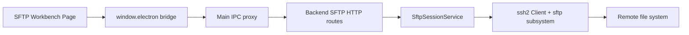
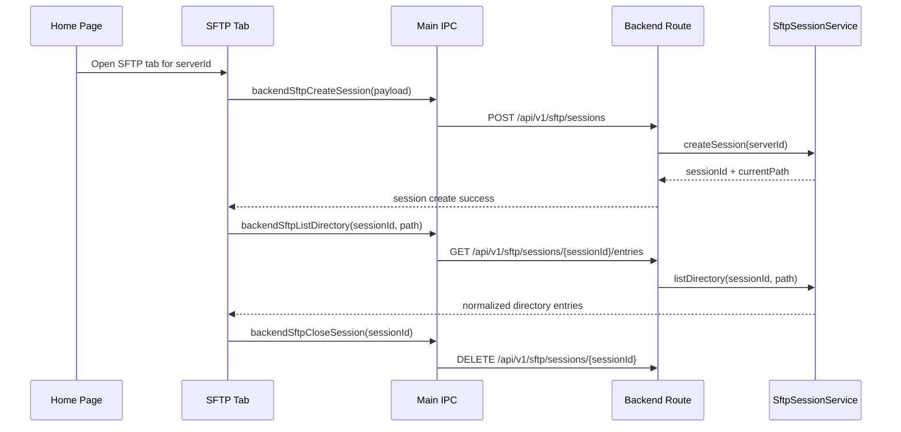

# SFTP 文件系统

## 1. 当前状态

Cosmosh 已实现基础只读 SFTP 浏览器。

v1 已实现：

- Home 服务器右键菜单与文件动作可以打开 SFTP 标签页。
- 每个 SFTP 标签页创建一个 backend SFTP 会话，并拥有该会话生命周期。
- 目录列表支持路径跳转、前进/后退历史、返回上级、刷新、当前目录过滤、loading、empty、会话过期与操作失败状态。
- Renderer 展示目录项与只读元数据详情。
- 左侧目录树展示当前目录的父级链路，并在用户浏览时缓存已加载的子目录。

v1 明确不包含：

- 上传、下载、删除、重命名、chmod、新建目录、拖放、全局搜索、文件预览、文件编辑、递归遍历与传输队列。
- 复用当前 SSH terminal 会话。SFTP 标签页会建立独立的 SSH + SFTP 连接。
- 持久化 SFTP history 或新增数据库表。

## 2. 运行时架构

### 模块归属

- **API contract**：`packages/api-contract/openapi/cosmosh.openapi.yaml` 定义 SFTP path、schema、成功码与错误码。
- **Backend**：`packages/backend/src/http/routes/sftp.ts` 负责 HTTP 输入校验与 API envelope 映射。`packages/backend/src/sftp/session-service.ts` 负责 SSH/SFTP 连接、会话注册表、目录路径归一化、条目映射与资源释放。
- **Main/preload**：`packages/main/src/ipc/register-backend-ipc.ts` 将 SFTP 请求代理到 backend route。`packages/main/src/preload.ts` 暴露最小 renderer bridge。
- **Renderer**：`packages/renderer/src/pages/SFTP.tsx` 负责标签页作用域 UI 状态与只读浏览交互。

## 3. API 契约

所有调用端必须使用 `@cosmosh/api-contract` 生成导出，尤其是 `API_PATHS` 与生成的请求/响应 payload 类型。

| Method | Path | Purpose |
|---|---|---|
| `POST` | `/api/v1/sftp/sessions` | 为一个 SSH server 创建只读 SFTP 浏览会话。 |
| `GET` | `/api/v1/sftp/sessions/{sessionId}/entries?path=...` | 为活动 SFTP 会话列出一个远程目录。 |
| `DELETE` | `/api/v1/sftp/sessions/{sessionId}` | 关闭 SFTP 会话并释放 SSH 连接。 |

成功码：

- `SFTP_SESSION_CREATE_OK`
- `SFTP_DIRECTORY_LIST_OK`

SFTP 专属错误码：

- `SFTP_SESSION_NOT_FOUND`
- `SFTP_VALIDATION_FAILED`
- `SFTP_OPERATION_FAILED`

Host fingerprint 信任失败复用 SSH 的 host-trust envelope 与错误码，因为 SFTP 使用同一套 SSH 传输安全模型。

## 4. 会话生命周期

生命周期规则：

- 普通 Home 右键菜单动作会在同一服务器已有 SFTP 标签页时复用该标签页。
- 显式新标签动作会创建新的 SFTP 标签页，因此也会创建独立 backend SFTP 会话。
- 隐藏的 SFTP 标签页保持挂载，并继续持有会话。
- 关闭标签页或变更连接意图时，会尽力关闭旧 SFTP 会话。
- Backend 关闭时会关闭所有已注册的 SFTP 会话。

## 5. 目录列表行为

Backend 始终将 SFTP 路径视为 POSIX 路径，不受运行 Cosmosh 的宿主 OS 影响。

目录列表步骤：

1. 归一化请求路径。
2. 使用 `realpath` 解析路径。
3. 对解析后的目录执行 `readdir`。
4. 将每个条目映射为 `{ name, path, type, size, mode, permissions, modifiedAt }`。
5. 目录优先排序，再按名称进行支持数字感知的 locale 排序。

条目类型收敛为：

- `directory`
- `file`
- `symlink`
- `other`

Renderer 当前显示名称、大小、修改时间与 mode 列。目录面板只支持过滤当前目录条目，不是远端递归搜索。详情面板只展示已选条目的元数据，不读取文件内容。

目录结果会在 SFTP 标签页生命周期内缓存在 renderer 内存中。再次访问已加载路径会立即使用缓存结果；刷新动作会绕过缓存，并从当前 backend 会话重新请求目录列表。

## 6. 安全与错误模型

SFTP 使用与 SSH 相同的服务器、钥匙链、凭据解密与 host fingerprint 信任模型：

- 凭据在 backend 进程中通过 `SshServer` -> `SshKeychain` 解析。
- 解密后的 secret 不会跨到 renderer 或 preload。
- Main 注入内部 backend 鉴权 token 与 locale header。
- 未知或不受信任的 host fingerprint 通过与 SSH 相同的确认流程返回。

错误映射：

- 缺失或非法请求数据 -> `SFTP_VALIDATION_FAILED`。
- 缺失 session id 或会话已关闭 -> `SFTP_SESSION_NOT_FOUND`。
- 连接失败、权限不足、路径不可读与远端 SFTP 错误 -> `SFTP_OPERATION_FAILED`。
- 未知 host fingerprint -> `SSH_HOST_UNTRUSTED`，并携带 fingerprint 确认数据。

## 7. Renderer UX 契约

SFTP 页面遵循 Cosmosh workbench 布局规则：

- 使用三个高密度圆角工作台卡片：左侧目录树、中间目录列表、右侧只读详情。
- 目录树面板保持窄而任务导向，目前对齐 Cosmosh 250 px 侧栏节奏。
- 使用内部 UI wrappers（`Button`、`Tooltip`、`Dialog`）与 tokenized classes。
- 顶部工具栏保持紧凑：后退、前进、返回上级、刷新、远程路径输入与当前目录过滤。
- 目录树展示当前目录和所有父级目录；展开目录行会加载其子目录列表，加载期间显示行内 spinner。
- 对齐文件管理器行为：展开或收起目录树节点不会切换中间目录列表。通过中间列表打开目录或在路径工具栏跳转时，才会改变当前目录。
- v1 不展示写操作，而不是用禁用按钮暗示功能已就绪。
- 保持稳定列表列宽，长名称/路径截断，避免布局抖动。

## 8. 后续范围

后续 SFTP 能力应单独规划。可能的下一阶段：

1. 带进度与取消的流式下载/上传。
2. 写操作：mkdir、rename、delete、chmod。
3. 传输队列与冲突处理。
4. 文件预览/编辑器集成。
5. 在 SSH terminal 与 SFTP 会话模型能安全共享状态后，再考虑 terminal path handoff。
