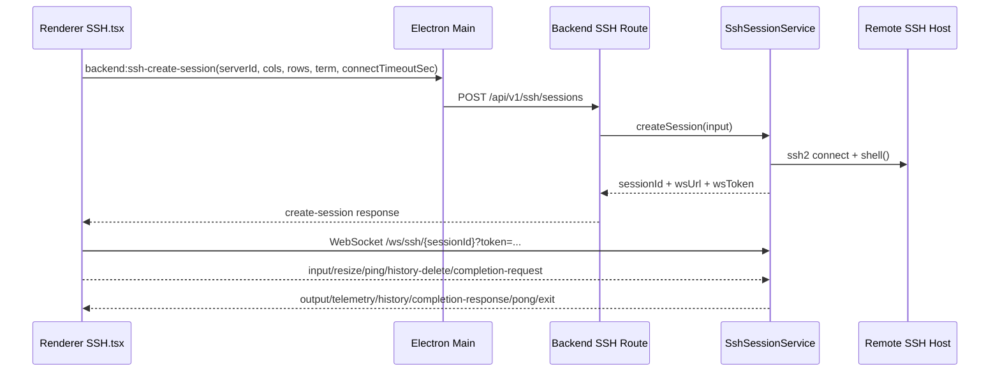
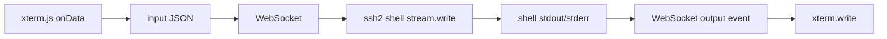
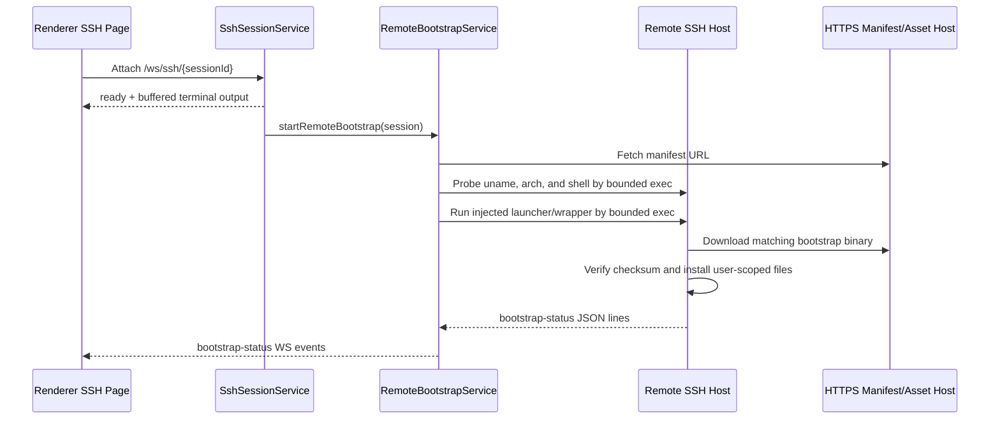

# SSH 终端实现

## 1. 集成概览（`ssh2` + `xterm.js`）

Cosmosh 终端链路分为控制面与数据面：

- **控制面**：Renderer 通过 Main 的 IPC bridge 调用后端创建会话。
- **数据面**：Renderer 直接连接后端 WebSocket 会话端点，传输终端 I/O 流。



## 2. 后端会话生命周期

### 创建会话

- 路由：`POST /api/v1/ssh/sessions`
- 服务：`SshSessionService.createSession`
- 请求字段：
  - `cols` / `rows`：终端视口尺寸。
  - `connectTimeoutSec`：来自设置项 `sshConnectionTimeoutSec` 的会话级 SSH 握手超时。
  - `strictHostKey`：从 SSH 服务器配置透传的会话级主机密钥策略。
  - `enableSshCompression`：从 SSH 服务器配置透传的会话级 SSH 传输压缩策略。
- 步骤：
  1. 读取 server 记录与其关联 keychain 的加密凭据。
  2. 解析可信主机指纹。
  3. 使用服务器作用域的压缩协商配置，并携带 UTF-8 locale 请求，通过 `ssh2.Client.shell` 打开 SSH shell。
  4. 写入 `SshLoginAudit` 记录：
     - 会话创建成功时写入 `result = success`，并记录 `sessionId` 与 `sessionStartedAt`。
     - 主机信任/认证/连接失败时写入 `result = failed`，并记录 `failureReason`。
  5. 在内存中注册会话状态（`Map<sessionId, SshLiveSession>`）。
  6. 返回短期 attach token 与 WS 端点。

Locale 行为：

- SSH shell 创建时会通过 `ssh2` shell 环境选项请求 `LANG=C.UTF-8` 与 `LC_CTYPE=C.UTF-8`，让支持 UTF-8 的终端程序默认继承 Unicode 字符类型 locale。
- 不设置 `LC_ALL`，以保留远端用户对时间、排序、数字格式等 locale 类别的偏好。
- Cosmosh 不会向交互式 shell 输入流注入 locale 命令。如果 SSH 服务器的 `sshd_config` 未接受这些环境变量请求，服务器可能会忽略它们。

### 附加 WebSocket

- 路径：`/ws/ssh/{sessionId}?token=...`
- 非法或编码畸形的路径、token、session 直接拒绝（`1008`），URL 解码错误不得逃逸出连接边界。
- 若已有附加 socket，将被替换（`1012`），保持单活连接。连接所有权切换后，旧 socket 的 close/error 事件不得清理新连接持有的会话。
- 会话 attach 前输出会缓存，ready 后统一回放。

### 关闭会话

- API 驱动关闭：`DELETE /api/v1/ssh/sessions/{sessionId}`
- 传输驱动关闭：socket close/error、SSH stream close、SSH client error。
- 释放行为：在 session 标记为 disposed 前发送 terminal `exit` 事件，再清理运行时所有权、关闭 SSH stream/client 与 WS。
- 审计收尾：回写对应 `SshLoginAudit` 的 `sessionEndedAt` 与 `commandCount`。
- Main 在判断窗口关闭或应用退出时，会把 SSH 会话注册表中所有尚未 disposed 的条目视为活动连接。用户确认 renderer 警告对话框后，`DELETE /api/v1/runtime/active-connections` 会在窗口销毁前通过同一服务释放路径关闭全部 SSH 会话。
- 本地终端会话以及仅由端口转发规则持有的 SSH 传输不计入本次关闭警告。

## 2.1 连接审计与最近使用排序

- 服务列表中的 `lastLoginAudit` 映射为最近一次**成功连接**（`result = success`）。
- 这样“按上次使用排序”将基于真实成功连接，而不是失败尝试。
- 失败连接仍会写入 `SshLoginAudit`，用于后续日志查询/审计能力。

## 2.2 本地优先安全审计接入

- SSH 运行时在保留 `SshLoginAudit` 兼容能力的同时，新增写入本地优先 `AuditEvent`，覆盖安全核心操作。
- 当前与 SSH 相关的审计分类包括：
  - `ssh-session`：连接成功/失败与会话关闭生命周期事件。
  - `ssh-host-trust`：主机指纹信任确认事件。
  - `ssh-server` / `ssh-keychain`：路由层的服务器/钥匙链实体变更事件。
- 关联策略：
  - `requestId` 用于串联同一请求链路。
  - `sessionId` 用于串联同一运行时会话。
  - `relatedRecordId` 用于关联兼容记录（例如可关联已有登录审计记录 ID）。
- metadata 在落库前会脱敏，敏感键按策略替换，占位后再执行大小上限控制。
- 审计写入采用 best-effort，不会因为日志写入失败而中断 SSH 会话创建或关闭流程。

## 3. 数据流协议

### Client → Server

- `input`：UTF-8 字符串形式的终端输入字节。
- `resize`：带边界归一化的 cols/rows。
- `ping`：心跳。
- `close`：显式断开请求。
- `history-delete`：请求后端删除远端 shell 历史中的选中命令。
- `completion-request`：基于当前命令前缀与光标位置请求排序后的补全候选。

### Server → Client

- `ready`：附加确认。
- `output`：shell stdout/stderr 输出。
- `telemetry`：CPU/内存/网络 + 命令历史快照。
- `history`：仅历史快照推送，用于即时 UI 同步。
- `completion-response`：当前命令 token 的排序补全候选。
- `bootstrap-status`：backend 侧通道安装器返回的远端 bootstrap 探测、下载、安装与失败状态。
- `pong`：ping 响应。
- `error`：协议/运行时错误。
- `exit`：会话关闭与原因。

### 3.1 History 同步模型

- 后端命令历史来源于远端 history 探测与 shell 历史解析结果。
- 每次 SSH 会话建立后，后端都会执行远端 history 探测并解析为标准化命令列表。
- 远端历史来源按兼容顺序探测（shell 内建 + 常见历史文件），覆盖 Bash/Zsh/Fish/Ksh/Ash 等格式，并在可用时兼容 PowerShell PSReadLine 历史。
- 运行时 REPL 专用历史（例如 `.node_repl_history`）会被排除，不作为 shell 命令历史聚合来源。
- 当渲染层发送的 `input` 包含提交字符（`\r` / `\n`）时，后端会以“延迟 + 节流”策略触发 history 刷新，避免过度抓取。
- history 与 telemetry 解耦：telemetry 仍为定时采样，history 可通过 `history` 事件即时推送。
- `SSH.tsx` 的删除操作会发送 `history-delete`，后端会以 best-effort 方式清理远端历史文件后再执行同步。

### 3.2 自动补全模型

- 渲染层会先在本地输入阶段记录 typing 补全请求，待对应 xterm 输出回显到达后（再经短延迟去抖）才发送 `completion-request`，从而保证弹层锚点始终基于已渲染光标几何。用户手动按下 `Tab` 仍会立即触发一次请求。
- 当 xterm 处于 alternate screen buffer（例如 `vim`、`less`、`top`）时，渲染层会门控关闭补全，避免 shell 补全劫持编辑器/TUI 的按键处理。
- 渲染层默认会抑制“空输入”补全（没有实际命令文本时不请求候选）；仅在明确的密钥提示流程中允许空前缀请求。
- 渲染层会基于 xterm 输入事件维护“按 pane 隔离”的本地命令前缀影子状态，使输入触发补全无需等待远端 shell 回显即可计算请求前缀。
- 当用户通过 readline/history 控制序列（例如 `ArrowUp`/`ArrowDown`/`Ctrl+P` 召回历史命令）导航后，渲染层会把下一段本地输入 shadow 视为增量后缀，并在发送补全请求前与 xterm 已渲染的命令行合并。这样继续输入时，`echo 1` 这类已召回命令仍会保留在补全前缀中。
- 命令起点边界识别不再依赖固定 prompt token 列表。渲染层会先按光标附近 shell 语义解析命令段边界（引号 + `;`、`&&`、`||`、`|` 等分隔符），再执行 prompt 边界裁剪。
- prompt 解析支持用户配置：`terminalAutoCompletePromptRegex`（设置 > 终端 > 自动补全）。配置后将优先使用该正则覆盖默认 prompt 裁剪；留空或正则无效时回退到内置启发式策略。
- 渲染层还会在 `completion-request` 中携带来源过滤开关（`includeHistory`、`includeBuiltInCommands`、`includePathSuggestions`、`includePasswordSuggestions`），其值来自设置项，且默认全部开启。
- 后端补全引擎由 SSH 与本地终端会话服务共享，候选来源合并为：
  - 当前会话实时输入流提取的交互命令（历史信号，按会话隔离），
  - 同步得到的 shell 历史快照会合并进补全历史缓存，保证在会话初期也能提供历史补全，
  - 来自 inshellisense/Fig 资源的命令元数据（规范信号，按完整命令路径索引生成，而非仅根命令子集），
  - 在同一排序流水线中组合的运行时 provider（路径补全 provider 与交互式密钥提示 provider）。
- 补全引擎的 token 解析按会话 shell 类型区分：SSH 使用 POSIX 规则；本地 PowerShell/CMD 使用 Windows 友好规则，反斜杠会作为路径字面字符保留，而不是通用转义符。
- `packages/backend/scripts/generate-inshellisense.mjs` 会生成规范数据与按语言策略处理的补全说明资源：
  - `packages/backend/src/terminal/completion/generated-inshellisense.ts` 会以紧凑 tuple 载荷保留命令结构，并在模块加载时还原；生成条目仅保留 `descriptionI18nKey` 引用（不再冗余内嵌原始英文说明文本）。
  - `packages/i18n/locales/en/backend-inshellisense.json` 会根据上游说明全量重建。
  - `packages/i18n/locales/zh-CN/backend-inshellisense.json` 仅保留“英文源文本未变化”的手工翻译键；新键不会自动回填，英文源变化或删除时会自动清理对应中文键。
- backend 作用域 i18n 会将 `backend-inshellisense.json` 合并到 `backend.json`，从而支持补全说明翻译，同时保持基础 backend 语料与生成语料分离。
- 生成器会清理 LS/PS Unicode 分隔符（`U+2028`/`U+2029`），避免生成 TypeScript 文件触发异常行终止符警告。
- 当前排序策略：
  - 先做命令路径感知匹配（例如 `git push -` 优先解析 `git push` 规范，再回退到根命令 `git`），
  - 前缀匹配优先，其次可选模糊子序列匹配，
  - 内置命令规范候选优先于通用 history 命中，
  - history 候选会在命令结构相关前提下按“距离最近一次执行的距离”动态加权。
- 候选展示为完整命令路径（例如 `git push --force`）。
- 设置页运行时分组提供来源级别开关，允许用户独立关闭历史补全、内置命令补全、路径补全或密码补全，同时保留其他来源。
- 选项解析具备参数语义感知：
  - 支持多选项连续组合输入且保持命令上下文稳定，
  - 对已知“需要参数值”的选项（来自 Fig `args` 元数据）可返回参数值候选，
  - 同一条命令中已使用的选项会被降噪过滤，减少重复干扰。
- 路径补全采用 provider 化并结合命令上下文：
  - 内置路径规则当前覆盖目录优先导航命令（`cd`、`pushd`）与常见文件/路径消费命令（`cat`、`vim`、`vi`、`nvim`、`nano`、`less`、`more`、`head`、`tail`、`grep`、`rg`、`sed`、`awk`、`find`、`ls`、`touch`、`rm`、`cp`、`mv`、`chmod`、`chown`、`chgrp`、`ln`、`tar`、`unzip`、`zip`、`scp`、`sftp`、`rsync`），以及命令位的直接路径前缀（`./`、`../`、`/`、`~`），
  - 相对路径的部分输入（例如 `cd ../../c`）会基于会话跟踪的工作目录解析，并按“前缀优先、包含回退”匹配排序，
  - SSH 的 home 相对输入（`~` / `~/...`）会基于探测到的远端 `$HOME` 展开后扫描目录，同时在返回候选中保留用户输入的 `~/` 前缀，
  - SSH 会话会在后台初始化补全 cwd/home，并让路径请求共享这次进行中的探测；在 cwd 尚未知时提交的 `cd` 命令会在首次 cwd 探测完成后重放，避免会话初期的相对路径补全错误回退到登录目录，
  - 输入触发（typing）的请求会对路径 provider 使用短超时预算，避免慢文件系统探测阻塞命令/历史/规范候选；手动 `Tab` 触发仍使用完整 provider 结果，
  - SSH 路径补全的 typing 预算会大于本地终端，因为远端 exec 延迟受网络影响；这避免香港/海外等高延迟服务器仅因首次目录扫描超过本地文件系统预算就返回空的运行时路径候选，
  - 远程 SSH 路径扫描使用 POSIX 参数展开（`${p##*/}`）替代 GNU 专有 `basename --`，以保证在 GNU/Linux、BSD/macOS 与 BusyBox 环境下都能稳定补全，
  - 输入触发（typing）的 history 评分会限制在“最近历史窗口”内执行，以在远端历史快照较大时保持补全延迟稳定，
  - 当当前 token 以 `-` 开头时，优先保留参数/参数值补全，当前 token 的路径 provider 会被门控关闭。
- 交互式密钥提示检测基于输出流：
  - 后端会跟踪近期输出尾部并检测常见提示（`sudo` 密码、`su`/通用密码提示、密钥口令提示），
  - 当提示处于激活状态且会话存在可复用密钥时，补全会返回运行时 `secret` 动作项（`填充密码`）实现一步填充。
- 接受 `填充密码` 后，渲染层不会自动再触发下一轮补全；后续候选仅在用户新输入或显式手动触发时出现。
- 接受补全时默认仅替换光标前的当前 token 片段（`replacePrefixLength`）；候选项也可携带 `replacePrefixLength` 覆盖值（例如需要替换整段已输入前缀的根命令历史候选）。
- 对“部分 token 的 history 补全”（例如 `docker e` -> `docker exec`），候选级 `replacePrefixLength` 会按“当前实际输入 token 长度”计算，避免误删前文导致错位或重复。
- 当在非根 token 位置接受 history 候选时，后端返回“从当前 token 到命令末尾”的后缀插入文本（而非仅单个 token），以便一次接受即可补完整段历史命令续写。
- `completion-response` 返回基础 `replacePrefixLength` 与候选项（`label`、`insertText`、可选候选级 `replacePrefixLength`、`detail`、`source`、`kind`、`score`）。
- `detail` 会在后端会话服务发送响应前完成本地化，回退顺序为：翻译后的 `detailI18nKey` → 本地化来源标签（`历史记录` / `命令规范` / 运行时标签，如 `目录`、`文件`、`填充密码`）。
- 候选可见时的键盘规则：
  - `ArrowUp/ArrowDown` 切换当前候选，并由补全导航独占消费，
  - 候选应用快捷键可在设置中通过 `terminalAutoCompleteAcceptKeys` 配置为 `Tab`（默认/当前方案）、`Enter` 或两者皆可，
  - 当启用 `Tab` 且当前没有候选时，按下 `Tab` 会立即触发一次手动补全请求，
  - `Escape` 关闭候选面板，
  - 当未将 `Enter` 作为应用快捷键时，`Enter` 仍保持 shell 提交语义。
- 候选面板布局约束：
  - 面板锚点会在终端可视区域内进行夹取，
  - 面板宽度会按当前 pane 可用空间动态计算（并受桌面目标宽度上限约束），锚点夹取也按该实际宽度计算，避免横向溢出，
  - 面板内容区使用最大高度与纵向滚动（`max-h`）保证长候选列表可完整访问，
  - 长命令与说明文本使用截断，避免横向溢出。



## 4. 主机校验与信任流程

- SSH 连接使用 `hostHash: 'sha256'` 与 `hostVerifier`。
- `strictHostKey=true`：主机指纹必须已被信任，未知指纹返回 `SSH_HOST_UNTRUSTED`。
- `strictHostKey=false`：本次会话允许未知主机指纹继续连接。
- 若指纹未知：
  - backend 返回 `SSH_HOST_UNTRUSTED` 载荷。
  - renderer 打开信任确认弹窗。
  - 用户确认后调用 trust endpoint。
  - renderer 重试 create-session。

## 4.1 SSH 传输压缩

- SSH server 记录持久化 `enableSshCompression`，默认值为 `false`。
- SSH 服务器编辑器会在“安全”分区中以服务器级开关暴露该能力。
- 关闭时，backend 会向 `ssh2` 传入 `algorithms.compress = ['none']`，明确保持默认“不启用传输压缩”策略。
- 启用时，backend 优先协商 `zlib@openssh.com`，其次是 `zlib`，最后以 `none` 作为兼容性回退。
- SSH terminal 会话创建可以携带显式 `enableSshCompression` 值，使 retry/split 流程绑定到已解析服务器快照。
- SFTP 会话与端口转发启动会在 backend 读取同一个持久化服务器标记，因此 shell、文件系统与转发传输保持一致。

## 5. 异常处理与重连

### 当前行为（已实现）

- attach 超时：30 秒。
- 任意 socket close/error 都会让 UI 进入失败状态。
- 重试为 **手动**（`SSH.tsx` 的 retry 按钮），本质是创建新会话。
- 重试严格绑定到当前 tab 最近一次成功解析的目标快照，不会重新读取全局“当前选择”。
- 若首次连接在快照落库前失败，手动重试会回退到该 tab 的最新 intent 重新解析。
- 每次连接都有 attempt identity（`attemptId`），并带有过期结果丢弃与可取消的连接前异步流程。
- 隐藏 tab 不会触发新的连接副作用，只有 active tab 允许发起连接。
- 当前尚未实现自动指数退避重连。

### 推荐下一步（规划中）

- 仅针对临时性 WS 传输故障加入有界自动重连。
- 对主机校验失败/认证失败保持不可重试终态。

## 6. 当前代码中的性能策略

- Renderer 在初始化 SSH 终端时，将设置项 `sshMaxRows` 绑定到 xterm `scrollback`。
- Renderer 使用 `FitAddon` + resize observer 保持终端尺寸同步。
- 当设置项 `terminalHardwareAccelerationEnabled` 开启时（默认开启），Renderer 使用 `@xterm/addon-webgl` 为终端渲染启用硬件加速。
- 当设置项 `terminalInlineImagesEnabled` 开启时（默认关闭），Renderer 可以使用 `@xterm/addon-image` 提供实验性的终端内联图片能力。该插件会在新建的 SSH 与本地终端窗格中解析 SIXEL 与 iTerm inline image protocol 输出。
- 当设置项 `terminalWebLinksEnabled` 开启时（默认开启），Renderer 使用 `@xterm/addon-web-links` 识别终端输出中的 HTTP/HTTPS URL。
- Backend 对终端尺寸做归一化限制（`20-400 cols`、`10-200 rows`）。
- Backend 会在终端 JSON 解析或 transport 写入前拒绝任何超过 1 MiB 的单条客户端 WebSocket 消息，并以关闭码 `1009` 断开连接。
- 通过 pending output queue 避免 attach 前早期输出丢失。
- pending output 采用“条目数 + 字节数”双上限；超过上限时丢弃最旧输出并记录日志。
- 遥测采用 5 秒定时采样 + 轻量文本解析，降低帧级开销。
- 遥测、历史与补全使用的后台 SSH exec 探测限制为 15 秒和 1 MiB stdout；超时、输出过大、client 同步失败或 channel error 会按数据不可用收敛，不会让周期任务持续悬挂。
- history 刷新使用防抖 + 节流策略，平衡实时性与远端执行开销。

## 6.1 渲染层可配置的 xterm 选项（设置驱动）

渲染层现在会在 `SSH.tsx` 初始化 `Terminal` 时，将设置项映射到 `ITerminalOptions`，用于控制终端运行时行为。

- **主题 / SSH 样式**：
  - `altClickMovesCursor`、`cursorBlink`
  - `fontFamily`、`fontSize`
- **主题 / 高级样式**：
  - `cursorInactiveStyle`、`cursorStyle`、可选 `cursorWidth`
  - `customGlyphs`、`fontWeight`、`fontWeightBold`、`letterSpacing`、`lineHeight`
- **终端 / 高级终端配置**：
  - `drawBoldTextInBrightColors`
  - `scrollSensitivity`、`fastScrollSensitivity`、`minimumContrastRatio`
  - `screenReaderMode`、`scrollOnUserInput`、`smoothScrollDuration`、`tabStopWidth`
- **终端 / 运行时**：
  - `terminalHardwareAccelerationEnabled` 控制 SSH 与本地终端会话（包括分屏窗格）是否加载可选 `WebglAddon`，默认开启。
  - `terminalInlineImagesEnabled` 控制 SSH 与本地终端会话（包括分屏窗格）是否加载可选 `ImageAddon`，默认关闭，并采用构造期生效策略：开关或参数变化会作用于新建终端实例。
  - `terminalInlineImageOptions` 是通过 Settings Editor 编辑的 JSON 设置项，并使用严格 JSON Schema。当前仅暴露 `enableSizeReports`、`pixelLimit`、`sixelSupport`、`sixelScrolling`、`sixelPaletteLimit`、`sixelSizeLimit`、`storageLimit`、`showPlaceholder`、`iipSupport`、`iipSizeLimit`；本轮不暴露 Kitty/TGP 选项。
  - 内联图片仅在开启后支持 SIXEL 与 iTerm inline image protocol 输出。远端输出可能分配解码后的图片缓冲，因此校验会限制像素数量、序列字节数、存储 MB，并将 `sixelPaletteLimit` 上限固定为 `4096`。
  - 内联图片插件与 WebGL 插件按共存生命周期加载：renderer 会先在 `terminal.open(...)` 前加载 `ImageAddon`，再在 open 后同步 `WebglAddon`，使 WebGL 绑定已挂载的 renderer。`ImageAddon` 初始化失败只记录 warning，不会关闭 WebGL，也不会阻断终端启动。
  - 内联图片渲染只会把图片 canvas 固定在 renderer canvas 上方，并强制该图片层使用同步透明 2D context。DOM 文本行、选区、装饰层和链接覆盖层仍由 xterm 自己管理图层关系，因此选中文本对比度会保持默认 renderer 行为；透明 context 可避免 WebGL 开启时完整的图片 canvas 层变成不透明黑色覆盖层。
  - 内联图片解码依赖 `@xterm/addon-image` 内部的 WebAssembly，因此 renderer CSP 允许 `script-src 'wasm-unsafe-eval'`，但仍不启用通用 JavaScript `unsafe-eval`。
  - `ignoreBracketedPasteMode` 由设置项 `terminalBracketedPasteEnabled` 推导（开启时为 `false`，关闭时为 `true`）。
  - 粘贴安全警告是在 `SSH.tsx` 页面层执行的防护，会在输入进入 `terminal.paste(...)` 或原始 websocket `input` 前拦截。默认值为：`terminalWarnOnMultiLinePaste=true`、`terminalWarnOnLargePaste=true`、`terminalLargePasteWarningThreshold=5120`、`terminalWarnOnControlCharactersPaste=true`。
  - 控制字符粘贴检测会检查混入的 ESC、BEL、ANSI 控制序列，以及除 Tab/换行形式以外的 C0/C1 控制字节。警告确认仅作用于单次粘贴；允许一次粘贴不会关闭后续警告。
  - 字符宽度兼容模式由设置项 `terminalCharacterWidthCompatibilityModeEnabled` 推导；开启时，renderer 会加载 `@xterm/addon-unicode11`，并让新建终端实例切换到 Unicode 11 字符宽度表。
  - Unicode 宽度切换依赖 xterm 的 proposed `unicode` namespace，因此 renderer 创建的 SSH/本地终端实例会在加载 `@xterm/addon-unicode11` 前设置 `allowProposedApi: true`。
  - 开启后，右键粘贴、拖拽文本插入、选区工具栏插入会统一走 xterm `terminal.paste(...)`，从而让 shell 侧 bracketed paste 机制避免多行内容被立即执行。
  - `terminalCopyOnSelectionEnabled` 默认关闭。开启后，xterm selection-change 事件会通过 `navigator.clipboard` 将非空终端选区写入系统剪贴板；纯空白选区会被忽略。
  - `terminalRightClickSelectsWord` 直接映射到 xterm `rightClickSelectsWord`，默认关闭。
  - `terminalForceSelectionModifier` 默认值为 `off`。`alt` 会映射为 xterm `macOptionClickForcesSelection=true`，并在该终端实例中关闭 `macOptionIsMeta`，避免 macOS Option 键冲突。`shift` 与 `ctrl` 会作为设置值持久化，供后续平台特定选择处理使用；当前 xterm 原生生效路径仅为 macOS Option-click。
  - `@xterm/addon-clipboard` 会以 Cosmosh 自有 provider 加载，用于处理终端剪贴板读取/写入（OSC 52）。
  - 远程 SSH 会话从服务器记录字段 `terminalClipboardAccess` 读取剪贴板策略；本地终端会话从设置项 `localTerminalClipboardAccess` 读取策略。
  - 两种策略默认均为 `off`。支持模式包括 `off`、`writeAskRead`、`readWrite` 和 `askAlways`。
  - 读写剪贴板时始终通过 toast 提示；若该次操作刚刚通过显式权限对话框允许，则不再额外发送 toast。该允许只作用于单次剪贴板请求。
  - `@xterm/addon-clipboard` 负责协议 base64 编解码；provider 只在调用 `navigator.clipboard` 前后接收和返回已解码文本。
  - 每个 SSH/本地 xterm 实例（包括分屏窗格）都会加载 `@xterm/addon-serialize`，让 renderer 操作可以序列化当前选区，而无需触碰 xterm 内部结构。
  - 终端右键菜单仅在当前激活窗格存在选区时启用`复制为 HTML`。该动作只用 `serializeAsHTML({ onlySelection: true, includeGlobalBackground: true })` 序列化选中范围，并写入一个同时包含 `text/html` 与 `text/plain` 的 Clipboard API item；它不会向后端会话发送数据，也不会持久化剪贴板历史。
  - `terminalWebLinksEnabled` 控制 SSH 与本地终端会话（包括分屏窗格）是否加载 `@xterm/addon-web-links`。该设置默认开启，仅影响新建的 xterm 实例，识别到的 HTTP/HTTPS 链接会通过 Cosmosh 的 Electron 外部 URL 桥接打开。
  - `terminalWebLinksRequireModifierKey` 默认开启。开启时，Windows/Linux 链接需要 `Ctrl+单击`，macOS 链接需要 `Cmd+单击`，普通单击仅用于选择/聚焦终端文本，链接悬停时仅在按住所需修饰键时显示 pointer 光标。关闭时，主键单击可直接打开链接。辅助键/右键在任何情况下都不会打开终端链接，以便右键始终保留给终端上下文菜单；macOS 上的 `Ctrl+单击` 也保留为上下文菜单手势，永远不会打开终端链接。

说明：

- 对可选数值（如 `cursorWidth`）采用防御式解析；为空或不合法时回退到 xterm 默认行为。
- 原有 `sshMaxRows` 仍保持映射到 xterm `scrollback`。
- SSH server 记录可通过 `disableCharacterWidthCompatibilityMode` 单独禁用该模式；最终生效规则是全局设置开启且服务器未禁用。本地终端只使用全局设置。
- 字符宽度变更只影响新建的 xterm 实例；已存在的 SSH 窗格会保留当前 Unicode 宽度 provider，直到该窗格/会话被重新创建。
- WebGL 加载是尽力而为：初始化失败会回退到 xterm 默认渲染器，且不会中断终端会话。如果 WebGL 上下文丢失，renderer 会释放该 add-on，在当前 SSH 页面运行期停止重试 WebGL，并显示一次警告。

## 6.2 终端分屏交互模型

- 渲染层在 `SSH.tsx` 中提供受限分屏序列：
  1. 单终端，
  2. 左右双栏，
  3. 横向三栏，
  4. 最右侧终端再纵向拆分为上下两栏。
- 分屏入口在终端右键菜单（`拆分终端`），关闭入口同样在右键菜单（`关闭终端`）。
- 终端右键菜单会为`复制`、`粘贴`、`查找...`、`清屏`显示按平台解析的快捷键提示，并与实际键盘处理保持一致（macOS 显示：`⌘C`/`⌘V`/`⇧⌘F`/`⌃L`；非 macOS：`Ctrl+Shift+C`/`Ctrl+Shift+V`/`Ctrl+Shift+F`/`Ctrl+L`，且已绑定处理逻辑）。`复制为 HTML`特意只保留在菜单中，因为它依赖选中的富文本 xterm 范围，而不是终端标准快捷键。
- 终端右键行为由设置项 `terminalRightClickAction` 控制，默认值为 `contextMenu`。`paste` 会消费右键并通过同一套粘贴警告路径粘贴剪贴板文本。`copyOnSelectionElsePaste` 在当前激活窗格存在选区时复制选区，否则通过同一套粘贴警告路径执行粘贴。
- 当 SSH tab 变为 active 时，renderer 会把键盘焦点恢复到当前激活的 xterm 实例，让切换 tab 后的输入直接落到终端里。
- 当前实现最多同时展示 4 个终端窗格。
- 每个分屏窗格会针对同一已解析目标（同一 SSH 服务器/本地 profile）独立创建后端终端会话，从而支持独立输入输出。
- 镜像窗格在重试场景下始终复用主窗格的目标快照语义，避免会话目标漂移。
- 新增分屏窗格从空白视口启动，仅接入并展示该窗格自己的会话流，避免来自其他窗格的陈旧缓冲内容串入。
- 关闭窗格会释放该窗格自身 session/socket，其他窗格会继续运行。
- 补全弹层锚点必须始终基于当前激活窗格容器计算，主窗格容器 ref 在重渲染时不能覆盖镜像窗格的激活几何信息。
- 终端内文本搜索由主窗格与镜像窗格统一加载 xterm `SearchAddon` 实现。右键`查找...`会以纯查找模式打开共享 `SearchReplacePanel`，提供可配置筛选开关（`区分大小写` / `匹配正则表达式`）以及紧凑的上一个/下一个导航动作，在当前激活窗格中跳转并高亮匹配结果。
- 当搜索词清空或关闭搜索面板时，会主动清理搜索高亮装饰，避免陈旧搜索标记在退出搜索后持续占用额外内存。
- Orbit Bar 在搜索全流程中保持抑制（包括空搜索词状态和 ESC 关闭路径），避免搜索高亮期间重新弹出选区动作条。
- Orbit Bar 与依赖选区的终端右键菜单动作会优先通过 xterm `getSelectionPosition()` 解析选区几何，只有不可用时才回退到 DOM selection blocks。这保证 `WebglAddon` canvas 渲染下 Orbit Bar 定位与`联网搜索`启用状态仍然可用。
- Orbit Bar 与终端右键菜单可以将选中的远程目录交给 SFTP 打开。该动作仅在 SSH 服务器会话中，对显式 POSIX 风格路径（`/path`、`~/path`、`./path`、`../path` 或 `file:///path`）启用；裸相对名称保持禁用，因为 SSH shell 当前目录不会与 SFTP 标签页共享。
- 从选区在 SFTP 中打开目录时，即使同一服务器已经存在其他 SFTP 标签页，也始终会用该 `initialPath` 创建新的 SFTP 标签页，且不会替换当前 SSH 终端标签页。

## 7. 开发排查清单

当 SSH 会话行为异常时，按以下顺序检查：

1. 会话创建 API 的入参与校验路径。
2. 主机校验分支（`SSH_HOST_UNTRUSTED` 与直接建连分支）。
3. WS attach token 与 sessionId 是否匹配。
4. 数据流方向是否完整（`input` 写入与 `output` 回放）。
5. 会话释放路径是否正确（API close、传输关闭或 SSH 错误触发）。

## 8. 远端增强运行时

远端增强是用于主机感知 SSH 能力的可选运行时层，例如 OS/发行版检测、未来 SFTP helper、命令快捷嗅探与补全支持。v1 只验证并维护远端 bootstrap 安装路径；后续能力应继续挂在相同 gate 之后，并复用同一用户级远端 helper 边界。

### 8.1 归属与开关

- `packages/backend/src/remote-bootstrap/service.ts` 负责运行时编排。它会获取 manifest、探测远端主机、注入 shell wrapper、解析 JSON-line 状态并写入审计事件。
- `packages/remote-bootstrap` 负责 Go 安装器与 wrapper 渲染器。模块级构建、测试、路径和安全说明见 `packages/remote-bootstrap/README.md`。
- 只有 Settings `remoteEnhancementsEnabled` 为 true 且 SSH server 记录 `remoteEnhancementsEnabled` 为 true 时，该功能才启用。两者默认均为 true，因此在用户未关闭任一开关前，部署级启用条件由 manifest URL 控制。
- 任一开关关闭时，backend 不会执行任何远端命令，会忽略此前已安装 helper 发出的运行期 shell OSC 事件，并会发送 code 为 `REMOTE_ENHANCEMENTS_DISABLED` 的 skipped `bootstrap-status`。
- Backend 需要 manifest URL 才会加载 bootstrap manifest。`COSMOSH_REMOTE_BOOTSTRAP_MANIFEST_URL` 是最高优先级 override。未打包的开发运行会默认使用滚动的 `remote-bootstrap-dev` manifest，因此本地开发无需每次设置 shell 环境变量也能测试远端增强。CI 打包也可以在 app 打包前生成 `remote-bootstrap/manifest-url.json`，让安装包无需用户手动配置环境变量即可发现 GitHub 托管的 manifest。正式 tag release 指向同版本 GitHub Release；`main` push 构建指向 `remote-bootstrap-dev`；分支名包含 `remote-bootstrap` 的 push 构建和手动 workflow dispatch 可以指向分支专用临时 prerelease，例如 `remote-bootstrap-branch-codex-remote-bootstrap-ci-release`。普通 PR 与 feature branch 构建默认不写入 packaged URL。远端增强启用但缺少配置时，不会执行远端 probe 或任何其它远端命令，只会明确上报 `MANIFEST_URL_NOT_CONFIGURED`。

开发环境默认 manifest URL 为 `https://github.com/agoudbg/Cosmosh/releases/download/remote-bootstrap-dev/cosmosh-remote-bootstrap-manifest.json`。只有需要覆盖默认值时才需要在启动 Cosmosh 的同一个终端里设置 `COSMOSH_REMOTE_BOOTSTRAP_MANIFEST_URL`，例如测试分支专用临时 prerelease：

  ```powershell
  $env:COSMOSH_REMOTE_BOOTSTRAP_MANIFEST_URL="<manifest-url>"
  pnpm dev:main
  ```

  ```sh
  COSMOSH_REMOTE_BOOTSTRAP_MANIFEST_URL="<manifest-url>" pnpm dev:main
  ```

### 8.2 会话流程



- Bootstrap 会在首次 WebSocket attach 后启动，并且每个 SSH session 只启动一次。
- 侧通道使用 `ssh2 exec`，并受 `REMOTE_BOOTSTRAP_EXEC_OPTIONS` 限制：60 秒、256 KiB 输出。安装器输出按 JSON lines 解析，永远不会写入交互式终端流。
- Renderer 会保存最新 `bootstrap-status` 以及当前 session 尝试内的 Remote Enhancements 调试事件历史。启用 Settings `userMenuDebugEntryEnabled` 后，终端右键菜单会显示 `Remote Enhancements Debug`；选择后会在终端右上角打开固定浮层，展示最新 bootstrap phase/state/code/message/version，以及当前 session 尝试中收到的每条 bootstrap 状态和远端 shell 事件原始 JSON payload，内容可选中。
- 调试浮层只记录状态/事件 payload，不记录 terminal `input`、terminal `output`、密码、私钥材料或完整屏幕输出。
- Terminal `ready`、`output`、telemetry、history、completion 与 shell-state 消息都与 bootstrap 进度彼此独立。

### 8.2.1 远端 Shell 事件协议

Remote Bootstrap 安装 helper 后，交互式 shell 启动文件会 source 用户级 shell integration。helper 会通过交互 PTY 上的 OSC 777 控制序列发送运行期 shell 状态：

```text
ESC ] 777 ; cosmosh ; <base64-json> BEL
```

Backend 解析规则：

- `SshSessionService` 会先把 SSH 输出流经过 `RemoteShellEventOscParser`，再写入 xterm。
- 合法 Cosmosh OSC 会从可见终端输出中剥离，解码、规范化后，仅在当前 live session 启用了 Remote Enhancements 时以 `remote-shell-event` 转发给 renderer。
- 非 Cosmosh OSC 与普通 ANSI 输出保持可见且不变。
- 非法 JSON、非法事件形状以及超过 8 KiB 的 payload 会被丢弃，不会导致 session 崩溃。
- 支持 SSH chunk 切分；未完成的 OSC 数据会缓冲到 BEL 或 ST 结束符到来。

服务端到 renderer payload：

```ts
type RemoteShellEventMessage = {
  type: 'remote-shell-event';
  event:
    | 'integration-ready'
    | 'prompt-ready'
    | 'cwd'
    | 'command-start'
    | 'command-end'
    | 'foreground-command';
  shell: 'bash' | 'zsh' | 'fish' | 'sh' | 'ash';
  cwd?: string;
  command?: string;
  exitCode?: number;
  durationMs?: number;
  commandId?: string;
  timestamp: number;
};
```

当前第一期 helper 行为：

- Bash 使用 `PROMPT_COMMAND`，保留已有 prompt hook，并在之后发送 `cwd`、`prompt-ready` 和上一轮 prompt 的 `command-end` exit code。受保护的 `DEBUG` trap 会在 prompt 设置完成后，为每条已提交命令行发送一次 `command-start` 与一次 `foreground-command`。
- Zsh 使用 `precmd`、`preexec` 与 `chpwd` hook，优先使用可用的 `add-zsh-hook`。
- Fish 使用 `fish_preexec`、`fish_prompt`、`fish_postexec` 与 `PWD` variable event。
- Sh/Ash 降级为仅基于 prompt 的 `cwd`、`prompt-ready` 与 `command-end`，不承诺精准 preexec 行为。
- 对所有可提取出可执行命令名的已提交命令，helper 都会发送 `command-start` 与 `foreground-command`；事件只携带经过清洗的可执行命令名（例如 `vim`），不携带完整命令行或参数。
- 第一期刻意不发送完整命令文本、line-buffer 状态、密码输入或原生 shell completion 列表。

Backend 状态模型：

- 每个 `SshLiveSession` 保存 `remoteShellReady`、`remoteShellCwd`、`remoteShellForegroundCommand`、`lastRemoteCommand`、`lastExitCode` 与 `lastCommandDurationMs`。
- `remoteShellCwd` 是 path completion 的优先 cwd 来源；现有 exec probe 与 renderer hint 仍作为 fallback。
- 收到 `foreground-command` 并设置 `remoteShellForegroundCommand` 后，backend 会返回空 completion response，直到下一个 `prompt-ready`；这能覆盖短命令、长时间前台进程以及未知 TUI/REPL 程序，不需要维护命令白名单。
- 密码提示与可复用 secret suggestion 继续由本地 backend 基于输出检测；shell hook 永远不捕获密码输入。

### 8.3 Manifest 与资产契约

```json
{
  "version": "1.2.3",
  "assets": [
    {
      "os": "linux",
      "arch": "amd64",
      "url": "https://downloads.example.test/cosmosh-remote-bootstrap-linux-amd64",
      "sha256": "0123456789abcdef0123456789abcdef0123456789abcdef0123456789abcdef"
    },
    {
      "os": "linux",
      "arch": "arm64",
      "url": "https://downloads.example.test/cosmosh-remote-bootstrap-linux-arm64",
      "sha256": "fedcba9876543210fedcba9876543210fedcba9876543210fedcba9876543210"
    }
  ]
}
```

- `version` 只能包含字母、数字、`.`、`_`、`+` 或 `-`。
- `assets` 必须非空。
- 每个 manifest asset 都必须包含 HTTPS `url` 与 64 位小写 `sha256`；任一 asset 格式错误都会让整个 manifest 无效，确保被污染的发布元数据明确失败。
- v1 只为 Linux `amd64` 与 `arm64` 远端选择 asset。
- 注入的 wrapper 会把所有 manifest 字段作为已引用的数据处理，永远不把它们当作可执行 shell source，然后使用 `curl` 或 `wget` 下载 binary，通过 `sha256sum` 或 `shasum` 校验后执行 `cosmosh-bootstrap install`。
- `cosmosh-wrappergen` 会在渲染 shell source 之前独立校验 manifest `version` 字符集、asset URL 必须为 HTTPS，且 SHA-256 必须为小写 hex。
- `scripts/build-remote-bootstrap-release.mjs` 会编译 `cosmosh-remote-bootstrap-linux-amd64` 与 `cosmosh-remote-bootstrap-linux-arm64`，计算 SHA-256，并写入被 git ignore 的 `packages/remote-bootstrap/dist/cosmosh-remote-bootstrap-manifest.json`。CI 可以覆盖下载 tag/base URL 与 manifest `version`，因此即使用固定 GitHub release tag，也可以发布类似 `dev-<commit-sha>` 的 manifest version。
- 正式 tag release CI 会把 helper assets 与 manifest 上传到同 tag 的 draft GitHub Release，并把该 tag 的 manifest URL 打进 app。`cosmosh-remote-bootstrap-*` 前缀是故意的，用来和 release 页面上的用户可见 app 安装包区分开。
- `build-main` CI 总是验证 Go package 与 manifest 生成路径。在 `push` 到 `main` 时，独立的写权限 job 会重新编译 helper assets，用 `--clobber` 发布到固定 prerelease tag `remote-bootstrap-dev`，并把 `https://github.com/<repo>/releases/download/remote-bootstrap-dev/cosmosh-remote-bootstrap-manifest.json` 打进 main 构建产物。在 `push` 到任意分支名包含 `remote-bootstrap` 的分支，或手动 `workflow_dispatch` 且 `publishRemoteBootstrap=true` 时，同一个 job 会发布到分支专用 prerelease tag `remote-bootstrap-branch-<sanitized-branch>`，并把这个 manifest URL 打进该分支构建产物。这些分支 prerelease 是临时内部测试桶，PR 合并或废弃后可以删除。普通分支和 PR 默认只验证构建链路，除非维护者显式选择发布路径。

### 8.4 远端要求与安装文件

支持的远端主机：

| 维度 | 支持值 |
| --- | --- |
| OS | `linux` |
| 架构 | `amd64`、`arm64` |
| Shell | `bash`、`zsh`、`fish`、`ash`、`sh` |

远端需要具备的常见工具：

- `mktemp`：创建临时 wrapper 与下载目录。
- `base64`：解码 backend 注入的 wrapper payload。
- `curl` 或 `wget`：下载 HTTPS asset。
- `sha256sum` 或 `shasum`：校验下载文件。
- probe 识别出的目标 shell。

安装文件只落在远端用户作用域：

| 用途 | 默认路径 |
| --- | --- |
| Bootstrap binary | `$XDG_DATA_HOME/cosmosh/bootstrap/bin/cosmosh-bootstrap` 或 `~/.local/share/cosmosh/bootstrap/bin/cosmosh-bootstrap` |
| Version marker | `$XDG_DATA_HOME/cosmosh/bootstrap/bin/.version` 或 `~/.local/share/cosmosh/bootstrap/bin/.version` |
| POSIX helper | `$XDG_CONFIG_HOME/cosmosh/bootstrap/helper.sh` 或 `~/.config/cosmosh/bootstrap/helper.sh` |
| Fish helper | `$XDG_CONFIG_HOME/cosmosh/bootstrap/helper.fish` 或 `~/.config/cosmosh/bootstrap/helper.fish` |
| Bash hook | `~/.bashrc` 内的 Cosmosh marker block |
| Zsh hook | `~/.zshrc` 内的 Cosmosh marker block |
| Sh/Ash hook | `~/.profile` 内的 Cosmosh marker block |
| Fish hook | `$XDG_CONFIG_HOME/fish/conf.d/cosmosh.fish` 或 `~/.config/fish/conf.d/cosmosh.fish` |

安装器具备幂等性。当已安装 version、binary、helper 与 shell hook 均为最新时会发送 `skipped`。如果 version 与文件已存在但 profile hook 缺失，则会修复 hook 而不是跳过。Version marker 只会在文件安装与 profile 更新均成功后写入。

### 8.5 安全与失败模型

- Wrapper 文件与 bootstrap 工作目录通过 `mktemp` 在 `${TMPDIR:-/tmp}` 下创建，使用受限权限并在退出时清理。
- 远端 wrapper 使用 `umask 077`；安装器目录/binary 使用 `0700`，helper/profile 写入在适用处使用 `0600`。
- 缺少 `mktemp`、`base64`、下载器、hash 工具或目标 shell 时，会明确上报 `bootstrap-status` 失败，而不是静默降级。
- Go 安装器只在远端用户的 XDG 路径下持久化文件，并且只在 shell profile 的 Cosmosh marker block 内更新内容。不要求 root，也不写全局路径。
- Bootstrap 审计 metadata 只记录状态，不得包含 secret。SSH 凭据、私钥与终端输入都不属于该契约。

常见状态码：

| Code | 含义 |
| --- | --- |
| `REMOTE_ENHANCEMENTS_DISABLED` | 全局 Settings 或服务器级开关在执行任何远端命令前禁用了 bootstrap；该 session 内的运行期 shell OSC 事件会被忽略。 |
| `MANIFEST_URL_NOT_CONFIGURED` | 远端增强已启用，但 backend 没有 manifest URL。 |
| `MANIFEST_FETCH_FAILED` | Backend 无法获取 manifest URL。 |
| `MANIFEST_INVALID` | Manifest 结构、asset URL 或 SHA-256 校验失败。 |
| `ASSET_NOT_FOUND` | Manifest 中没有匹配 probe 到的 OS/架构的 asset。 |
| `PROBE_FAILED` | 远端 OS、架构或 shell 不支持，或解析失败。 |
| `BASE64_NOT_FOUND` | 远端无法解码注入的 wrapper payload。 |
| `MKTEMP_NOT_FOUND` | 远端缺少 `mktemp`。 |
| `DOWNLOADER_NOT_FOUND` | 远端既没有 `curl` 也没有 `wget`。 |
| `HASH_TOOL_NOT_FOUND` | 远端既没有 `sha256sum` 也没有 `shasum`。 |
| `CHECKSUM_MISMATCH` | 下载得到的 binary 与 manifest SHA-256 不匹配。 |
| `FILE_INSTALL_FAILED` | 安装器无法创建或复制用户级文件。 |
| `PROFILE_UPDATE_FAILED` | 安装器无法更新目标 shell profile hook。 |
| `VERSION_WRITE_FAILED` | 安装器无法写入最终 version marker。 |

排查 bootstrap 行为时，先确认是哪一层 gate 停止了执行，再检查 manifest 有效性、远端 probe 支持、远端工具可用性，最后检查用户 profile 写入权限。缺少 manifest URL 时不应出现任何远端 probe 命令。

## 9. Windows 右键启动与本地终端工作目录

- 安装器集成选项可在资源管理器右键菜单注册“在 Cosmosh 中打开终端”。
- 安装器会写入 shell verb 元数据（`MUIVerb`、图标）以兼容资源管理器右键菜单解析路径。
- 资源管理器通过 `--working-directory <path>` 启动 Cosmosh。
- 启用终端启动应用注册时，安装器还会生成 `%LOCALAPPDATA%\Microsoft\WindowsApps\cosmosh.cmd` 作为稳定 CLI 启动 shim。
- Main 进程解析该参数并保存为一次性启动上下文。
- 渲染层如何处理该上下文由设置项 `terminalContextLaunchBehavior` 控制：
  - `openDefaultLocalTerminal`：自动打开 SSH 页签并使用默认本地终端配置。
  - `openLocalTerminalList`：打开 Home 并聚焦到本地终端列表。
  - `off`：忽略上下文启动自动跳转。
- 当选择 `openDefaultLocalTerminal` 时，会优先使用设置项 `defaultLocalTerminalProfile`（`auto` 或来自当前本地终端列表的具体 profile id），若不可用则回退到首个可用配置。
- 若 Cosmosh 已在运行，`second-instance` 会通过 IPC 事件把启动上下文推送到渲染层。
- `second-instance` 在解析上下文时会同时使用 CLI 参数与 Electron 提供的 `workingDirectory` 兜底，降低仅聚焦不触发新终端的情况。

## 10. 钥匙链凭据运行时说明（2026-03）

- SSH 连接阶段的认证材料统一从 `SshServer.keychainId` 解析。
- 当前钥匙链认证类型仍为 `password`、`key`、`both`，运行时行为与旧版保持一致，并为后续扩展认证方式预留入口。
- 无服务器引用的隐藏钥匙链会在后端清理流程中被回收，避免长期堆积孤儿密钥记录。
- 在下一次创建本地终端会话（`POST /api/v1/local-terminals/sessions`）时，Main 会透传一次 `cwd`。
- Backend 会校验 `cwd`，若路径不可用则回退到 `os.homedir()`。

## 11. macOS CLI 启动与本地终端工作目录

- 在 macOS 打包版本中，Main 会准备用户级启动脚本：`~/Library/Application Support/Cosmosh/bin/cosmosh`。
- 该脚本以 `--working-directory "$PWD"` 启动应用，因此会继承当前终端目录作为启动上下文。
- Main 会尝试在常见 PATH 目录（`/opt/homebrew/bin`、`/usr/local/bin`）创建到该脚本的符号链接；若无权限不会导致应用启动失败。
- 若因权限限制无法创建符号链接，应用会继续启动并在日志给出提示，用户可手动将脚本目录加入 PATH 或自行创建符号链接。
- 启动后上下文处理链路与 Windows 一致：Main 解析待消费 cwd，并在下一次本地终端会话创建时透传。

## 12. 服务器代理解析

- 全局代理模式为 `off`、`system` 或 `custom`，默认是 `system`。
- 单服务器代理模式为 `default`、`off` 或 `custom`；`default` 继承全局设置。
- 自定义 URL 支持 `http://`、`https://` 与 `socks5://`，可包含 URL 凭据；路径、查询参数与片段会被拒绝。
- 系统模式下，renderer 通过 Electron `Session.resolveProxy` 请求 Main 解析 `https://{host}:{port}/`，并在创建会话时携带临时规则字符串。
- Backend 按顺序解析 `PROXY`、`HTTPS`、`SOCKS5` 与 `DIRECT` 候选，建立隧道后把 socket 注入 `ssh2`。
- 所有代理候选共享会话连接超时。除非系统规则显式包含后续 `DIRECT`，代理失败就是终止错误。
