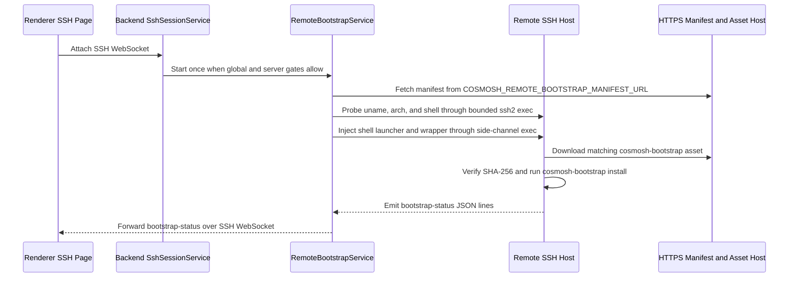

# Cosmosh Remote Bootstrap

`packages/remote-bootstrap` contains the Go tooling that Cosmosh can install on a remote SSH host to prepare future Remote Enhancements. It is intentionally small, user-scoped, and shell-aware: the backend orchestrates when bootstrap should run, while this package owns the remote installer binary and the shell wrapper contract used to fetch and run that binary safely.

The module exists so Cosmosh can add remote-side capabilities without pushing privileged files, modifying global system state, or mixing bootstrap output into the interactive terminal stream. In v1, the installed helper is deliberately thin. It proves the installation path, keeps a versioned bootstrap binary available under the remote user's profile, and gives later runtime work a controlled place to add host-local helper behavior.

## What This Module Does

- Builds `cosmosh-bootstrap`, the binary downloaded and executed on the remote host.
- Builds `cosmosh-wrappergen`, a CLI that renders shell-specific wrappers for release and diagnostic workflows.
- Installs the current bootstrap binary into user-scoped XDG paths.
- Writes a small shell helper and wires it into the user's shell startup file.
- Emits line-delimited `bootstrap-status` JSON so the backend can forward progress over the SSH WebSocket.
- Installs first-phase shell integration hooks that can emit runtime shell state over Cosmosh OSC 777 from the interactive PTY.
- Keeps installation idempotent by comparing the installed version, binary, helper, and shell hook before rewriting files.

## What This Module Does Not Do

- It does not open SSH connections. `packages/backend/src/remote-bootstrap/service.ts` owns runtime orchestration.
- It does not write root-owned or system-wide files.
- It does not persist credentials, terminal output, or user command history.
- It does not download files from the user's local machine. The remote wrapper downloads an HTTPS asset URL from the deployment manifest.
- It does not enable deeper Remote Enhancement behavior by itself. It only installs the first remote helper layer.

## Runtime Ownership



The interactive terminal stream is separate from the bootstrap side channel. `RemoteBootstrapService` uses bounded `ssh2 exec`, parses JSON lines from stdout, logs terminal states through the audit service, and never writes installer output into the xterm stream.

## Directory Layout

```text
packages/remote-bootstrap/
  cmd/
    cosmosh-bootstrap/
      main.go
    cosmosh-wrappergen/
      main.go
  internal/
    install/
      install.go
      install_test.go
    wrapper/
      wrapper.go
      wrapper_test.go
  go.mod
```

- `cmd/cosmosh-bootstrap`: command entry point for remote installation and status inspection.
- `cmd/cosmosh-wrappergen`: command entry point for rendering shell wrapper source.
- `internal/install`: validates install inputs, resolves user-scoped paths, copies the bootstrap binary, writes helpers, updates profile hooks, and emits status lines.
- `internal/wrapper`: validates manifest-derived wrapper inputs and renders POSIX or fish shell source with shell-safe quoting.

## Supported Targets

Remote Bootstrap v1 supports Linux hosts only:

| Dimension | Supported values |
| --- | --- |
| OS | `linux` |
| Architecture | `amd64`, `arm64` |
| Shell | `bash`, `zsh`, `fish`, `ash`, `sh` |

The remote host also needs common bootstrap tools:

- `mktemp` for temporary wrapper and download directories.
- `base64` for decoding the backend-injected wrapper payload.
- `curl` or `wget` for downloading the bootstrap binary.
- `sha256sum` or `shasum` for asset verification.
- The probed target shell itself.

Missing tools are reported as explicit `bootstrap-status` failures instead of falling back silently.

## Manifest Contract

The backend only runs a remote probe after it has loaded and validated the manifest configured by `COSMOSH_REMOTE_BOOTSTRAP_MANIFEST_URL`.

```json
{
  "version": "1.2.3",
  "assets": [
    {
      "os": "linux",
      "arch": "amd64",
      "url": "https://downloads.example.test/cosmosh-remote-bootstrap-linux-amd64",
      "sha256": "0123456789abcdef0123456789abcdef0123456789abcdef0123456789abcdef"
    },
    {
      "os": "linux",
      "arch": "arm64",
      "url": "https://downloads.example.test/cosmosh-remote-bootstrap-linux-arm64",
      "sha256": "fedcba9876543210fedcba9876543210fedcba9876543210fedcba9876543210"
    }
  ]
}
```

Validation rules:

- `version` must contain only letters, digits, `.`, `_`, `+`, or `-`.
- `assets` must be non-empty.
- Every asset URL must be HTTPS.
- Every `sha256` must be 64 lowercase hexadecimal characters.
- One malformed asset invalidates the entire manifest so polluted release metadata fails visibly.

The backend selects the first asset whose `os` and `arch` match the remote probe.

## Installed Files

The installer writes only inside the remote user's home/XDG scope:

| Purpose | Default path |
| --- | --- |
| Bootstrap binary | `$XDG_DATA_HOME/cosmosh/bootstrap/bin/cosmosh-bootstrap` or `~/.local/share/cosmosh/bootstrap/bin/cosmosh-bootstrap` |
| Version marker | `$XDG_DATA_HOME/cosmosh/bootstrap/bin/.version` or `~/.local/share/cosmosh/bootstrap/bin/.version` |
| POSIX helper | `$XDG_CONFIG_HOME/cosmosh/bootstrap/helper.sh` or `~/.config/cosmosh/bootstrap/helper.sh` |
| Fish helper | `$XDG_CONFIG_HOME/cosmosh/bootstrap/helper.fish` or `~/.config/cosmosh/bootstrap/helper.fish` |
| Bash profile hook | `~/.bashrc` |
| Zsh profile hook | `~/.zshrc` |
| Sh/Ash profile hook | `~/.profile` |
| Fish profile hook | `$XDG_CONFIG_HOME/fish/conf.d/cosmosh.fish` or `~/.config/fish/conf.d/cosmosh.fish` |

POSIX shell hooks are kept inside a Cosmosh marker block:

```sh
# >>> cosmosh bootstrap >>>
export PATH="/home/user/.local/share/cosmosh/bootstrap/bin":$PATH
. "/home/user/.config/cosmosh/bootstrap/helper.sh"
# <<< cosmosh bootstrap <<<
```

Fish uses a dedicated `conf.d/cosmosh.fish` file:

```fish
set -gx PATH "/home/user/.local/share/cosmosh/bootstrap/bin" $PATH
source "/home/user/.config/cosmosh/bootstrap/helper.fish"
```

## Shell State Integration

The installed helper is the user-scoped runtime boundary for shell-state events. It reports status over the interactive PTY with invisible OSC 777 control sequences:

```text
ESC ] 777 ; cosmosh ; <base64-json> BEL
```

First-phase behavior:

- Bash preserves any existing `PROMPT_COMMAND`, appends a Cosmosh prompt hook for `cwd`, `prompt-ready`, and previous-command `command-end` exit code, and uses a guarded `DEBUG` trap for one `command-start` per submitted command line.
- Zsh uses `precmd`, `preexec`, and `chpwd`, preferring `add-zsh-hook` when available so existing hook functions remain in the chain.
- Fish uses `fish_preexec`, `fish_prompt`, `fish_postexec`, and `PWD` variable events.
- Sh/Ash only install prompt-based degraded hooks for `cwd`, `prompt-ready`, and `command-end`; they do not claim precise preexec behavior.

The helper must not capture passwords, private keys, terminal line buffers, full screen output, or native shell completion lists. `command-start` and `foreground-command` carry only the sanitized executable name, not the full submitted command line or arguments.

## Idempotency and Repair Behavior

`cosmosh-bootstrap install` returns `skipped` when all of these are already current:

- `.version` matches the requested version.
- The installed binary exists.
- The shell helper exists.
- The expected shell profile hook exists.

If the version and files exist but the profile hook was removed or edited, the installer repairs the hook instead of skipping. The version marker is written only after files and profile updates succeed, which prevents a failed profile write from being mistaken for a complete install.

## Status Output

All machine-readable progress is emitted as one JSON object per line:

```json
{"type":"bootstrap-status","phase":"download","state":"started","version":"1.2.3","message":"downloading bootstrap binary"}
{"type":"bootstrap-status","phase":"verify","state":"started","version":"1.2.3","message":"verifying bootstrap binary"}
{"type":"bootstrap-status","phase":"install","state":"started","version":"1.2.3","message":"installing bootstrap helper"}
{"type":"bootstrap-status","phase":"verify","state":"ok","version":"1.2.3","message":"bootstrap installed"}
```

Supported phases are `probe`, `manifest`, `download`, `install`, and `verify`. Supported states are `started`, `ok`, `skipped`, and `failed`.

Common failure codes include:

| Code | Meaning |
| --- | --- |
| `MANIFEST_URL_NOT_CONFIGURED` | Backend Remote Enhancements are enabled, but no manifest URL is configured. |
| `MANIFEST_FETCH_FAILED` | Backend could not fetch the manifest. |
| `MANIFEST_INVALID` | Manifest shape, asset URL, or SHA-256 value failed validation. |
| `ASSET_NOT_FOUND` | Manifest has no asset for the probed remote platform. |
| `PROBE_FAILED` | Remote OS, architecture, or shell is unsupported or could not be parsed. |
| `BASE64_NOT_FOUND` | Remote host cannot decode the injected wrapper payload. |
| `MKTEMP_NOT_FOUND` | Remote host does not provide `mktemp`. |
| `DOWNLOADER_NOT_FOUND` | Remote host provides neither `curl` nor `wget`. |
| `HASH_TOOL_NOT_FOUND` | Remote host provides neither `sha256sum` nor `shasum`. |
| `CHECKSUM_MISMATCH` | Downloaded binary hash does not match the manifest. |
| `FILE_INSTALL_FAILED` | Installer could not create/copy user-scoped files. |
| `PROFILE_UPDATE_FAILED` | Installer could not update the target shell profile hook. |
| `VERSION_WRITE_FAILED` | Installer could not write the final version marker. |

## Security Boundaries

- Manifest asset URLs must use HTTPS.
- Manifest fields are treated as quoted data, never shell source.
- Wrapper tests include adversarial URL cases with shell metacharacters and command substitutions.
- Temporary files are created under `${TMPDIR:-/tmp}` with `mktemp`.
- `umask 077` and `0700`/`0600` file modes keep bootstrap files user-private.
- Temporary wrapper/download directories are cleaned up on exit, interrupt, and termination signals.
- The installer does not require root and does not write outside the remote user's home/XDG paths.
- Backend status/audit metadata should stay secret-free; the bootstrap contract never needs SSH credentials or private key material.

## Build and Test

Run tests from this package directory:

```sh
go test ./...
```

Build the remote installer for Linux targets:

```sh
node ../../scripts/build-remote-bootstrap-release.mjs
```

The CI/release helper writes git-ignored files under `dist/`: `cosmosh-remote-bootstrap-linux-amd64`, `cosmosh-remote-bootstrap-linux-arm64`, and `cosmosh-remote-bootstrap-manifest.json`. Tagged releases publish those files to the versioned GitHub Release. `main` branch builds publish the same file names to the fixed `remote-bootstrap-dev` prerelease with a manifest version such as `dev-<commit-sha>`. Pushed branches whose name contains `remote-bootstrap` and manual workflow dispatch runs can publish branch-scoped temporary prereleases for end-to-end package testing; ordinary PR and feature-branch CI runs use the script for compilation and manifest validation only.

Render a wrapper for inspection:

```sh
go run ./cmd/cosmosh-wrappergen \
  --shell sh \
  --os linux \
  --arch amd64 \
  --version 1.2.3 \
  --asset-url https://downloads.example.test/cosmosh-remote-bootstrap-linux-amd64 \
  --sha256 0123456789abcdef0123456789abcdef0123456789abcdef0123456789abcdef \
  --helper-payload-b64 ZXhwb3J0IENPU01PU0hfQk9PVFNUUkFQX1JFQURZPTEK
```

Inspect resolved install paths without writing files:

```sh
go run ./cmd/cosmosh-bootstrap status --shell sh
```

For local install tests, prefer a temporary home so the command cannot touch your real shell profile:

```sh
tmp_home="$(mktemp -d)"
HOME="$tmp_home" XDG_DATA_HOME="$tmp_home/data" XDG_CONFIG_HOME="$tmp_home/config" \
  go run ./cmd/cosmosh-bootstrap install \
    --shell sh \
    --version 0.0.0-dev \
    --helper-payload-b64 ZXhwb3J0IENPU01PU0hfQk9PVFNUUkFQX1JFQURZPTEK
```

## Adding a Remote Enhancement

Use this checklist when expanding the remote helper:

1. Keep the remote behavior user-scoped and non-root.
2. Add or update tests in `internal/install` or `internal/wrapper`.
3. Preserve the `bootstrap-status` JSON-line contract.
4. Keep manifest fields validated and shell-quoted before execution.
5. Update `docs/developer/runtime/ssh-terminal.md` and the Chinese mirror under `docs/zh-CN/`.
6. Update `docs/developer/core/project-map.md` if ownership or placement changes.

The backend TypeScript orchestration and this Go package must stay in lockstep. If a wrapper field, status phase, status code, or installed path changes in one layer, update the other layer and the documentation in the same change set.
